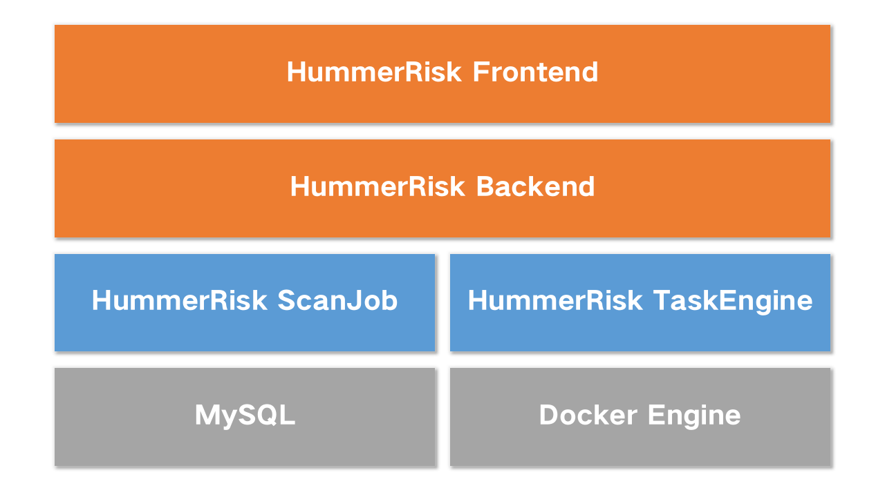
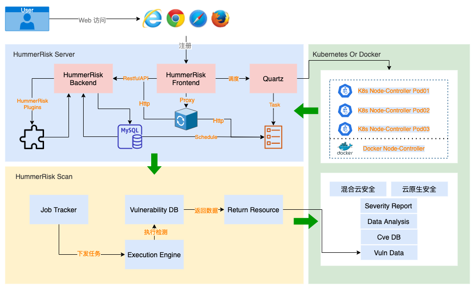
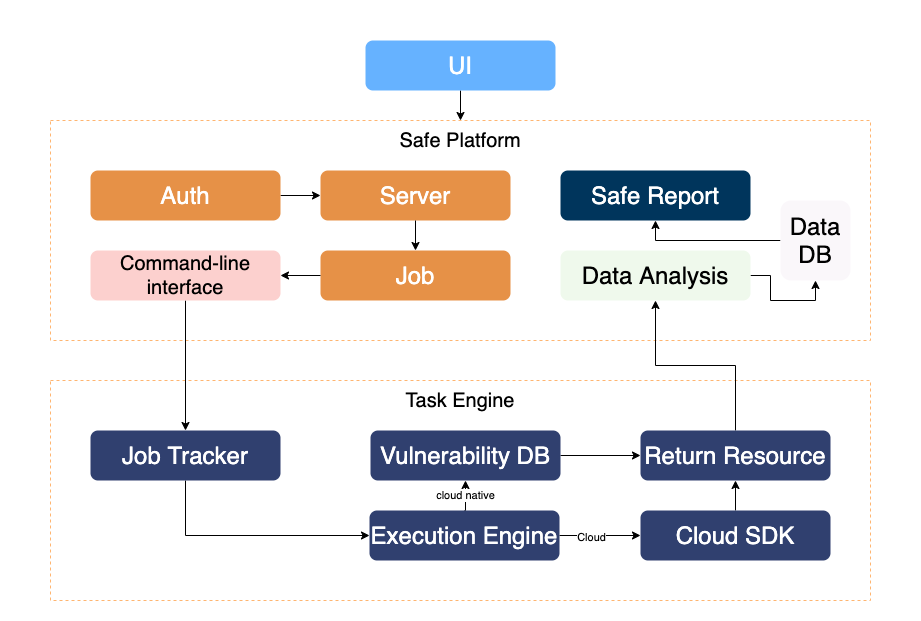

# 系统架构

## 微服务架构版

## 整体架构

{ width="65%" }

## 功能原理

{ width="75%" }

## 工作流程

{ width="75%" }

## 组件说明

- [Vue](https://vuejs.org/)：HummerRisk 使用了 Vue.js 作为前端技术栈
- [Spring Boot](https://www.tutorialspoint.com/spring_boot/spring_boot_introduction.htm)：HummerRisk 使用了 Spring Boot 作为后端技术栈
- [MySQL](https://www.mysql.com/)：HummerRisk 使用了 MySQL 作为数据库引擎
- [Cloud Custodian](https://cloudcustodian.io/)：HummerRisk 使用了 Cloud Custodian 作为云平台检测引擎
- [Prowler](https://prowler.pro/)：HummerRisk 使用了 Prowler 作为 AWS 检测引擎
- [Trivy](https://github.com/aquasecurity/trivy)：HummerRisk 使用了 Trivy 作为云原生检测引擎
- [Element](https://element.eleme.cn/#/)：HummerRisk 使用了 Element 提供的优秀组件库

## 技术优势

- [x] 开源开放：HummerRisk 遵循 GPL v3 开源协议;
- [x] 无侵入式：基于无侵入式的实现方式，快速上手，降低潜在风险;
- [x] 支持全面：从底层基础环境到上层软件应用，覆盖云原生环境的全部方面;
- [x] 规则丰富：大量内置检测规则，如 CIS 规则，等保2.0 规则等，同时支持自定义规则;
- [x] 支持信创：支持在信创环境中部署。

!!! warning "默认 web 登录账户: admin 密码：hummer"
