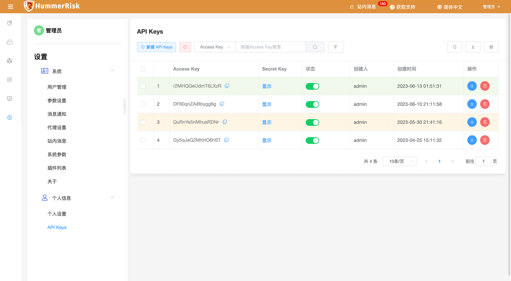
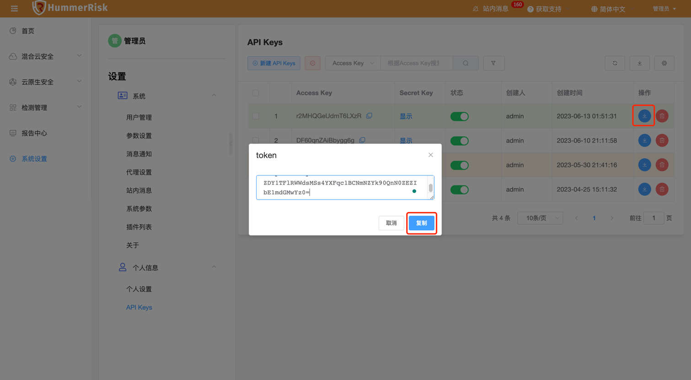
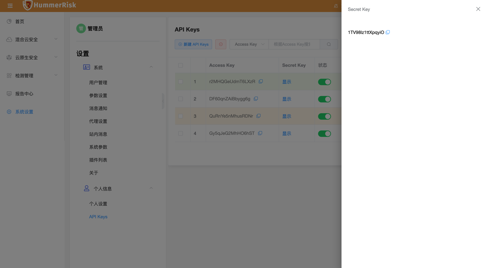
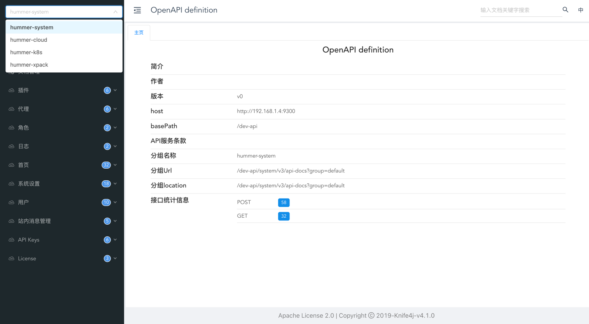
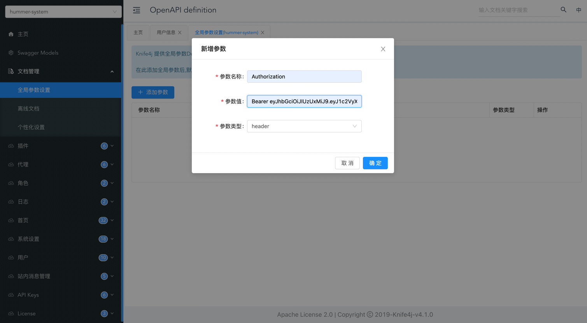
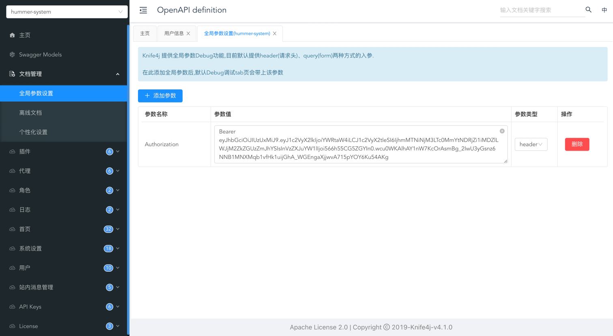
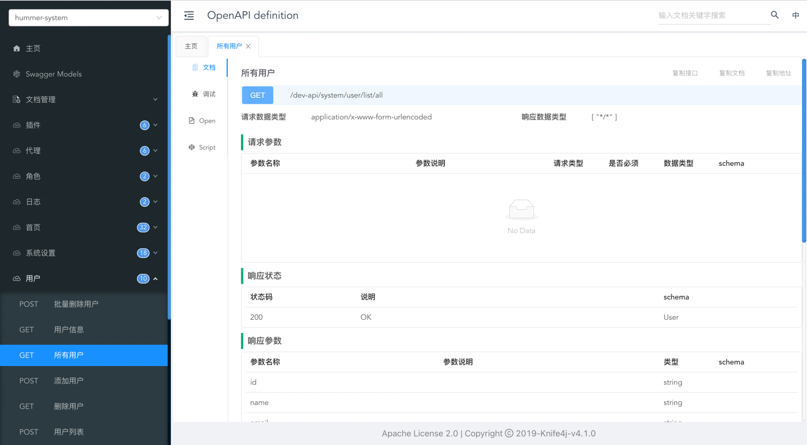
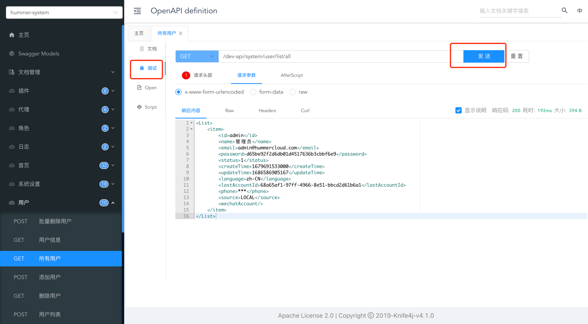
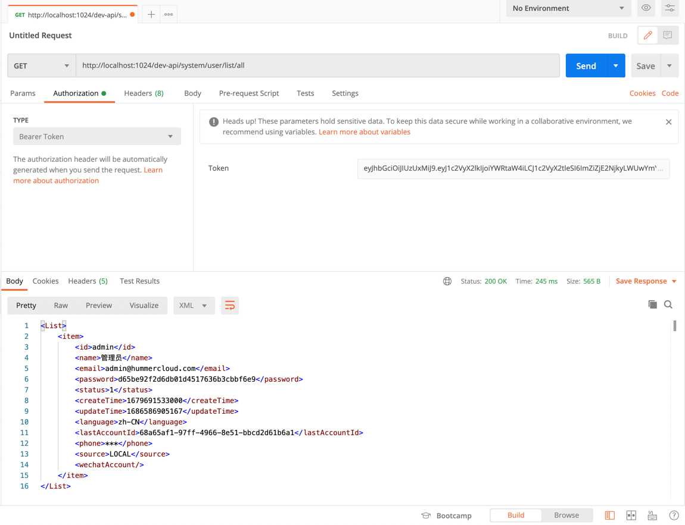

# RestFul API

## 1 签名方法
    这里介绍 API 请求中签名 ( signature ) token 的生成方法。

### 1.1 获取 HummerRisk Access Key 和 Secret Key

!!! abstract "页面获取"
    在已运行的 HummerRisk 平台，点击左侧菜单"系统设置"，二级菜单"个人信息"，三级菜单"API Keys"页面获取，如图所示：
    { width="95%" }

    点击右侧操作按钮，可以根据 Access Key 和 Secret Key 和当前时间戳，生成 token，以便于调用 RestFul API 使用：
    { width="95%" }

    点击 Access Key 和 Secret Key 可以复制，粘贴出来，用于代码生成 token，以便于调用 RestFul API 使用：
    { width="95%" }

### 1.2 根据 HummerRisk Access Key 和 Secret Key 生成 ( signature ) token

!!! abstract "代码示例"
    以 Java 代码为例 (其他语言类似，需要使用 AES 加密)， 如下面示例所示：
    ```
    accessKey=r2MHQGeUdmT6LXzR
    secretKey=1TV98lz1ttXpqyiO
    ```


    ```java
    import org.apache.commons.codec.binary.Base64;
    import org.apache.commons.lang3.StringUtils;
    
    import javax.crypto.*;
    import javax.crypto.spec.IvParameterSpec;
    import javax.crypto.spec.SecretKeySpec;
    import java.security.MessageDigest;
    
    /**
     * 加密解密工具
     *
     * @author harris
     */
    public class CodingUtil {
    
        private static final String UTF_8 = "UTF-8";
    
        /**
         * JAVA 签名方法, API 调用 DEMO
         * @throws Exception
         */
        @org.junit.Test
        public void test () throws Exception {
            try {
                URL url = new URL("http://localhost:1024/prod-api/system/user/list/all");
                HttpURLConnection urlConnection = (HttpURLConnection) url.openConnection();
                urlConnection.setRequestProperty("Accept", "application/json;charset=UTF-8");
                urlConnection.setRequestProperty("accessKey", accessKey);
                String str = accessKey + "|" + System.currentTimeMillis();//时间戳
                String signature = aesEncrypt(str, secretKey, accessKey);
                urlConnection.setRequestProperty("signature", signature);
                InputStream is = urlConnection.getInputStream();
                ByteArrayOutputStream baos = new ByteArrayOutputStream();
                byte[] buffer = new byte[1024];
                int len = 0;
                while (-1 != (len = is.read(buffer))) {
                    baos.write(buffer, 0, len);
                    baos.flush();
                }
                System.out.println(urlConnection.getResponseCode());
                System.out.println(baos.toString("utf-8"));
            } catch (Exception e) {
                e.printStackTrace();
            }
        }
        
        /**
         * AES加密
         *
         * @param src       待加密字符串
         * @param secretKey 密钥
         * @param iv        向量
         * @return 加密后字符串
         */
        public static String aesEncrypt(String src, String secretKey, String iv) throws Exception {
            if (StringUtils.isBlank(secretKey)) {
                throw new Exception("secretKey is empty");
            }
    
            try {
                byte[] raw = secretKey.getBytes(UTF_8);
                SecretKeySpec secretKeySpec = new SecretKeySpec(raw, "AES");
                // "算法/模式/补码方式" ECB
                Cipher cipher = Cipher.getInstance("AES/CBC/PKCS5Padding");
                IvParameterSpec iv1 = new IvParameterSpec(iv.getBytes());
                cipher.init(Cipher.ENCRYPT_MODE, secretKeySpec, iv1);
                byte[] encrypted = cipher.doFinal(src.getBytes(UTF_8));
                return Base64.encodeBase64String(encrypted);
            } catch (Exception e) {
                throw new Exception("AES encrypt error:", e);
            }
    
        }
    
        /**
         * AES 解密
         *
         * @param src       待解密字符串
         * @param secretKey 密钥
         * @param iv        向量
         * @return 解密后字符串
         */
        public static String aesDecrypt(String src, String secretKey, String iv) {
            if (StringUtils.isBlank(secretKey)) {
                throw new RuntimeException("secretKey is empty");
            }
            try {
                byte[] raw = secretKey.getBytes(UTF_8);
                SecretKeySpec secretKeySpec = new SecretKeySpec(raw, "AES");
                Cipher cipher = Cipher.getInstance("AES/CBC/PKCS5Padding");
                IvParameterSpec iv1 = new IvParameterSpec(iv.getBytes());
                cipher.init(Cipher.DECRYPT_MODE, secretKeySpec, iv1);
                byte[] encrypted1 = Base64.decodeBase64(src);
                byte[] original = cipher.doFinal(encrypted1);
                return new String(original, UTF_8);
            } catch (BadPaddingException | IllegalBlockSizeException e) {
                // 解密的原字符串为非加密字符串，则直接返回原字符串
                return src;
            } catch (Exception e) {
                throw new RuntimeException("decrypt error，please check parameters", e);
            }
        }
    
        public static String secretKey() {
            try {
                KeyGenerator keyGen = KeyGenerator.getInstance("AES");
                keyGen.init(128);
                SecretKey secretKey = keyGen.generateKey();
                return Base64.encodeBase64String(secretKey.getEncoded());
            } catch (Exception e) {
                throw new RuntimeException("generate secretKey error", e);
            }
    
        }
    }
    ```


## 2 API 调用

### 2.1 HummerRisk API 文档调用

!!! abstract "HummerRisk Swagger"
    HummerRisk 右上角，点击 API 文档按钮，跳转 API 文档页面。左上角 API 按微服务模块展示，需要调用哪个模块的方法在此切换，如图所示：
    { width="95%" }

    在此页面，点击文档管理-全局参数设置，添加参数，参数名称 Authorization，将已生成的签名 ( signature ) token 粘贴到此项参数值中；
    { width="95%" }
    { width="95%" }

    以查询所有用户为例，找到左侧菜单，点击调试，如果有其他参数请填写其他参数，点击发送进行 API 请求，即可得到返回值：  
    { width="95%" }
    { width="95%" }

### 2.2 Postman 调用

!!! abstract "Postman 请求"
    填写请求 url 等信息，找到 Authorization 菜单，TYPE 选择 Bearer Token，右侧 Token 粘贴已生成的签名 ( signature ) token，点击发送进行 API 请求，即可得到返回值：  
    { width="95%" }

## 3 其他注意事项

!!! abstract ""
    1. 请求中签名 ( signature ) 即是 HummerRisk 中请求的 token，概念相同；
    2. token 根据当前时间戳生成，时效为 30 分钟；
    3. 生成环境(即宿主机根据安装包部署的 HummerRisk 平台，URL 路径为 prod-api)，而本地代码启动 (URL 路径为 dev-api，以查询所有用户为例：http://localhost:1024/dev-api/system/user/list/all)。

