# 微服务版

!!! warning "微服务版"
    v1.0.0 以后的版本，代码在 dev 分支。欢迎大家在 dev 开发分支提交 pr 。

## 一 项目结构

### 1.1 系统模块

~~~
HummerRisk     
├── hummer-ui                                          // 前端框架 [80]
├── hummer-flyway                                      // 数据迁移 [9000]
├── hummer-gateway                                     // 网关模块 [8080]
├── hummer-auth                                        // 认证中心 [9200]
├── hummer-api                                         // 接口模块
│       └── hummer-api-cloud                           // 混合云接口
│       └── hummer-api-k8s                             // 云原生接口
│       └── hummer-api-system                          // 系统接口
├── hummer-common                                      // 通用模块
│       └── hummer-common-core                         // 核心模块
│       └── hummer-common-datascope                    // 权限范围
│       └── hummer-common-redis                        // 缓存服务
│       └── hummer-common-security                     // 安全模块
│       └── hummer-common-swagger                      // 系统接口
├── hummer-modules                                     // 业务模块
│       └── hummer-system                              // 系统模块 [9300]
│       └── hummer-cloud                               // 混合云服务 [9400]
│       └── hummer-k8s                                 // 云原生服务 [9500]
├── hummer-visual                                      // 图形化管理模块
│       └── hummer-monitor                             // 监控中心 [9100]
├──pom.xml                                             // 公共依赖
~~~

### 1.2 系统需求

- JDK >= 17 (推荐17版本)
- Mysql >= 8.0 (推荐8.0.32版本)
- Maven >= 3.6 (推荐3.6.3版本)
- Node >= 16.1 (推荐16.1.0版本)
- Redis >= 6.2 (推荐6.2.10版本)
- nacos >= 2.2 (推荐2.2.0版本)
- sentinel >= 1.6.0

### 1.3 技术选型

1、系统环境

- Java EE 17
- Servlet 3.0
- Apache Maven 3

2、主框架

- Spring Boot 3.0.0
- Spring Cloud 2022.0.1
- Spring Framework 6.0.0
- Spring Security 6.0.0

3、持久层

- Apache MyBatis 3.5.x
- Hibernate Validation 6.0.x
- Alibaba Druid 1.2.x

4、视图层

- Vue 2.6.x
- Axios 0.21.0
- Element 2.15.x

### 1.4 系统端口

- hmr-ui [80]
- hmr-flyway [9000]
- hmr-gateway [8080]
- hmr-auth [9200]
- hmr-system [9300, 9301, 8001]
- hmr-cloud [9400, 9401, 8002]
- hmr-k8s [9500, 9501, 8003]
- hmr-monitor [9100]
- hmr-mysql [3306]
- hmr-nacos [8848, 9848]
- hmr-redis [6379]
- hmr-job [8084]

## 二 配置开发环境
### 2.1 环境准备

=== "后端"
    !!! abstract "后端"
        HummerRisk 后端使用了 Java 语言的 Spring Cloud 框架，并使用 Maven 作为项目管理工具。开发者需要先在开发环境中安装 JDK 17 及 Maven。  

=== "前端"
    !!! abstract "前端"
        HummerRisk 前端使用了 Vue.js 作为前端框架，ElementUI 作为 UI 框架，并使用 npm 或 yarn 作为包管理工具。开发者请先下载 Node.js 或 Yarn 作为运行环境，IDEA 用户建议安装 Vue.js 插件，便于开发。  

=== "安装 npm 或 yarn"
    !!! abstract "安装 npm 或 yarn"
        进入网站 https://nodejs.org/en/download 或 https://yarn.bootcss.com/docs/install， 选择相应的安装包进行安装即可。

=== "组件"
    !!! abstract "相关组件"
        1. nacos: https://nacos.io/zh-cn/docs/quick-start.html
        2. redis: https://redis.io/
        3. xxl-job: https://github.com/HummerRisk/xxl-job


### 2.2 初始化配置

!!! abstract "数据库初始化"
    HummerRisk 使用 MySQL 数据库，推荐使用 MySQL 8.0 版本。同时 hummerrisk 对数据库部分配置项有要求，请参考下附的数据库配置，修改开发环境中的数据库配置文件

    ```
    [mysqld]
    default-storage-engine=INNODB
    lower_case_table_names=1
    table_open_cache=128
    max_connections=2000
    max_connect_errors=6000
    innodb_file_per_table=1
    innodb_buffer_pool_size=1G
    max_allowed_packet=1G
    slave_max_allowed_packet=1G
    transaction_isolation=READ-COMMITTED
    innodb_flush_method=O_DIRECT
    innodb_lock_wait_timeout=1800
    innodb_flush_log_at_trx_commit=0
    sync_binlog=0
    sql_mode=STRICT_TRANS_TABLES,NO_ZERO_IN_DATE,NO_ZERO_DATE,ERROR_FOR_DIVISION_BY_ZERO,NO_AUTO_CREATE_USER,NO_ENGINE_SUBSTITUTION
    skip-name-resolve
    ```

    **注意：Windows 系统数据库初始化配置应删除 innodb_flush_method 参数，请参考[文章](https://bugs.mysql.com/bug.php?id=40757)。**

    请参考文档中的建库语句创建 HummerRisk 使用的数据库，HummerRisk 服务启动时会自动在配置的库中创建所需的表结构及初始化数据。

    ```mysql
    CREATE DATABASE `hummer_config` /*!40100 DEFAULT CHARACTER SET utf8mb4 */
    CREATE DATABASE `hummer_risk` /*!40100 DEFAULT CHARACTER SET utf8mb4 */
    ```

!!! abstract "配置参数"
    HummerRisk 本地开发需要各种配置，**请参考下面配置参数**。  
    **提示：** 请自行将 HMR_MYSQL_HOST 等配置参数设置为自己的 MySQL 地址，以下每一项参数都可以在项目的 bootstrap.yml 配置文件或者 nacos 配置数据里找到。

    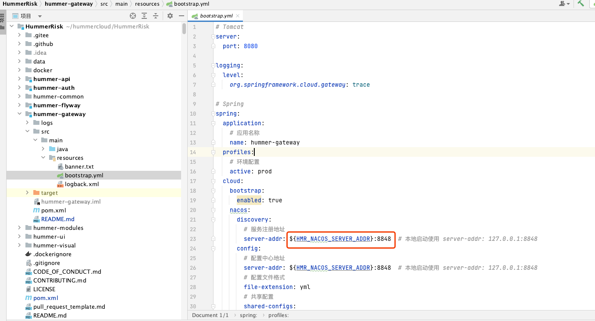{ width="95%" }
    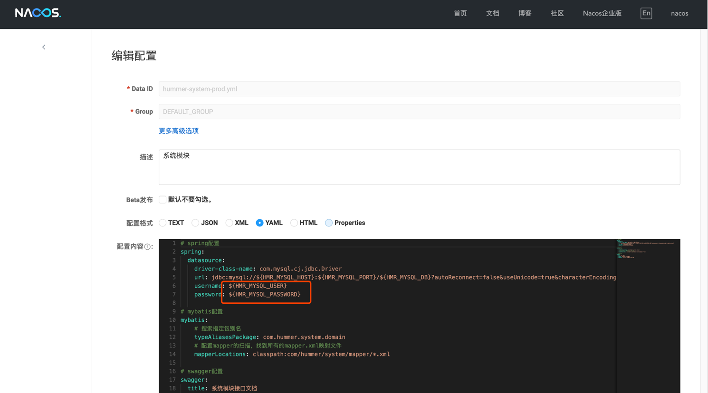{ width="95%" }

    1. hummer-flyway 如图所示，将各种配置信息拷贝到启动 IDEA 的环境变量中。（原理：因为首次启动项目，hummer-flyway 需要初始化 nacos 的数据，初始化之后 hummer-flyway 项目只要没有更新 flyway sql，就不再需要启动了）
    
    ```
    # hummer-flyway 本地开发的各种配置
    HMR_NACOS_SERVER_ADDR=127.0.0.1;HMR_REDIS_HOST=127.0.0.1;HMR_REDIS_PORT=6379;HMR_REDIS_PASSWORD=;HMR_MYSQL_HOST=127.0.0.1;HMR_MYSQL_PORT=33060;HMR_MYSQL_DB_NACOS=hummer_config;HMR_MYSQL_DB=hummer_risk;HMR_MYSQL_USER=root;HMR_MYSQL_PASSWORD=root;HMR_XXL_JOB_ADDR=127.0.0.1
    ```

    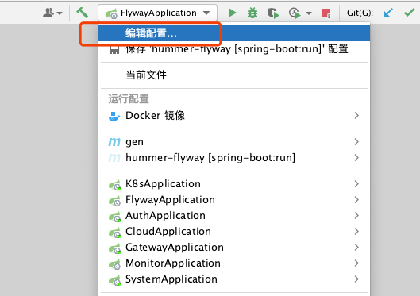{ width="95%" }
    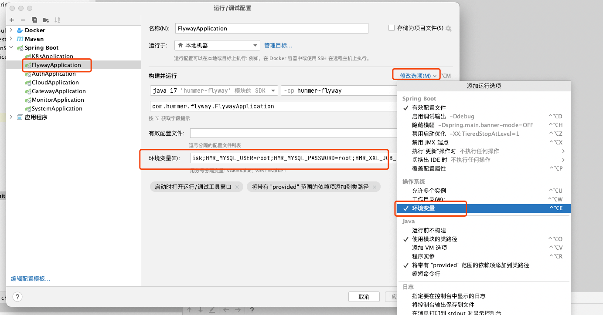{ width="95%" }

    2. hummer-auth、hummer-gateway、hummer-cloud、hummer-k8s、hummer-system、hummer-monitor 等项目如图所示，将各种配置信息拷贝到启动 IDEA 的环境变量中。
        
    ```
    # hummer-auth、hummer-gateway、hummer-cloud、hummer-k8s、hummer-system、hummer-monitor 本地开发的各种配置
    HMR_NACOS_SERVER_ADDR=127.0.0.1;HMR_REDIS_HOST=127.0.0.1;HMR_REDIS_PORT=6379;HMR_REDIS_PASSWORD=;HMR_MYSQL_HOST=127.0.0.1;HMR_MYSQL_PORT=33060;HMR_MYSQL_DB=hummer_risk;HMR_MYSQL_USER=root;HMR_MYSQL_PASSWORD=root;HMR_XXL_JOB_ADDR=127.0.0.1;HMR_XXL_SYSTEM_ADDR=127.0.0.1;HMR_XXL_CLOUD_ADDR=127.0.0.1;HMR_XXL_K8S_ADDR=127.0.0.1
    ```

    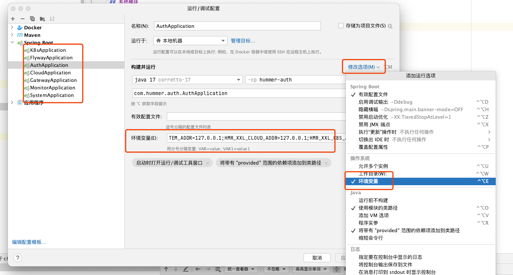{ width="95%" }

## 三 代码运行

### 3.1 IDEA 方式运行

!!! warning "启动顺序"
    1. 启动 mysql、nacos、redis
    2. 启动 hummer-flyway (第一次初始化数据启动一次，后面 flyway 无变化时，跳过此步骤)
    3. 启动 hummer-auth、hummer-gateway
    4. 启动 xxl-job
    5. 启动 hummer-cloud、hummer-k8s、hummer-system、hummer-ui、hummer-monitor(监控，本地开发可以不启动)

!!! abstract "先启动本地组件"
    1. 本地启动 mysql 8.0 (本地如果已经有 mysql 5.7，可以用 docker 启动 mysql 8.0)
    ```sh
    docker pull mysql/mysql-server:latest
    docker run -itd --name mysql -p 33060:3306 -e MYSQL_ROOT_PASSWORD=123456 mysql/mysql-server
    ```
    2. 本地启动 nacos (sh startup.sh -m standalone)
    ```sh
    git clone https://github.com/alibaba/nacos.git
    cd nacos/
    mvn -Prelease-nacos -Dmaven.test.skip=true clean install -U  
    ls -al distribution/target/
    
    // change the $version to your actual path
    cd distribution/target/nacos-server-$version/nacos/bin
    unzip nacos-server-$version.zip 或者 tar -xvf nacos-server-$version.tar.gz
    ```
    ```sh
    // 修改数据库配置，连接本地 mysql
    vim nacos/conf/application.properties

    # 将如下配置进行修改

    ### Count of DB:
    db.num=1
    
    ### Connect URL of DB:
    spring.datasource.platform=mysql
    db.url.0=jdbc:mysql://localhost:33060/hummer_config?characterEncoding=utf8&connectTimeout=1000&socketTimeout=3000&autoReconnect=true&useUnicode=true&useSSL=false&serverTimezone=UTC
    db.user=root
    db.password=root
    
    flyway.enabled=true
    ```
    ```sh
    # 启动nacos
    cd nacos/bin
    sh startup.sh -m standalone
    ```

    3. 本地启动 redis
    ```sh
    redis-server --port 6379
    ```

!!! abstract "1. 新建 HummerRisk 项目"
    1. 新建一个 git 项目 输入主工程 git 地址: git@github.com:HummerRisk/HummerRisk.git。
    2. 配置 maven 并引入 pom.xml。
    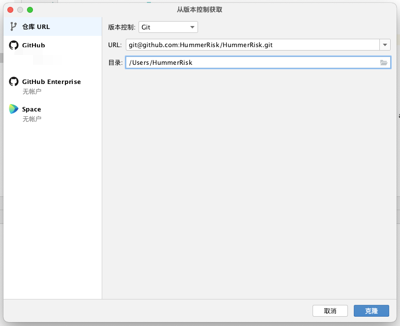{ width="95%" }
    3. 本地采用 jdk 17，打包镜像需要 tool.jar，但是本地开发不需要，所以注释这一段。
    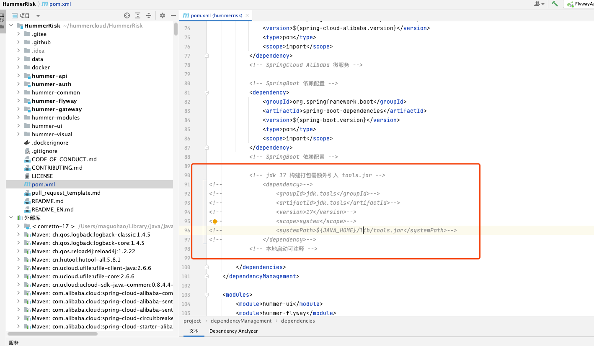{ width="95%" }
    4. 在 HummerRisk 目录下，执行 mvn clean install。将 common 等基础包打到项目里。
    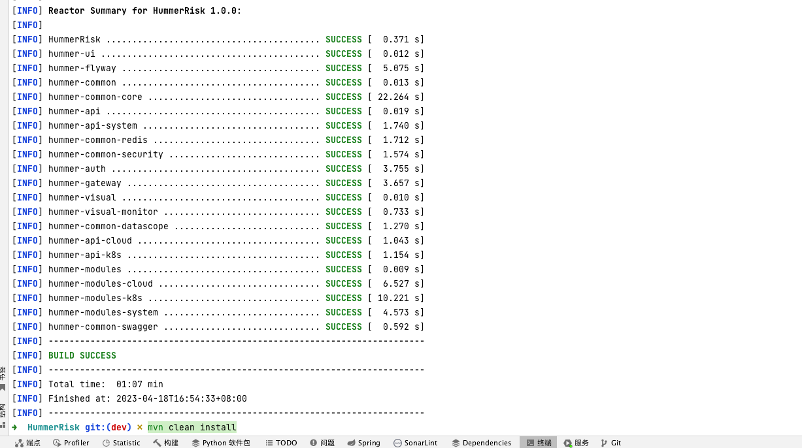{ width="95%" }

!!! abstract "2. 启动 hummer-flyway 项目"
    1. 在启动配置中添加 Spring Boot 启动项，直接启动 Spring Boot 项目即可。
    2. 后端服务成功运行如下所示。
    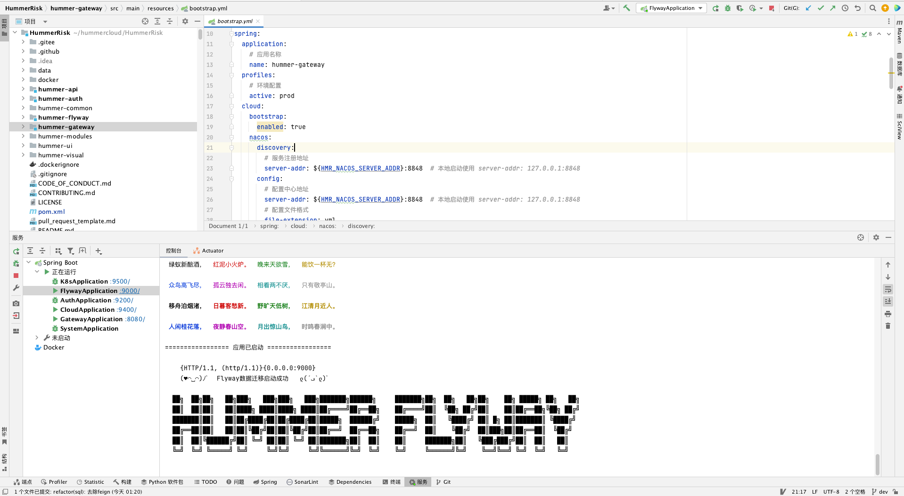{ width="95%" }

!!! abstract "启动 hummer-auth 项目"
    1. 在启动配置中添加 Spring Boot 启动项，直接启动 Spring Boot 项目即可。 
    2. 后端服务成功运行如下所示。
    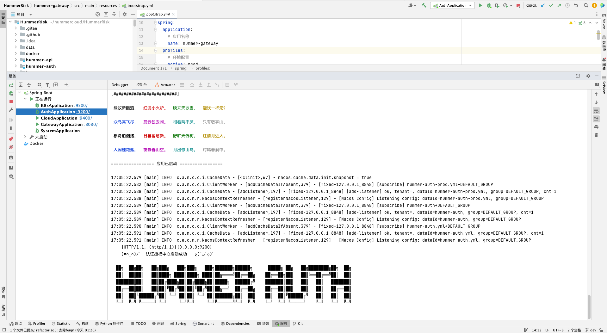{ width="95%" }

!!! abstract "3. 启动 xxl-job"
    4. 本地启动 xxl-job（定时任务，执行检测用，在启动 hummerrisk 其他微服务之前启动）
        * 新建一个 git 项目 输入主工程 git 地址: git@github.com:HummerRisk/xxl-job.git。 
    ```sh
    git clone git@github.com:HummerRisk/xxl-job.git
    
    # 配置参数放到环境变量
    HMR_NACOS_SERVER_ADDR=127.0.0.1;HMR_REDIS_HOST=127.0.0.1;HMR_REDIS_PORT=6379;HMR_REDIS_PASSWORD=;HMR_MYSQL_HOST=127.0.0.1;HMR_MYSQL_PORT=33060;HMR_MYSQL_DB=hummer_risk;HMR_MYSQL_USER=root;HMR_MYSQL_PASSWORD=root;HMR_XXL_JOB_ADDR=127.0.0.1;HMR_XXL_SYSYTEM_ADDR=127.0.0.1;HMR_XXL_CLOUD_ADDR=127.0.0.1;HMR_XXL_K8S_ADDR=127.0.0.1
    
    # IDEA 启动 xxl-job 项目 XxlJobAdminApplication 
    ```
    { width="95%" }

!!! abstract "4. 启动其他项目"
    1. 在启动配置中添加 Spring Boot 启动项，直接启动 Spring Boot 项目即可。
    3. 启动 hummer-gateway、hummer-cloud、hummer-k8s、hummer-system、hummer-monitor(监控，本地开发可以不启动)
    2. 服务成功运行如下所示。
    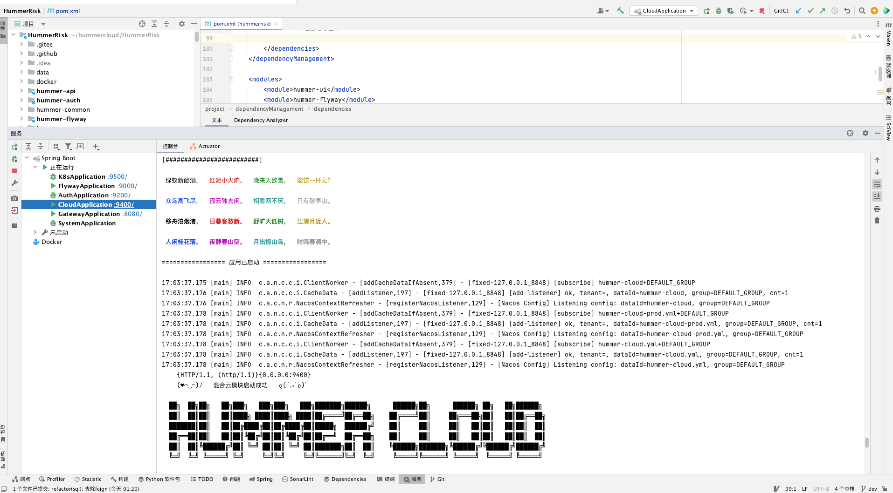{ width="95%" }
    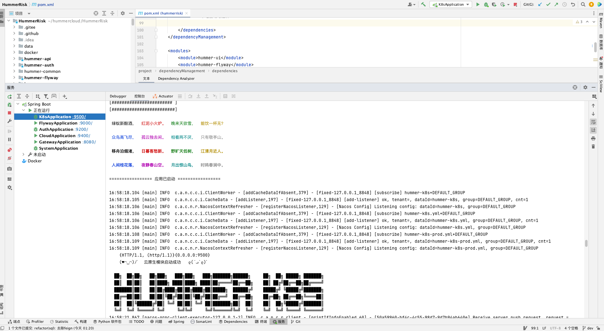{ width="95%" }
    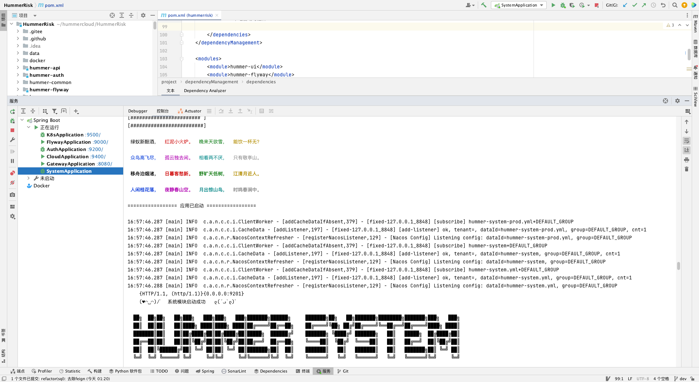{ width="95%" }
    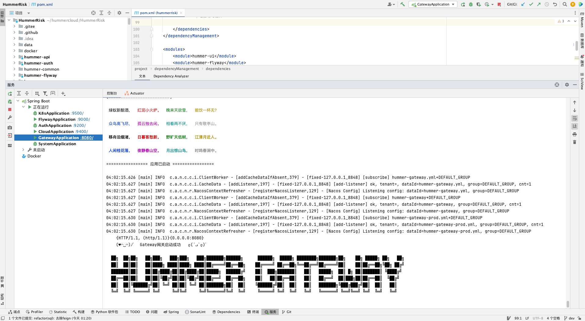{ width="95%" }

!!! abstract "5. 启动前端"
    进入 hummer-ui 目录，执行以下命令安装相关前端组件。
    ```
    npm install
    ```
    进入到 hummer-ui 目录，执行以下命令启动前端服务。
    ```
    npm run serve
    ```
    或者使用 yarn 启动
    ```
    # 项目设置
    yarn install
    ```
    ```
    # 编译并最小化生产
    yarn build
    ```
    ```
    # 编译和热重装以进行开发
    yarn serve
    ```
    前端服务成功运行如下所示。
    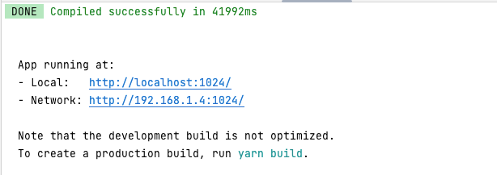{ width="95%" }

## 四 本地安装引擎组件

!!! warning "**注意：** 若需要调试相应的检测功能，需要安装相应的组件引擎"
    1. Cloud Custodian 作为云平台检测引擎，详细的相关操作，请参考 [Cloud Custodian](../related/opensource-tool/custodian.md)
    2. Prowler 作为 AWS 检测引擎，详细的相关操作，请参考 [Prowler](../related/opensource-tool/prowler.md)
    5. Trivy 作为云原生检测引擎  ，详细的相关操作，请参考 [Trivy](../related/opensource-tool/trivy.md)


### 4.1 准备运行环境

!!! abstract "配置本地目录和配置文件"
    **初始化目录：**
    ```shell
    mkdir -p /opt/hummerrisk/conf
    mkdir -p /opt/hummerrisk/image
    mkdir -p /opt/hummerrisk/file
    mkdir -p /opt/hummerrisk/trivy
    mkdir -p /opt/hummerrisk/logs
    ```

=== "安装 Custodian"
    !!! tip "安装 Custodian"
        ```bash
        $ python3 -m venv custodian
        $ source custodian/bin/activate
        (custodian) $ pip install c7n
        # c7n 为必装， tools 下面使用哪个安装哪个
        (custodian) $ pip install -e tools/c7n_aliyun
        (custodian) $ pip install -e tools/c7n_huawei
        (custodian) $ pip install -e tools/c7n_tencent
        (custodian) $ pip install -e tools/c7n_baidu
        (custodian) $ pip install -e tools/c7n_azure
        (custodian) $ pip install -e tools/c7n_gcp
        (custodian) $ pip install -e tools/c7n_jdcloud
        (custodian) $ pip install -e tools/c7n_kube
        (custodian) $ pip install -e tools/c7n_openstack
        (custodian) $ pip install -e tools/c7n_qingcloud
        (custodian) $ pip install -e tools/c7n_ucloud
        (custodian) $ pip install -e tools/c7n_volc
        (custodian) $ pip install -e tools/c7n_vsphere
        (custodian) $ pip install -e tools/c7n_qiniu
        (custodian) $ pip install -e tools/c7n_ksyun
        ……
        ```

=== "安装 Prowler"
    !!! tip "安装 Prowler"
        *  yum 源方式安装 Prowler
        *  对于 Amazon Linux（yum 基于 Linux 发行版和 AWS CLI v2）
        ```bash
        sudo yum update -y
        sudo yum remove -y awscli
        curl "https://awscli.amazonaws.com/awscli-exe-linux-x86_64.zip" -o "awscliv2.zip"
        unzip awscliv2.zip
        sudo ./aws/install
        sudo yum install -y python3 jq git
        sudo pip3 install detect-secrets==1.0.3
        git clone https://github.com/prowler-cloud/prowler
        ```
        * apt 源方式安装 Prowler
        *  对于 Ubuntu Linux（apt 基于 Linux 发行版和 AWS CLI v2）
        ```bash
        sudo apt update
        sudo apt install python3 python3-pip jq git zip
        pip install detect-secrets==1.0.3
        curl "https://awscli.amazonaws.com/awscli-exe-linux-x86_64.zip" -o "awscliv2.zip"
        unzip awscliv2.zip
        sudo ./aws/install
        git clone https://github.com/prowler-cloud/prowler
        ```

=== "安装 Trivy"
    !!! tip "安装 Trivy"
        * Yum 源方式安装
        ```bash
        $ sudo vim /etc/yum.repos.d/trivy.repo
        [trivy]
        name=Trivy repository
        baseurl=https://aquasecurity.github.io/trivy-repo/rpm/releases/$releasever/$basearch/
        gpgcheck=0
        enabled=1
        $ sudo yum -y update
        $ sudo yum -y install trivy
        ```
        * rpm 方式安装
        ```bash
        rpm -ivh https://github.com/aquasecurity/trivy/releases/download/v0.19.2/trivy_0.19.2_Linux-64bit.rpm
        ```
        * 二进制方式安装
        ```bash
        mkdir -p $GOPATH/src/github.com/aquasecurity
        cd $GOPATH/src/github.com/aquasecurity
        git clone --depth 1 --branch v0.19.2 https://github.com/aquasecurity/trivy
        cd trivy/cmd/trivy/
        export GO111MODULE=on
        go install
        ```

## 五 镜像打包（推荐）

!!! abstract ""
    源码中包含 Dockerfile 文件，建议将项目打包成镜像运行，进入 docker 目录，用户可以替换自己的 Dockerfile 研发版本。
    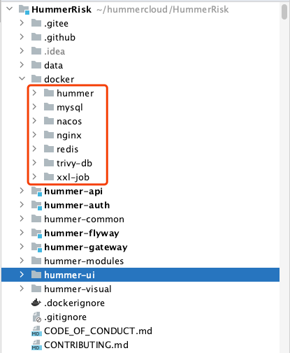{ width="95%" }

## 六 其他注意事项

!!! abstract ""
    内置示例数据以 flyway 的形式在 HummerRisk 启动时自动插入到了 MySQL 数据库中，在源码运行的情况下可自动初始化获取内置检测规则等数据；  

