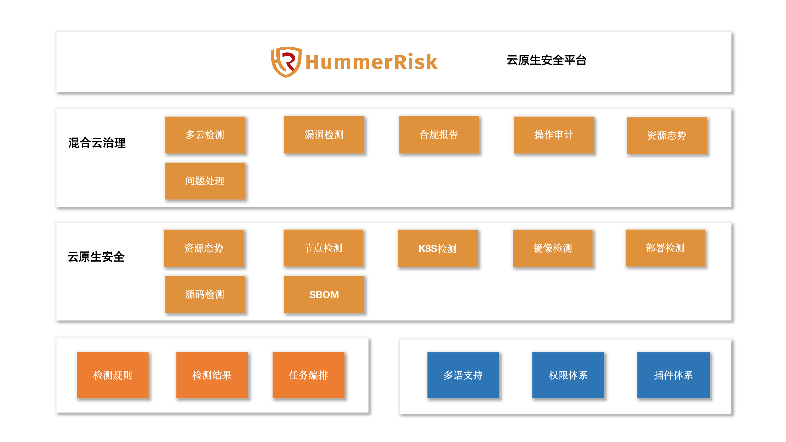
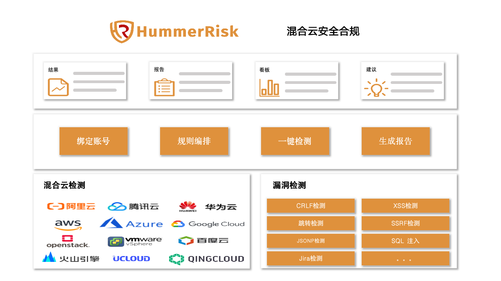
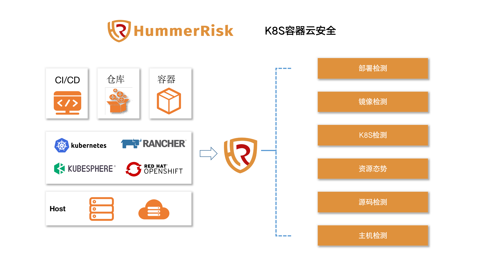

# 总体介绍

> HummerRisk 是开源的云原生安全平台，以非侵入的方式解决云原生环境的安全和治理问题。核心能力包括混合云的安全治理和容器云安全检测。

## 功能架构图

{ width="95%" }

## HummerRisk 能做什么

### **混合云安全治理**

* 混合云安全合规检测：
  对主流的公(私)有云资源进行安全合规检测，例如等保2.0预检、CIS 合规检查、各种基线检测，同时可自定义检测规则；
* 云资源态势：
  同步云上资源，快速查看混合云的各种资源态势与云资源拓扑图；
* 漏洞检测：
  基于漏洞规则库，通过扫描等手段对指定的网络设备及应用服务的安全脆弱性进行检测；
* 合规报告：
  一键获取合规报告，全面掌控安全态势。
* 操作审计：
  统一监控多云环境上的账号活动，对云上产品和服务的访问和使用行为的操作日志进行审计。
  
{ width="95%" }

> **优势是什么？**

* 支持全面: 支持的几乎所有公有云，包括：阿里云、腾讯云、华为云、火山引擎、百度云、青云、UCloud、Amazon Web Services、Microsoft Azure、Google Cloud，支持的私有云包括：OpenStack、VMware vSphere，并还在不断的扩充支持的范围；
* 容易上手: 只需绑定云账号，就可以一键执行检测；
* 灵活便捷: 多种维度查看检测结果，根据需求任务编排；
* 开箱即用: 内置大量规则，并且不断迭代新增。用户可以按需自定义规则。 

### **容器云安全检测**

* K8S 资源态势：
  可以关联多个 K8S 集群，统一查看各个关联环境的资源态势；
* 主机检测：
  可以自定义检测内容，发现底层主机、虚机中存在问题；
* K8s 检测：
  根据 K8S 安全基线进行检测，发现存在的配置错误、安全漏洞、危险动作等内容；
* 部署检测：
  检测 K8S 的部署编排文件，在部署前发现其中的配置问题；
* 镜像检测：
  全面检测镜像相关的漏洞，包括操作系统、软件包、应用程序依赖等方面；
* 源码检测：
  检测开发者的源代码，提前发现其中的开源协议、依赖、漏洞、代码等问题；
* 文件检测：
  检测源码项目中特定的语言文件或文件夹，发现应用程序依赖的漏洞风险；
* SBOM 管理:
  SBOM 的可视化管理和分析，检测 SBOM 的变更，快速发现和定位软件供应链中的风险和漏洞，给出合理的处理建议。

{ width="95%" }

>**优势是什么？**  

* 兼容性: 支持多种 K8s 发行版；
* 独立性: 中立产品，客观检测；
* 可靠性: 急速响应，快速准确；
* 无侵入：无侵入式检测。

## Star History

[{ width="95%" }](https://star-history.com/#HummerRisk/HummerRisk&Date)

!!! warning "默认 web 登录账户: admin 密码：hummer"
