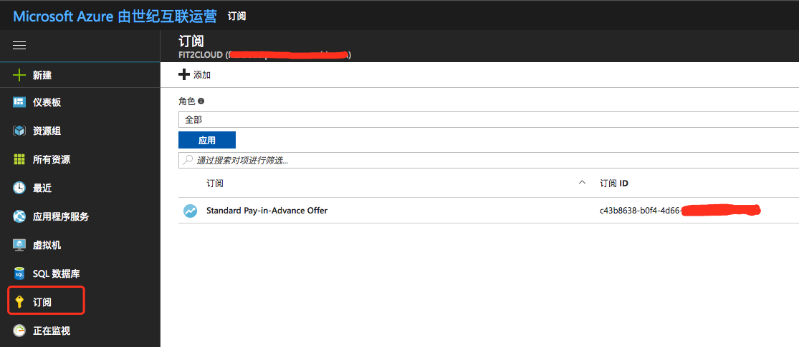

### 安装 Azure CL 并生成 service principal 文件

#### 1 安装

!!! question "Yum⽅式安装"
    For Linux distributions with yum such as RHEL, Fedora, or CentOS, there's a
    package for the Azure CLI. This package has been tested with RHEL 7, Fedora
    19 and higher, and CentOS 7.

    ```bash
     1.1 sudo rpm --import https://packages.microsoft.com/keys/microsoft.asc
     1.2 sudo sh -c 'echo -e "[azure-cli]\nname=Azure CLI\nbaseurl=https://packages.microsoft.com/yumrepos/azure-cli\nenabled=1\ngpgcheck=1\ngpgkey=https://packages.microsoft.com/keys/microsoft.asc" > /etc/yum.repos.d/azure-cli.repo'
     1.3 sudo yum install azure-cli
    ```

!!! info "验证"
{ width="95%" }

!!! question "macOS 上安装"
    ```bash
    brew update && brew install azure-cli
    ```
    验证⽅式同上

#### 2 service principal⽂件的作用

!!! question "为什么需要service principal⽂件"
    使⽤azure-sdk-for-java必须使⽤此⽂件中的内容。

    参考：https://github.com/Azure/azure-libraries-for-java/blob/master/AUTH.md

!!! info "1.登录"
    (⾮常重要)如果是中国区账号，务必先执⾏如下命令以指定AzureChinaCloud
    ```bash
    az cloud set -n AzureChinaCloud
    ```
    然后登录
    ```bash
    az login -u <登录⽤户名> -p <登录密码>
    ```
    其中，登录⽤户名和密码为登录Azure Web控制台所使⽤的⽤户名和密码

!!! info "2.指定订阅"
    ```bash
    az account set --subscription <subscription name>
    ```
    其中，subscription name为订阅名称或订阅ID，它的值可以从上述登录命令的返回中找到,或者从Azure Web控制台中找到。

{ width="95%" }
{ width="95%" }

#### 3 生成service principal⽂件

!!! question "第⼀种⽅式"
    执⾏命令
    ```bash
    curl -L https://raw.githubusercontent.com/Azure/azure-libraries-for-java/master/tools/authgen.py | python > my.azureauth
    ```
    执⾏完成后会在当前⽬录⽣成my.azureauth⽂件，这个就是需要的service principal⽂件，⽂件看起来是这样的：

{ width="95%" }

!!! question "第⼀种⽅式"
    执⾏命令
    ```bash
    az ad sp create-for-rbac -o json --query "{client: appId, key: password, tenant: tenant}"
    ```
    命令中的参数名称（appId、password、tenant）用实际参数替换再执行，返回结果看起来是这样的：

{ width="95%" }
