## 互联网安全中心（CIS: Center for Internet Security）

网络安全域

>将企业网络安全进行一个整体的统筹划分，按照企业网络安全建设的全方面，将网络安全技术领域细分为9个安全子域，其中网络安全基线为基础域，通过各个子域的建设实施，不断完善网络安全基线的建设，将网络安全基线作为网络安全技术标准，统一实施，提高企业网络安全整体防御实力。

{ width="900px" }
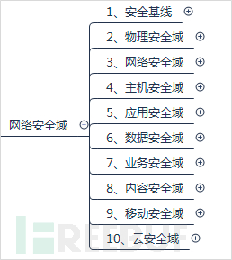{ width="900px" }

### 1、安全基线

安全基线是网络安全技术的标准基石、是网络安全技术的标准依据，基于网络安全基线，进行网络安全建设和实施，为包括系统安装、应用部署、数据库部署等在内的具体的技术实施提供安全基线实施。

实际上，安全基线是有国际标准组织和最佳实践的，即CIS。CIS®（Center for Internet Security）是一非盈利组织，CIS Controls和CIS
Benchmarks是保护IT系统和数据免受最普遍网络攻击的全球标准和公认的最佳实践。CIS Benchmarks提供了一系列指导手册来保护容易受到网络攻击的操作系统、软件和网络。主要包括如下内容：

|   序号    |   类别    | 内容 |
|:-------:|:-------:| :----: |
|    1    |  操作系统   | Amazon Linux、CentOS Linux、Debian Linux、Oracle Linux、Red Hat Linux、SUSE Linux、Ubuntu Linux、Apple OS、IBM AIX、Oracle Solaris、Windows |
|    2    |   数据库   | IBM DB2、Microsoft SQL Server、MongoDB、Oracle Database、Oracle MySQL |
|    3    |   服务器   | Apache HTTP Server、Apache Tomcat、Microsoft IIS |
|    4    |    云    | Amazon Web Services、Microsoft Azure |
|    5    | 容器和虚拟机  | Docker、VMware |
|    6    |  移动设备   | Apple IOS、Google Android |
|    7    |   浏览器   | Google Chrome、Mozilla Firefox、Microsoft Internet Explorer、Safari Browser |
|    8    |  移动设备   | Microsoft Office、Microsoft Exchange Server |
|    9    |   浏览器   | Cisco、Palo Alto Networks |

CIS还提供了配置评估工具CIS-CAT Pro，当前支持85+ CIS Benchmarks。

*更多请参考：https://www.cisecurity.org/cis-benchmarks/

关于基线的建立和实施落地的最佳实践是这样的：

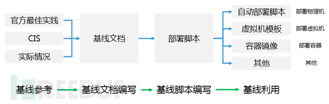{ width="900px" }

基于官方最佳实践、CIS和自身实际具体情况等，首先完成相应内容的基线文档编写。然后在进行基线文档编写的同时或基于基线文档，完成脚本的编写和脚本部署（技术工程师在编写基线文档时，可以同时输出脚本和文档）。通过基线文档和基线脚本固化系统、应用、数据库等部署方式，并且可以形成自动化部署，以此为基础，结合实际架构，形成标准的虚拟机模板或是容器镜像，并再配套自定义脚本，完成基线的落地实施。

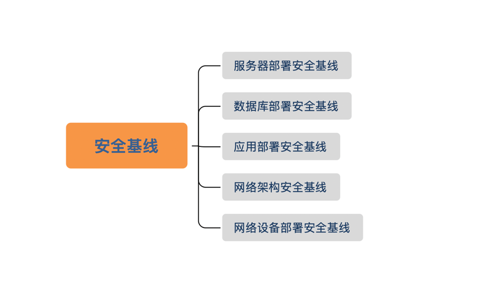{ width="900px" }

### 2、物理安全域

物理安全域主要包括：企业经营过程中门禁安保、视频监控、电话录音以及机房安全等物理设施设备方面的安全。

物理安全是比较容易忽视的，对于物理安全的攻击威胁大多属于社会攻击学范畴，忽视或防范不善所造成的影响往往比较大且极具毁灭性，例如机房纵火、断电等。对于视频监控、机房建设等方面几乎都有专业的国际、国家标准要求规范，按照国标要求规范进行建设实施，并且定时巡检排查，可有效地避免物理安全事件的发生。尤其是作为应用系统和数据的物理载体，数据中心机房的安全更需要着重注意，注意考虑从以下几个方面进行物理安全加固：选择科学合理的位置进行机房建设；对机房出入权限进行严格控制；通过安防和门禁，避免机房遭窃和被破坏；根据标准规范进行机房施工建设，使机房具备防雷击、防火、防水、防潮、防静电以及有效控制温湿度、保持稳定电力供应和电磁防护等功能。

从企业网络安全的角度来说，安保、门禁、监控以及电话录音等部门所归属有的时候不属于IT部，或不属于网络安全部门，但是这一块还是应该引起网络安全责任者的足够重视，一旦物理防线失守，任何上层高阶防护都将都成为浮云。物理安全方面也可引申出灾备建设这一概念，通过建立灾备机房、异地备份等手段，避免因单节点物理故障造成巨大影响。'

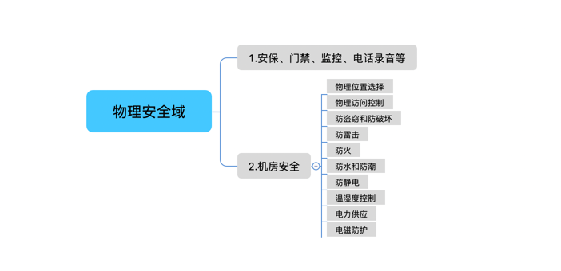{ width="900px" }

### 3、网络安全域

网络安全域主要是指网络规划架构、网络防护、控制等方面安全，与企业网络安全相比，此处的网络安全属于狭义的网络安全，仅是“网络”方面的安全。

{ width="900px" }

网络安全域的防护建设应该从网络架构、边界防护、访问控制和安全通信四个方面进行，具体如下：

* 网络架构

网络架构设计对网络安全起着重要的决定性作用，架构的好坏直接决定了后续网络安全工作的难易度以及工作量。网络架构方面可分为三个部分：

>①划分网络区域

根据实际业务需求划分科学合理的网络区域，不同网络区域间采用ACL控制策略和白名单机制（甚至区域防火墙），最大限度的防范区域网络安全和网络攻击的蔓延。一般来讲，网络区域划分可以借鉴这几个区域：办公区、业务区、办公系统服务区、开发测试服务区、内部系统服务区、军事隔离区（DMZ）等，不同的区域提供不同的服务，区域之间耦合较少，进行策略隔离。

>②网络设备高可用

网络架构的设计和部署一定要保证网络设备、网络线路的高可用，避免单点故障。核心交换机、接入交换机、汇聚交换机要尽量避免单台，建议多台进行堆叠或虚拟化部署，连接的线路要双线路，最大程度的避免设备和线路的单点故障。如果资源或是设计受限，那么核心交换机的双台、双线是最基本的需求。

>③网络负载均衡和流量控制

网络架构设计还应规划建设网络负载均衡、流量监控、流量控制引流等方面的内容。在避免单运营商故障（实际上，运营商光缆挖断的情况经常发生）的同时，为不同网络用户提供高效的网络服务，并且可根据流量的实时监控，动态调整和管控。

* 边界防护

边界防护方面主要是边界防火墙和边界准入策略（一般为白名单机制）等方面。边界包括企业与互联网之间的边界，还包括内部网络区域之间的边界、企业与第三方合作单位和分支机构的边界等。边界防护是网络安全的第一道墙，应提供坚实有力的网络防护功能，具备卸掉绝大多数网络攻击的能力。

* 访问控制

访问控制主要是对网络区域访问的控制策略，以及允许哪些网络终端、办公终端可以访问哪些网络区域、系统应用等。

* 安全通信

安全通信是指在网络安全传输过程中防止网络被监听、被篡改等内容。常用的解决方法如SSL数据数据传输加密。

### 4、主机安全域

主机安全域主要包括主机服务器安全和终端安全。

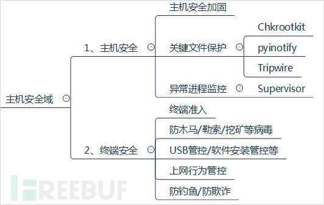{ width="900px" }

>主机安全

主机服务器的安全在遵循主机安全基线部署的前提下，主要包括三个内容，可以从这三个内容进行主机安全防御：

①主机安全加固

主机安全加固主要指在安装部署操作系统时，对操作系统进行安全加固，如：内核升级、ssh升级、root禁止远程登录、修改ssh端口、history命令增加时间、禁止rm等。具体可参考：

终端合规安全设置文档（window平台）

https://mp.weixin.qq.com/s/ov0GvC9MmTM3i_0ixlungA

终端合规安全设置文档（linux平台）

https://mp.weixin.qq.com/s/YGfRLLFy7DO8GkpKCNnoog

实际上这一块是与安全基线不断完善的，实际部署过程中，按照基线部署实施即可。

②关键文件保护

关键文件保护是指针对操作系统的核心的、重要文件通过技术手段进行保护，避免被删、被篡改。以linux为例（实际上linux是最好做的），常用到的工具有Tripwire、Chkrootkit、pyinotify，通过这类工具软件可以拒绝关键文件的非法修改，同时还可以出发告警。另外在上面主机安全加固时，其实还有一块，是可以将操作系统关键操作修改命名名称的，如：

#锁定关键文件系统禁止被修改

    !!! tip ""
        ```sh
        chattr +i /etc/passwd
        
        chattr +i /etc/inittab
        
        chattr +i /etc/group
        
        chattr +i /etc/shadow
        
        chattr +i /etc/gshadow
        
        chattr +a /var/log/messages
        ```


#使用chattr命令后，为了安全我们需要将其改名

mv /usr/bin/chattr /usr/bin/lockkeyfile

通过对关键文件进行保护，一是提高了系统的整体安全性，另外就是当系统遭受攻击时，其基本命令还是处于可信的状态，否则在系统已被攻陷的情况下，极有可能你的一条cd /home的命令实际上是rm -rf /home。

③异常进程监控

对于系统中常用的进程进行记录固定至进程白名单中，并对系统的进程进行实时监控，当启动非白名单进程时，进行自动kill，并且邮件通知进行排查。

实际上通过主机安全加固、关键文件保护以及异常进程监控等可以很大程度的保障主机的安全稳定，同时在结合一定的病毒入侵分析方法和脚本，可以更加完整、完善的建立起主机防病毒和异常自动检测。

终端安全
终端安全主要是指常见的办公终端、移动终端等终端设备的安全。终端安全的内容有：终端准入，允许哪些终端连接哪些系统或是设备；终端防木马、防勒索、防挖矿等；USB管控/软件安全装管控（实际上终端管理实现）、上网行为管控以及防钓鱼、防欺诈等。

终端安全关系到每一个终端使用者，提高终端使用者的安全意识和安全基本技能，也是终端安全防护的重要内容且非常行之有效的方式之一。

### 5、应用安全域

应用安全域主要覆盖应用系统的网络安全，特别是web应用系统，由于web应用系统多对外发布，故所面临的的安全威胁和攻击相比内网系统要高得多，甚至每时每刻都处于被扫描和被攻击中。非营利性组织开放式Web应用安全项目（OWASP）正式发布了十大最关键的Web应用安全风险：

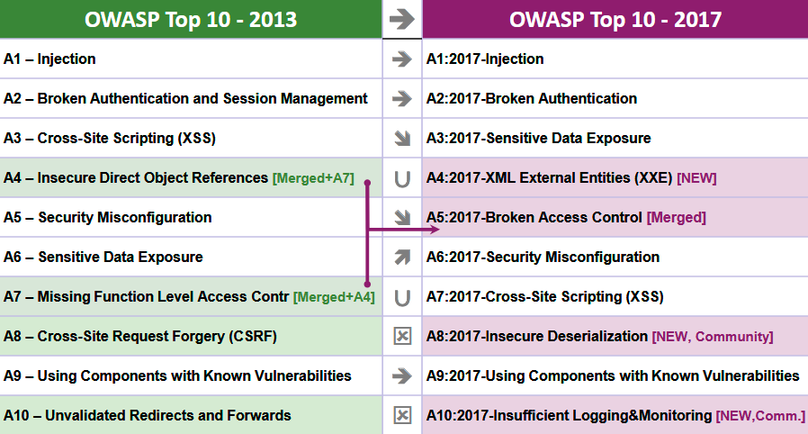{ width="900px" }

>A1：2017-Injection（注入漏洞）

当不可信的数据作为命令或查询语句的一部分被发送给解释器的时候，会发生注入漏洞，包括SQL、NoSQL、OS以及LDAP注入等。攻击者发送的恶意数据可能会诱使解释器执行计划外的命令，或在没有适当授权的情况下访问数据。

>A2：2017-BrokenAuthentication（中断身份认证）

与认证和会话管理相关的应用函数经常被错误地实现，从而允许攻击者破坏密码、密钥或是会话令牌，或者利用其他的应用漏洞来暂时或永久地获取用户身份信息。

>A3：2017-Sensitive DataExposure（敏感数据泄露）

许多web应用程序和API不能正确的保护敏感数据，如金融、医疗保健和PII（个人身份信息）等。攻击者可能会窃取或篡改这些弱保护的数据，从而进行欺诈、身份盗窃或其他犯罪行为。在缺少额外保护（例如，在存放和传输过程中加密，且在与浏览器进行交换时需要特别谨慎）的情况下，敏感数据可能会受到损害。

>A4：2017-XML ExternalEntities（XXE）XML外部处理器漏洞

许多过时的或配置不当的XML处理器在XML文档内进行外部实体引用。外部实体可用于泄露内部文件，通过使用文件URI处理器、内部文件共享、内部端口扫描、远程代码执行以及拒绝服务攻击等手段。

>A5：2017-Broken AccessControl（中断访问控制）

限制“认证的用户可以实现哪些操作”的命令没有得到正确的执行。攻击者可以利用这些漏洞访问未经授权的功能和数据，例如访问其他用户的账户，查看敏感文件，篡改其他用户的数据，更改访问权限等。

>A6：2017-SecurityMisconfiguration（安全配置错误）

安全配置错误是最常见的问题。这通常是由不安全的默认配置，不完整或ad hoc配置，开放云存储，错误配置的HTTP标头，以及包含敏感信息的详细错误信息造成的。所有的操作系统、框架、库、应用程序都需要进行安全配置外，还必须要及时进行系统更新和升级。

>A7：2017-Cross-SiteScripting（XSS）跨站脚本攻击

如果应用程序在未经适当验证或转义的情况下，能够在新网页中包含不受信任的数据，或是使用可以创建HTML或者JavaScript的浏览器API更新包含用户提供的数据的现有网页，就会出现XSS漏洞。XSS允许攻击者在受害者的浏览器中执行脚本，这些脚本可以劫持用户会话、破坏网站或将用户重定向到恶意网站中。

>A8：2017-InsecureDeserialization（不安全的反序列化）

不安全的反序列化漏洞通常会导致远程代码执行问题。即使反序列化错误不会导致远程代码执行，也可以被用来执行攻击，包括重放攻击、注入攻击以及权限提升攻击等。

>A9：2017-UsingComponents with Known Vulnerabilities（使用含有已知漏洞的组件）

组件（如库、框架和其他软件模块）是以与应用程序相同的权限运行的。如果存在漏洞的组件被利用，这种攻击可能会导致严重的数据丢失或服务器接管危机。使用已知漏洞组件的应用程序和API可能会破坏应用程序的防御系统，从而启动各种形式的攻击，造成更为严重的影响。

>A10：2017-InsufficientLogging & Monitoring（不足的记录和监控漏洞）

不足的记录和监控漏洞，再加上事件响应能力欠缺以及缺少有效的整合，使得攻击者可以进一步攻击系统，维持其持久性，转而攻击更多的系统，并篡改、提取或销毁数据。大部分的数据泄露研究显示，检测出发生数据泄漏的时间通常需要超过200天，而且通常是外部机构率先发现数据泄漏的事实，而不是通过内部的审计流程或监控发现的。

想规避这些应用安全，最有效的办法是在应用系统开发时进行安全编码、安全测试，即在根上解决大部分的问题。关于安全编码规范在上述章节中已经有所说明，也是OWASP给出的安全编码规范。另外就是通过安全设备、安全策略的方式对我们的应用系统进行安全防护，避免应用系统遭受攻击和破坏。

网关安全是应用系统架构在实行微服务架构之后，要着重注意的一个方面。随着新应用系统架构的革新，新架构的安全方面需要从系统架构、安全策略等方面重新审视，这一点其实经常被忽略，这要求我们的架构师、IT负责人在进行技术架构改变的时候，对于新架构的安全性和稳定性要进行安全风险评估，尤其是采用的新技术、新框架。

实际上，在应用安全域中最主要的安全设备是WAF，WEB应用防火墙。一般WEB应用防火墙应具备SQL防注入、防XSS攻击、防CSRF攻击、防文件上传漏洞、webshell检测与阻断、防暴力破解、防止页面被恶意篡改、页面被劫持等常见web防护功能。设备配合安全策略，也可以防住绝对多数的安全攻击。

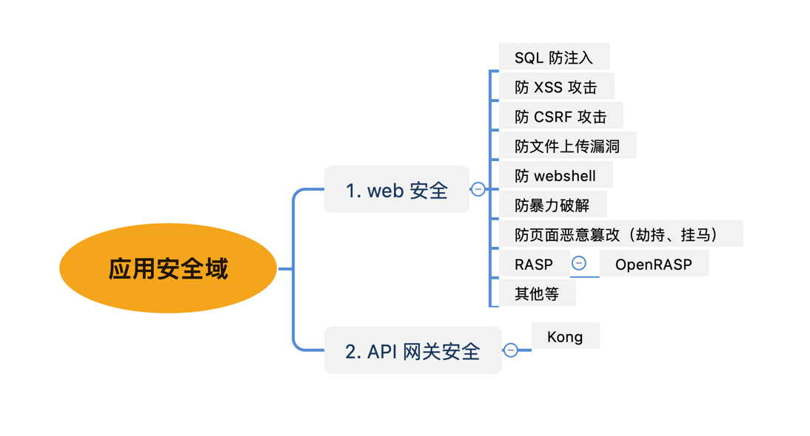{ width="900px" }

### 6、数据安全域

数据安全域是网络安全域中最核心的内容之一。因为所有的应用系统最终都转化成数据进行存储、管理和使用，数据也是企业最重要的核心资产之一。

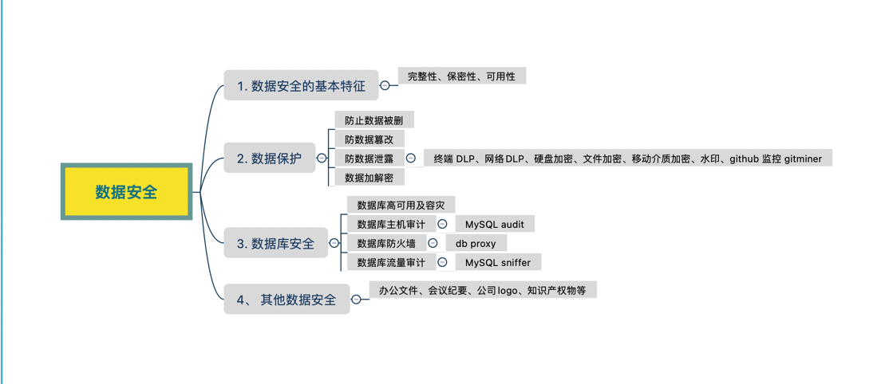{ width="900px" }

数据安全主要包括四个部分：数据安全的基本特性、数据保护、数据库安全和其他数据安全等。

>与信息安全的五大特性（完整性、保密性、可用性、不可否认性、可控性）相配合，数据安全的三大特性为，可用性、完整性和保密性：

① 数据的可用性是指经授权的合法用户必须得到系统和网络提供的正常服务。不可因为保护数据泄露而拒合法使用者于千里之外。数据安全必须为合法使用者提供便捷的服务。

② 数据的完整性是指数据未经授权不得进行修改，确保数据在存储和传输过程中不被篡改、破坏、盗用、丢失。这需要在加密的基础上，运用多种方案和技术来实现。完整性是数据安全的核心。要保障数据的完整性，必须设置部门人员权限和文件密级。这样可以严格控制文件的流向，监控文件访问人员的操作行为，从源头上控制数据泄露。此外，鉴于黑客攻击的目标通常是高权限账户，系统建立了完善的日志审计体系。全面记录对文件的操作行为，特别是高权限账户。通过监控和分析，实时呈现整体安全态势，并及时识别威胁行为，杜绝数据泄露的发生。

③ 数据的保密性是指对数据进行加密，只有授权者方可使用，并保证数据在流通环节不被窃取。这包括网络传输保密和数据存储保密。这一特性，要求加密技术必须自动、实时、精确、可靠。

（2）围绕数据安全基本特性即数据安全的基本要求，进行数据保护。实际上数据保护可以细分为防误删、防篡改、防泄漏以及配合的数据加解密手段。

① 防误删。应当通过安全设备、安全策略或系统自身功能防止数据被恶意删除。防止数据被恶意删除有三个层面值得防护：应用系统层面、操作系统层面和数据库层面。对这三个层面的操作权限进行严格的控制，并且杜绝物理删除，只允许逻辑删除，并且保留日志记录，日志应当详细的记录整个删除操作，包括删除时间、删除人员、删除对象、删除前内容等。另外对于防误删，应当制定相应的备份策略，并且对备份集严加管控，确保数据即使被删，也快通过技术手段进行挽回。

② 防篡改。应当通过安全设备、安全策略或系统自身提供的功能，防止数据被恶意篡改。防止数据被恶意篡改包括数据传输过程中的被恶意篡改和数据存储使用过程中被恶意篡改。与数据防误删一致，应当在不同的层面进行权限控制、日志记录和制定备份策略等方式，防止数据被恶意篡改。另外防止数据被恶意篡改，还应提供数据加密、数据水印、数据校验等手段进行检测和防护。

③ 防泄漏。数据泄漏的渠道非常多，应当针对不同的渠道采用科学、合理、完善的措施防止数据被泄露。常用的安全设备有：终端DLP、网络DLP、硬盘加密、文件加密、移动介质加密、水印、github监控gitminer等，其中尤其注意gitminer，可以帮忙监控企业在github是是否由泄露敏感代码或数据信息等。对于数据防泄漏这一块，要做到两点，第一是防止数据被泄露出去，第二就是当数据泄露出去时，应当快速的调查出是由谁、什么时间、什么方式、什么终端泄露至什么地方等关键信息，同时配套的网络安全管理方面应当有管理制度和惩罚机制。

（3）数据库安全

数据库作为承载数据最重要的载体之一，数据库的安全防护至关重要。对于数据库的安全防护可从三个方面进行：数据库高可用及灾备、数据库防火墙、数据库审计等。

首先应当通过数据库的高可用架构保障数据库能够稳定的运行，避免单点故障，与高可用架构想配合的有灾备方案，包括数据中心灾备、存储灾备等，数据库的高可用方案也有多种选择，如主从同步（如Oracle的DG、MySQL的replication等）、集群（如Oracle的Rac、MySQL的Cluster等）等；

其次是数据库防火墙。数据库防火墙系统，串联部署在数据库服务器之前，解决数据库应用侧和运维侧两方面的问题，是一款基于数据库协议分析与控制技术的数据库安全防护系统。DBFirewall基于主动防御机制，实现数据库的访问行为控制、危险操作阻断、可疑行为审计。以mysql为例，可以使用db proxy实现防火墙的功能，实际上db proxy的位置与数据库防火墙的位置是一致的，所以二者功能相结合是不错的选择。

最后是数据库审计。能够实时记录网络上的数据库活动，对数据库操作进行细粒度审计的合规性管理，对数据库遭受到的风险行为进行告警，对攻击行为进行阻断。它通过对用户访问数据库行为的记录、分析和汇报，用来帮助用户事后生成合规报告、事故追根溯源，同时加强内外部数据库网络行为记录，提高数据资产安全。以MySQL为例，开源的审计工具有mysql-audit、mysql sniffer，还有其自身的审计功能。

实际上，数据库安全除了上述主要的三个方面外，还有数据库漏扫、数据库加密、数据脱敏等内容。常见的数据库安全风险包括：刷库、拖库、撞库等，数据库安全攻击最常用的手段是SQL注入攻击。通过数据库安全设备和数据库安全策略以及数据库自身的安全框架，数据库高可用等，共同对数据库安全进行重要防护。

（4）其他数据安全

数据安全域的主要保护对象是数据，实际上除了应用系统的数据外，还包括公司文件、会议纪要、公司logo、知识产权物等内容，同时这些内容这也是内容安全域的重要组成部分之一。这一部分数据的安全，结合数据防泄漏的产品设备和策略进行防护，同时还应加强安全管理管控，提升全员安全意识。

回归数据安全域，数据作为企业的重要核心资产之一，一定要加强对数据的防护。同时在防护过程中，也要准确识别不同级别、不同类型的数据资产，分级别防护，做到数据安全收益的最大化。

### 7、业务安全域

如果说数据安全域是网络安全域最重要的部分，那么业务安全域极有可能是网络安全域中最困难的部分。因为业务安全域需要在安全技术和业务知识方面有很深的理解和融合，才能做好业务安全的防护。

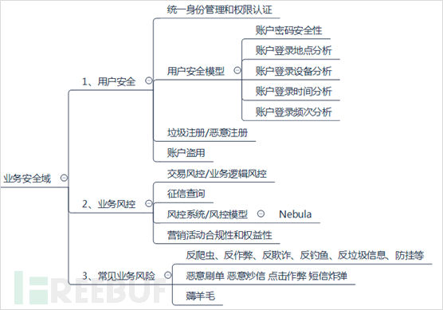{ width="900px" }

业务安全域可以从三个方面介绍：用户安全、业务风控以及常见业务风险。

（1）用户安全

首先是用户安全，这个也是在进行应用系统设计是要着重注意的内容。用户安全要求在应用系统设计时，要有统一的身份管理和权限认证模块，制定应用系统用户、权限分级、分类设计和管理，还应防止垃圾注册、恶意注册等内容。同时还应建立用户安全模型，分析用户的异常情况，防止用户账号被盗用或系统用户管理出现异常信息等。用户安全模型除了要求用户密码安全性和复杂度外，通过记录用户账户的登录地点、登录设备（或浏览器）、登录时间、登录频次等进行分析，判断用户是否处于异常高危情况。对于用户账户密码要求这一块，建议应符合以下原则：

* 密码长度最小值大于等于8个字符
* 密码最短使用期限大于等于2天
* 密码最长使用期限小于等于90天
* 保留密码历史数量大于等于5个
* 复位账户锁定计数器大于等于15分钟
* 账户锁定时间大于等于15分钟
* 账户锁定阈值小于等于10次

（2）业务风控

业务安全区域实际上主要是对业务风险进行识别和控制，确保

（3）常见业务风险

存储存储存储池

### 8、内容安全域

内容安全域在网络安全工作中比较容易忽视，尤其是一些中小型公司的网络安全工作中比较淡薄。内容安全域主要是指企业日常经营过程中网络舆情、媒介内容宣传等方面内容。

{ width="900px" }

根据当下主流方式，舆情监控的重点主要在微信公众号、抖音公众号、微博、贴吧、论坛、知乎等区域。通过监控公司声誉形象、敏感信息、公司关键人物信息等在不同信息渠道的不同评价，及时遏制负面舆论导向，积极进行正面引导，避免因舆论导致公司经营受阻。特别是注意舆论黑天鹅事件。

在公司经营活动过程中所涉及的文件、文字字体、宣传图片、营销文案、音视频等在防止恶意泄露的同时，还应注意版权信息，不仅要防止自己权益受侵害，还应保护他人合法权益，避免对他人造成侵权行为。

当公司的规模比较大时，内容安全也是网络安全的重要部分，及时监控和引导舆情，为企业生产经营在互联网世界营造正面、积极向上的形象，同时还要增强版权意识，避免侵权和被侵权的事件发生。

### 9、移动安全域

移动安全域主要是针对企业的移动网站、移动App等内容，该域安全主要涉及两个方面：一方面是移动安全加固，即在开发和发布移动网站、移动App时，应主动进行安全加固，避免出现高危安全漏洞；另一方面是移动安全监控，即企业移动应用在运行过程中，要进行安全监控，包括可用性监控和安全性监控。

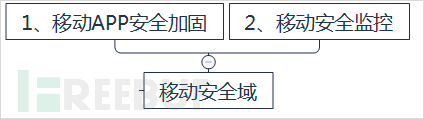{ width="900px" }

### 10、云安全域

云安全域详情参考第二部分第四章云安全部分。

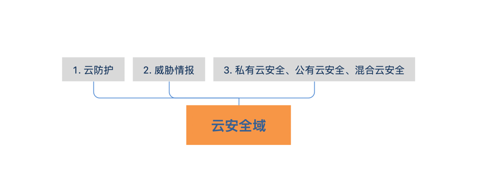{ width="900px" }
