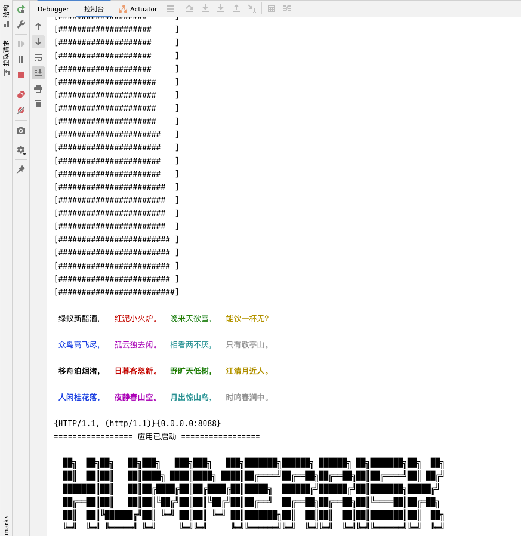
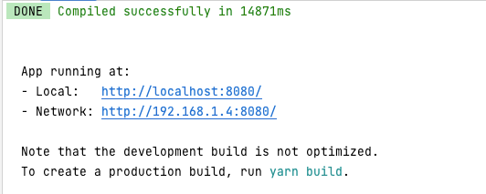

## hummerrisk 项目结构（https://github.com/HummerRisk/HummerRisk）

```
.
├── Dockerfile                                      # 构建容器镜像使用的 dockerfile
├── LICENSE
├── README.md
├── ROADMAP.md
├── backend                                         # 后端项目主目录
│   ├── backend.iml
│   ├── pom.xml                                     # 后端 maven 项目使用的 pom 文件
│   └── src                                         # 后端代码目录
├── frontend                                        # 前端项目主目录
│   ├── babel.config.js
│   ├── frontend.iml
│   ├── node
│   ├── node_modules
│   ├── package-lock.json
│   ├── package.json
│   ├── pom.xml                                     # 前端 maven 项目使用的 pom 文件
│   ├── public
│   └── src                                         # 前端代码目录
└── pom.xml                                         # 整体 maven 项目使用的 pom 文件
```

## 配置开发环境

### 后端

hummerrisk 后端使用了 Java 语言的 Spring Boot 框架，并使用 Maven 作为项目管理工具。开发者需要先在开发环境中安装 JDK 1.8 及 Maven。

#### 初始化配置

##### 数据库初始化

!!! info "注意"
hummerrisk 使用 MySQL 数据库，推荐使用 MySQL 5.7 版本。同时 hummerrisk 对数据库部分配置项有要求，请参考下附的数据库配置，修改开发环境中的数据库配置文件

```
[mysqld]
default-storage-engine=INNODB
lower_case_table_names=1
table_open_cache=128
max_connections=2000
max_connect_errors=6000
innodb_file_per_table=1
innodb_buffer_pool_size=1G
max_allowed_packet=1G
slave_max_allowed_packet=1G
transaction_isolation=READ-COMMITTED
innodb_flush_method=O_DIRECT
innodb_lock_wait_timeout=1800
innodb_flush_log_at_trx_commit=0
sync_binlog=0
sql_mode=STRICT_TRANS_TABLES,NO_ZERO_IN_DATE,NO_ZERO_DATE,ERROR_FOR_DIVISION_BY_ZERO,NO_AUTO_CREATE_USER,NO_ENGINE_SUBSTITUTION
skip-name-resolve
```

请参考文档中的建库语句创建 hummerrisk 使用的数据库，hummerrisk 服务启动时会自动在配置的库中创建所需的表结构及初始化数据。

```mysql
CREATE DATABASE `hummerrisk` /*!40100 DEFAULT CHARACTER SET utf8mb4 */
```

##### HummerRisk 配置文件

HummerRisk 会默认加载该路径下的配置文件 /opt/hummerrisk/conf/hummerrisk.properties，请参考下列配置创建对应目录及配置文件

```
# 数据库配置
spring.datasource.url=jdbc:mysql://localhost:3306/hummerrisk?autoReconnect=false&useUnicode=true&characterEncoding=UTF-8&characterSetResults=UTF-8&zeroDateTimeBehavior=convertToNull&useSSL=false
spring.datasource.username=root
spring.datasource.password=root

# 启动模式，lcoal 表示以本地开发模式启动
run.mode=local
```

#### 运行后端服务

在启动配置中添加 Spring Boot 启动项，直接启动 Spring Boot 项目即可

#### 后端服务成功运行

{ width="900px" }

### 前端

hummerrisk 前端使用了 Vue.js 作为前端框架，ElementUI 作为 UI 框架，并使用 npm 作为包管理工具。开发者请先下载 Node.js 作为运行环境，IDEA 用户建议安装 Vue.js 插件，便于开发

#### 初始化配置

进入 hummerrisk/frontend/ 目录，执行以下命令安装相关前端组件

```
npm install
```

#### 运行前端服务

进入到 hummerrisk/frontend/ 目录，执行以下命令启动前端服务

```
npm run serve
```

或者使用 yarn 启动

```
# 项目设置
yarn install
```

```
# 编译并最小化生产
yarn build
```

```
# 编译和热重装以进行开发
yarn serve
```

#### 前端服务成功运行

{ width="900px" }

## Cloud Custodian 项目结构（https://github.com/hummerrisk/cloud-custodian）(hummerrisk 分支)

```
.
├── c7n                                           # c7n基础 aws
├── docker                                        # docker
├── docs
├── tests
├── tools                                         # 其他平台
│   ├── c7n_aliyun                                # 阿里云
│   ├── c7n_azure                                 # Azure          
│   ├── c7n_gcp                                   # Google Cloud
│   ├── c7n_huawei                                # 华为云
│   ├── c7n_kube                                  # k8s
│   ├── c7n_openstack                             # OpenStack
│   ├── c7n_tencent                               # 腾讯云
│   └── c7n_vsphere                               # VMware vSphere
├── pyproject.toml
├── poetry.lock
├── requirements.txt
└── setup.py                                       
```

#### hummerrisk 日志目录

/opt/hummerrisk/logs
