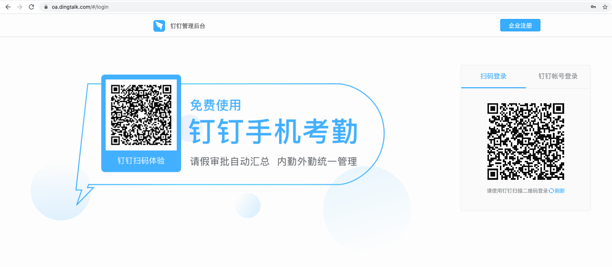
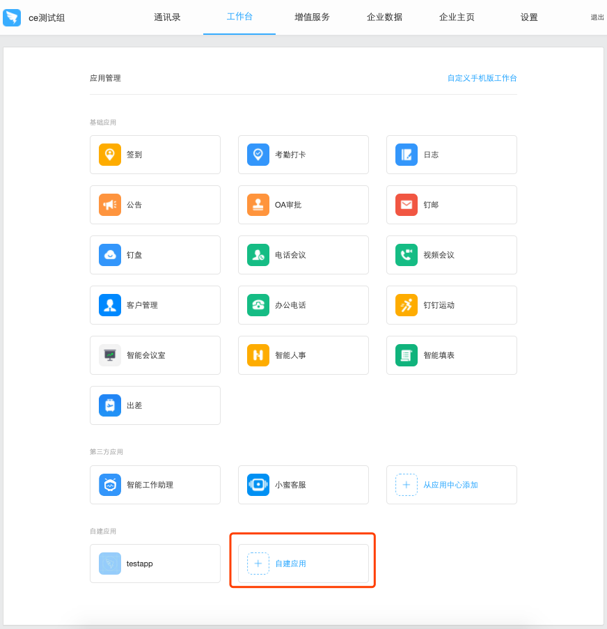
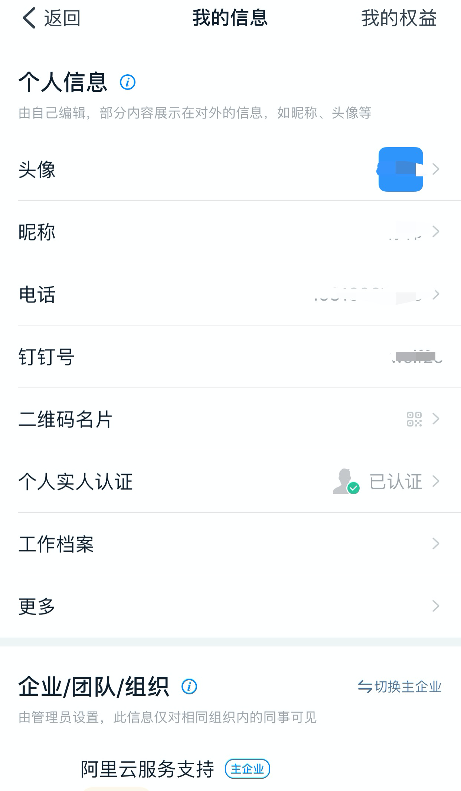
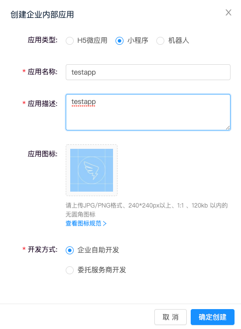
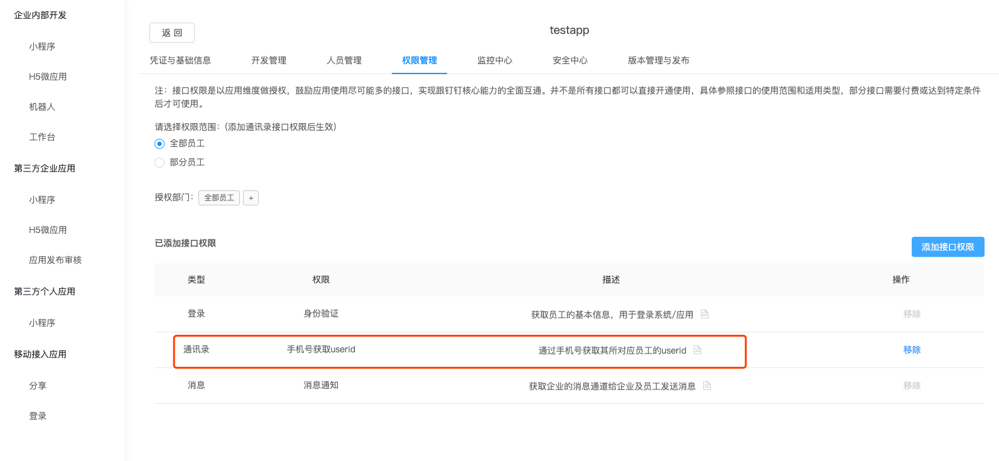
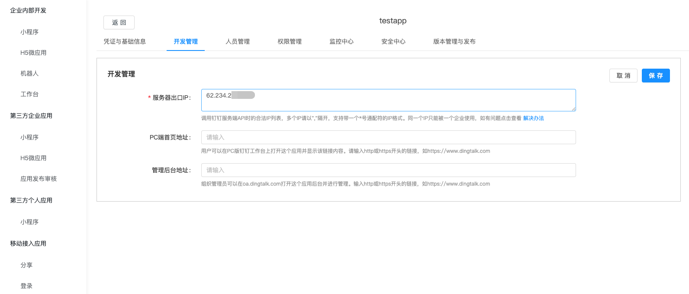
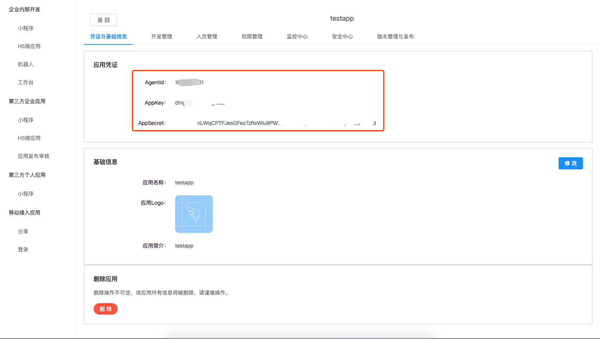

## 登录钉钉管理后台

> 电脑端通过浏览器访问钉钉的管理后台 https://oa.dingtalk.com, 通过手机端扫码或输入密码进行登录。

## 新建应用

> hummerrisk 需要通过“自建应用”发送钉钉消息，登录钉钉管理后台后，选择“工作台”，点击下方“自建应用”按钮，创建应用。

## 进行个人实人认证

> 在钉钉上创建应用需要进行“个人实人认证”，可以参照提示的信息进行操作。

> 通过钉钉手机客户端登录后，点击左上角个人图标，选择“设置”，选择“我的信息”，选择“个人实人认证”，根据提示完成认证。

## 创建应用

> 点击“自建应用”，选择创建一个“小程序”，输入完相关信息后，点击“确认创建”，如下图所示。

## 授权接口权限

> 进入“小程序”的“权限管理”页面，选择“添加接口权限”，给“小程序”添加“手机号获取 userid”的权限。

## 服务白名单

> 进入“小程序”的“开发管理”页面，选择“修改”按钮，将需要调用“小程序”发送消息的服务器的地址填入其中，然后点击“保存”按钮保存。

## 获取应用凭证

> 进入“小程序”的“凭证与基础信息”页面，获取到“小程序”的 AppKey、AgentId、AppSecret 信息。

## 绑定钉钉信息

> 登录到 hummerrisk 平台，进入【管理中心】。在“管理与设置”下的“消息通知”中，选择“钉钉设置”。

> 依次输入上述步骤获取到的 AppKey、AgentId、AppSecret，以及测试用户的手机号信息。
