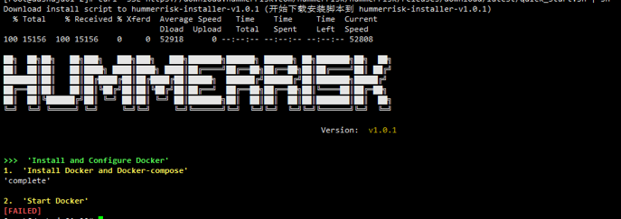

### 常见安装问题

#### Q. 安装过程中，Docker 检测失败？
{ width="65%" }

!!! question ""
    A. 默认情况下，使用 HummerRisk 安装脚本安装时会检测您 Linux 主机上是否安装 Docker 以及 docker-compose ，如果都已安装，则会跳过安装步骤，此时你应该保证您的 Docker 和 docker-compose 是可以正常使用的，通过命令`docker ps` 和 `docker-compose -v`可以进行自检。如果您依旧解决不了此问题，建议使用纯净的Linux系统重新安装，HummerRisk 安装脚本会自动安装所有依赖软件，包括 docker 和 docker-compose。

#### Q. 安装过程出现的 Docker network 错误？
出现的错误日志可能是： `failed to create network hummer_net: Error response from daemon: Pool overlaps with other one on this address space`
!!! question ""
    A. 出现该问题的原因通常是因为 docker network 的网段冲突，HummerRisk 的 docker-compose 使用的默认网段是 172.19.0.0/16 ，您可以使用 `docker network ls` 查看所有的 docker 网络，如果与您现有的 docker 网络冲突，可以修改 HummerRisk 的 /opt/hummerrisk/conf/install.conf 的配置文件中的 HMR_DOCKER_SUBNET 字段，替换为其他网段来修复网段冲突问题。

#### Q. 安装过程提示端口被占用，导致 hmr-ui 无法启动？
出现的错误日志可能是： `0.0.0.0:80 bind: address already in use`
!!! question ""
    A. 将端口修改为未被占用的端口即可，通过命令`netstat -ntpl` 可以查看当前系统的端口占用情况，通过修改 /opt/hummerrisk/conf/install.conf 的配置文件中的 HMR_HTTP_PORT 来更改监听端口，之后使用 `hrctl restart` 重新启动。

#### Q. 使用国产操作系统安装失败？
通常会在 docker 和 docker-compose 步骤出现问题
!!! question ""
    A. 出现此问题的原因是因为当前安装 docker 以及 docker-compose 的脚本尚未支持您的操作系统，您可以根据您所使用的操作系统的官方说明，手动安装 docker 以及 docker-compose，并确保 docker 服务正常启动且可用，之后再次执行 HummerRisk 的安装脚本即可。

#### Q. 安装失败如何卸载，如何重新安装？
!!! question ""
    A. 您可以使用 `hrctl uninstall` 命令快速卸载 HummerRisk，之后再次运行安装脚本即可

#### Q. HummerRisk 导入 license 后，XPACK 功能模块依旧不可用？
!!! question ""
    A. 在确保 license 正确导入并且在有效期内后，在部署 HummerRisk 的服务器运行 `hrctl start`命令进行加载 XPACK 组件