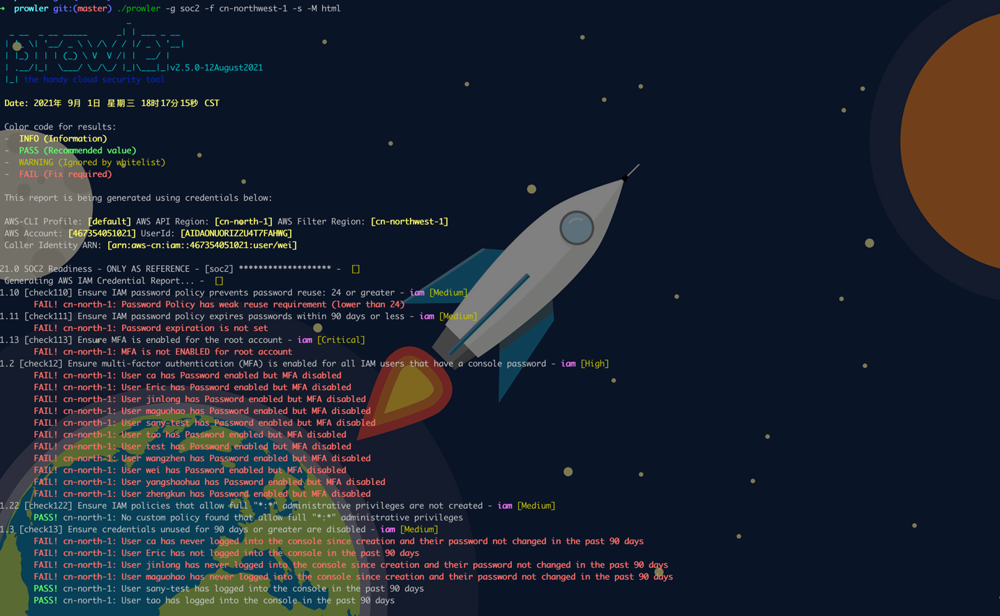
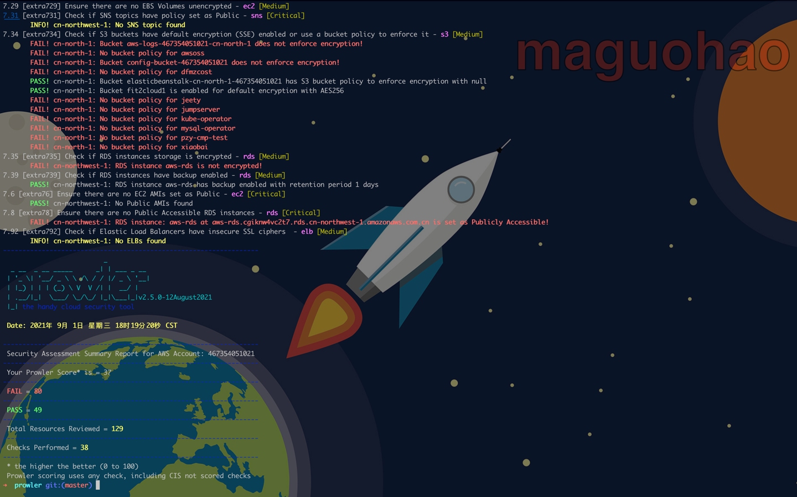

### 安全合规(Prowler 规则)

> Github 项目地址：https://github.com/hummerrisk/prowler
 
#### 一、Prowler 是什么

Prowler 是一个命令行工具，可帮助您进行 AWS 安全评估、审计、强化和事件响应。

它遵循 CIS Amazon Web Services Foundations Benchmark（49 项检查）的指导方针，并有 100 多项额外检查，包括与 GDPR、HIPAA、PCI-DSS、ISO-27001、FFIEC、SOC2 等相关的检查。

#### 二、Prowler 使用

> 工具使用: ./prowler -h

上述命令将显示该工具的帮助信息，下面给出的是该工具的常用选项：

USAGE:

    prowler [ -p <profile> -r <region>  -h ]

Options:

| 选项标签 | 描述信息 |
| :---- | :---- |
| -p <profile> |       specify your AWS profile to use (i.e.: default) |
| -r <region> |         specify an AWS region to direct API requests to (i.e.: us-east-1), all regions are checked anyway if the check requires it |
| -c <check_id> |       specify one or multiple check ids separated by commas, to see all available checks use -l option (i.e.: check11 for check 1.1 or extra71,extra72 for extra check 71 and extra check 72) |
| -g <group_id> |       specify a group of checks by id, to see all available group of checks use  -L (i.e.: group3 for entire section 3, cislevel1 for CIS Level 1 Profile Definitions or forensics-ready)|
| -f <filterregion> |   specify an AWS region to run checks against (i.e.: us-west-1 or for multiple regions use single quote like 'us-west-1 us-west-2')|
| -m <maxitems> |       specify the maximum number of items to return for long-running requests (default: 100)|
| -M <mode> |           output mode: text (default), mono, html, json, json-asff, junit-xml, csv. They can be used combined comma separated. (separator is ,; data is on stdout; progress on stderr).|
| -k  |                 keep the credential report|
| -n  |                 show check numbers to sort easier (i.e.: 1.01 instead of 1.1)|
| -l  |                list all available checks only (does not perform any check). Add -g <group_id> to only list checks within the specified group|
| -L  |                list all groups (does not perform any check)|
| -e  |                exclude group extras|
| -E  |                execute all tests except a list of specified checks separated by comma (i.e. check21,check31)|
| -b  |                do not print Prowler banner|
| -s  |                show scoring report|
| -S  |                send check output to AWS Security Hub - only valid when the output mode is json-asff (i.e. -M json-asff -S)|
| -x  |                specify external directory with custom checks (i.e. /my/own/checks, files must start by check)|
| -q  |                suppress info messages and passing test output|
| -A  |                account id for the account where to assume a role, requires -R and -T (i.e.: 123456789012)|
| -R  |                role name to assume in the account, requires -A and -T (i.e.: ProwlerRole)|
| -T  |                session duration given to that role credentials in seconds, default 1h (3600) recommended 12h, requires -R and -T (i.e.: 43200)|
| -I  |                External ID to be used when assuming roles (not mandatory), requires -A and -R|
| -w  |                whitelist file. See whitelist_sample.txt for reference and format (i.e.: whitelist_sample.txt)|
| -N <shodan_api_key> | Shoadan API key used by check extra7102.|
| -o  |                Custom output directory, if not specified will use default prowler/output, requires -M <mode> (i.e.: -M csv -o /tmp/reports/)|
| -B  |                Custom output bucket, requires -M <mode> and it can work also with -o flag. (i.e.: -M csv -B my-bucket or -M csv -B my-bucket/folder/)|
| -F  |                Custom output report name, if not specified will use default output/prowler-output-ACCOUNT_NUM-OUTPUT_DATE|
| -V  |                show version number & exit|
| -h  |                this help|

#### 三、Prowler 工具扫描

