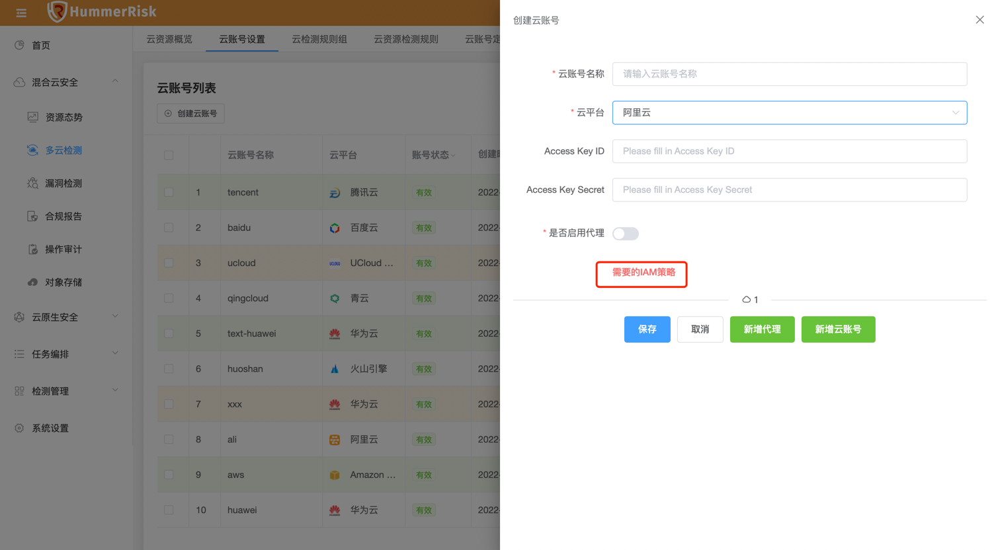
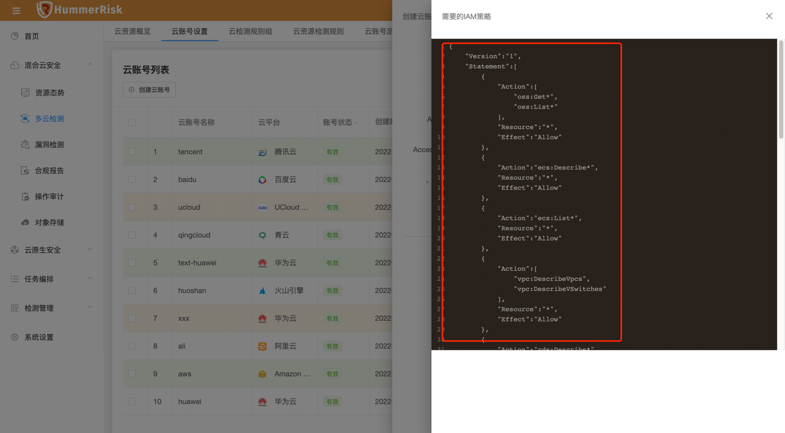

### 云资源检测结果

!!! warning "云资源检测结果，某些资源检测状态一直执行中，不停止。"

#### IAM 策略未填写完整
!!! question "资源一直获取不到，没有权限，系 IAM 策略未填写完整"
    1. 如图所示，在 HummerRisk 平台添加或编辑云账号时，可能查看云平台获取资源需要的 IAM 策略 Json。
    2. 用户可拷贝或自行在云平台创建 IAM 策略，用以满足 HummerRisk 获取云上资源的需要。
    3. 每个云平台的策略是不一样的，注意查看对应的云平台策略。

{ width="95%" }
{ width="95%" }
