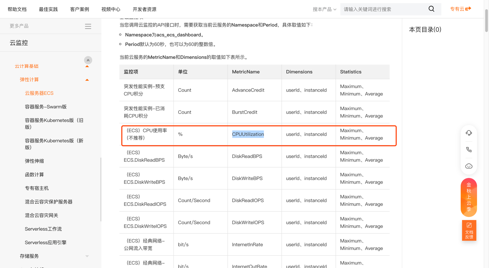

### 用户怎么自定义规则( Cloud Custodian 规则)

> Github 项目地址：https://github.com/hummerrisk/cloud-custodian/tree/hummerrisk

> Cloud Custodian 官方文档：https://cloudcustodian.io/docs/index.html

#### Cloud Custodian 是什么

Cloud Custodian 是用于管理公有云帐户和资源的规则引擎。规则策略用简单的 YAML 格式，使用户能够指定资源类型（EC2、ASG、Redshift、CosmosDB、PubSub 主题）的策略，并由过滤器和操作的词汇表构建。

官方的 Cloud Custodian 可用于管理 AWS、Azure 和 GCP 环境，我们在此基础上新增了阿里云、华为云、腾讯云、OpenStack、VMware vSphere等。

#### Cloud Custodian 使用

> 一、查看云平台的规则指标(custodian schema 命令)

如需要自己查看 yaml 规则，需要进入到 hummerrisk 容器内用 custodian 命令查看相应的规则指标。例如：

<details>
<summary>custodian schema aliyun</summary>
<pre><code>
resources:
- aliyun.cdn
- aliyun.disk
- aliyun.ecs
- aliyun.eip
- aliyun.mongodb
- aliyun.oss
- aliyun.polardb
- aliyun.ram
- aliyun.rds
- aliyun.redis
- aliyun.security-group
- aliyun.slb
- aliyun.vpc
</code></pre>
</details>

<details>
<summary>custodian schema tencent</summary>
<pre><code>
resources:
- tencent.cdb
- tencent.clb
- tencent.cos
- tencent.cvm
- tencent.dcdb
- tencent.disk
- tencent.eip
- tencent.mongodb
- tencent.redis
- tencent.security-group
- tencent.vpc
</code></pre>
</details>

<details>
<summary>custodian schema huawei</summary>
<pre><code>
resources:
- huawei.dds
- huawei.disk
- huawei.ecs
- huawei.eip
- huawei.elb
- huawei.iam
- huawei.obs
- huawei.rds
- huawei.redis
- huawei.security-group
- huawei.vpc
</code></pre>
</details>

<details>
<summary>custodian schema aws</summary>
<pre><code>
resources:
- aws.account
- aws.acm-certificate
- aws.alarm
- aws.ami
- aws.app-elb
- aws.app-elb-target-group
- aws.asg
- aws.backup-plan
- aws.backup-vault
- aws.batch-compute
- aws.batch-definition
- aws.cache-cluster
- aws.cache-snapshot
- aws.cache-subnet-group
- aws.cfn
- aws.cloud-directory
- aws.cloudhsm-cluster
- aws.cloudsearch
- aws.cloudtrail
- aws.codebuild
- aws.codecommit
- aws.codepipeline
- aws.config-recorder
- aws.config-rule
- aws.customer-gateway
- aws.datapipeline
- aws.dax
- aws.directconnect
- aws.directory
- aws.distribution
- aws.dlm-policy
- aws.dms-endpoint
- aws.dms-instance
- aws.dynamodb-backup
- aws.dynamodb-stream
- aws.dynamodb-table
- aws.ebs
- aws.ebs-snapshot
- aws.ec2
- aws.ec2-reserved
- aws.ecr
- aws.ecs
- aws.ecs-container-instance
- aws.ecs-service
- aws.ecs-task
- aws.ecs-task-definition
- aws.efs
- aws.efs-mount-target
- aws.eks
- aws.elastic-ip
- aws.elasticache-group
- aws.elasticbeanstalk
- aws.elasticbeanstalk-environment
- aws.elasticsearch
- aws.elb
- aws.emr
- aws.emr-security-configuration
- aws.eni
- aws.event-rule
- aws.event-rule-target
- aws.firehose
- aws.fsx
- aws.fsx-backup
- aws.gamelift-build
- aws.gamelift-fleet
- aws.glacier
- aws.glue-catalog
- aws.glue-classifier
- aws.glue-connection
- aws.glue-crawler
- aws.glue-database
- aws.glue-dev-endpoint
- aws.glue-job
- aws.glue-ml-transform
- aws.glue-security-configuration
- aws.glue-table
- aws.glue-trigger
- aws.glue-workflow
- aws.health-event
- aws.healthcheck
- aws.hostedzone
- aws.hsm
- aws.hsm-client
- aws.hsm-hapg
- aws.iam-certificate
- aws.iam-group
- aws.iam-policy
- aws.iam-profile
- aws.iam-role
- aws.iam-user
- aws.identity-pool
- aws.internet-gateway
- aws.iot
- aws.kafka
- aws.key-pair
- aws.kinesis
- aws.kinesis-analytics
- aws.kms
- aws.kms-key
- aws.lambda
- aws.lambda-layer
- aws.launch-config
- aws.launch-template-version
- aws.lightsail-db
- aws.lightsail-elb
- aws.lightsail-instance
- aws.log-group
- aws.message-broker
- aws.ml-model
- aws.nat-gateway
- aws.network-acl
- aws.network-addr
- aws.ops-item
- aws.opswork-cm
- aws.opswork-stack
- aws.peering-connection
- aws.qldb
- aws.r53domain
- aws.rds
- aws.rds-cluster
- aws.rds-cluster-param-group
- aws.rds-cluster-snapshot
- aws.rds-param-group
- aws.rds-reserved
- aws.rds-snapshot
- aws.rds-subnet-group
- aws.rds-subscription
- aws.redshift
- aws.redshift-reserved
- aws.redshift-snapshot
- aws.redshift-subnet-group
- aws.rest-account
- aws.rest-api
- aws.rest-resource
- aws.rest-stage
- aws.rest-vpclink
- aws.route-table
- aws.rrset
- aws.s3
- aws.sagemaker-endpoint
- aws.sagemaker-endpoint-config
- aws.sagemaker-job
- aws.sagemaker-model
- aws.sagemaker-notebook
- aws.sagemaker-transform-job
- aws.secrets-manager
- aws.security-group
- aws.serverless-app
- aws.shield-attack
- aws.shield-protection
- aws.simpledb
- aws.snowball
- aws.snowball-cluster
- aws.sns
- aws.sns-subscription
- aws.sqs
- aws.ssm-activation
- aws.ssm-managed-instance
- aws.ssm-parameter
- aws.step-machine
- aws.storage-gateway
- aws.streaming-distribution
- aws.subnet
- aws.support-case
- aws.transit-attachment
- aws.transit-gateway
- aws.user-pool
- aws.vpc
- aws.vpc-endpoint
- aws.vpn-connection
- aws.vpn-gateway
- aws.waf
- aws.waf-regional
- aws.workspaces
</code></pre>
</details>

<details>
<summary>custodian schema azure</summary>
<pre><code>
resources:
- azure.aks
- azure.api-management
- azure.appserviceplan
- azure.armresource
- azure.batch
- azure.cdnprofile
- azure.cognitiveservice
- azure.container-group
- azure.containerregistry
- azure.containerservice
- azure.cosmosdb
- azure.cosmosdb-collection
- azure.cosmosdb-database
- azure.cost-management-export
- azure.databricks
- azure.datafactory
- azure.datalake
- azure.disk
- azure.dnszone
- azure.eventhub
- azure.eventsubscription
- azure.hdinsight
- azure.image
- azure.iothub
- azure.keyvault
- azure.keyvault-certificate
- azure.keyvault-key
- azure.keyvault-keys
- azure.keyvault-storage
- azure.loadbalancer
- azure.networkinterface
- azure.networksecuritygroup
- azure.policyassignments
- azure.postgresql-database
- azure.postgresql-server
- azure.publicip
- azure.recordset
- azure.redis
- azure.resourcegroup
- azure.roleassignment
- azure.roledefinition
- azure.routetable
- azure.search
- azure.sql-database
- azure.sql-server
- azure.sqldatabase
- azure.sqlserver
- azure.storage
- azure.storage-container
- azure.subscription
- azure.vm
- azure.vmss
- azure.vnet
- azure.webapp
</code></pre>
</details>

<details>
<summary>custodian schema openstack</summary>
<pre><code>
resources:
- openstack.flavor
- openstack.image
- openstack.network
- openstack.project
- openstack.router
- openstack.security-groups
- openstack.server
- openstack.user
- openstack.volume
</code></pre>
</details>

<details>
<summary>custodian schema vsphere</summary>
<pre><code>
resources:
- vsphere.cluster
- vsphere.datacenter
- vsphere.datastore
- vsphere.folder
- vsphere.host
- vsphere.network
- vsphere.resourcepool
- vsphere.vm
</code></pre>
</details>

<details>
<summary>custodian schema gcp</summary>
<pre><code>
resources:
- gcp.app-engine
- gcp.app-engine-certificate
- gcp.app-engine-domain
- gcp.app-engine-domain-mapping
- gcp.app-engine-firewall-ingress-rule
- gcp.autoscaler
- gcp.bq-dataset
- gcp.bq-job
- gcp.bq-project
- gcp.bq-table
- gcp.bucket
- gcp.build
- gcp.cloudbilling-account
- gcp.dataflow-job
- gcp.disk
- gcp.dm-deployment
- gcp.dns-managed-zone
- gcp.dns-policy
- gcp.firewall
- gcp.folder
- gcp.function
- gcp.gke-cluster
- gcp.gke-nodepool
- gcp.iam-role
- gcp.image
- gcp.instance
- gcp.instance-template
- gcp.interconnect
- gcp.interconnect-attachment
- gcp.kms-cryptokey
- gcp.kms-cryptokey-version
- gcp.kms-keyring
- gcp.loadbalancer-address
- gcp.loadbalancer-backend-bucket
- gcp.loadbalancer-backend-service
- gcp.loadbalancer-forwarding-rule
- gcp.loadbalancer-global-address
- gcp.loadbalancer-global-forwarding-rule
- gcp.loadbalancer-health-check
- gcp.loadbalancer-http-health-check
- gcp.loadbalancer-https-health-check
- gcp.loadbalancer-ssl-certificate
- gcp.loadbalancer-ssl-policy
- gcp.loadbalancer-target-http-proxy
- gcp.loadbalancer-target-https-proxy
- gcp.loadbalancer-target-instance
- gcp.loadbalancer-target-pool
- gcp.loadbalancer-target-ssl-proxy
- gcp.loadbalancer-target-tcp-proxy
- gcp.loadbalancer-url-map
- gcp.log-exclusion
- gcp.log-project-metric
- gcp.log-project-sink
- gcp.ml-job
- gcp.ml-model
- gcp.organization
- gcp.project
- gcp.project-role
- gcp.pubsub-snapshot
- gcp.pubsub-subscription
- gcp.pubsub-topic
- gcp.route
- gcp.router
- gcp.service
- gcp.service-account
- gcp.snapshot
- gcp.sourcerepo
- gcp.spanner-database-instance
- gcp.spanner-instance
- gcp.sql-backup-run
- gcp.sql-instance
- gcp.sql-ssl-cert
- gcp.sql-user
- gcp.subnet
- gcp.vpc
</code></pre>
</details>

> 二、自定义云平台的规则

根据可选参数值，改变参数的形式匹配规则。

如需查看更详细的规则过滤项，则用点xx.xx的形式。以阿里云为例，例如：

<details>
<summary>custodian schema aliyun.ecs</summary>
<pre><code>
Help
----
A Cloud Custodian resource
aliyun.ecs:
  actions:
  - notify
  - webhook
  filters:
  - PublicIpAddress
  - event
  - instance-age
  - instance-network-type
  - metrics
  - value
  - vpc-type
</code></pre>
</details>

<details>
<summary>custodian schema aliyun.ecs.filters</summary>
<pre><code>
aliyun.ecs:
  filters:
  - PublicIpAddress
  - event
  - instance-age
  - instance-network-type
  - metrics
  - value
  - vpc-type
</code></pre>
</details>

<details>
<summary>custodian schema aliyun.ecs.filters.metrics</summary>
<pre><code>
Help
----
Supports   metrics filters on resources.
.. code-block:: yaml
- name: aliyun-ecs-underutilized
  resource: aliyun.ecs
  filters:
    - type: metrics
      name: CPUUtilization
      days: 4
      period: 86400
      value: 30
      op: less-than
Note periods when a resource is not sending metrics are not part
of calculated statistics as in the case of a stopped ecs instance,
nor for resources to new to have existed the entire
period. ie. being stopped for an ecs instance wouldn't lower the
average cpu utilization.
The "missing-value" key allows a policy to specify a default
value when CloudWatch has no data to report:
.. code-block:: yaml
- name: aliyun-elb-low-request-count
  resource: aliyun.elb
  filters:
    - type: metrics
      name: RequestCount
      statistics: Sum
      days: 7
      value: 7
      missing-value: 0
      op: less-than
This policy matches any ELB with fewer than 7 requests for the past week.
ELBs with no requests during that time will have an empty set of metrics.
Rather than skipping those resources, "missing-value: 0" causes the
policy to treat their request counts as 0.
Note the default statistic for metrics is Average.
Schema
------
properties:
  attr-multiplier:
    type: number
  days:
    type: number
  dimensions:
    patternProperties:
      ^.*$:
        type: string
    type: object
  endTime:
    type: string
  missing-value:
    type: number
name:
    type: string
  namespace:
    type: string
  op:
    enum:
    - eq
    - equal
    - ne
    - not-equal
    - gt
    - greater-than
    - ge
    - gte
    - le
    - lte
    - lt
    - less-than
    - glob
    - regex
    - regex-case
    - in
    - ni
    - not-in
    - contains
    - difference
    - intersect
    type: string
  percent-attr:
    type: string
  period:
    type: number
  startTime:
    type: string
  statistics:
    enum:
    - Average
    - Sum
    - Maximum
    - Minimum
    - SampleCount
    type: string
  type:
    enum:
    - metrics
  value:
    type: number
required:
- value
- name
</code></pre>
</details>

最终实现规则示例：
```
policies:                                      -- policies 固定写法
  - name: aliyun-ecs-underutilized             -- name 自定义检测的名称（也是返回结果的目录名称）
    resource: aliyun.ecs                       -- resource 要检测的资源类型（根据custodian schema 查询的结果来写）
    filters:                                   -- filters 过滤（下面是过滤各种条件）
      - type: metrics                          -- type 过滤类型
        name: CPUUtilization
        days: 4
        period: 86400
        value: 30
        op: less-than
```

> 三、metrics 监控名称（参考阿里云监控指标项）
- [监控概览(https://help.aliyun.com)](https://help.aliyun.com/document_detail/163515.html?spm=a2c1g.8271268.10000.177.2e90df25Y9AtSU)
- [监控项(https://help.aliyun.com)](https://help.aliyun.com/document_detail/162844.htm?spm=a2c4g.11186623.0.0.2bc573c2Qhb3tx#concept-2482301)

