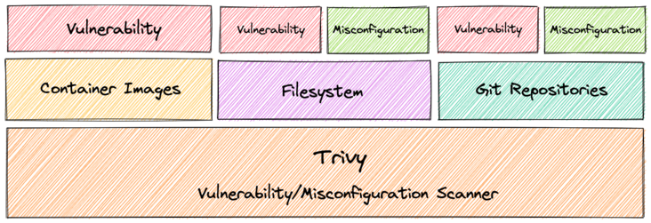

### Trivy

> Github 项目地址：https://github.com/aquasecurity/trivy
 
#### 一、Trivy 是什么

Trivy（tri 发音为 trigger，vy 发音为 envy）是一个简单而全面的漏洞/错误配置扫描器，用于容器和其他工件。 软件漏洞是软件或操作系统中存在的故障、缺陷或弱点。 Trivy 检测操作系统包（Alpine、RHEL、CentOS 等）和特定语言包（Bundler、Composer、npm、yarn 等）的漏洞。 此外，Trivy 会扫描基础设施即代码 (IaC) 文件，例如 Terraform 和 Kubernetes，以检测使您的部署面临攻击风险的潜在配置问题。 Trivy 易于使用。 只需安装二进制文件，您就可以开始扫描了。 扫描所需要做的就是指定一个目标，例如容器的图像名称。

Trivy 检测两种类型的安全问题 ：

* 漏洞
* 配置错误

Trivy 可以扫描三种不同的工件：

* 容器镜像
* 文件系统
* Git存储库

Trivy 可以在两种不同的模式下运行：

* 独立
* 客户端服务器

它旨在用于 CI。在推送到容器注册表或部署应用程序之前，您可以轻松扫描本地容器映像和其他工件。

#### 二、Trivy 特征

* 全面的漏洞检测
  * 操作系统包（Alpine、Red Hat Universal Base Image、Red Hat Enterprise Linux、CentOS、Oracle Linux、Debian、Ubuntu、Amazon Linux、openSUSE Leap、SUSE Enterprise Linux、Photon OS 和 Distroless）
  * 特定于语言的包（Bundler、Composer、Pipenv、Poetry、npm、yarn、Cargo、NuGet、Maven 和 Go）

* 检测 IaC 错误配置

各种各样的内置策略提供了开箱：

* Kubernetes
* 码头工人
* 地形
* 更多即将推出

支持自定义策略

> 简单的

* 仅指定图像名称、包含 IaC 配置的目录或工件名称

> 快速地

* 第一次扫描将在 10 秒内完成（取决于您的网络）。随后的扫描将在几秒钟内完成。
* 与在第一次运行时需要很长时间才能获取漏洞信息（约 10 分钟）并鼓励您维护持久漏洞数据库的其他扫描程序不同，Trivy 是无状态的，不需要维护或准备。

> 简易安装

* apt-get install,yum install并且brew install是可能的
* 没有先决条件，如安装DB的，图书馆等

> 高精确度

* 特别是 Alpine Linux 和 RHEL/CentOS
* 其他操作系统也高

> 开发安全运营

* 适用于Travis CI、CircleCI、Jenkins、GitLab CI 等 CI。

> 支持多种格式

* 容器镜像
  * 作为守护进程运行的 Docker Engine 中的本地映像
  Podman中暴露套接字的本地图像
  Docker Registry 中的远程镜像，例如 Docker Hub、ECR、GCR 和 ACR
  存储在docker save/podman save格式文件中的 tar 存档
  符合OCI 图像格式的图像目录
  本地文件系统
  远程 git 仓库
