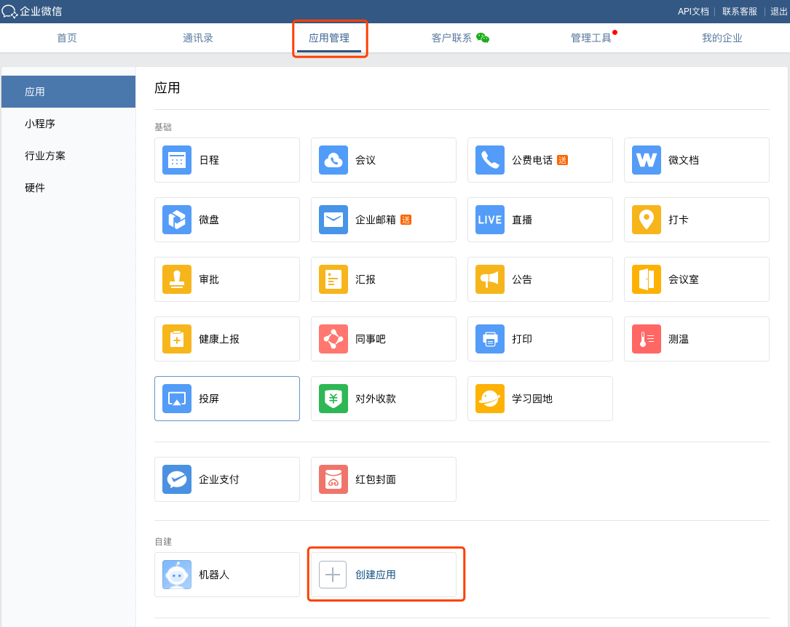
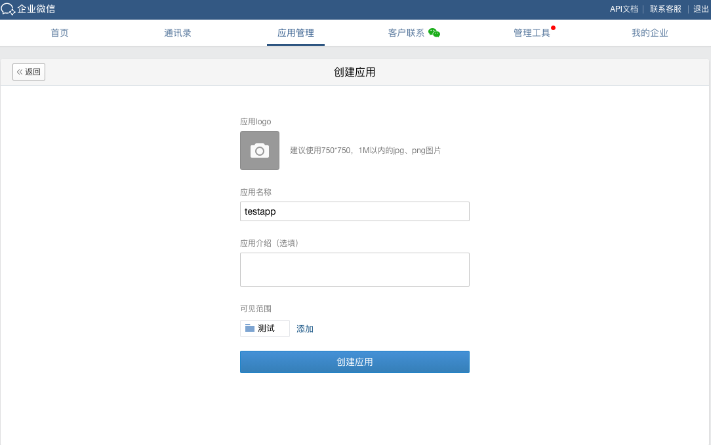
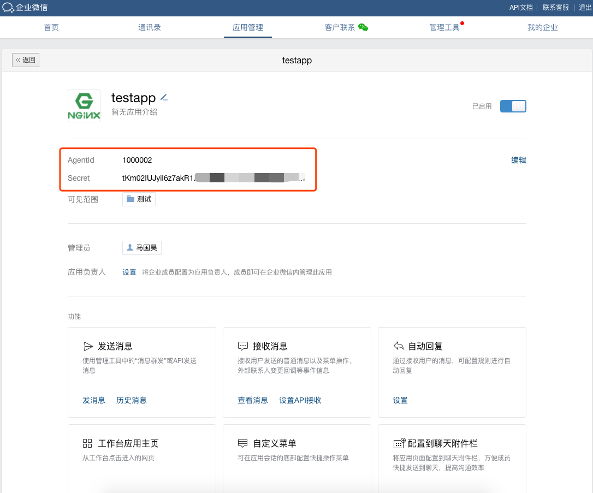
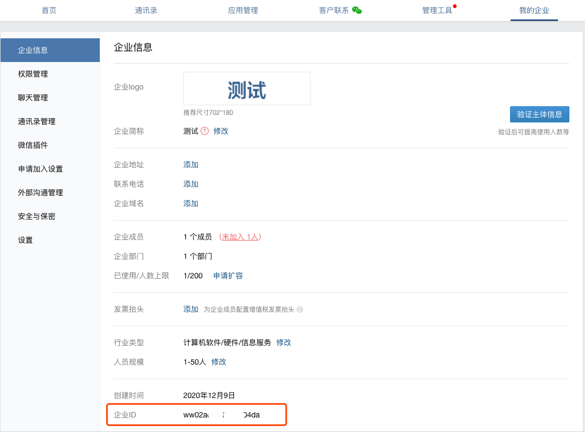
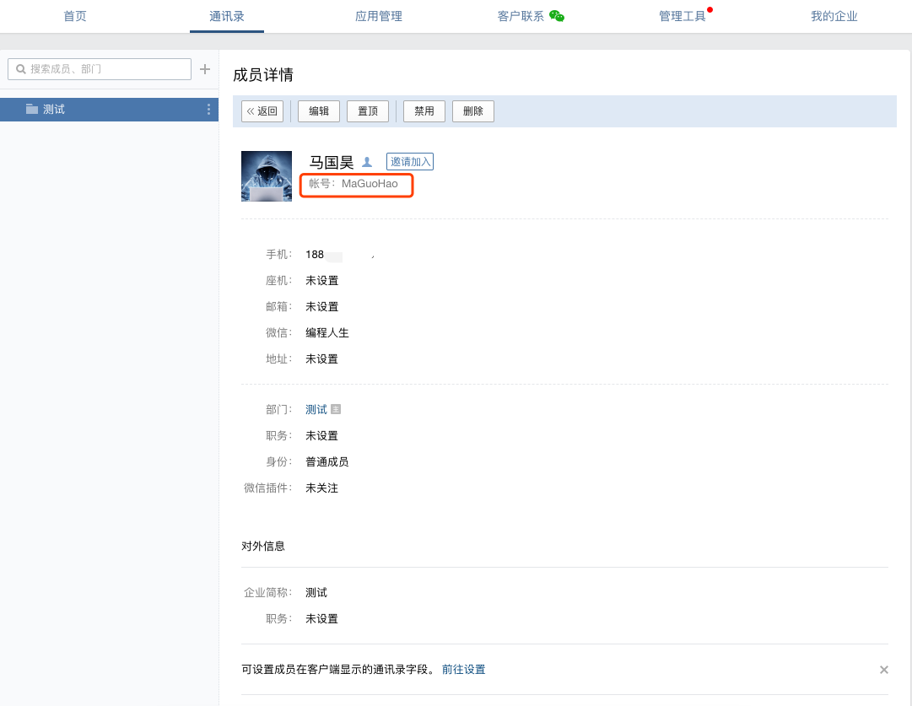

## 登录企业微信管理后台

> 电脑端通过浏览器访问企业微信的管理后台 https://work.weixin.qq.com/ 。

## 新建应用

> hummerrisk 需要通过“创建应用”发送微信消息，登录企业微信管理后台后，选择“工作台”，点击下方“自建应用”按钮，创建应用。

> 进入“应用管理”页面，选择“创建应用”。

> 在应用的信息设置页面进行相关设置，注意“可见范围”选择可以接收消息通知的部门或个人，如下图所示：

## 获取应用凭证

> 创建完应用后，可以进入应用查看相关的访问凭证信息，如下图所示的 AgentId、Secret。

## 获取企业 ID

> 进入“我的企业”页面，在“企业信息”栏里查询企业 ID。

## 获取个人微信账号

> 企业微信的管理员可以在“通讯录”页面查看到各个成员的企业微信账号。企业微信账号是可以用来作为微信消息的接收者。如下图所示：

## 绑定企业微信信息

> 登录到 hummerrisk 平台，进入【管理中心】。在“管理与设置”下的“消息通知”中，选择“企业微信设置”。依次输入上述步骤获取到的企业微信 ID、AgentId、Secret，以及测试用户的企业微信账号信息。
