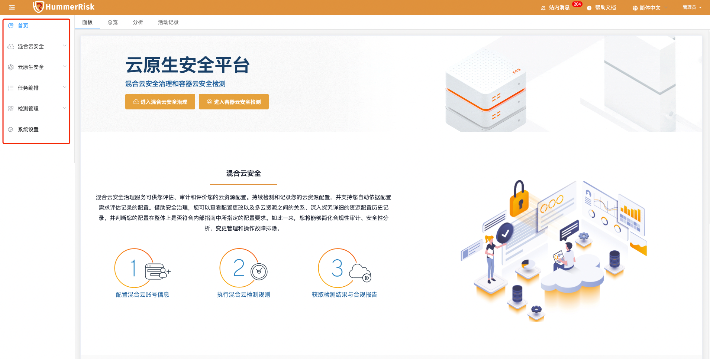

## 1 一键部署

!!! tip "3分钟快速一键部署"
    1. 部署服务器要求
        - 操作系统要求：任何支持 Docker 的 Linux x64
        - CPU内存要求：最低要求 4C8G，推荐 8C16G
        - 部署目录空间（默认/opt目录）要求： 50G
        - 网络要求：可访问互联网（如遇内网环境，理论上除公有云安全检测、Github源码检测外，其他功能可照常使用）
    2. 执行以下脚本进行一键安装：
    ```bash
    curl -sSL https://github.com/HummerRisk/HummerRisk/releases/latest/download/quick_start.sh -o quick_start.sh
    ```
    3. HummerRisk 是一款 B/S 架构的产品，即浏览器/服务器结构，在服务器安装完成后，客户端通过浏览器访问以下地址，即可开始使用。
        - http://目标服务器 IP 地址：服务运行端口，例如：http: 82.157.130.20:80（默认端口为80，用户可在安装时自定义）
        - 使用默认用户名 admin 密码 hummer 进行登录。

## 2 界面说明

### 2.1 模块介绍

!!! abstract "进入 HummerRisk 主界面后可以看到界面左侧导航栏，有【首页】【混合云安全】【云原生安全】【任务编排】【检测管理】【系统设置】六大模块"
    { width="95%" }

### 2.2 功能介绍

!!! abstract "【首页】【混合云安全】【云原生安全】【任务编排】【检测管理】【系统设置】六大模块的主要功能与作用"
    1. 首页：包含面板、总览、分析、活动记录。主要是快速进入场景、集中展示和分析检测数据、记录操作的日志。
    2. 混合云安全：
    3. 云原生安全：
    4. 任务编排：
    5. 检测管理：
    6. 系统设置：

## 3 登录并使用

### 3.1 场景一：混合云安全

#### 3.1.1 多云检测
!!! abstract "多云检测"

#### 3.1.2 漏洞检测
!!! abstract "漏洞检测"

### 3.2 场景二：云原生安全

#### 3.2.1 主机检测
!!! abstract "主机检测"      

#### 3.2.2 K8s 检测
!!! abstract "K8s 检测"  

#### 3.2.3 部署检测
!!! abstract "部署检测"  

#### 3.2.4 镜像检测
!!! abstract "镜像检测"  

#### 3.2.5 源码检测
!!! abstract "源码检测"  

#### 3.2.6 文件检测
!!! abstract "文件检测"  

## 4 新手引导

!!! info ""
    - [常见问题](./question/cloud.md)
    - [功能手册](./user/process.md)
    - [开发文档](./develop/dev-manual.md)

!!! warning "默认 web 登录账户: admin 密码：hummer"
