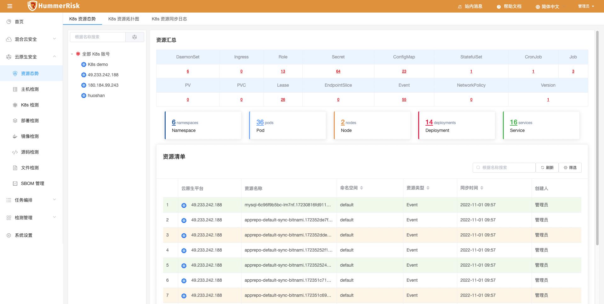
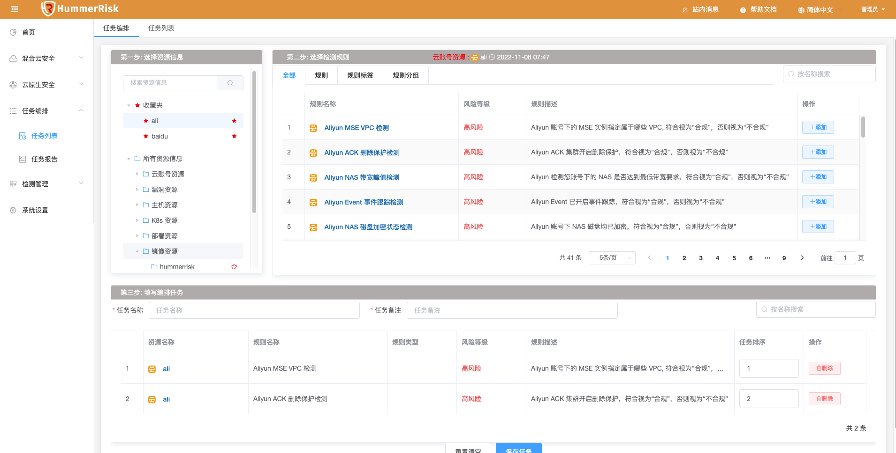
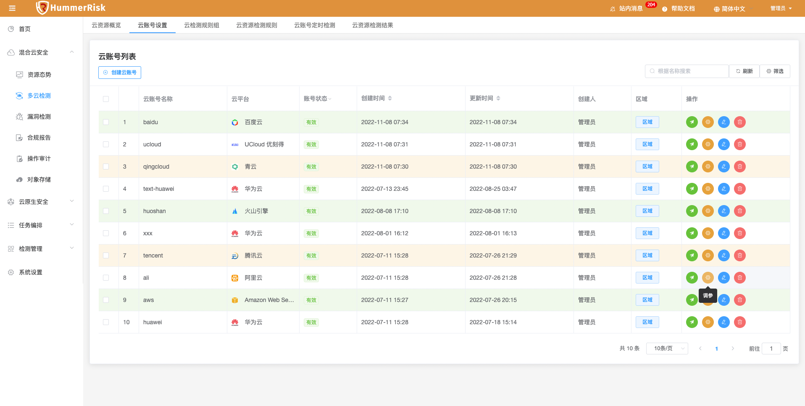
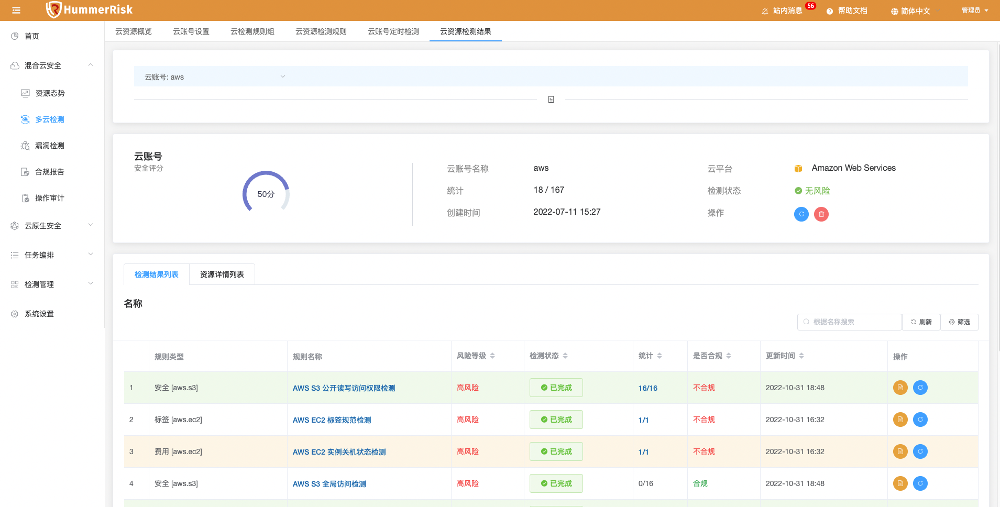

## 1 一键部署

!!! tip "3分钟快速一键部署"
    1. 部署服务器要求
        - 操作系统要求：任何支持 Docker 的 Linux x64
        - CPU内存要求：最低要求 4C8G，推荐 8C16G
        - 部署目录空间（默认/opt目录）要求： 50G
        - 网络要求：可访问互联网（如遇内网环境，理论上除公有云安全检测、Github源码检测外，其他功能可照常使用）
    2. 执行以下脚本进行一键安装：
    ```bash
    curl -sSL https://github.com/HummerRisk/HummerRisk/releases/latest/download/quick_start.sh -o quick_start.sh
    ```
    3. HummerRisk 是一款 B/S 架构的产品，即浏览器/服务器结构，在服务器安装完成后，客户端通过浏览器访问以下地址，即可开始使用。
        - http://目标服务器 IP 地址：服务运行端口，例如：http: 82.157.130.20:80（默认端口为80，用户可在安装时自定义）
        - 使用默认用户名 admin 密码 hummer 进行登录。

## 2 界面说明

### 2.1 模块介绍

!!! abstract "进入 HummerRisk 主界面后可以看到界面左侧导航栏，有【首页】【混合云安全】【云原生安全】【任务编排】【检测管理】【系统设置】六大模块"
{ width="95%" }

### 2.2 功能介绍

!!! abstract "【首页】【混合云安全】【云原生安全】【任务编排】【检测管理】【系统设置】六大模块的主要功能与作用"

!!! tip "1. 首页"
    - 包含面板、总览、分析、活动记录。
    - 主要作用是快速进入场景、集中展示和分析检测数据、记录操作的日志。
{ width="95%" }

!!! tip "2. 混合云安全"
    - 包含资源态势、多云检测、漏洞检测、合规报告、操作审计等功能。
    - 主要作用是持续检测和记录评估、审计和评价您的云资源配置，帮助用户快速完成合规性审计、安全性分析、变更管理和操作故障排除。
{ width="95%" }

!!! tip "3. 云原生安全"
    - 包含资源态势、主机检测、K8s 检测、部署检测、镜像检测、源码检测、文件检测、SBOM 管理等功能。
    - 主要作用是在整个开发生命周期提供云原生安全和合规性检测服务，深入探究漏洞详情，简单便捷的进行安全性分析，修正漏洞并形成最佳实践。
{ width="95%" }

!!! tip "4. 任务编排"
    - 包含任务列表和任务报告功能。
    - 主要作用是可以自由将各个模块中的检测任务进行编排，组合成一个综合检测任务，简化用户进行跨模块、跨资源的检测操作。
{ width="95%" }

!!! tip "5. 检测管理"
    - 包含检测规则和检测结果功能。
    - 主要作用是统一汇总所有模块的检测规则和执行检测后获取的检测结果，使用户可以快速便捷的在统一入口查看和操作。
{ width="95%" }

!!! tip "6. 系统设置"
    包含系统设置（用户设置、参数设置、消息通知、代理设置、站内消息、系统参数等）、个人设置等功能。
{ width="95%" }

## 3 登录并使用

### 3.1 场景一：混合云安全

#### 3.1.1 多云检测
!!! abstract "云账号列表"
    - 进入云账号设置页面，通过绑定多云的账号信息（Access Key ID / Access Key Secret）, 一键执行内置或自定义规则组，得到混合云的安全合规资源的风险结果信息。
{ width="95%" }

!!! abstract "添加/编辑云账号"
    - 左上角创建云账号、列表第三个编辑按钮，可以添加/编辑云账号。通过对应的云平台，获取账号信息（一般为AK/SK），填写信息并绑定，自动获取区域和认证等信息。
{ width="95%" }

!!! abstract "云账号调参"
    - 通过列表第二个调参按钮，可以云账号调参。因为检测规则的参数可以灵活配置，不同的云账号可以有不同的安全合规标准，所以在此页面用户可以根据自身需求自定义规则的参数与任意区域。
    - 保存参数后，执行检测将优先执行当前调参内容，而且在调参页面可以快速执行某一规则的某些区域快速检测。（注：不设置调参内容不影响检测，检测内容为内置默认参数和所有待检测区域）
{ width="95%" }
{ width="95%" }

!!! abstract "云检测规则组"
    - 多云检测基于规则组进行场景检测，例如检测 Aliyun ECS 最佳安全实践，将检测此规则组下一系列规则，达到覆盖场景的目的。
    - 可以通过云账号列表第一个一键检测按钮选取多个规则组执行检测，也可以通过规则组列表选择某个云账号执行一键检测。
{ width="95%" }

!!! abstract "云资源检测结果"
    - 在点击上述一键检测后，将自动跳转云资源检测结果页面，检测结果将会显示正在执行。
    - 等待检测执行完毕后获得检测结果的安全合规信息与优化建议。
{ width="95%" }
{ width="95%" }
{ width="95%" }

!!! abstract "云资源合规报告"
    - 待云资源检测完毕后，根据检测结果生成合规报告，用户可查看和下载合规报告。
{ width="95%" }

!!! abstract "操作审计"
    - 云操作审计，帮助您监控并记录多云账号的活动，包括通过云控制台、OpenAPI、开发者工具对云上产品和服务的访问和使用行为。
    - 用户可以查看这些行为事件，然后进行行为分析、安全分析、资源变更行为追踪和行为合规性审计等操作。
{ width="95%" }

!!! abstract "资源态势"
    - 根据绑定混合云账号信息，即可同步获取云资源汇总信息。
    - 执行检测后，可以自动关联云资源态势信息，可以查看到具体哪些资源具有安全合规风险。
{ width="95%" }

#### 3.1.2 漏洞检测
!!! abstract "漏洞检测"

!!! abstract "云账号列表"
    进入云账号设置页面，通过绑定多云的账号信息（Access Key ID / Access Key Secret）, 一键执行内置或自定义规则组，得到混合云的安全合规资源的风险结果信息。
{ width="95%" }

!!! abstract "添加/编辑云账号"
    左上角创建云账号、列表第三个编辑按钮，可以添加/编辑云账号。通过对应的云平台，获取账号信息（一般为AK/SK），填写信息并绑定，自动获取区域和认证等信息。
{ width="95%" }

!!! abstract "云资源检测结果"
    在点击上述一键检测后，将自动跳转云资源检测结果页面，检测结果将会显示正在执行。
{ width="95%" }

### 3.2 场景二：云原生安全

#### 3.2.1 主机检测
!!! abstract "主机检测"      

#### 3.2.2 K8s 检测
!!! abstract "K8s 检测"  

#### 3.2.3 部署检测
!!! abstract "部署检测"  

#### 3.2.4 镜像检测
!!! abstract "镜像检测"  

#### 3.2.5 源码检测
!!! abstract "源码检测"  

#### 3.2.6 文件检测
!!! abstract "文件检测"  

## 4 新手引导

!!! info ""
    - [常见问题](./question/cloud.md)
    - [功能手册](./user/process.md)
    - [开发文档](./develop/dev-manual.md)

!!! warning "默认 web 登录账户: admin 密码：hummer"
