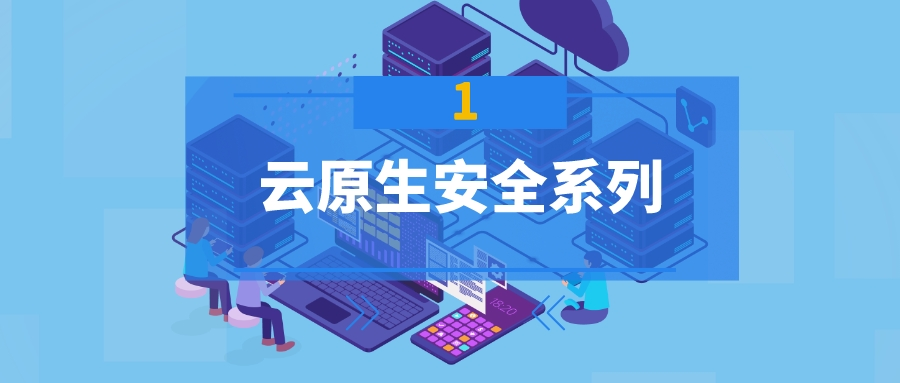
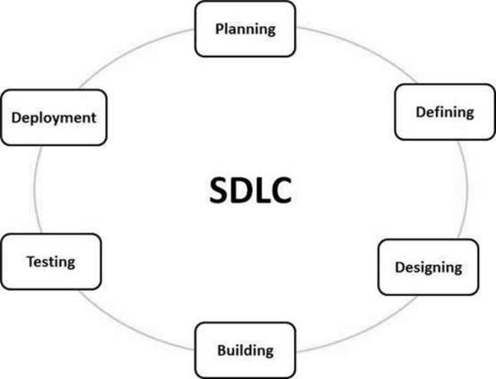
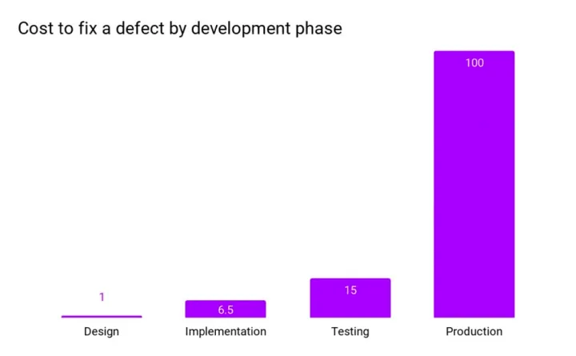

{ width="80%" }   

### 引言：

!!! abstract "引言："
    自动化已经以各种形式出现了几十年，直到现在我们才开始看到它的全部潜力。

    自动化软件开发生命周期 (SDLC) 可以显著提高质量保证、开发人员的生产力并减少花在特定任务上的时间。公司已开始在其整个 SDLC 的安全实践上投入更多资金，以保护其数据并防止恶意软件攻击。

    随着行业的变化，安全实践也在不断发展。已经从传统的安全实践（安全被认为超出了开发团队的范围）转变为将安全作为 SDLC 中的优先事项。采用左移心态的趋势正在上升，这意味着在 SDLC 开发阶段之前从安全开始。这有助于公司采用更灵活的方法来处理网络安全。

 
#### 一、零信任安全

!!! info "什么是零信任安全？"
    零信任安全是一个 IT 安全框架，它对待每个人和一切都是敌对的（以一种好的方式！）。因此，零信任安全模型授予对所有 IT 资源的最低特权访问权限，这意味着除了明确授予他们访问权限之外，任何人都不应该被信任。相反，按照严格的协议，只有经过验证和授权的网络、应用程序、用户、IP 地址和设备才能进入网络。

    这个零信任框架的实现涉及先进和安全的技术来验证用户的身份并实现系统的安全性。用于实现此目的的一些著名技术是基于角色的访问控制（RBAC）、多因素身份验证（MFA）、身份和访问管理 (IAM)、身份保护和端点安全技术。此外，在授予任何访问权限之前强制执行严格和动态的用户身份验证方法。

    此外，还会进行持续的潜在威胁扫描和检测。

#### 二、安全软件开发生命周期

!!! abstract "软件开发生命周期"
    软件开发生命周期（SDLC）是软件行业设计，开发和测试高质量软件的过程。SDLC旨在生产符合或超过客户期望的高质量软件，在时间内完成和成本估算。

!!! info "为什么需要保障 SDLC 中的安全性？"
    每家公司都希望更快地向客户发布新功能，而安全性需要跟上创新的步伐。此外，组织正在将他们的工作负载转移到云中，利用云计算服务，而云提供了动态扩展。必须扩展安全性以匹配云的规模。今天的公司不允许服务中断一秒钟，因此安全性在自动事件响应补救中变得至关重要。

    { width="60%" }   

    修复生产中的错误的成本会让您的客户感到不安，并给开发团队带来大量开销，因此安全专家强烈要求在 SDLC 的每个阶段都设置安全检查点。
    { width="60%" }   

    为了成功和安全地利用自动化，需要在整个 SDLC 中更加强调安全性。这就是DevSecOps作为云原生技术的一种集成思维方式，将开发、运营和安全统一为 SDLC 中的一个流程。它提倡在 SDLC 的早期阶段采用左移方法来促进安全性（安全左移）。

#### 三、实施 DevSecOps 的挑战

!!! tip "实施 DevSecOps 的挑战"
    在 DevOps 工作流程中实施安全性存在许多挑战。以下是一些主要的：    

    * DevOps 是一种快节奏的游戏：由于 DevOps 主要关注快速开发、部署和发布，因此要跟上这种快节奏的竞赛节奏变得具有挑战性。    
    * 孤立的团队方法：安全团队通常使用不同的工具集和流程，而且他们通常缺乏完整的 SDLC 可见性。这种将 dev 和 sec 视为两个独立团队的考虑变得具有挑战性。  
    * 可扩展性和集成：随着容器化和创建虚拟 VM 的发明，DevOps 为攻击者提供了许多新的攻击面。Jenkins、Docker 等各种工具和技术在扩展时增加了不同的安全挑战，并且可以创建复杂的层（字面意思）。    
    * 技能组合：DevOps 领域缺乏安全原则、概念证明和技能组合，这使得招聘真正的安全专业人员具有挑战性。此外，企业往往忽视安全团队，不让他们参与重大决策，无论是选择新平台或工具、更新策略等，因此将安全放在首位的整体愿景很容易被淡化。    
    * 错误的工具选择：选择不合适的工具并做出糟糕的决定最终成为责任。这可以通过让安全团队成为设计考虑、工具选择、政策制定、合规性、治理等的一部分来实现。   

#### 四、SDLC 中的安全最佳实践

!!! tip "SDLC 中的安全最佳实践"  
    以下是在 DevOps 管道中实施零信任安全性的一些提示：   

    * 将 DevSecOps 实施为 SDLC 的基础，并使左移方法成为必须。    
    * 每当与第三方工具和供应商合作时，都必须强制执行软件物料清单 (SBOM)。  
    * 定期进行安全培训，向您的开发人员和运营团队灌输安全意识和所有权。  
    * 在 SDLC 的每个阶段都有安全检查点，并验证只有好的代码而不是机密数据或机密会暴露给外界。  
    * 将静态代码分析集成到构建过程中。  
    * 制定威胁建模计划，以识别和减轻开发过程中涉及的潜在安全风险。  
    * 将持续安全作为一项先见之明。利用安全性和合规性最佳实践并采用持续改进策略。  
    * 使用与您的 SDLC 良好集成的安全工具，并在很少或无需人工干预的情况下轻松实现安全和治理自动化。  
    * 确保您的工具套件包含强大的安全漏洞检测器和通用软件组合分析解决方案。  
    * 制定强有力的安全威胁响应管理策略，以应对发生的任何安全威胁。  
    * 拥有对访问权限、角色和职责有明确界限的访问控制策略，以消除团队之间的冲突。  

#### 五、著名的安全工具

!!! abstract "著名的安全工具"
    * JFrog Xray： JFrog的 Xray 是一种已知的安全漏洞工具，可扫描您的所有开源软件工件及其依赖项以查找漏洞和许可证合规性问题。它扫描存储库、构建包和容器映像。它可以检测受损的许可证和软件组件中的任何违规行为，确保您的端到端软件生命周期尽可能顺利。   
    * SonarQube：SonarQube是一个用于持续代码检查的开源工具。它收集和分析源代码，并提供有关项目代码质量的报告。通过经常使用，SonarQube 可确保您组织内的通用编码标准，同时确保应用程序的可持续性。
    * HummerRisk ：HummerRisk 是云原生安全平台，包括混合云安全治理和云原生安全检测，提供一站式的安全检测功能，帮助你快速发现安全隐患。   
    * Vdoo： Vdoo 是一种强烈推荐的安全工具，它使安全团队能够揭示和减少应用程序、容器、嵌入式、物联网和边缘设备中涉及的软件风险。使用 Vdoo，负责安全的团队可以在几分钟内进行自动化和配置安全审计。注： JFrog 最近收购了 Vdoo以增强其在云原生领域的安全游戏。   
    * Aqua 安全： Aqua安全 平台在整个应用程序生命周期中实施安全自动化，以保护构建、云基础设施和工作负载，无论它们部署在何处。   
    * WhiteSource：WhiteSource是许可证合规性管理平台，可确保团队能够有效地管理和信任他们的开源资产。它检测并修复整个 SDLC 的安全性和合规性问题。它会在问题发生时提醒并帮助开发人员查找和修复问题。   
    * http://Logz.io：Logz.io旨在通过日志管理和日志分析服务为系统提供更可靠的可观察性。该工具为安全和运营团队提供了一个集中式平台，专门用于云原生环境。   

#### 六、保护您的 SDLC

!!! tip "保护您的 SDLC"
    安全性在 SDLC 的每一点都变得至关重要，以降低人为错误的风险。大多数公司认为，“左移”，让安全成为每个人的工作，将提高整个SDLC的安全部分。但就是这样吗？保护 SDLC 不仅仅是让安全成为每个人的工作。
    以下是有关如何开始保护您的 SDLC 的一些要点：  

    * 创建可靠的安全编码最佳实践、指南和框架，以供开发人员在 SDLC 中整合。  
    * 让每个加入贵公司的开发人员都必须接受安全培训。   
    * 使用同类最佳工具进行安全漏洞、静态代码分析、端到端供应链保护。  
    * 使代码审查、扫描、渗透测试和架构分析成为开发工作的一个组成部分。  
    * 通过 JFrog Xray、Vdoo、SonarQube 等工具将安全性集成到您的 CI/CD 管道中。  
    * 确保您在 SDLC 中包含的每个工具都有一个安全检查表。例如，如果您使用 Docker 和 Kubernetes 等平台，请确保仅使用官方 Docker 镜像，并为您在 Kubernetes 上的工作负载提供高级别的集群安全性。  
    * 如果您在 SDLC 中使用开源工具，请确保使用软件组合分析 (SCA) 工具来分析开源代码、库和依赖项等。  
    * 拥有一个自定义仪表板或工具，可帮助您在单一窗格中查看 SDLC 中发生的情况。或许，结合Dynatrace、Nagios 或 Datadog 等监控工具来获取此信息。  
    * 建议使用在单一窗口中具有整体安全方法的工具——一个连接所有点并建立零信任安全系统的端到端平台，攻击者难以渗透以获取访问权限. 对于 SDLC，您的二进制文件和所有依赖项构成了重要的输入数据，用于进一步的步骤。  
    * 首先，您需要一个流程和一个工具集来保护二进制文件到边缘的安全，整合安全数据以进行有效的决策，以及一个具有最高完整性的端到端交付系统。   

#### 七、结论

!!! abstract "结论"
    无论您处于云原生之旅的哪个行业和阶段，零信任原则已成为必须并被中小型企业采用，以确保其系统始终高度安全和可用。通过植入安全原则、最佳实践和工具来确保坚实的安全基础，可以减轻安全威胁。