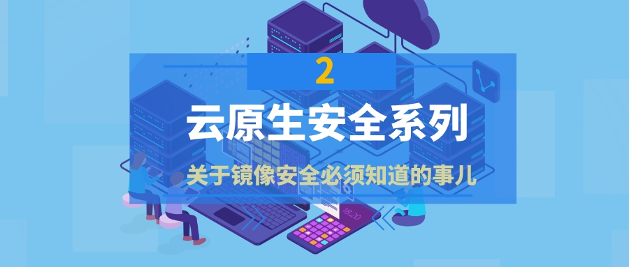
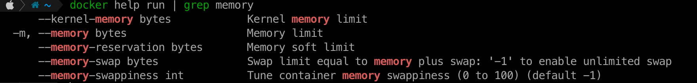

{ width="80%" }   

### 引言：

!!! abstract "引言："
    镜像安全是云原生安全中一个重要组成部分，今天我们就来说说关于镜像安全必须要知道的事。

 
#### 1、避免特权容器

!!! info ""
    Docker 提供了一种特权模式，它允许容器在本地计算机上以 root 身份运行。在特权模式下运行容器提供了该主机的功能，包括：

    * 对所有设备的根访问权限
    * 能够篡改 AppArmor 和 SELinux 等 Linux 安全模块
    * 能够使用主机的内核功能安装 Docker 平台的新实例，并在 Docker 中运行 Docker。
    特权容器会带来重大安全风险——使攻击者能够在容器受到威胁时轻松提升特权。因此，不建议在生产环境中使用特权容器。最重要的是，切勿在任何环境中使用它们。

    要检查容器是否在特权模式下运行，请使用以下命令（如果容器有特权则返回 true，否则返回错误消息）：

    docker inspect --format =''[container_id]

#### 2、隔离容器网络

!!! info ""
    Docker 容器需要网络层通过主机上的网络接口与外界通信。默认桥接网络存在于所有 Docker 主机上——如果您没有指定不同的网络，新容器会自动连接到它。

    强烈建议不要依赖默认的桥接网络——使用自定义桥接网络来控制哪些容器可以在它们之间通信，并启用从容器名称到 IP 地址的自动 DNS 解析。您可以根据需要创建任意数量的网络，并决定每个容器应该连接到哪些网络（如果有的话）。

    确保容器只有在绝对必要时才能相互连接，并避免将敏感容器连接到面向公众的网络。

    Docker 提供网络驱动程序，让您可以创建自己的桥接网络、覆盖网络或 macvlan 网络。如果您需要更多的控制，您可以创建一个 Docker 网络插件。

#### 3、定期更新 Docker 和主机

!!! info ""
    确保 Docker 和主机是最新的，定期进行漏洞扫描，补丁更新。始终确保 Docker 是最新版本。使用更新的操作系统和容器化软件来阻止安全问题。每个更新都有保护主机和 Docker 所必需的安全升级。 

#### 4、配置资源配额

!!! info ""
    容器应该有资源限制。设置资源限制会降低容器消耗大量系统资源的能力。限制分配给每个容器的资源可增强发生攻击时的安全性。

    资源配额由 Docker 基于每个容器配置。它们使您能够限制容器可以消耗的资源（内存和 CPU）数量。

    在容器上配置资源配额可以提高 docker 环境的效率。也防止了环境中整体容器的资源不平衡。

    此功能增强了容器安全性并使它们以预期的速度运行。如果一个容器感染了恶意代码，它不会让很多资源进入，因为配额会切断它。这进一步有助于最大限度地减少攻击。

    以 docker 为例：

    { width="60%" }   
    
#### 5、保持图像最轻量化

!!! info ""
    尽量使用最小的基础镜像，同时应安装最少的必须软件包，这可以减小图像大小，还可以减少可能存在漏洞或可能被用于恶意目的的包/组件的数量

    从不受信任的来源和供应商下载容器镜像可能会在容器中引入安全漏洞，您应该确保从在线平台下载的图像来自可信和安全的来源：

    * 使用真实的容器镜像。在Docker Hub上查看它们。它是最大的 Docker 镜像注册中心，拥有多个容器镜像。
    * 使用经过Docker Content Trust验证的图像。
    * 使用 Docker 安全扫描工具帮助您识别容器映像中的漏洞。

#### 6、监控 API 和网络安全

!!! info ""
    网络和 API 在 Docker 安全性中发挥着重要作用。Docker 容器使用 API 和网络进行通信。通信对于容器正确部署和运行至关重要。因此，需要适当的监控和安全措施。

    API 和网络安全是与 Docker 一起使用的资源。这些资源也是 Docker 安全性的一个公开风险。应该很好地监控和配置 API 和网络安全，以增强 Docker 的安全性。    

#### 7、不要将任何秘密、密码或密钥写入 Dockerfile

!!! info ""
    储敏感信息以纯文本的方式写入 Dockerfile 很容易造成数据泄露，当他人获取到您的镜像时，甚至可以通过 `docker history` 命令查看您的镜像构建情况，从而查看到您 DockerFile 中的 ARG、ENV映射的敏感数据。

#### 8、除非特别需要，否则不要打开端口 22 或包括 SSH

!!! info ""
    SSH（Secure Shell）是一种加密的网络传输协议，它允许用户通过Internet 控制和修改远程服务器，但是在容器中这将是一个潜在的攻击媒介，黑客可以通过ssh登录到容器，以容器为攻击起点，在网络环境中展开以南北向、散射状进行网络攻击和病毒入侵。

#### 9、通过特定版本标签引用基础映像，而不是“latest”：

!!! info ""
    您需要知道您正在使用的特定版本，以便组件跟踪和重建映像。“latest”图像是一个“活动版本”，使用者每次更新latest版本的镜像时，可能获得的结果都不一样，从而产生很多意想不到的后果！

#### 结论

!!! abstract "结论"
    保护 Docker 容器是必不可少的，但也可能很复杂。通过以上提示，您可以为容器化应用程序管理一个大型且安全的平台。上述做法至关重要，因为它们将帮助您防止容器化环境中的安全漏洞和攻击

    最后，应根据更新的漏洞数据库持续扫描在环境中使用的图像，以确保管理新漏洞。

