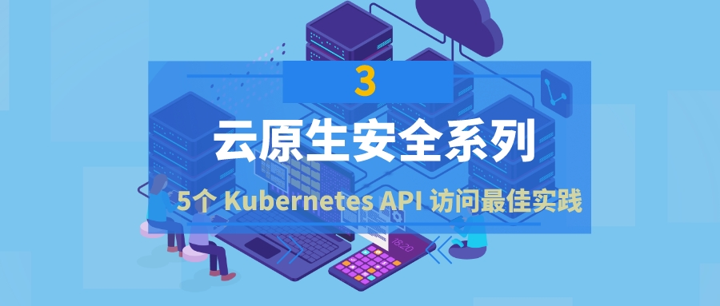

{ width="80%" }   

### 引言：

!!! abstract "引言："
    Kubernetes 中的 API 访问控制会经历三个步骤。首先，对请求进行身份验证，然后检查请求的有效授权，然后执行请求准入控制，最后授予访问权限。但在身份验证过程开始之前，确保正确配置网络访问控制和 TLS 连接应该是首要任务。
    以下是保护对 Kubernetes API（控制平面）的直接网络访问的五种最佳实践

 
#### 1、配置并使用 TLS

!!! info ""
    与 API 服务器的连接，控制平面内的通信，以及控制平面和 Kubelet 之间的通信，应该只被配置为可使用 TLS 连接到达。尽管 API 服务器可以通过向 kube-apiserver 提供 -tls-cert-file=[file]和-tls-private-key-file=[file]标志来轻松配置为使用 TLS，但考虑到 Kubernetes 能够根据需要快速扩大或缩小规模，在集群内配置连续的TLS证书管理是具有挑战性的。为了解决这个问题，Kubernetes 引入了TLS引导功能，它允许在 Kubernetes 集群内部自动进行证书签署和 TLS 配置。

#### 2、强化全局 TLS 连接配置

!!! info ""
    配置 kube-apiserver 支持的 TLS 相关标志。

    * -secure-port 用于与 kube-apiserver 进行 HTTPS 连接的网络端口。默认的端口是 6443。你也可以通过使用 -secure-portflag 提供所需的端口号来改变默认安全端口（6443）。
    * --tls-cert-file, --tls-private-key-file
    这些标志为 HTTPS 连接配置了 x509 证书和私钥。
    * --cert-dir
    配置TLS证书和密钥文件目录。--tls-cert-file 和 --tls-private-key-file 标志将优先于该目录下的证书。--cert-dir 的默认位置是在 /var/run/kubernetes。
    * --tls-cipher-suites
    配置TLS的首选密码套件。如果不提供这个标志，kube-apiserver 将使用 Golang 提供的默认密码套件运行。
    * --tls-min-version
    配置最小支持的 TLS 版本。值可以是。VersionTLS10, VersionTLS11, VersionTLS12, VersionTLS13。
    * --tls-sni-cert-key
    配置服务器名称指示(SNI)为一对值 --tls-sni-cert-key=testdomain.crt,testdomain.key。
    * --strict-transport-security-directives
    配置HTTP严格传输安全（HSTS）。
    * --requestheader-client-ca-file, --proxy-client-cert-file, --proxy-client-key-file
    Kubernetes 允许使用聚合层来扩展 kube-apiserver 的自定义 API。聚合层让你建立自己的API服务器（ kube-apiserver 的扩展）。为了确保 kube-apiserver 和自定义 API 服务器之间的通信安全，这些标志可以让你配置 x509 证书，以实现安全和可信的通信。

#### 3、加固 API Server 和 kubelet 之间的 TLS 连接

!!! info ""
    * --kubelet-certificate-authority, --kubelet-client-certificate, --kubelet-client-key
    这些标志让你为 Kubernetes API 服务器和 Kubelet 之间的 TLS 配置配置 CA、客户端证书和客户端私钥。 

#### 4、API Server 和  Etcd 之间的 TLS 连接

!!! info ""
    * --etcd-cafile, --etcd-certfile, --etcd-keyfile 
    
#### 5、确保对 API  Server 的直接网络访问

!!! info ""
    * 在生产中不要启用 localhost 端口。
    默认情况下，Kubernetes API在两个端口提供HTTP服务：localhost 和安全端口。localhost 端口不需要 TLS，对这个端口的请求可以绕过认证和授权模块。因此，确保在 Kubernetes 集群的测试设置之外不启用这个端口。
    * 使用 Kubectl Proxy 来管理安全客户端访问。
    安全通信（认证、传输）需要在客户端和服务器上进行仔细的秘密管理。如果你的团队是分布式的，那么 kubectl 有可能被来自不同地点的多个用户使用，增加了凭证（cert文件、令牌）泄露的机会。你可以配置一个跳板服务器，在这个服务器上配置 kubectl 代理，使用户向这个跳板服务器发送HTTPS请求，kubectl 代理转发（有必要的凭证）到API服务器。这样，就可以确保安全的客户端凭证永远不会离开安全加固的 跳板服务器。这种方法也可以用来防止用户通过网络访问直接到达 API 服务器。
    * 了解并保护 API 服务器代理功能。
    Kubernetes 有一个内置的跳板服务器（API服务器内部），可以代理访问集群上运行的服务。对服务的访问可以通过 URL 方案达到，如http://kubernetes_master_address/api/v1/namespaces/namespace-name/services/service-name[:port_name]/proxy 例如，如果弹性搜索-logging 服务在集群内部运行，可以通过URL方案https://ClusterIPOrDomain/api/v1/namespaces/kube-system/services/elasticsearch-logging/proxy
    这个功能的主要目的是允许访问那些可能无法从外部网络直接访问的内部服务。虽然这个功能对于管理目的可能很有用，但恶意的用户也可以访问内部服务，否则可能无法通过分配的角色授权。如果你想允许对 API 服务器的管理访问，但想阻止对内部服务的访问，使用HTTP代理或WAF来阻止对这些端点的请求。
    * 使用HTTP代理、负载均衡器和网络防火墙。
    添加一个简单的HTTP代理服务器（例如，用 Nginx 代理）可以帮助在 Kubernetes API 前快速应用 URL 和安全规则。为了最终的安全，在 Kubernetes API 服务器前投资一个负载平衡器（如AWS ELB、谷歌云负载平衡器）和网络防火墙，以控制对 Kubernetes API 服务器的直接访问。
