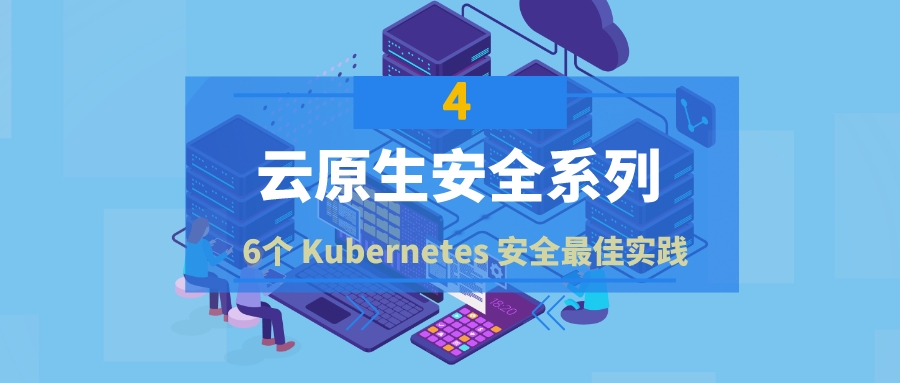
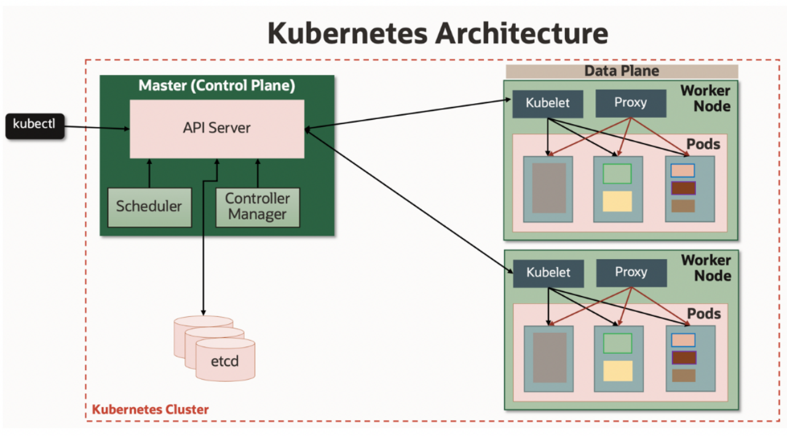
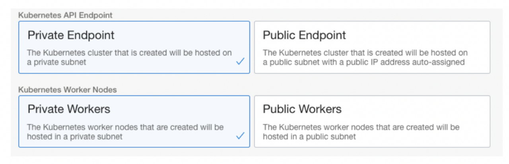
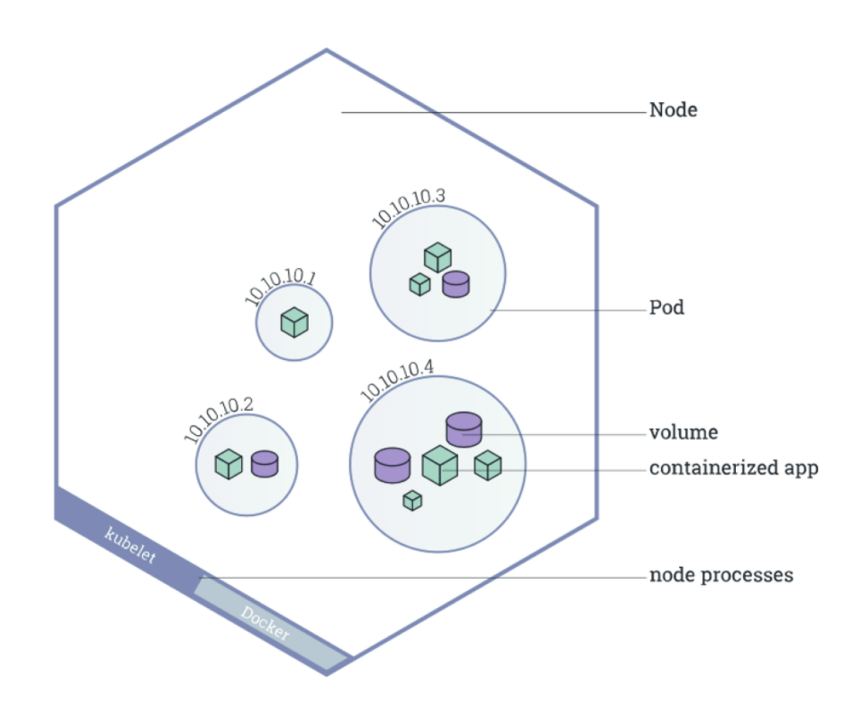

{ width="80%" }   

### 引言：

!!! abstract "引言："
    - Kubernetes为我们提供了一套很好的核心软件安全原则，但我们仍然需要理解并实施它们。对于 Kubernetes 集群分布式部署，攻击向量的数量也会增加，了解并尽可能限制这些攻击面的最佳实践非常重要。
    - 即使在使用托管的 Kubernetes 服务时，例如：EKS、AKS、TKE等，一些安全所有权仍然落在我们最终用户身上。云供应商通常负责管理和保护 Kubernetes 集群的控制平面（API 服务器、调度程序、etcd、控制器），客户负责保护数据平面（节点池、入口、网络、服务网格等）。

{ width="80%" }

#### 1、使用基于角色的访问控制（RBAC）

!!! info ""
    - 基于角色的访问控制 (RBAC) 让客户可以控制谁可以访问 Kubernetes API 以及他们拥有什么权限。RBAC 通常在 Kubernetes 中默认启用。但是，如果您从非常旧的 Kubernetes 版本升级并且之前没有启用它，则应检查 RBAC 设置以确保它们已启用。
    - 另一件要记住的事情是仅仅启用 RBAC 是不够的。您还应该管理授权策略并正确使用它们。使用 RBAC 将用户和组限制为他们可能需要的操作和任务。始终遵循最小权限原则，以确保用户和 Kubernetes 服务帐户具有所需的最小权限集。确保不授予集群范围的权限，除非绝对必要，否则不要授予任何集群管理员权限。有关详细信息，请参阅官方 Kubernetes RBAC 文档 。
    - 对于使用云服务创建和管理的 Kubernetes 集群的操作，供应商可能会提供身份和访问管理 服务。此处的文档 提供了更多详细信息。如果您需要多个因素来验证身份，多因素身份验证 (MFA) 是另一种增强 Kubernetes API 身份验证安全性的选项。

#### 2、秘密就应该是秘密

!!! info ""
    - 机密包含敏感数据，例如密码、令牌或 SSH 密钥。Kubernetes 机密有助于使用密钥、密码、令牌等工件安全地初始化 pod。当 pod 启动时，它通常需要访问其机密。每当创建服务帐户时，都会自动生成存储其授权令牌的 Kubernetes 秘密。Kubernetes 支持静态加密。这将加密 etcd 中的秘密资源，防止访问您的 etcd 备份和查看这些秘密的内容。
    - 当备份未加密或攻击者获得对 etcd 的读取权限时，加密提供了额外的防御级别。确保用户与 API 服务器之间以及从 API 服务器到 kubelet 的通信使用 SSL/TLS 进行保护，如此 处所述。推荐的做法是使秘密或凭据的生命周期较短，以使攻击者更难使用它们。为证书设置较短的生命周期并自动轮换是一个很好的做法。
    - 另一件要记住的事情是了解第三方集成请求访问 Kubernetes 集群的秘密。在这种情况下，请仔细检查请求的 RBAC 权限和访问权限，否则您可能会危及集群的安全配置文件。如果您使用的是Oracle Kubernetes Engine，请参阅 在 Etcd 中静态加密 Kubernetes 机密以 获取更多信息。

#### 3、私有 Kubernetes API 端点

!!! info ""
    - Kubernetes 集群管理员和操作员可以将集群的 Kubernetes API 端点配置为私有或公共子网的一部分。在私有集群中，控制平面内的 API 服务器（端点）有一个私有 IP 地址，使主服务器无法从公共互联网访问。除了专用工作程序节点之外，您还应确保将 Kubernetes API 端点配置为专用端点。如果您需要创建不使用或公开任何公共 IP 并且不允许流量进出公共互联网的完全私有集群，这一点很重要。可以使用安全访问控制列表或使用网络安全设置在粒度级别控制对集群 API 端点的网络访问。例如，

{ width="50%" }

#### 4、保护节点和 Pod

!!! info ""
    * 节点：  Kubernetes 节点是工作节点，可以是通常在 Linux 操作系统 (OS) 上运行的虚拟机或物理机。节点上运行的服务包括容器运行时、kubelet 和 kube-proxy。加固和保护节点上运行的操作系统很重要；这是云提供商和 Kubernetes 管理员的责任。
    * 例如，Oracle Kubernetes Engine 节点带有强化的 Linux 映像。Kubernetes 管理员应定期在这些节点上运行的 Linux 映像上应用安全补丁，或者在客户提供这些补丁后使用服务提供商的自动升级功能。对节点使用互联网安全中心 (CIS) Kubernetes 基准测试是另一种好的做法。
    * 除了 OS 安全之外，建议节点位于专用网络上并且不能从 Internet 访问。如果需要，可以配置网关以访问集群网络之外的其他服务。节点上的网络端口访问应通过网络访问列表进行控制。还建议限制对节点的安全外壳 (SSH) 访问。Oracle Kubernetes Engine 节点池安全文档 提供了更多指导。
    * Pod: Pod 是一  组在节点上运行的一个或多个容器，可以使用共享或专用存储。默认情况下，对于哪些节点可以运行 pod 没有限制。使用 网络策略来定义集群中 pod 的通信规则。网络策略由网络插件实现，使用它们可能需要支持策略的网络驱动程序。例如，Oracle Kubernetes Engine 提供了多种选项 来保护与集群中的工作负载之间的通信。
    * 为获得最佳网络安全态势，评估使用网络策略组合来保护 pod 级网络通信和安全列表以保护主机级网络通信。Kubernetes pod 安全上下文有助于定义 pod 或容器的权限和访问控制设置。检查并利用 pod 和容器清单正在使用的安全上下文设置。Pod 安全策略允许客户控制 Pod 的运行时执行属性，例如将容器作为特权容器运行的能力、主机文件系统、网络和端口的使用。默认情况下，一个 pod 可以被调度到集群中的任何节点上。Kubernetes 提供了多种方式来控制 pod 分配给节点，例如用于控制 Pod 在节点上的放置 以及 基于污点的 Pod 放置和驱逐的策略。如果使用 Oracle Kubernetes Engine，您可以按照文档中的说明为集群设置 pod 安全策略。

{ width="50%" }

#### 5、消除容器安全风险

!!! info ""
    - 应用程序被打包为容器镜像，通常是 Docker 镜像。容器映像存储在容器注册表中并从中提取，并实例化为 Pod 内的运行时容器。当您处理源代码和库以为您的应用程序构建容器映像时，安全性必须是开发过程开始时的设计原则。
    - 在 CI/CD 工具链中以及容器映像的整个构建、存储和部署过程中实施安全实践。其中包括安全地存储容器镜像、扫描这些镜像以查找安全漏洞以及管理容器的运行时安全性。作为 DevSecOps 周期的一部分，自动扫描您可能用于构建应用程序的第三方库的漏洞是个好主意。例如，如果您使用的是 Oracle Kubernetes Engine，您还可以查看 NeuVector、Deepfence、Aqua Security 和 Prisma Cloud Security 等合作伙伴解决方案。您还可以找到本机容器镜像扫描、签名和验证功能作为平台的一部分。
    - 在构建 Docker 镜像和容器时，使用强化的 slim 操作系统镜像，并确保运行应用程序的用户拥有运行容器内进程所需的最低操作系统权限。另一件需要记住的重要事情是定期对源镜像应用安全更新，然后将它们重新部署为更新的容器。使用私有 Docker 注册表（如Oracle Cloud Infrastructure Registry）也很重要，它具有适当的访问控制和适当的策略以及容器映像管理的治理。建议签署容器镜像并维护容器内容的信任系统。

#### 6、审计、日志记录和监控必不可少

!!! info ""
    - 审计、日志记录和监控是重要的安全方面，可以帮助改善集群的安全状况，不容忽视。Kubernetes 审计日志是对 Kubernetes API 服务器的每次调用的详细描述。这些审计日志提供有关集群中发生的事情的有用信息，甚至可以用于审计、合规性和安全分析。Kubernetes 审计 记录包括捕获完整活动序列的安全记录，可以帮助检测异常行为和对敏感资源的访问。
    - 建议启用审核日志并将审核日志保存在安全存储库中，以便在发生危害时进行分析。Kubernetes 还提供基于集群的 日志记录 ，将容器活动记录到中央日志子系统中。Kubernetes 集群中每个容器的标准输出和标准错误输出可以使用  在每个节点上运行 的代理（如Fluentd）提取到Elasticsearch等工具中，并使用 Kibana 查看。最后，使用Prometheus、  Grafana或 Jaeger等工具监控容器、pod、应用程序、服务和集群的其他组件， 以监控、查看和跟踪集群。
    O'Reilly 的Liz Rice 和 Michael Hausenblas 合着的“Kubernetes Security”一书是了解有关该主题的更多信息的好资源。如果像我一样使用 Oracle Kubernetes Engine，您可以查看 OCI 安全指南 和一些关于 保护 Oracle Kubernetes Engine的额外建议。如上所述，我还利用了 Oracle Cloud Infrastructure 中的本地身份和身份验证功能。