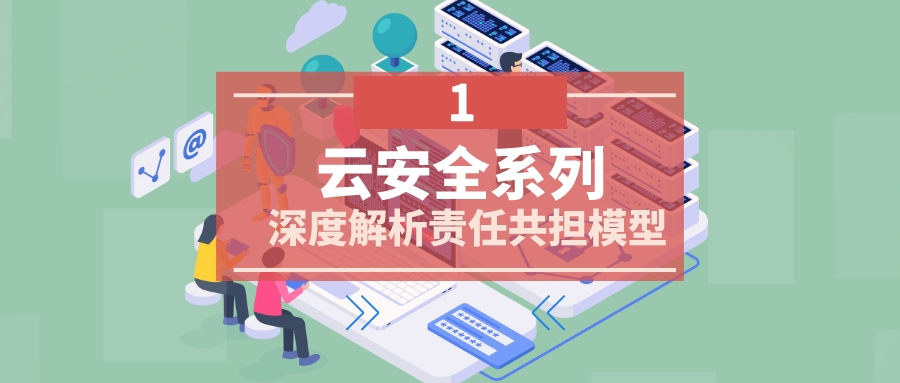
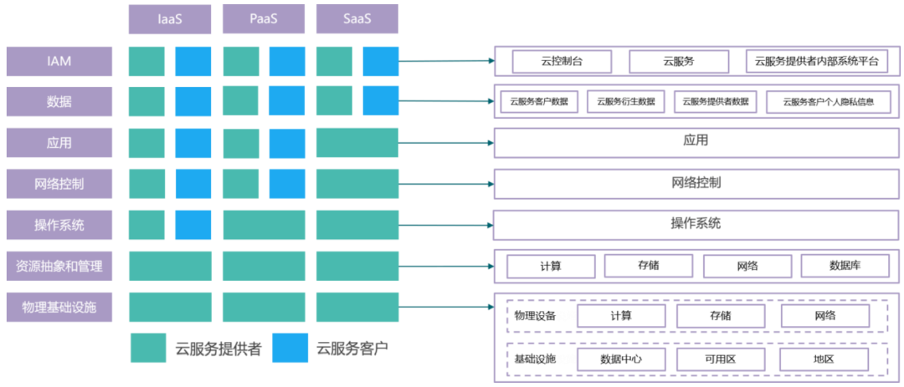
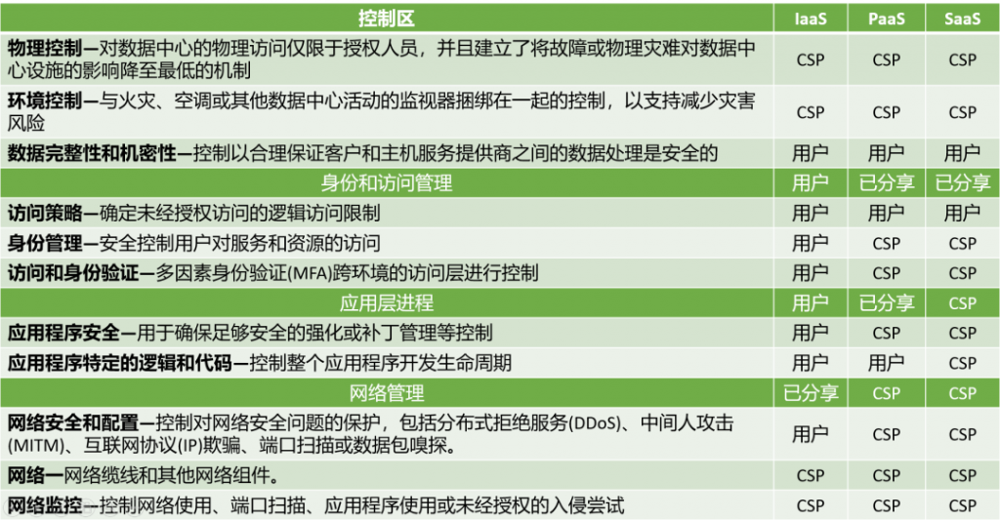
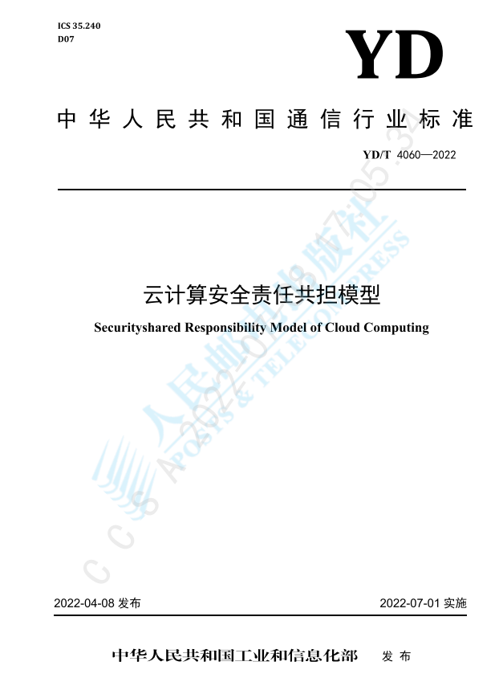

{ width="90%" }   

### 引言

!!! abstract ""
    云作为一股改变世界的技术趋势，正被各种类型的组织所采用，基于云的数字化转型在加速进行。伴随着云计算一同快速发展的一个重要问题就是安全性。在云安全中一个首先需要使用者清晰的概念就是责任共担模型，今天我们就来详细说一说责任共担模型。

    由于云相关的复杂性，在开始之前我们需要清楚一些与责任共担模型相关概念。

 
#### 云的部署类型

!!! abstract ""
    云的类型主要根据署模式来划分，主要包括：公有云、私有云、混合云。

    * 公有云：公有云部署模式是云服务商完全通过互联网向其客户提供的计算服务。客户无需承担与购买、管理和维护底层基础设施相关的成本。  
    * 私有云：私有云是专用于某一企业或组织的云计算环境。它通过额外的控制以及更高级别的安全和隐私来提供公有云的所有优势。  
    * 混合云：混合云将公有云和私有云组合使用。尤其是对于一些大型组织，他们有着复杂的业务需求和监管要求。混合云模式使组织能够从公有云的灵活性和私有云的安全性中获益。  

#### 服务模式

!!! abstract ""
    根据对外提供服务形式的不同，可以分为三类：

    * IaaS 基础设施即服务  
    * PaaS 平台即服务  
    * SaaS 软件即服务  

    不同于传统数据中心的视角，云安全包括保护云服务本身在各类云服务以及云服务数据中心内部运维运营所需的技术资源，以确保各类应用和服务能够持续、高效、安全、稳定地运行。    
    云服务与传统数据中心存在明显差异，前者对云安全整体设计和实践更侧重于为您提供完善的、多维度的、按需要任意定制、组合的各种安全和隐私保护功能和配置，涵盖基础设施、平台、应用及数据安全等各个层面。同时，不同的云安全服务又进一步为您提供了各类可自主配置的高级安全选项。这些云安全服务需要通过深度嵌入各层云服务的安全特性、安全配置和安全管控来实现，并通过可整合多点汇总分析的、 日趋自动化的云安全运维运营能力来支撑。   

#### 责任主体

!!! abstract ""
    云服务提供者：云服务商，提供laaS、PaaS、SaaS中的一种或多种云服务。   

    云服务客户：包括企事业客户和个人客户，云服务客户通过云服务对外提供其它应用或服务的，其用户不在范围内。

#### 责任共担模型

!!! abstract ""  
    责任共担模型是定义云服务提供者及其客户之间的安全责任的框架，云计算用户必须了解所涉及的风险，并主动设计和实现充分的安全控制。云环境中的安全是云服务提供商和云用户的共同责任，在某些领域有一些重叠。当前许多云安全问题都源于客户对谁负责什么问题的困惑。虽然从责任占比来说云服务提供者更多，但是云计算用户承担了云安全更重要的部分。    

{ width="90%" }   

!!! tip ""  
    七大类安全责任：

    * 物理基础设施：指运营云计算服务的数据中心安全和云计算平台基础架构安全；  
    * 资源抽象和管理：指计算、存储、网络、数据库等资源的虚拟化安全，以及云主机、云存储、 云网络和云数据库等云服务产品的安全管理；  
    * 操作系统：指云主机的操作系统安全；  
    * 网络控制：指云服务间的，或云服务与外部的网络通信的安全控制。   
    * 应用：指云计算环境下的应用系统的安全管理。在laaS. PaaS模式中，是云服务客户自行部署在云环境上的软件或服务。在SaaS模式中，应用是云服务提供者为云服务客户提供的软件类云服务；  
    * 数据：指云计算相关的云服务客户数据、云服务衍生数据、云服务提供者数据和云服务客户 个人隐私信息的安全管理；  
    * IAM：指对云计算相关资源和数据的身份识别和访问管理   
!!! info ""  
    责任共担模型是定义云服务提供者及其客户之间的安全责任的框架，一般来说，云服务提供商负责管理安全，客户负责保护自己在云中的资产。

    我们将内容进行一些细化，可以整理一个表格来更好的观察在模型中，云服务提供者和客户需要承担的责任。

{ width="90%" }   

!!! info ""  
    我们这里也借鉴一下公有云领域的领军企业 AWS 的责任共担模型。

{ width="90%" }   

#### 《云计算安全责任共担模型》行业标准

!!! abstract ""
    为建立更加精细可落地、普遍适用于云计算行业的安全责任共担模型，提升云服务客户责任共担意识与承担水平，2019年起，由中国信息通信研究院（以下简称“中国信通院”）牵头，联合数十家云服务商开展了云计算安全责任共担的相关研究，制定YD/T 4060—2022《云计算安全责任共担模型》行业标准，该标准已于2022年7月正式发布施行。

{ width="60%" }   

#### 总结

!!! abstract ""
    云安全是一个需要多方协同的安全体系，除云计算提供者，云服务用户也在服务链中有至关重要的影响，Gartner预估到2025年，99%的云安全事件将源于用户配置错误。当客户根据其云服务提供商的责任共担模型了解到自己应负的安全相关责任，他们才能制定符合自身情况的云安全策略。

