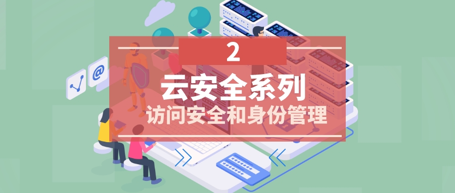
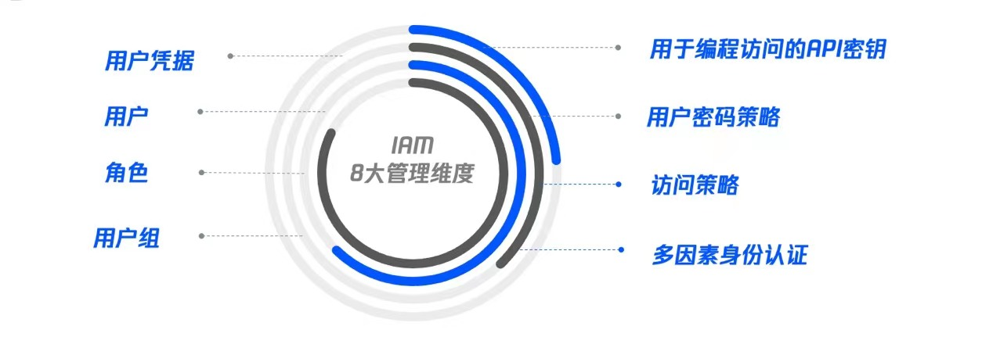
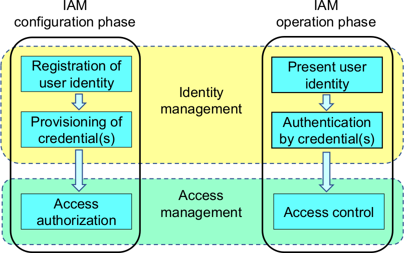
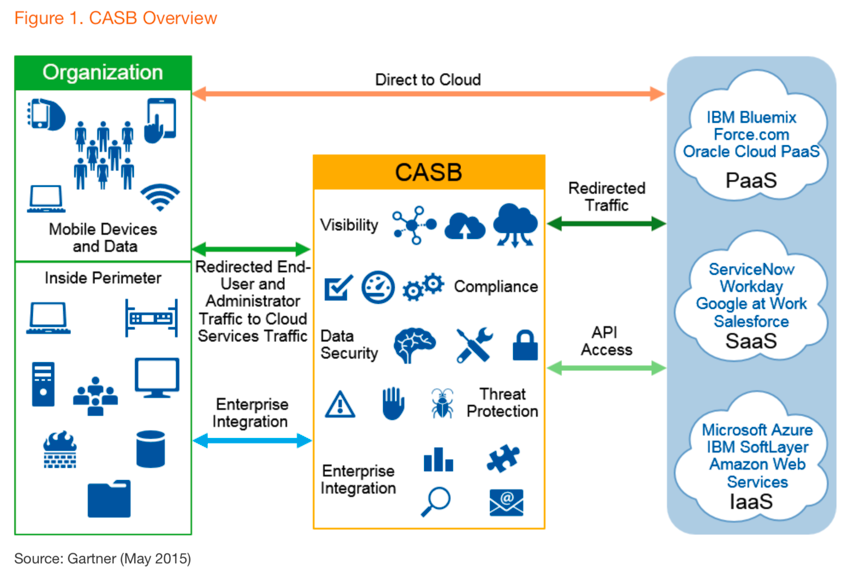

{ width="90%" }  
### 引言

!!! abstract ""
    云环境带来了新的变化，尤其是多云环境的复杂性使得管理好使用者身份并且实现安全访问成为一项挑战。安全和身份团队在考虑云上安全的时候，首先就需要解决这方面的难题。

### 云 IAM 作为管理基础

!!! abstract ""
    为了达成访问安全和身份管理的目标，IAM是目前云上安全的一个通用和必备要素。关于IAM 的含义，Gartner Information Technology Glossary中给出了关于IAM的定义：“Identity and access management (IAM) is the discipline that enables the right individuals to access the right resources at the right times for the right reasons”。与之类似，云上身份和访问管理服务，则是云厂商提供的一种用于帮助用户安全地控制对云上资源访问的服务。用户可以使用 IAM 来控制身份验证以及授权使用相应的资源。

{ width="90%" }  

!!! abstract ""
    云上身份与访问管理首先在配置阶段注册和授权访问权限，然后在操作阶段识别、验证和权限控制。下图将展示IAM的配置阶段与操作阶段之间的关系，以及身份与访问管理的区别。

{ width="90%" }  

!!! abstract ""
    云厂商通常会提供完整的IAM服务及能力，以AWS为例，在其IAM服务中提供了丰富角色和权限管理体系，并且有着完善和丰富的API及使用体系。同样对于国内的云供应商阿里云、腾讯云等，也都提供了能力完善的IAM服务，实现了账号全生命周期管理、身份管理、认证、权限、审计以及联合身份等基本功能。

### CASB 作为可选扩展

!!! abstract ""
    云访问安全代理（通常缩写成 CASB）是介于企业用户和云服务提供商之间的安全策略执行点。CASB 可以结合多种不同的安全策略（从身份验证和凭据映射到加密、恶意软件检测等等），提供灵活的企业解决方案，帮助确保云应用在授权和未授权应用程序以及托管和非托管设备上的安全性。
{ width="90%" }  

!!! tip ""
    CASBs核心围绕四个方面来提供安全的访问能力：数据安全、法规遵从性、威胁保护和核心可见性。
    在部署模式角度也比较灵活，一般来说有三种：云上部署，数据中心部署和混合部署模式。
    CASB 可以作为企业的有效扩展考量，目前很多云厂商也提供了内置的CASB 服务，来方便用户的选择，当然用户也可以考虑选择第三方供应商的解决方案，尤其是当面对混合云的场景时，第三方的方案会比云厂商的产品更有普适性。

### 配置管理和行为审计是必要建设
!!! abstract ""
    使用了IAM的能力或者扩充了云访问安全代理并不完全足够，正确的使用访问管理，可以规避许多云上风险的发生。但是错误的配置以及使用将会导致严重的云上漏洞。Unit 42云威胁报告指出，错误配置的亚马逊云IAM服务角色导致数以千计的云工作负载受损。
    为了避免安全性风险的出现，这里我们需要建设的能力包括：   
    * 对用户的的IAM配置和其他安全配置进行持续管理，持续性管理是一个重点方向，安全是动态和变化的，因此对于IAM等相关服务的配置也要具备动态管理的能力。  
    * 基于规则的检测能力，对于IAM等云上的安全服务其配置和要求都有非常经常的变化，并且会有着各种不同场景的最佳实践，因此为了灵活快速的发现问题，需要定义不同的检测规则，进而定位和发现问题所在。  
    * 快速的修复能力。针对检测发现的问题，需要快速地进行针对性的修复处理，及时减小风险的影响范围。  
    * 充分结合云上操作审计，任何的安全防护都不可能万无一失，但是作为事后安全部分的审计，可以有效地实现安全性的持续提升，达到一种持续进化的安全演进能力。  
### 总结
!!! abstract ""
    进行身份验证与访问管理是一个重要内容，对保障云上安全尤为重要。虽然IAM服务自身拥有如上的众多优势，可以很好支持云上身份与访问管理，但是由于没有遵循安全规范，错误的使用IAM功能，依然会为云上资产带来风险。
    因此在企业日常的安全管理中需要关注云厂商以及中立第三方给出的最佳实践，并结合自身的环境特点，持续性的优化企业的云上访问安全和身份管理体系。
