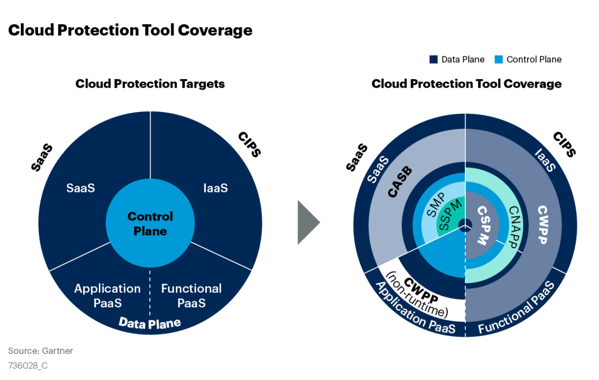

{ width="80%" }  
### 引言

!!! abstract ""
    随着组织越来越多地将数据和应用转移到云端，云安全在确保工作负载安全方面变得至关重要。Gartener 就表示：“云优先战略现在已十分普遍，甚至在不愿承担风险的企业机构中也是如此。但由于缺乏确保安全云计算部署所必需的技能和工具，因此执行仍然受到阻碍。”
    在了解和选择云安全的相关工具前，我们还是强烈建议，先了解云安全的基础责任共担模型，可以参考本系列的第一篇文章。

### 云安全防护分类

!!! abstract ""
    针对于云安全中的分类问题，为我们一般分为控制平面和数据平面两个层次去考虑，数据平面主要解决云工作负载本身的防护问题， CWPP主要完成这一层面的工作；控制平面则是在云工作负载之上实施的安全服务，比如CSPM等产品。

!!! info "控制平面的安全"
    在云中的控制平面一般是对云上资源的管理能力，比如常见的资源查看，创建删除等动作。同时由于目前云能力的不断深入，云的控制平面也在不断地扩展，比如从控制台延伸到API，SDK，shell工具等。

    我们需要就需要对所有潜在的控制平面风险进行检测、识别、处理和审计。这里我们可以有一个比喻，就是控制平面类似控制道路交通的信号灯。

!!! abstract "数据平面的安全"
    云中的数据平面关注云上工作负载本身的防护问题，在这部分中即会涉及到和云上应用相关的主机基础防护，也会涉及到云上业务数据流量调度和云上数据内容的安全。

    也用一个形象的比喻来说，数据平面就是道路交通中行驶的车辆。
{ width="50%" }      
### C云安全工具分类

!!! abstract ""
    由于共享了云安全责任和云产品本身的复杂性，大部分企业上云后都需要对其安全工具进行更新，例如被国内大多数企业广泛应用的CWPP(云工作负载保护平台)，在国外较为成熟的CASB(云访问安全代理)、CSPM(云安全态势管理)、CNAPP(云原生应用保护平台)，以及SSPM(SaaS安全态势管理)和SMP(SaaS管理平台)等新兴的安全工具。
{ width="50%" }  
!!! tip ""
    从上图可以看出，CWPP和CASB一般关注数据平面的安全，CSPM、SSPM和SMP主要关注控制平面的安全，而CNAPP则同时适用于控制平面和数据平面的安全管控。随后，高峰详细介绍了几个重要的云安全工具。
!!! tip "CASB"
    即云访问安全代理，CASB通过对多种类型的云安全控制进行整合，为SaaS、IaaS和PaaS提供一些可见性、合规性、数据安全和威胁保护的控制，例如授权、用户行为分析(UEBA)、自适应访问控制、数据泄漏防护(DLP)以及设备分析等。据悉，CASB在国外已得到广泛应用，而在国内市场，由于CASB供应商需要与云服务提供商进行深度合作，因此市面上提供CASB的供应商较少。

    CASB通常有四类集成方式：一是API集成，其部署优势是不存在代理模式的会话管理问题;二是正向代理方式，主要针对用户上云的访问进行保护，包括企业访问外网以及访问云上资源的流量;三是反向代理部署，针对外部用户(如：非企业管理的客户端)对企业云上的应用访问，进行保护;四是从安全网关或企业防火墙等安全设备提取日志，注入到CASB进行分析，并生成云应用的发行报告。  
!!! tip "CWPP"
    即云工作负载保护平台，又称“云主机保护平台”，是以工作负载的保护为主的安全产品，可以保护混合云、多云和数据中心的服务器工作负载。与EDR不同的是，CWPP专注于保护服务器负载主机，为物理机、虚拟机、容器和无服务工作负载等所有主机提供保护，无论它们在数据中心还是云上，都能提供一致性的可见控制。CWPP能够结合多种功能保护工作负载，例如：系统完整性保护、应用程序控制、行为监控、入侵防御、以及恶意软件的保护。

    需要强调的是，尽管中国的供应商提供了很多CWPP工具，但是其中不乏一些基于供应商原有的EDR进行修改的产品，这些修改版的CWPP工具对无服务工作负载、容器以及云集成的支持能力可能非常有限，企业在选择相关产品时需要格外注意。
!!! tip "CSPM"
    即云安全态势管理，主要通过预防、检测、响应和主动识别云基础设施风险，持续管理云安全状况，核心是通过ISO22701等通用框架要求，等保等相关法律法规要求，以及企业的安全策略，主动与被动结合，发现评估云服务的安全配置风险，一旦发现问题，可以提供自动或者人工的补救措施。例如，CSPM可以根据企业配置的安全策略，对其进行持续的安全检查，一旦发现配置偏移，即可阻止或通知安全人员。由于CSPM产品需与云服务提供商深度合作，目前只有少数本地供应商能够提供此类产品，而国外已经有很多CSPM产品开始支持中国的云服务商。
!!! tip "CNAPP"
    即云原生应用保护平台，CNAPP集成了安全与合规功能，助力保护云原生应用程序的整个生命周期，包括应用的构建、云基础设施的配置以及应用运行时的安全保护。CNAPP整合了大量独立功能，例如容器扫描、云安全态势管理以及云主机运行时的安全保护等等。目前，一些中国供应商，尤其是初创的云安全供应商，已经开始提供CNAPP产品，但是尚未覆盖所有领域，这一类工具有待进一步发展。
{ width="50%" }  

### 工具选择思路
!!! abstract ""
    **充分结合自身现状**   
    这里还是要提到责任共担模型，由于云安全的特殊性，因此不可能以单打独斗的心态来做好这件事，所以在选择工具时候，就要充分考虑实际情况。这里最为明显的两点：

    一是并不一定最贵最大厂的就是最好的，而应该选择和自己的实际情况和实际诉求最贴合的。

    二是要充分利用云供应商的能力，云供应商很多时候已经提供了很多免费的安全能力，充分的利用这些能力，可以显著的提升安全性，并且没有额外的成本。

    **顾及扩展性和延伸性**   
    随着混合云的不断发展，用户在云上的环境复杂度在不断提升，因此在选择工具时很难做到一劳永逸，而应该在选择时充分为扩展性做考虑。以防后期企业云环境出现变化，而工具无法适应，需要重新全盘更换的情况出现。

    **开放性是未来的趋势**   
    随着基础架构即代码(IAC)的不断发展，给云资源的自动化管理带来很多便捷，另一方面DevSecOps的快速发展，是得安全需要和研发流程深入的进行结合，在这个过程中，需要云安全工具可以很好的和企业内部的其他工具和部门进行结合，这个时候就考验到所选择工具的开放性。开放性的要求既需要可以向外对接，也需要支持接入，也就是说既要具备开放API/SDK可以让其他人对接，也需要有灵活的开发扩展模式。

