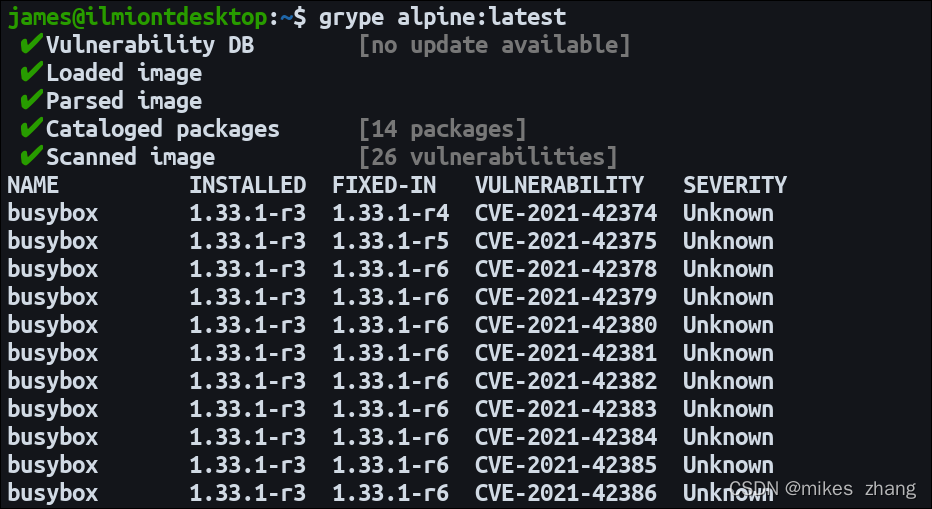
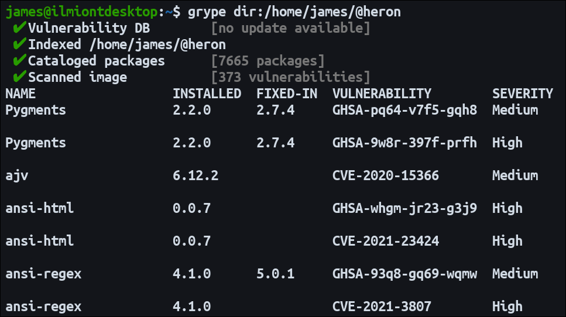

### Grype

!!! info "项目地址"
    Github 项目地址：https://github.com/anchore/grype
 
#### 一、Grype 是什么

!!! abstract "Grype 是什么"
    * Grype 是一个开源漏洞扫描器，可以发现容器镜像和文件系统目录中的弱点。Grype由 Anchore 开发，但作为一个独立的二进制文件工作，比 Anchore 引擎更容易掌握。
    * 已知漏洞通过过时的操作系统包、受损的编程语言依赖项和不安全的基础镜像进入您的软件。主动扫描您的工件可以让您在恶意行为者发现问题之前了解问题。以下是如何使用 Grype 查找代码和容器中的问题。

#### 二、安装 Grype

!!! abstract "安装 Grype"
    1. Grype 作为预编译的二进制文件以deb、rpm、Linux 源代码和 Mac 格式分发。
    2. 您可以从 GitHub获取最新版本并使用系统的包管理器安装它，或者将二进制文件复制到您路径中的某个位置。
    3. 或者，使用安装脚本来自动化该过程：

!!! tip "一键安装"
    ```sh
    curl -sSfL https://raw.githubusercontent.com/anchore/grype/main/install.sh | sh -s -- -b /usr/local/bin
    ```

!!! abstract "Grype 命令"
    通过运行 grype 命令检查二进制文件的工作。将显示有关可用命令的文档。

#### 三、基本扫描

!!! abstract "基本扫描"
    1. 在最简单的形式中，Grype 使用一个参数来指定要扫描的容器镜像或文件系统路径。要扫描镜像，请提供有效的注册表标记。
    2. Grype 将使用可用的 Docker 凭据从 Docker Hub 和私有注册表中提取镜像。

!!! tip "grype"
    ```sh
    grype alpine:latest
    ```
!!! tip "您还可以扫描从 Docker 导出的镜像存档"
    ```sh
    grype saved-image.tar
    ```

!!! abstract "漏洞数据库"
    Grype 将在第一次运行时下载其漏洞数据库。目前它的重量约为 110MB。一旦数据库可用，Grype 将拉取 Docker 镜像，对其中的软件进行编目，并解析数据库中存在的已知漏洞。

{ width="95%" }

!!! abstract "结果"
    1. 结果显示在终端内的表格中。每个漏洞都包括其CVE ID、受影响包的名称及其严重性级别。当问题在以后的版本中得到修补时，您将在FIXED-IN列中看到该更新的版本号。这有助于您确定是否可以通过简单的包管理器更新轻松解决漏洞。
    2. Grype 可以处理所有最流行的Linux 发行版的包。它还支持 Ruby Gems、NPM 和 Yarn 包、Python Eggs、Wheels 和 Poetry 依赖项，以及 JAR、WAR、EAR、JPI 和 HPI 格式的 Java 模块。
    3. Grype 还可以获取Anchore Feed服务所提供的漏洞数据库，这个数据库会在每一次扫描任务开始之前进行更新，不过我们也可以使用下列命令来进行手动更新：
!!! tip "手动更新"
    ```sh
    grype db update
    ```

#### 四、扫描文件系统

!!! abstract "扫描文件系统"
    Grype 可以扫描您机器上的文件系统路径。这使您可以在构建镜像之前发现源代码存储库中的漏洞。要使用此功能，请使用dir:方案指定目录路径：

!!! tip "目录路径"
    ```sh
    grype dir:/example-dir
    ```

!!! abstract "兼容文件"
    Grype 将查找嵌套在给定目录根下的兼容文件。每个找到的文件都将被索引并扫描漏洞。

{ width="95%" }

!!! abstract "相同类型的漏洞"
    文件系统扫描与容器镜像扫描具有相同类型的漏洞。如果您使用的是大型目录树，则扫描可能需要几分钟才能完成。

#### 五、过滤漏洞

!!! abstract "过滤漏洞"
    1. 支持两个过滤标志以将报告范围限定为您感兴趣的漏洞或解决方案选项：
        – only-fixed – 仅显示已在受影响软件包的后续版本中修补的漏洞。
        – fail-on high–high发现 - 级漏洞时立即退出并显示错误代码。您可以用任何支持的错误级别（严重、高、中或低）代替high.

#### 六、忽略漏洞

!!! abstract "忽略漏洞"
    1. 可以忽略漏洞以隐藏误报或您决定不解决的问题，这可能是因为它们与您对包的使用无关。
    2. 要忽略漏洞，您需要创建一个 YAML 格式的自定义 Grype 配置文件。在顶级ignore字段下添加漏洞的CVE ：

!!! tip "ignore字段"
    ```sh
        ignore:
           - vulnerability: CVE-2021-12345
    ```

!!! tip "也支持其他字段，例如此变体忽略源自 NPM 包的所有问题"
    ```sh
        ignore:
            - package:
                type: npm
    ```
!!! abstract "配置"
    * 将您的配置文件保存到.grype.yaml或.grype/config.yaml在您的工作目录中。下次运行 Grype 扫描时会自动使用它。~/.grype.yaml还支持全局配置文件。工作目录中的文件将在运行时与全局文件合并。
    * 如果忽略这些漏洞，它们将不会影响 Grype 的退出代码。JSON 报告会将它们移动到单独的ignoredMatches字段，而终端表报告将它们完全排除。如果您忽略某个漏洞，请记住记录它被接受的原因，以便每个贡献者都了解风险。

#### 七、使用 SBOM

!!! abstract "SBOM"
    1. Grype 可以使用 Syft 生成的 SBOM，这是 Anchore 的另一个项目。Syft 为您的容器镜像编制索引以生成它们包含的依赖项列表。
    2. 使用 Syft 以 JSON 格式为您的镜像创建 SBOM：

!!! tip "Syft"
    ```sh
    syft alpine:latest -o json > alpine-sbom.json
    ```
!!! tip "然后使用 SBOM 运行 Grype 扫描"
    ```sh
    grype sbom:/alpine-sbom.json
    ```
!!! abstract "结合使用"
    Grype 将检查参考镜像是否存在由其材料清单引起的新漏洞。继续将 Grype 与您的 SBOM 结合使用，以监控您已经审核和索引的镜像依赖项中的新问题。

#### 八、自定义 Grype 输出

!!! abstract "Grype 输出"
    1. Grype 提供四种不同的输出格式化程序，您可以使用-oCLI 标志在它们之间切换：
        - table – 终端内消费的默认人类可读表。
        - json– 一份 JSON 格式的报告，其中包含有关每个漏洞的更全面的信息，以及用于扫描的 Grype 数据库的详细信息。JSON
        - 文件适合长期存档和比较，或用作 CI 构建工件。
        - cyclonedx– XML 格式的与CycloneDX 兼容的报告，可用于支持 SBOM 和漏洞列表的其他工具。
        - template – 此高级格式化程序可让您以任意格式生成自己的报告。

!!! tip "该template格式接受将被用来呈现报表输出转到模板。要使用此格式化程序，请不要按名称指定它——而是将路径传递到包含 Go 模板的文件"
    ```sh
    grype alpine:latest -o output-template.tmpl
    ```
!!! abstract "Grype 输出结构"
    * 该模板应使用 Go 模板语法来引用 Grype 提供的变量。您可以构建所需的任何类型的文件格式，例如 HTML 页面、Markdown 文件或自定义 JSON 结构。
    * Grype 文档包括从可用变量生成 CSV 文件的示例。

#### 九、漏洞数据库

!!! abstract "漏洞数据库"
    1. 漏洞数据库存储 Grype 已知的所有漏洞的详细信息。下载后，缓存版本将被重复使用，直到有可用更新。通常不需要与数据库进行手动交互。
    2. 在某些情况下，您可能需要强制下载数据库。这可能是因为您在运行扫描之前设置了一个气隙服务器。使用grype db check和grype db update命令检查和下载较新版本的数据库。
    3. 一旦数据库可用，扫描将在您的系统脱机时工作。您可以通过在 shell 中设置GRYPE_DB_AUTO_UPDATE环境变量来禁用 Grype 的自动数据库更新检查false。

#### 十、概括

!!! abstract "概括"
    1. Grype 会提醒您容器内和文件系统上的漏洞。作为一个独立的 CLI 二进制文件，它比完整的 Anchore 安装更容易上手。
    2. 如果您想知道应该选择哪个，Anchore 的价值在于其可扩展性和高级配置选项。使用锚定引擎，您可以根据门、触发器和操作定义自己的策略集。这些使您可以根据特定环境精确定制扫描。当您只需要镜像中的已知漏洞列表时，Grype 可提供更简化的体验。
    3. 无论您选择哪种方式，采用某种形式的主动漏洞扫描都会让您了解软件供应链中的弱点。对于完全集成的方法，将 Grype 用作 CI 管道的一部分，以便在提交代码时收到新漏洞的警报。
