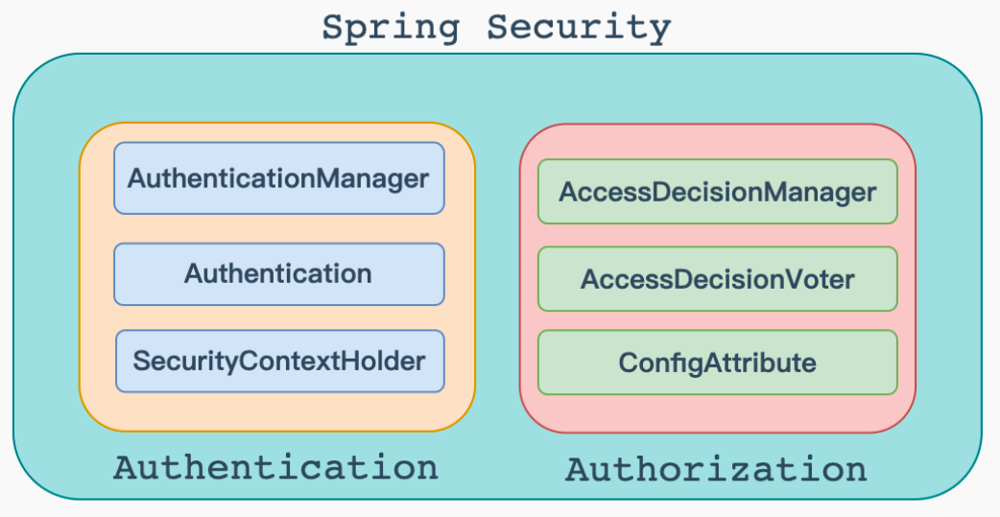
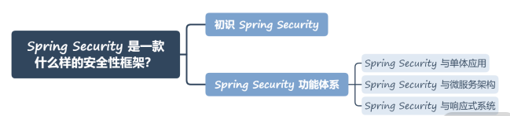

### Spring Security

!!! info "项目地址"
    * Github 项目地址：https://github.com/spring-projects/spring-security
    * Spring Security 官方文档：https://spring.io/projects/spring-security

#### 一、Spring Security 是什么

!!! abstract "安全框架 Spring Security 是什么"
    1. Spring Security 是一套认证授权框架, 支持认证模式如 HTTP BASIC 认证头 (基于 IETF RFC-based 标准), HTTP Digest 认证头 ( IETF RFC-based 标准), Form-based authentication (用于简单的用户界面), OpenID 认证等, Spring Security使得当前系统可以快速集成这些验证机制亦或是实现自己的一套验证机制.
    1. Spring Security 是⼀个功能强大、可高度定制的身份验证和访问控制框架。它是保护基于 Spring 的应用程序的事实标准。
    2. Spring Security 是⼀个面向Java应用程序框架。与所有Spring项目⼀样，Spring Security 的真正威力在于它可以轻松地扩展以满足定制需求。

{ width="95%" }


#### 二、权限管理

!!! abstract "认证和授权"
    在Spring Security中，权限管理主要包括两个方面：认证和授权。简单来说，认证就是用户的登录认证；授权就是登录成功之后，用户可以访问资源的多少。
    
!!! warning "什么是认证和授权"
    1. 什么是权限管理
        * 基本上涉及到用户参与的系统都要进行权限管理，权限管理属于系统安全的范畴，权限管理实现对用户访问系统的控制 ，按照安全规则 或者 安全策略控制用户 可以访问而且只能访问自己被授权的资源。权限管理包括用户身份认证和授权两部分，简称认证授权。对于需要访问控制的资源用户首先经过身份认证，认证通过后用户具有该资源的访问权限才可访问。
    2. 什么是认证
        * 认证 ，就是判断⼀个用户是否为合法用户的处理过程。最常用的简单身份认证方式是系统通过核对用户输入的用户名和口令（密码），看其是否与系统中存储的该用户的用户名和口令⼀致，来判断用户身份是否正确。这就好比我们登录QQ、微信、游戏账号等等需要的账号和密码~
    3. 什么是授权
        * 授权 ，即访问控制，控制谁能访问哪些资源。主体进行身份认证后需要分配权限才可访问系统的资源，对于某些资源没有权限是无法访问的。这就好比学校的网站，有学生可以访问的资源，然而老师的资源学生就无法访问~

#### 三、整体架构

!!! abstract "架构设计"
    在 Spring Security 的架构设计中， 认证 和 授权 是分开的，但无论使用什么样的认证方式。都不会影响授权，这是两个独立的存在，这种独立带来的好处之⼀，就是可以非常方便地整合⼀些外部的方案。

{ width="95%" }

!!! abstract "1、认证"
    ```java
    // AuthenticationManager 接口，在Spring Security中认证是由 AuthenticationManager 来负责的，接口定义为：
    public interface AuthenticationManager {
        Authentication authenticate(Authentication var1)
            throws AuthenticationException;
    }
    ```

    ```java
    // Authentication接口，认证以及认证成功的信息主要是由 Authentication 的实现类进行保存的，接口定义如下：
    public interface Authentication extends Principal, Serializable {
        Collection<? extends GrantedAuthority> getAuthorities();
        Object getCredentials();
        Object getDetails();
        Object getPrincipal();
        boolean isAuthenticated();
        void setAuthenticated(boolean var1) throws IllegalArgumentException;
    }
    ```
    
    * 方法介绍：
        * getAuthorities 获取用户权限信息
        * getCredentials 获取用户凭证信息，⼀般指密码
        * getDetails 获取用户详细信息
        * getPrincipal 获取用户身份信息，用户名、用户对象等
        * isAuthenticated 用户是否认证成功

    ```java
    // SecurityContextHolder 类，SecurityContextHolder 用来获取登录之后用户信息。定义如下（省略了一些属性和方法）：
    public class SecurityContextHolder {
        public static void clearContext() {
            strategy.clearContext();
        }
        public static SecurityContext getContext() {
            return strategy.getContext();
        }
        public static int getInitializeCount() {
            return initializeCount;
        }
        public static void setContext(SecurityContext context) {
            strategy.setContext(context);
        }
        public static void setStrategyName(String strategyName) {
            strategyName = strategyName;
            initialize();
        }
        public static SecurityContextHolderStrategy getContextHolderStrategy() {
            return strategy;
        }
        public static SecurityContext createEmptyContext() {
            return strategy.createEmptyContext();
        }
        public String toString() {
            return "SecurityContextHolder[strategy='" + strategyName + "'; initializeCount=" + initializeCount + "]";
        }
    }
    ```

    1. Spring Security 会将登录用户数据保存在 Session 中。但是，为了使用方便,Spring Security在此基础上还做了一些改进，其中最主要的⼀个变化就是线程绑定。
    2. 当用户登录成功后,Spring Security 会将登录成功的用户信息保存到SecurityContextHolder 中。SecurityContextHolder 中的数据保存默认是通过ThreadLocal 来实现的，使用ThreadLocal 创建的变量只能被当前线程访问，不能被其他线程访问和修改，也就是用户数据和请求线程绑定在⼀起。
    3. 当登录请求处理完毕后，Spring Security 会将 SecurityContextHolder 中的数据拿出来保存到 Session 中，同时将 SecurityContexHolder 中的数据清空。以后每当有请求到来时，Spring Security 就会先从 Session 中取出用户登录数据，保存到 SecurityContextHolder 中，方便在该请求的后续处理过程中使用，同时在请求结束时将 SecurityContextHolder 中的数据拿出来保存到 Session 中，然后将SecurityContextHolder 中的数据清空。
    4. 这⼀策略非常方便用户在 Controller、Service 层以及任何代码中获取当前登录用户数据。
    

!!! warning "注意"
    * 注意：当返回Authentication 时，表示认证成功；当返回AuthenticationException异常时，表示认证失败。
        * AuthenticationManager 主要实现类为 ProviderManager，在 ProviderManager 中管理了众多AuthenticationProvider实例。在⼀次完整的认证流程中，Spring Security允许存在多个
        * AuthenticationProvider ，用来实现多种认证方式，这些 AuthenticationProvider 都是由 ProviderManager 进行统⼀管理的。

{ width="95%" }

!!! abstract "2、授权"
    * 在 Spring Security 的授权体系中，有两个关键接口：AccessDecisionManager和AccessDecisionVoter。

    ```java
    // AccessDecisionManager (访问决策管理器)，用来决定此次访问是否被允许。接口定义如下：
    public interface AccessDecisionManager {
        void decide(Authentication var1, Object var2, Collection<ConfigAttribute> var3) throws AccessDeniedException, InsufficientAuthenticationException;
        boolean supports(ConfigAttribute var1);
        boolean supports(Class<?> var1);
    }
    ```

    ```java
    // AccessDecisionVoter (访问决定投票器)，投票器会检查⽤户是否具备应有的角色，进而投出赞成、反对或者弃权票。接口定义如下：
    public interface AccessDecisionVoter<S> {
        int ACCESS_GRANTED = 1;
        int ACCESS_ABSTAIN = 0;
        int ACCESS_DENIED = -1;
        boolean supports(ConfigAttribute var1);
        boolean supports(Class<?> var1);
        int vote(Authentication var1, S var2, Collection<ConfigAttribute> var3);
    }
    ```

!!! warning "注意"
    * 注意：需要注意的是：AccessDecisionManager中会挨个遍历 AccessDecisionVoter，进而决定是否允许用户访问。

    ```java
    // ConfigAttribute，用来保存授权时的角色信息。接口定义如下：
    public interface ConfigAttribute extends Serializable {
        String getAttribute();
    }
    ```

    * 在 Spring Security 中，用户请求⼀个资源需要的角色会被封装成一个 ConfigAttribute 对象。
    * 在 ConfigAttribute 中只有⼀个 getAttribute方法，该方法返回⼀个 String 字符串，就是角色的名称。
    * ⼀般来说，角色名称都带有⼀个 ROLE_ 前缀，投票器AccessDecisionVoter 所做的事情，其实就是比较用户所具各的角色和请求某个资源所需的 ConfigAtuibute 之间的关系。

#### 四、项目使用

!!! abstract "Spring Security"
    * 其实在 Spring Boot 出现之前，Spring Security 就已经诞生多年了。
    * 但 Spring Security 的发展一直都不是很顺利，主要问题在于应用程序中集成和配置 Spring Security 框架的过程比较复杂。
    * 但是随着 Spring Boot 的兴起，基于 Spring Boot 所提供的针对 Spring Security 的自动配置方案，开发人员可以零配置使用 Spring Security。
    * 如果想要在 Spring Boot 应用程序中使用 Spring Security，只需要在 Maven 工程的 pom 文件中添加如下依赖：

    ```xml
    <dependency>
         <groupId>org.springframework.boot</groupId>
         <artifactId>spring-boot-starter-security</artifactId>
    </dependency>
    ```
#### 五、小结
!!! abstract "Spring Security"
    * 总之，Spring Security 框架，基于日常开发，框架具备的功能体系完全满足各项安全需求。
    * 不同的功能对应不同的应用场景，在普通的单体应用、微服务架构、响应式系统中都可以使用 Spring Security 框架提供的各种功能确保系统的安全性。

{ width="95%" }
