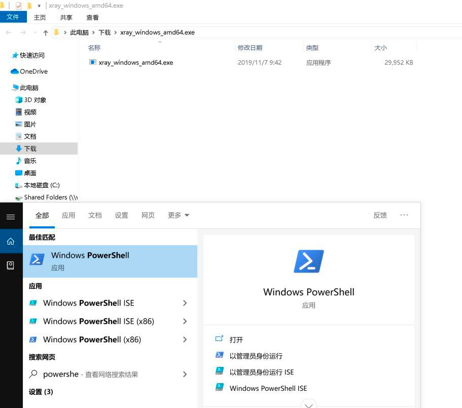
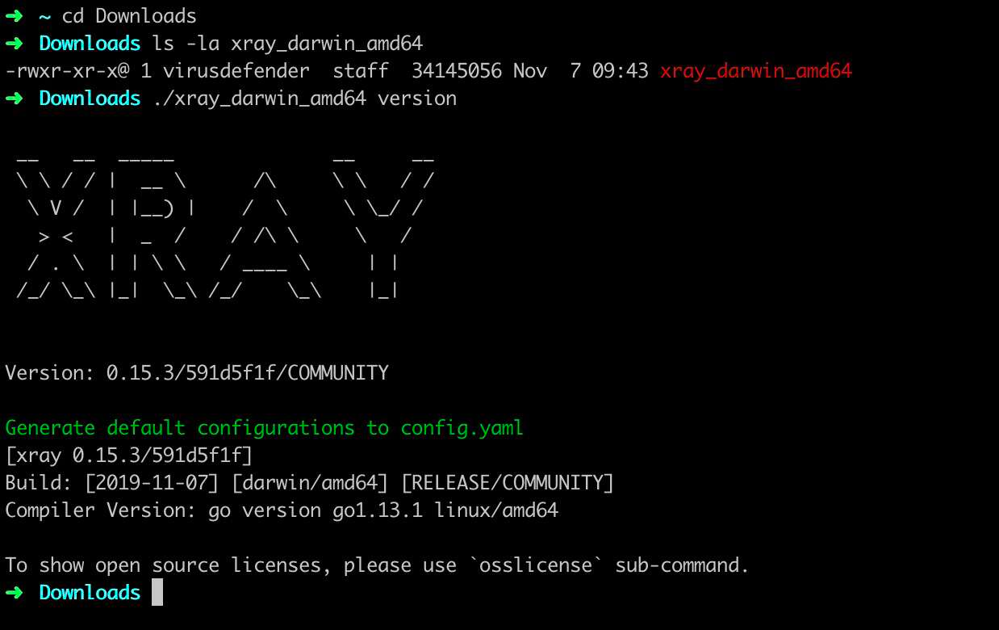
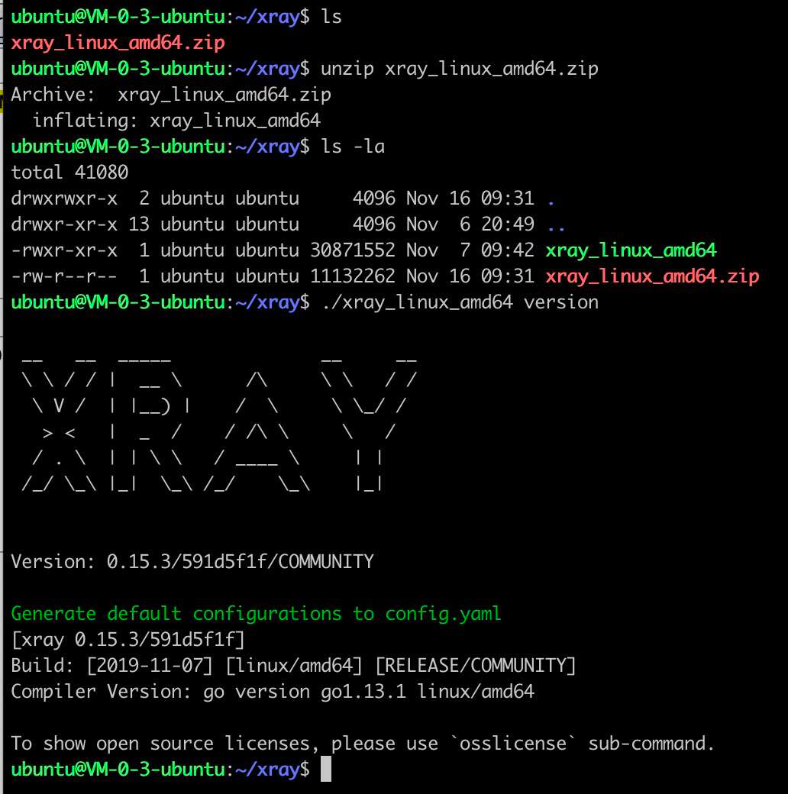

## Xray

!!! info "项目地址"
    - Github 项目地址：https://github.com/chaitin/xray
    - 文档地址：https://docs.xray.cool/

### 一、Xray 是什么

!!! abstract "Xray 是什么"
    - xray 是一款功能强大的安全评估工具，由多名经验丰富的一线安全从业者呕心打造而成，主要特性有:
        - [x] 检测速度快。发包速度快; 漏洞检测算法高效。
        - [x] 支持范围广。大至 OWASP Top 10 通用漏洞检测，小至各种 CMS 框架 POC，均可以支持。
        - [x] 代码质量高。编写代码的人员素质高, 通过 Code Review、单元测试、集成测试等多层验证来提高代码可靠性。
        - [x] 高级可定制。通过配置文件暴露了引擎的各种参数，通过修改配置文件可以极大的客制化功能。
        - [x] 安全无威胁。xray 定位为一款安全辅助评估工具，而不是攻击工具，内置的所有 payload 和 poc 均为无害化检查。

### 二、Xray 能做什么

!!! abstract "Xray 是什么"
    - 目前支持的漏洞检测类型包括:
        - [x] XSS漏洞检测 (key: xss)
        - [x] SQL 注入检测 (key: sqldet)
        - [x] 命令/代码注入检测 (key: cmd-injection)
        - [x] 目录枚举 (key: dirscan)
        - [x] 路径穿越检测 (key: path-traversal)
        - [x] XML 实体注入检测 (key: xxe)
        - [x] 文件上传检测 (key: upload)
        - [x] 弱口令检测 (key: brute-force)
        - [x] jsonp 检测 (key: jsonp)
        - [x] ssrf 检测 (key: ssrf)
        - [x] 基线检查 (key: baseline)
        - [x] 任意跳转检测 (key: redirect)
        - [x] CRLF 注入 (key: crlf-injection)
        - [x] Struts2 系列漏洞检测 (高级版，key: struts)
        - [x] Thinkphp系列漏洞检测 (高级版，key: thinkphp)
        - [x] POC 框架 (key: phantasm)

!!! abstract "POC"
    其中 POC 框架默认内置 Github 上贡献的 poc，用户也可以根据需要自行构建 poc 并运行。

### 三、Xray 使用

#### 下载运行

!!! abstract "下载运行"
    xray 为单文件二进制文件，无依赖，也无需安装，下载后直接使用。

#### 下载地址

!!! abstract "下载地址"
    请下载的时候选择最新的版本下载。

!!! warning "说明"
    - Github: https://github.com/chaitin/xray/releases （国外速度快）
    - 网盘: https://yunpan.360.cn/surl_y3Gu6cugi8u （国内速度快）
    - 注意： 不要直接 clone 仓库，xray 并不开源，仓库内不含源代码，直接下载构建的二进制文件即可。

!!! warning  "说明"
    xray 跨平台支持，请下载时选择需要的版本下载。

=== "Windows"
    !!! tip "Windows"
        - windows_amd64 Windows x64
        - windows_386 Windows x86
        - 系统版本要求大于等于 Windows 7 或大于等于 Windows Server 2008 R2, 不支持 Windows XP、Windows 2003 等低版本系统。

=== "MacOS"
    !!! tip "MacOS"
        - darwin_amd64 MacOS
        - 支持的系统版本为大于等于 10.10

=== "Linux"
    !!! tip "Linux"
        - linux_amd64 Linux x64
        - linux_386 Linux x86
        - 要求内核版本大于等于 2.6.23。不支持 CentOS 5, 因为内核太旧了 （2.6.18)。

!!! abstract "对于 release 中的其他文件，说明如下"
    - sha256.txt 校验文件，内含个版本的 sha256 的哈希值，请下载后自行校验以防被劫持投毒。
    - Source Code Github 自动打包的，无意义，请忽略。

### 运行

!!! abstract "运行"
    下载对应系统的版本后，来查看下 xray 的版本号。

=== "Windows"
    !!! tip "Windows"
        - 以下载到 C:\Users\$User\Downloads 为例，右键解压，就可以得到 xray_windows_amd64.exe 文件了（有的解压软件还会创建一个 xray_windows_amd64.exe 的文件夹，不要和最终的可执行文件混淆了）。
        - 支持的系统版本为大于等于 10.10
        { width="95%" }
        - 使用桌面左下方的的搜索框，输入 PowerShell，点击 Windows PowerShell，进入命令终端。
        - 然后 cd 到下载目录，运行 .\xray_windows_amd64.exe version 即可查看 xray 的版本号。

=== "MacOS"
    !!! tip "MacOS"
        - 以下载到 ~/Downloads 为例，双击解压，就可以得到 xray_darwin_amd64 文件了。
        - 打开使用的终端工具，比如 Terminal 或者 iTerm
        { width="95%" }
        - 然后 cd 到下载目录，运行 ./xray_darwin_amd64 version 即可查看 xray 的版本号。
        { width="95%" }

=== "Linux"
    !!! tip "Linux"
        - 以下载到 ~/xray 为例，使用 unzip 命令解压，就可以得到 xray_linux_amd64 文件了。
        - 然后运行 ./xray_linux_amd64 version 即可查看 xray 的版本号。
        { width="95%" }

