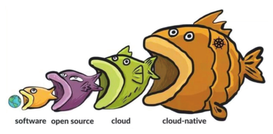
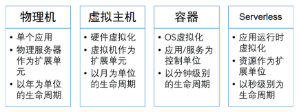
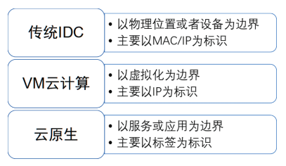

{ width="80%" }   

### HummerRisk 使用场景-云原生安全检测（3）--全生命周期检测

#### 云原生安全背景
!!! abstract "背景："
    云原生安全是一种将安全性构建到云原生应用程序中的方法。 

    它确保安全是从开发到生产的整个应用程序生命周期的一部分。 

    云原生安全旨在确保与传统安全模型相同的标准，同时适应云原生环境的特殊性，即快速的代码更改和高度短暂的基础设施。 

    云原生安全与称为测试左移的实践高度相关。

 
#### 云原生安全解决的问题

!!! info "解决的问题"
    传统的安全模型是根据许多不再有效的假设构建的。 

    云原生应用程序变化频繁，使用大量开源工具和库，通常运行在供应商控制的基础设施中，并且会受到快速的基础设施变化的影响。 

    代码审查、长质量保证周期、基于主机的漏洞扫描和最后一分钟的安全审查无法与云原生应用程序一起伸缩。

    云原生安全引入了一种新的工作方式，通过从传统的安全模型迁移到发布周期的每个步骤都涉及安全的模型来保护应用程序。 

    人工审核和检查在很大程度上被自动扫描所取代。 

    快速代码发布管道与在编译之前扫描代码以查找漏洞的工具集成在一起。 
    
    开源库从受信任的来源中提取并监控漏洞。 

    云原生安全模型不是减缓变化，而是通过频繁更新易受攻击的组件或确保定期更换基础设施来拥抱它。

#### 为什么需要云原生安全检测

##### 1 云原生正在吞噬一切

!!! info "技术特点"
    从技术特征来看，云原生拥有极致的弹性能力、服务自治、故障自愈能力和大规模可复制能力；从应用价值方面来看，云原生异构资源标准化，加速了数字基础设施解放生产力，提升业务应用的迭代速度，在赋能业务创新方面有重要价值；从产业效用来看，云原生极大地释放了云的红利，成为驱动业务的重要引擎。

    云原生以其技术优势以及不断扩大的应用场景，逐步普及到各行各业的敏捷开发与业务创新中，可以说“云原生正在吞噬一切”。

{ width="95%" }

##### 2 云原生未来拥有巨大挑战和机遇

!!! info "架构特点"
    云原生作为云计算的未来阶段，其安全势必成为云安全的主要战场。云原生安全的需求主要体现在两个方面。一是新的组件面临新的风险，如容器的隔离性不如虚拟机（VM）而导致其更容易发生逃逸攻击等，这就需要新的产品及解决方案。二是传统的云安全需求（例如访问控制）在新的架构中需要改进以适应新的架构。

    在以前的云计算时代，安全和云平台的结合不算紧密，大部分以安全资源池这种外挂形式来实现云安全，而云原生安全需要安全能力和云原生平台紧密结合，真正成为内生安全，这将是云安全的巨大挑战和机遇。

    “不可变的基础设施”是云原生中非常重要的一个理念，可以说是云原生整个架构的核心思想，其贡献不亚于应用商店对智能手机的贡献。云原生对一个容器实例的更新是替换，而不是修改。这种方式保证了多实例间的一致性，有利于应用的弹性扩容。为了解决随之而来的效率问题，云原生用编排工具、微服务架构和 DevOps 一系列技术来保证替换的效率。相应地，“不可变的基础设施”也带来了安全防护思路的变化。

{ width="95%" }

{ width="95%" }

#### HummerRisk 如何上手

##### 1 主机检测

!!! abstract "添加统一凭据"      
    - 用户可以在统一凭据页面将常用的或重复的主机认证进行保存，这样在创建主机的过程中可以直接绑定，方便操作防止重复拷贝。
    - 新建、修改主机信息时，可灵活绑定凭据，统一凭据有三种类型，密码、密钥字符串、密钥文件。
{ width="95%" }

!!! abstract "添加主机 & 执行检测"      
    - 主机管理列表页面提供了对主机分组、主机的创建、删除、编辑、查找、校验、检测等操作。
    - 创建主机时，可以为多个主机批量添加统一凭据，也可以分别为主机添加凭据。
    - 目前可针对 Linux/Windows 操作系统类型的主机。

{ width="95%" }
{ width="95%" }

!!! abstract "主机检测结果"      
    - 在主机管理界面，选中待检测主机，一键执行后将自动跳转到主机检测结果页面。
    - 主检测结果页面将只会保留最新的一次检测结果，历史检测结果请到主机检测历史记录中查看。
    - 点击检测状态按钮，可以查看检测结果日志详情。
{ width="95%" }
{ width="95%" }

##### 2 K8s 检测

!!! abstract "Kuberbetes 配置"      
    - K8s 配置与云原生 K8s 环境安全检测功能，绑定 K8s Url 与 Token 信息即可进行安全检测，并生成安全漏洞结果。
    - K8s 平台环境有四种：分别是 Kubernetes、Rancher、OpenShift、KubeSphere。
{ width="95%" }
{ width="95%" }

!!! abstract "K8s 检测结果"      
    - K8s 检测结果，主要展示 K8s 环境的漏洞安全信息和配置审计风险信息。
{ width="95%" }
{ width="95%" }
{ width="95%" }

!!! abstract "K8s 资源态势"
    - 资源态势功能，绑定 K8s 环境信息，即可获取 K8s 的 Namespace、Pod、Node、Deployment、Service 等20余种资源信息。
    - 绑定完 K8s 账号是可以自动获取资源态势信息的。
    - 同时，也可以在同步日志页面手动获取资源态势信息。
    - 手动创建同步任务，即可查看同步资源数与同步状态。
{ width="95%" }

##### 3 检测部署

!!! abstract "K8s 部署配置"
    - K8s 部署检测功能，输入 K8s 部署配置 YAML 文件，即可进行部署检测，输出部署配置检测结果。
{ width="95%" }

!!! abstract "部署检测结果"
    - 针对部署文件（YAML），一键执行检测后展示结果。
    - 用户可以根据检测结果的提示，修改对应的 YAML 文件内容，达到最佳要求。
{ width="95%" }
{ width="95%" }
{ width="95%" }

##### 4 镜像检测

!!! abstract "镜像仓库"      
    - 用户可以绑定镜像仓库，之后检测的镜像可以从绑定的镜像仓库中查找和获取。
    - 镜像仓库类型：目前支持四种类型 harbor、dockerhub、nexus 和 other。如果选择 other 不会同步镜像，只做登录验证。
    - 镜像仓库中同步的镜像列表，可以直接执行检测，直接跳转到检测结果页面。（这个过程也会默认在镜像管理中新建一条数据）
{ width="95%" }
{ width="95%" }

!!! abstract "镜像管理"      
    - 在镜像管理页面，我们可以对具体需要检测的镜像进行管理。
    - 镜像列表中会显示出已经创建成功的待检测镜像，列表会显示出镜像的名称、状态、地址等信息。   
    - 通过校验的镜像，镜像状态会显示为 [有效]，可以对其执行检测。
    - 镜像可以是公有镜像，也可以是私有镜像。可以手动填写镜像地址，上传镜像tar包，也可以从镜像仓库中选择同步的镜像。
    - 在镜像列表中，选择希望执行检测的镜像，点击列表后的[检测]按钮，确认后系统就会对该镜像进行检测。
{ width="95%" }
{ width="95%" }

!!! abstract "镜像检测结果"      
    - 镜像检测结果列表，展示镜像的漏洞信息。
{ width="95%" }
{ width="95%" }

##### 5 源码检测

!!! abstract "项目源码配置"      
    - 在源码检测部分，通过对源码依赖的扫描，发现项目中存在的漏洞。
    - 目前绑定仓库支持两种类型：GitHub 和 GitLab 。
    - Token 的获取：首先私有仓库需要填入Token，公有仓库无需填写Token。
{ width="95%" }
{ width="95%" }

!!! abstract "源码检测结果"      
    - 源码检测，可以针对 branch 分支、可以针对 tag 标签、可以针对 commit 某次提交。
    - 源码检测结果列表，展示源码项目依赖的漏洞信息。
{ width="95%" }
{ width="95%" }

##### 6 文件检测

!!! abstract "依赖文件管理"      
    - 对于源码检测的补充，如果只想检测源码项目的依赖文件检测，可以上传对应的文件进行检测。
    - 依赖文件可以是单个文件，也可以是文件夹的压缩文件。
    - 依赖文件的格式，例如 java 的 pom.xml，vue 的 package.json 或 yarn.lock 等。
{ width="95%" }
{ width="95%" }

!!! abstract "依赖文件检测结果"      
    - 依赖文件检测结果列表，展示项目依赖的漏洞信息。
{ width="95%" }
{ width="95%" }

#### 结论

!!! abstract "结论"
    HummerRisk 在逐步迭代的过程中，逐渐满足云原生的安全检测问题，逐步覆盖全生命周期。
