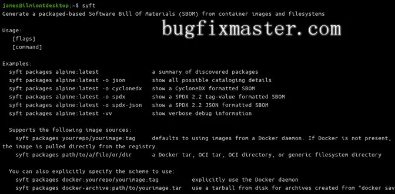

### Syft

!!! info "项目地址"
    Github 项目地址：https://github.com/anchore/syft

#### 一、Syft 是什么

!!! abstract "Syft 是什么"
    1. Syft 是一个 CLI 工具和 Go 库，用于从容器镜像和文件系统生成软件物料清单（SBOM）。SBOM是你的镜像所使用的依赖关系的一个目录。它使你能够看到构成你的镜像文件系统的 "材料"。
    2. 制作SBOM可以帮助你识别过于复杂的包装供应链，使你面临依赖性混乱的攻击风险。在你的图片旁边分发一个SBOM，可以让用户了解表面之下的东西。这在加强供应链安全时提供了一个有用的起点。
    3. Syft是由Anchore开发的，它也提供了一个完整的容器扫描引擎。Syft CLI能够使用流行的操作系统和编程语言从镜像中提取软件包列表。Docker和OCI镜像都支持。

#### 二、安装 Syft

!!! tip "有一个安装脚本可以下载最新的 Syft 二进制文件并将其添加到你的路径中"
    ```sh
    curl -sSfL https://raw.githubusercontent.com/anchore/syft/main/install.sh | sh -s -- -b /usr/local/bin
    ```
!!! abstract "Mac 安装 Syft"
    Mac 用户也可以从Homebrew获得Syft，方法是加入anchore/syft储存库，并安装syft包。

{ width="95%" }

!!! warning "注意"
    1. 一旦你在你的系统上安装了 Syft，运行 syft 在你的终端中显示可用的命令。你可以通过运行以下程序为你的 shell 生成补全信息 syft completion.
    2. 使用 syft version 来找到你的安装版本。
    3. 定期检查 GitHub 的标签页以找到新的版本，然后重复使用安装脚本来下载每个更新。

#### 三、扫描一个镜像

!!! abstract "功能"
    Syft 的功能目前是由一个单一的子命令暴露的。syft packages 传递给它一个镜像标签，为其生成一个SBOM。

!!! tip "扫描镜像"
    ```sh
    syft packages alpine:latest
    ```

!!! abstract "内容"
    Syft 将下载镜像，扫描其内容，并产生一个被发现的软件包的目录。输出将在你的终端显示为一个表格。每个结果都包括检测到的软件包名称、版本和类型。

{ width="95%" }

!!! abstract "原理"
    - 这个镜像的软件包清单很短。由于这是一个base的基本形象，安装的软件包被有意精简，以提供尽可能小的表面。
    - 较大的镜像可能包含几百或几千个不同格式的包。
    - 将Syft与现有的Unix终端工具相结合可能会有帮助，如grep和awk来提取你要找的数据。

!!! tip "命令"
    ```sh
    syft packages example-image:latest | grep example-package-to-find
    ```

#### 四、支持的软件包类型

!!! abstract "支持类型"
    - Syft支持许多主流操作系统和编程语言的流行包格式。该名单包括。
        - Alpine (apk)
        - C (conan)
        - C++ (conan)
        - Dart (pubs)
        - Debian (dpkg)
        - Dotnet (deps.json)
        - Go (go.mod, Go binaries)
        - Java (jar, ear, war, par, sar)
        - JavaScript (npm, yarn)
        - Jenkins Plugins (jpi, hpi)
        - PHP (composer)
        - Python (wheel, egg, poetry, requirements.txt)
        - Red Hat (rpm)
        - Ruby (gem)
        - Rust (cargo.lock)

#### 五、改变输出格式

!!! abstract "输出格式"
    - 默认的输出格式称为table.它在你的终端显示一个基于柱状的结果表，为每个检测到的软件包创建一个新的行。
    - 另一种人类可读的格式是text的软件包列表，该列表呈现了一个带有Version和Type嵌套在每个部分下的字段。

{ width="95%" }

!!! abstract "程序化的格式"
    - Syft也支持几种程序化的格式。
        - json- 将软件包数据保存为JSON结构。
        - cyclonedx- 一个XML格式的CycloneDX报告。
        - spdx和spdx-json- 与SPDX兼容的标签值或JSON格式的报告。

!!! tip "使用这些报告之一，你可以将调查结果归档到一个文件中，供以后参考"
    ```sh
    syft packages alpine:latest -o json > alpine-packages.json
    ```

!!! abstract "集成 Grype"
    - 标准化的CycloneDX和SPDX格式可以帮助将Syft扫描集成到你的CI/CD管道中。这些数据可以被其他与软件包列表和SBOM结果一起工作的生态系统工具所访问。
    - Syft还集成了Grype，Anchore的独立容器文件系统漏洞查找器。如果你使用JSON输出格式，Syft的数据可以直接输入Grype。

!!! tip "sbom"
    ```sh
    syft packages example-image:latest -o json > sbom.jsongrype sbom:./sbom.json
    ```
!!! abstract "Grype"
    - Grype 会将软件包列表与它的已知漏洞索引进行比较。
    - 它将突出显示含有问题的软件包，给你一个直接的起点来改善你的安全态势。

#### 六、使用其他镜像源

!!! abstract "使用其他镜像源"
    - Syft可以使用除公共Docker注册处以外的其他来源的镜像。
    - 你可以引用任何符合OCI标准的镜像，无论是通过注册表标签还是作为一个保存的镜像焦油。
    - 镜像档案的路径可以直接交给Syft。

!!! tip "命令"
    ```sh
    docker image save my-image:latest > my-image.tarsyft packages ./my-image.tar
    ```
!!! abstract "使用原理"
    1. Syft也能与私人Docker注册机构合作。
    2. 它使用你的现有证书，在你的~/.docker/config.json文件。
    3. 虽然Syft专注于容器镜像扫描，但它也可以为任意文件系统路径创建SBOM。
    4. 你可以使用Syft通过扫描通常包含软件二进制文件和库的目录来索引你的主机的软件包。

!!! tip "命令"
    ```sh
    syft packages dir:/usr/bin
    ```
!!! abstract "方案"
    - 你必须明确地添加dir:方案，如果你引用工作目录以外的路径。
    - 否则Syft将尝试将其解释为镜像标签参考。

#### 七、总结

!!! abstract "总结"
    1. Syft从你的容器镜像中提取软件包列表。生成的数据作为你的形象的SBOM，增加你对供应链长度的认识。
    2. Syft以单一的二进制文件形式发布，可产生几种不同格式的报告。它可以很容易地集成到CI/CD系统中，作为镜像构建管道的一部分上传一个SBOM工件。这增加了问责制，并通过记录每张图片在制作时的完整软件列表来帮助审计跟踪。
    3. 将Syft扫描添加到你的工作流程中，可以让你了解你正在使用的软件包。一旦你得到了这些信息，你就可以开始评估每一个包，以确定它是否真的需要。如果你发现有很多软件包不被你的工作量所使用，可以考虑切换到一个最小的基础镜像，只在上面分层安装必要的软件。
