## 1 新功能 Features

### 1.1 火山引擎云账号规则

!!! abstract "火山引擎云账号规则"
    如下图所示，新增火山引擎(字节云)检测规则，绑定火山账号即可进行安全合规检测。

绑定火山引擎(字节云)账号。

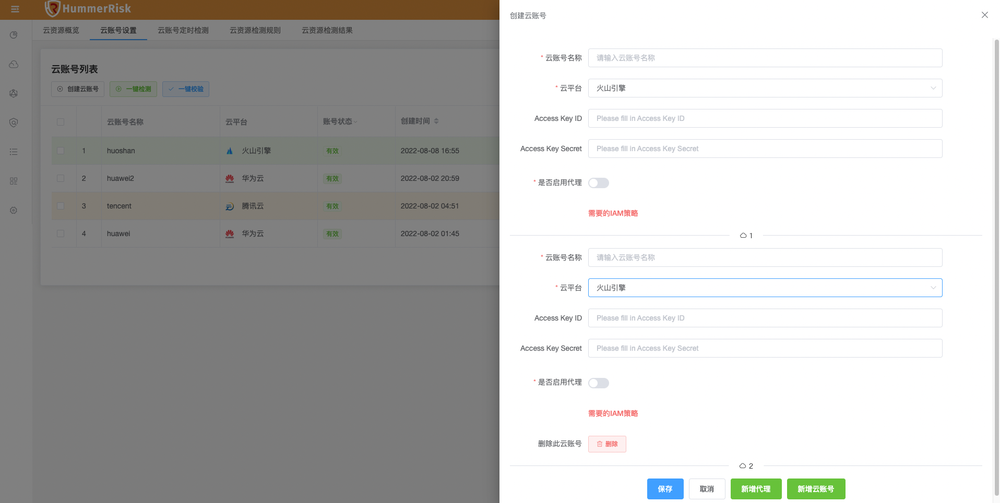{ width="95%" }
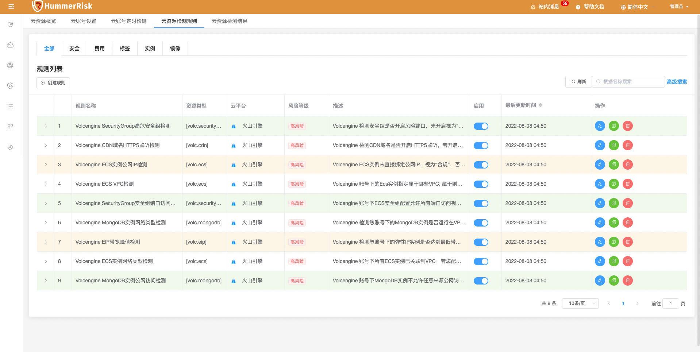{ width="95%" }

执行一键安全检测。

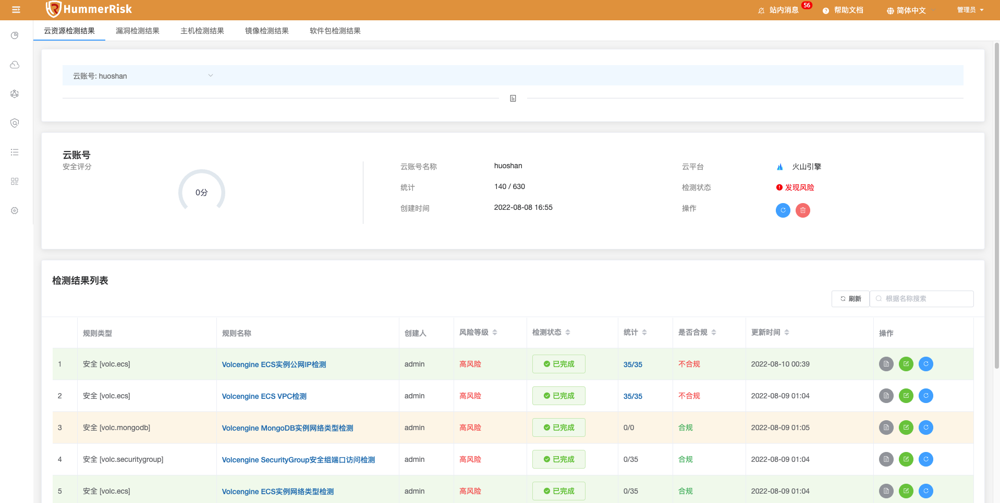{ width="95%" }

查看合规报告。

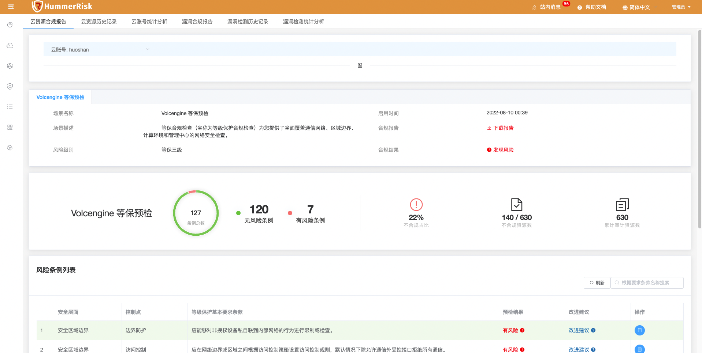{ width="95%" }

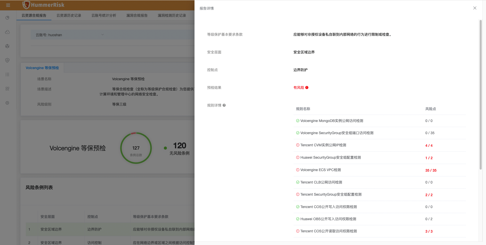{ width="95%" }

### 1.2 华为云账号规则

!!! abstract "华为云账号规则"
    如下图所示，新增华为云检测规则若干，绑定华为云账号即可进行安全合规检测。

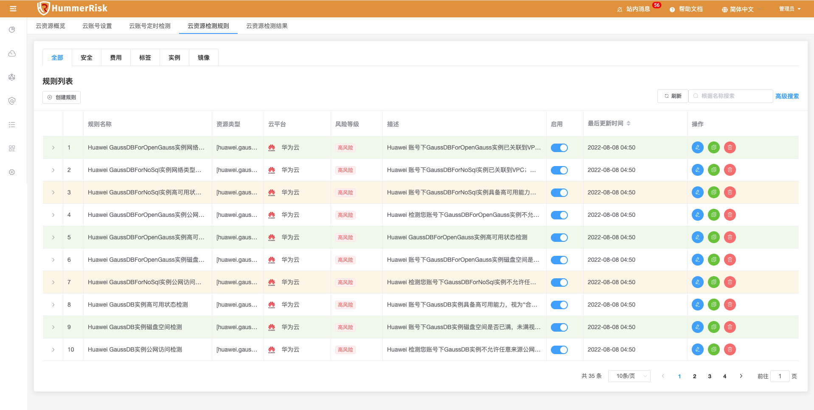{ width="95%" }

### 1.3 阿里矢量图标库

!!! abstract "阿里矢量图标库"
    新增阿里矢量图标库，增强图标库。

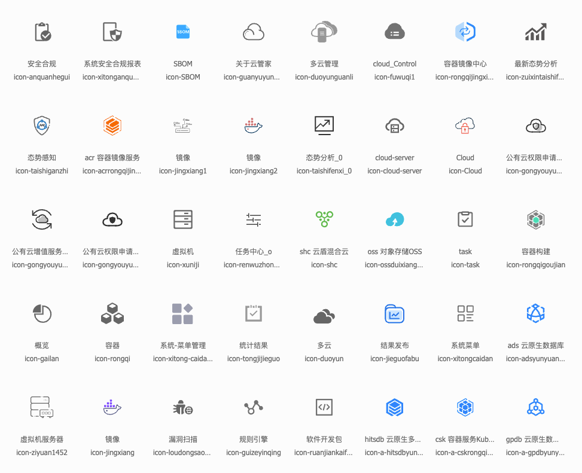{ width="95%" }

### 1.4 合规报告

!!! abstract "合规报告"
    如下图所示，新增漏洞检测合规报告。

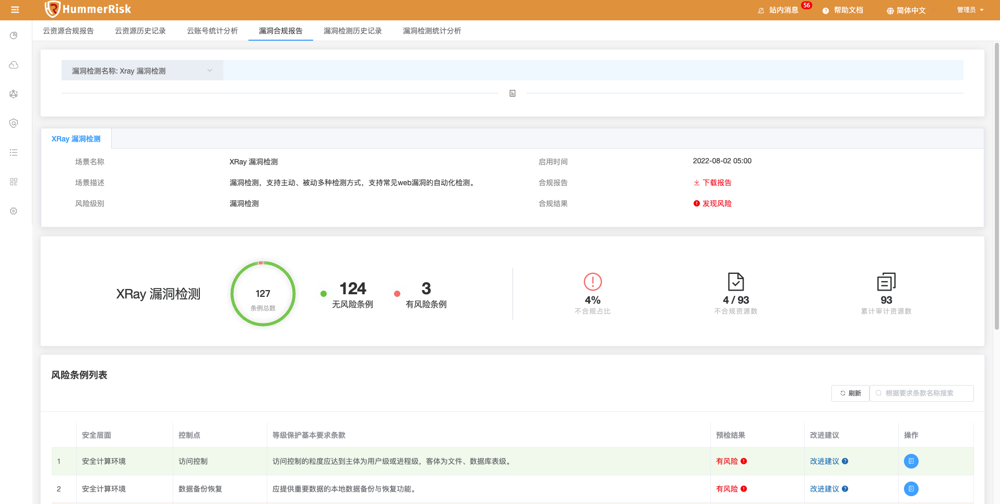{ width="95%" }

## 2 性能优化 Optimization

### 2.1 目录结构

!!! abstract "目录结构"
    优化目录结构，突出三大场景：混合云安全、云原生安全、软件安全。

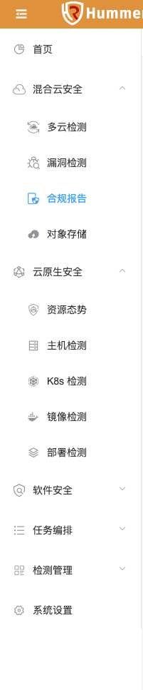
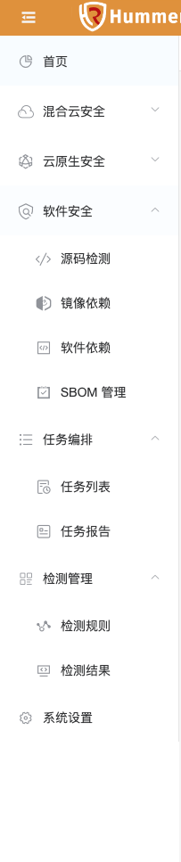

### 2.2 云端检测

!!! abstract "云端检测"
    优化阿里云部分检测规则。

### 2.3 统计分析

!!! abstract "统计分析"
    优化云账号检测、漏洞检测的历史对比和统计分析功能。

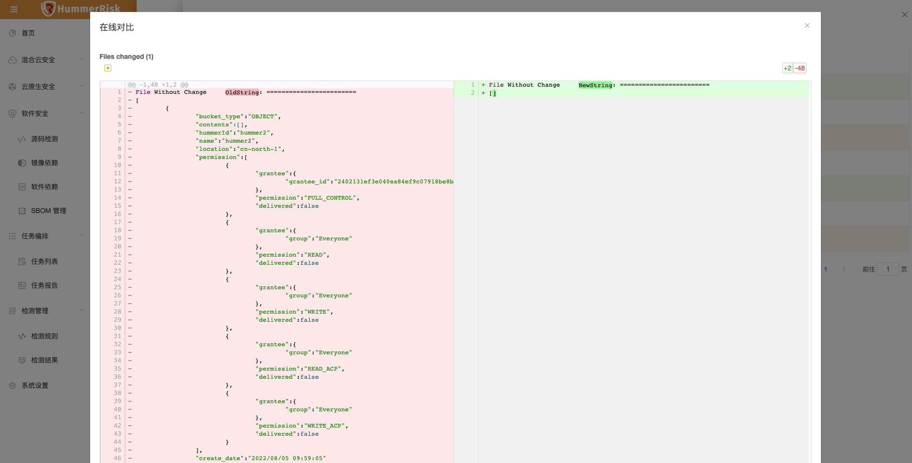

### 2.4 POM依赖

!!! abstract "POM依赖"
    优化 HummerRsik 的依赖包版本，删除无用的 log4j 包。

## 3 Bug修复 Bug Fixes

### 3.1 历史数据

!!! abstract "历史数据"
    修复历史数据列表版本对比展示问题。

### 3.2 检测规则

!!! abstract "检测规则"
    修复部分检测规则中存在中文引号的问题。

### 3.3 I18n翻译

!!! abstract "I18n翻译"
    修复大文本字段因翻译报错的问题。

### 3.4 路由转换

!!! abstract "路由转换"
    优化详情页跳转、遮罩覆盖、路由转换等问题。

### 3.5 菜单栏

!!! abstract "菜单栏"
    修复菜单栏滚动与全屏滚动的问题。
