## 1 新功能 Features

### 1.1 QingCloud 云账号规则

!!! info ""
    如下图所示，新增 QingCloud 青云检测规则，绑定 QingCloud 账号即可进行云安全合规检测。

> 绑定 QingCloud 账号, 即可执行安全合规检测。

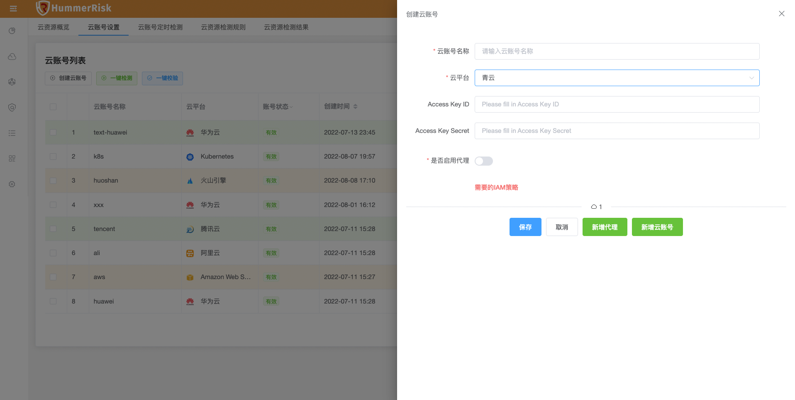{ width="95%" }
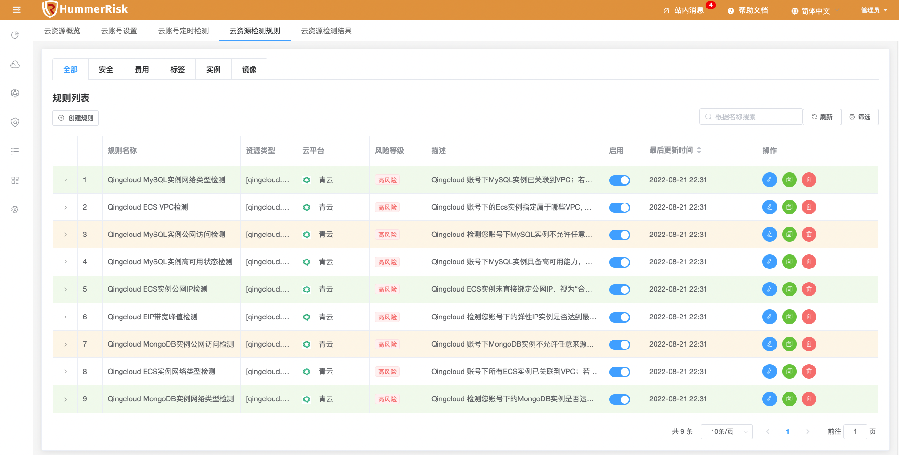{ width="95%" }

### 1.2 Ucloud 云账号规则

!!! info ""
    如下图所示，新增 Ucloud 优刻得检测规则，绑定 Ucloud 账号即可进行云安全合规检测。

> 绑定 Ucloud 账号, 即可执行安全合规检测。

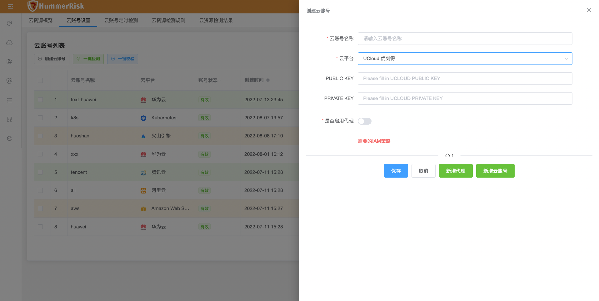{ width="95%" }
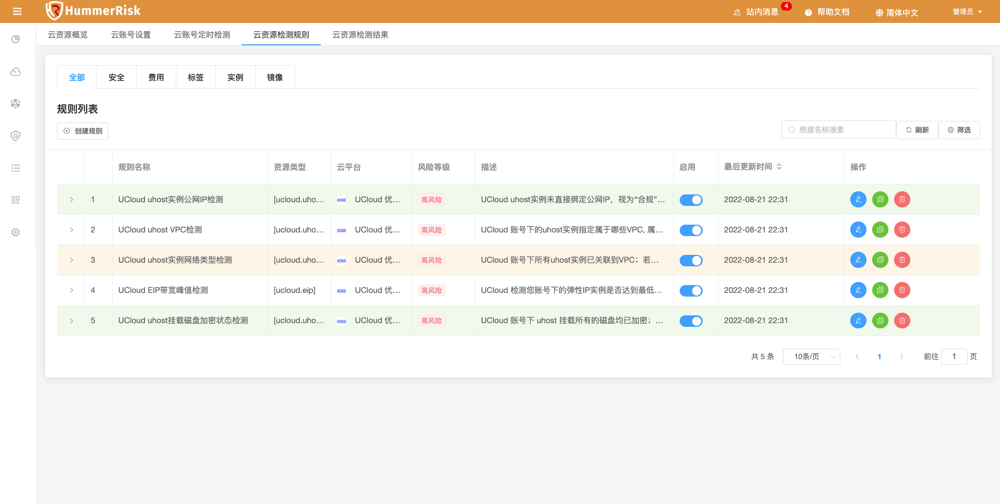{ width="95%" }

### 1.3 K8s 检测

!!! info ""
新增 K8s 配置与云原生 K8s 环境安全检测功能，绑定 K8s Url 与 Token 信息即可进行安全检测，并生成安全漏洞结果。

> 绑定 K8s 账号, 即可执行安全检测。

{ width="95%" }
{ width="95%" }

> 云原生检测结果列表，点击"统计按钮"进入详情列表，点击"状态按钮"查看日志与报告。

{ width="95%" }
{ width="95%" }
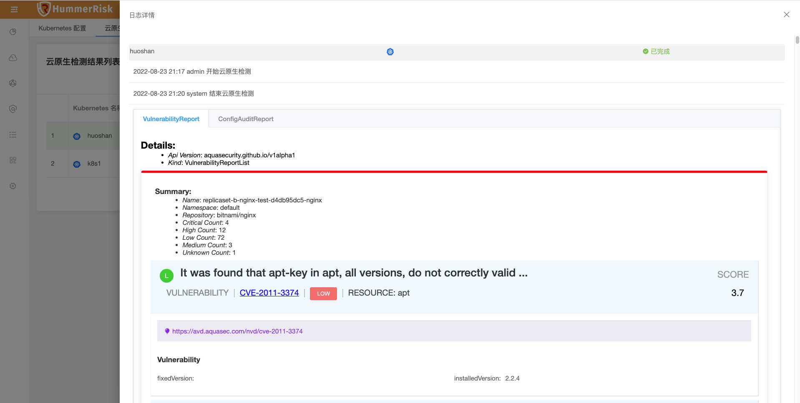{ width="95%" }
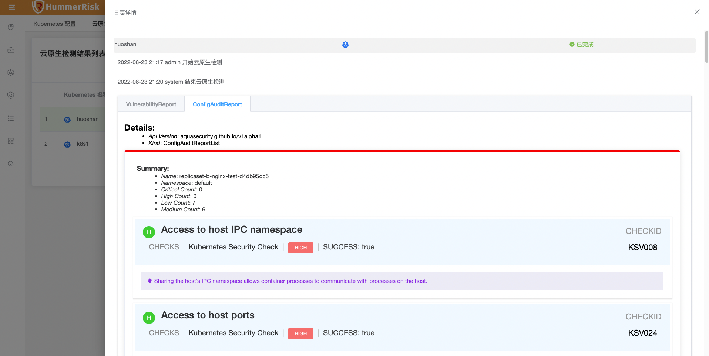{ width="95%" }

### 1.4 资源态势

!!! info ""
    如下图所示，新增资源态势功能，绑定 K8s 环境信息，即可获取 K8s 的 Namespace、Pod、Node、Deployment、Service 等20余种资源信息。

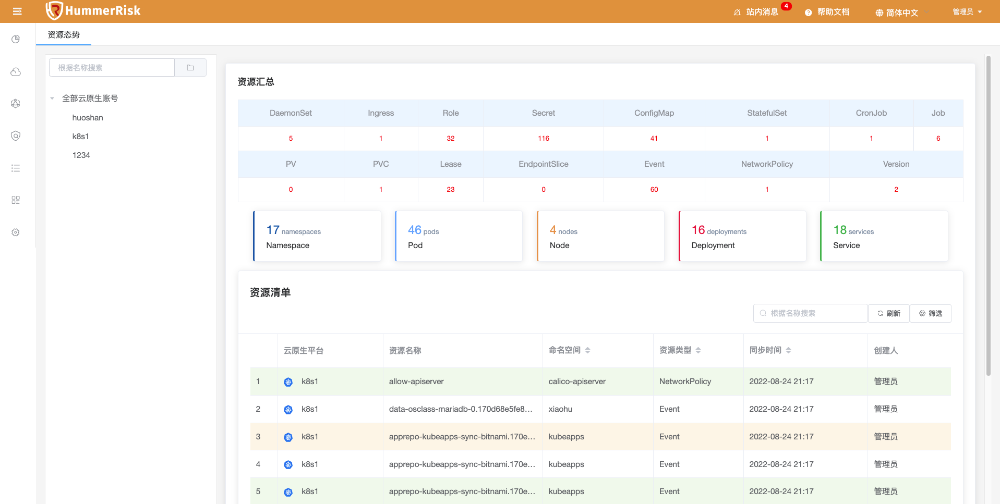{ width="95%" }

### 1.5 镜像检测

!!! info ""
    如下图所示，新增云原生镜像漏洞检测功能，镜像检测获取漏洞结果。

> 云原生镜像漏洞检测结果列表，点击"统计按钮"进入详情列表，点击"状态按钮"查看日志与报告。

{ width="95%" }
{ width="95%" }
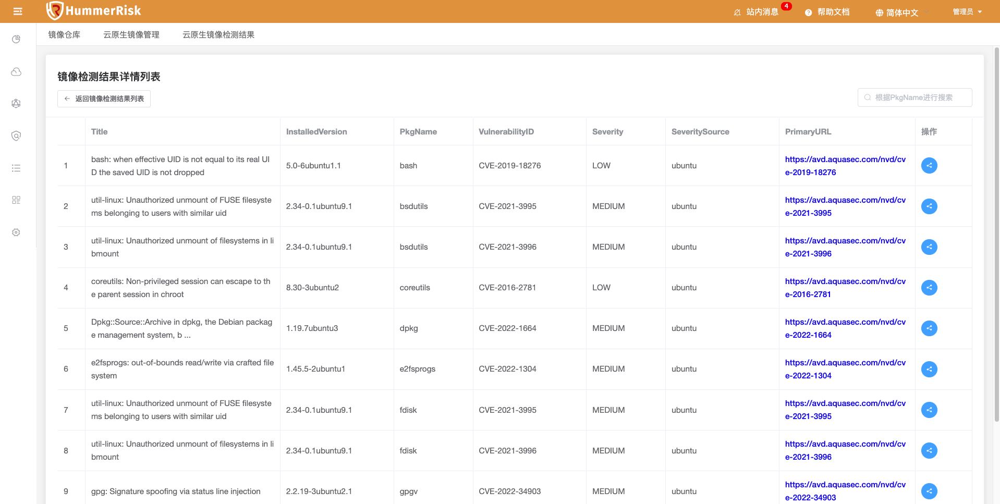{ width="95%" }
{ width="95%" }

### 1.6 K8s 部署检测

!!! info ""
    如下图所示，新增云原生部署检测功能，输入 K8s 部署配置 YAML 文件，即可进行部署检测，输出部署配置检测结果。

> K8s 部署检测结果列表，点击"统计按钮"进入详情列表，点击"状态按钮"查看日志与报告。

{ width="95%" }
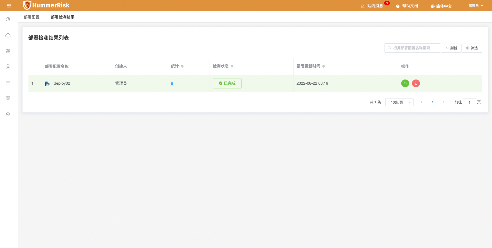{ width="95%" }
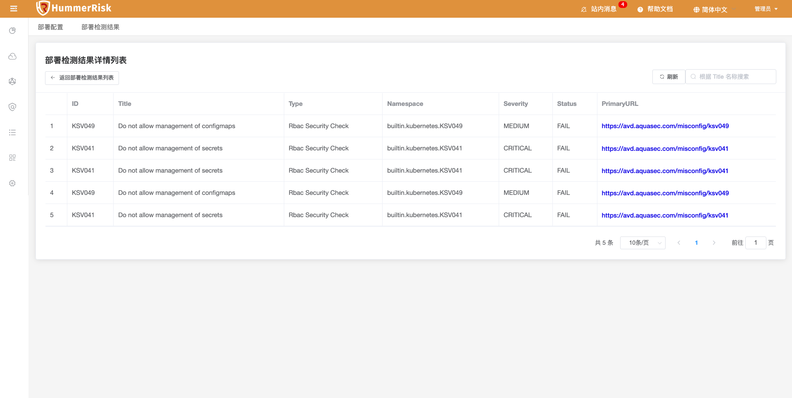{ width="95%" }
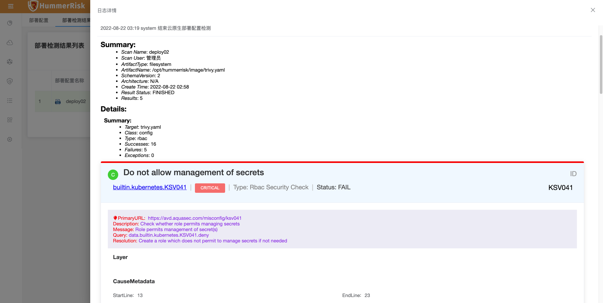{ width="95%" }

### 1.7 插件列表

!!! info ""
    如下图所示，系统设置，新增插件列表，展示云插件与云原生插件信息。

{ width="95%" }

## 2 性能优化 Optimization

### 2.1 镜像检测

!!! info ""
    优化云原生镜像检测，主要用于漏洞检测。区分开与软件镜像依赖检测，软件镜像依赖检测主要用于 SBOM 管理。

### 2.2 HttpClient

!!! info ""
    优化 HttpClient，解决 SSL 限制导致 API 调用不通的问题。

### 2.3 K8s 检测

!!! info ""
    优化 K8s 检测流程，获取 K8s 版本等信息。

### 2.4 历史数据

!!! info ""
    优化安全检测历史数据的留存。

## 3 Bug修复 Bug Fixes

### 3.1 执行日志

!!! info ""
    修复执行检测日志某些字段不够大导致的报错问题。

### 3.2 筛选条件

!!! info ""
    修复部分筛选条件为空或导致页面报错的问题。

### 3.3 镜像依赖

!!! info ""
    修复添加云原生镜像检测后，镜像依赖检测报错等问题。

### 3.4 目录菜单

!!! info ""
    优化因添加目录，导致菜单栏滚动条失效的问题。
