## 1 新功能 Features

### 1.1 源码检测

!!! info ""
    如下图所示，新增源码检测功能，添加 GitHub 或 GitLab 项目地址、branch 分支名称或 tag 标签名称或 commit 提交记录，即可进行源码安全检测。

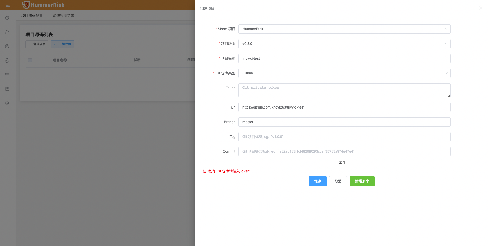{ width="900px" }
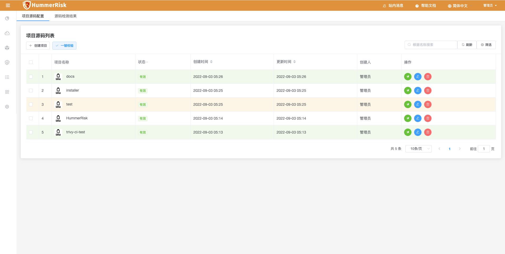{ width="900px" }

> 点击统计，查看具体检测详情信息。点击检测状态，查看检测日志与漏洞清单。

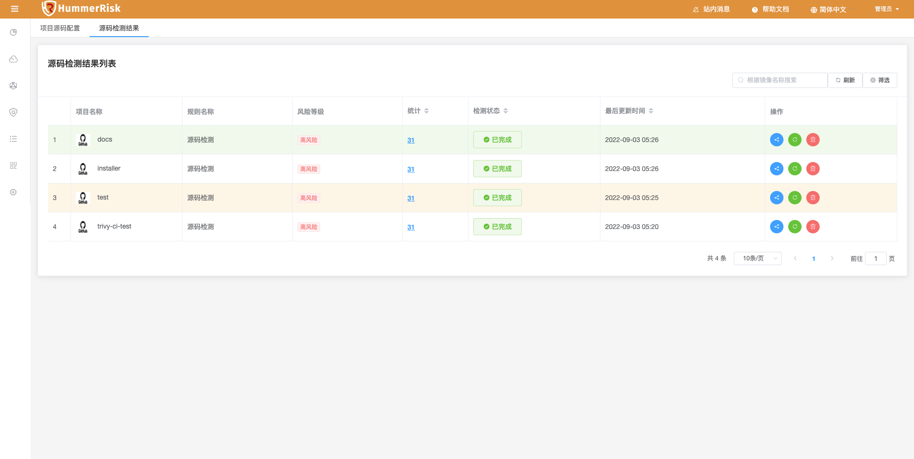{ width="900px" }
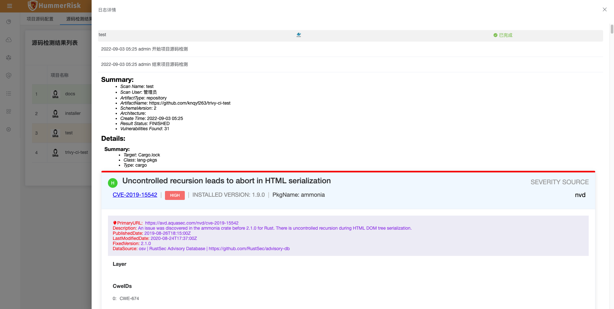{ width="900px" }
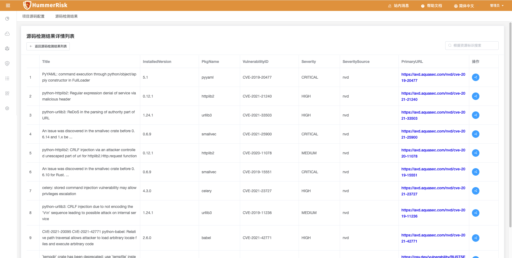{ width="900px" }

### 1.2 Sbom 管理

!!! info ""
    如下图所示，新增 Sbom 管理功能，Sbom 管理源码、镜像和软件包的项目和版本，最终根据检测结果生成分析报告并进行下载。

> 创建项目与项目版本。

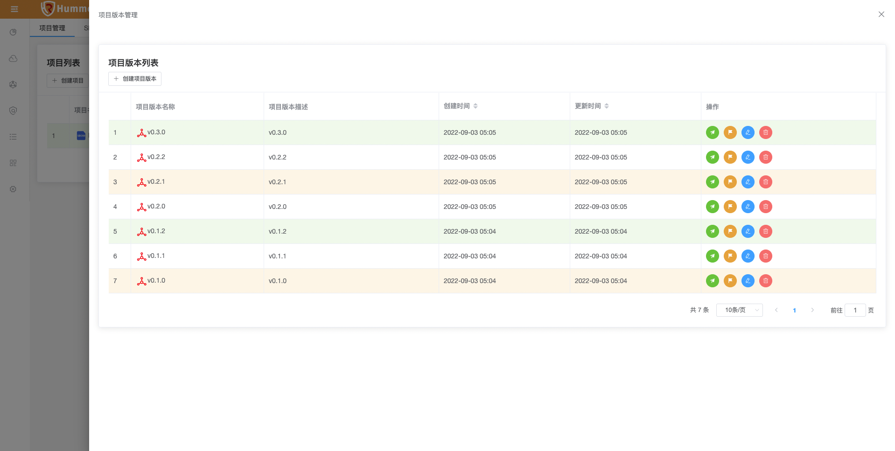{ width="900px" }

> 可以在 Sbom 管理界面绑定检测资源，也可以在每个检测菜单创建资源时绑定 Sbom 的项目。

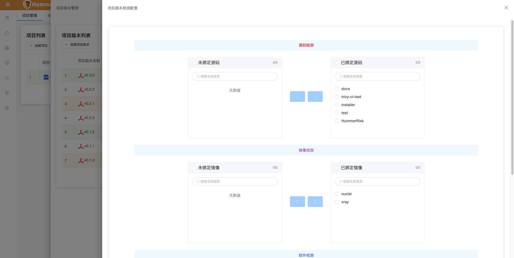{ width="900px" }

> 最终根据检测结果生成统计分析报告，并进行下载。

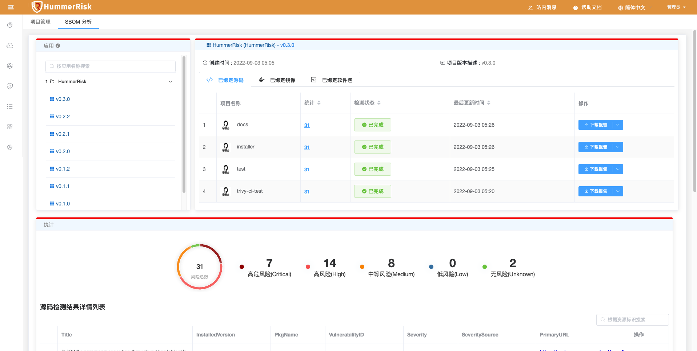{ width="900px" }

### 1.3 镜像仓库

!!! info ""
    如下图所示，新增镜像仓库 Harbor 对接功能，绑定 HarBor 镜像仓库自动获取镜像列表。

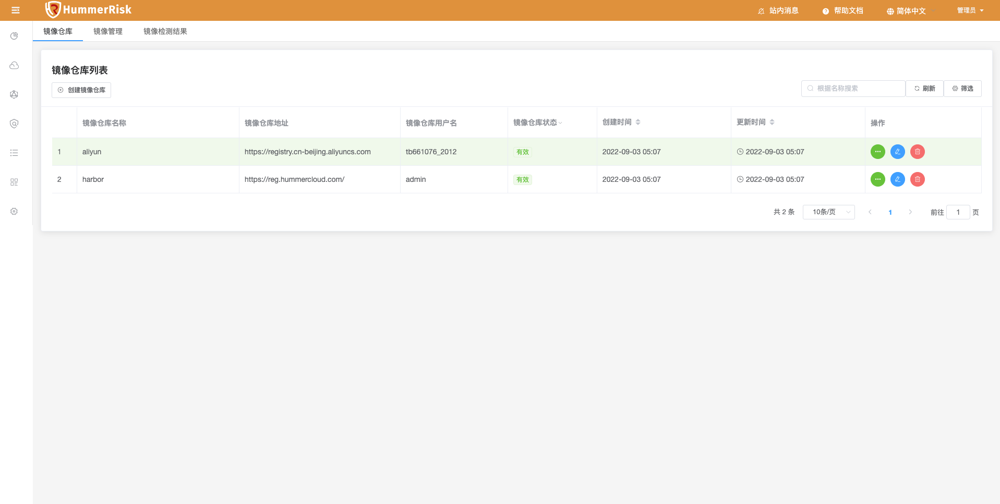{ width="900px" }
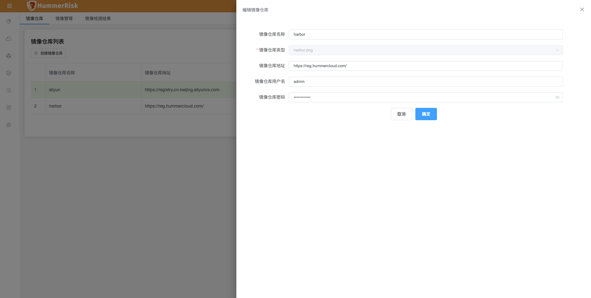{ width="900px" }
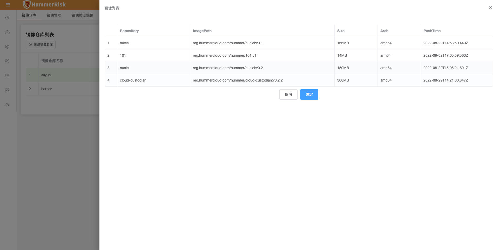{ width="900px" }
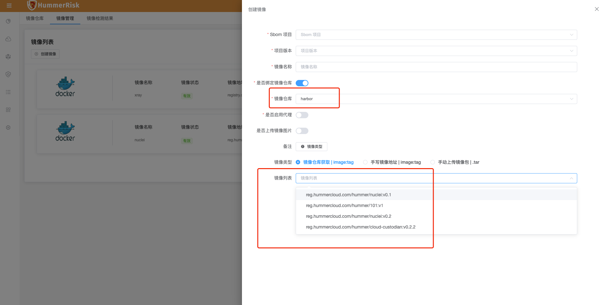{ width="900px" }

### 1.4 操作审计

!!! info ""
    如下图所示，新增操作审计功能，根据公有云账号，同步获取资源操作事件日志。

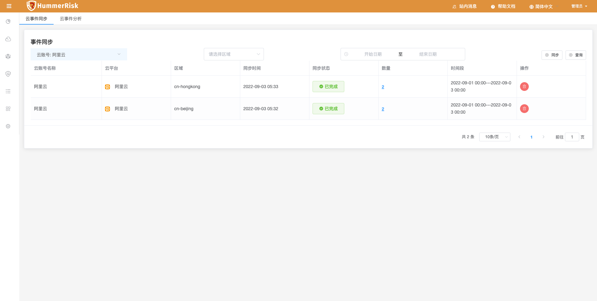{ width="900px" }
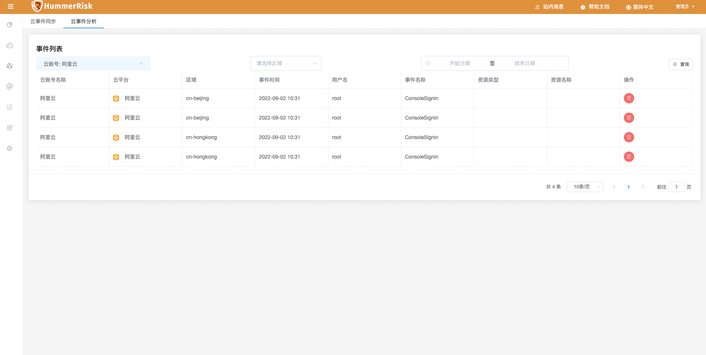{ width="900px" }

## 2 性能优化 Optimization

### 2.1 K8s 检测

!!! info ""
    优化云原生 K8s 账号绑定时，需要在 K8s 环境中添加 operator 的提示，并且增加 operator 安装状态检测功能。

### 2.2 首页

!!! info ""
    修改首页内容，新增云原生检测、部署检测、源码检测数据展示。

### 2.3 任务编排

!!! info ""
    优化任务编排，新增源码检测类型。

### 2.4 ICON图库

!!! info ""
    优化目录结构和 icon 图库。

## 3 Bug修复 Bug Fixes

### 3.1 镜像检测

!!! info ""
    修复镜像检测结果漏洞列表数据。

### 3.2 部署检测

!!! info ""
    修复部署检测 Yaml 文件为多脚本时校验失败的问题。

### 3.3 pom

!!! info ""
    修复包版本冲突的问题。

### 3.4 Dockerfile

!!! info ""
    优化分解 Dockerfile 文件，基础镜像单独提取。
