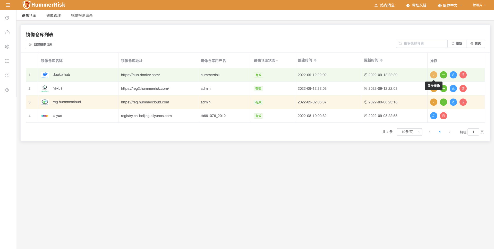
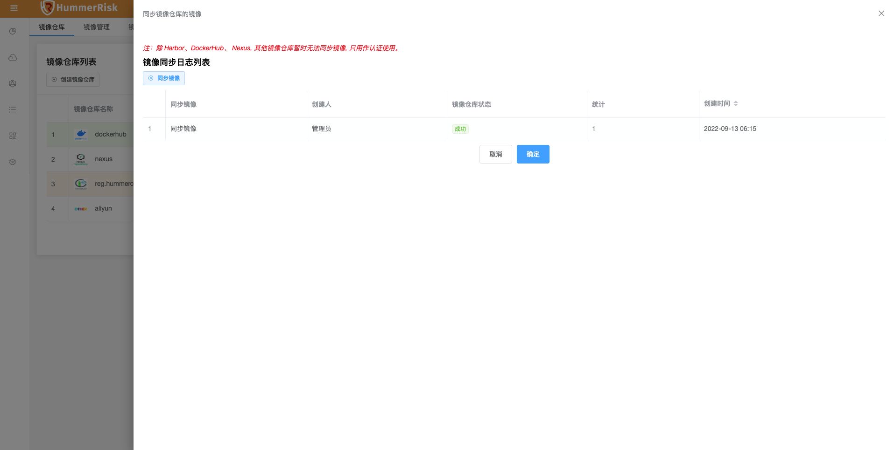
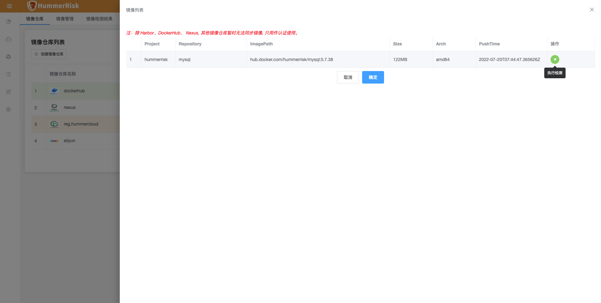
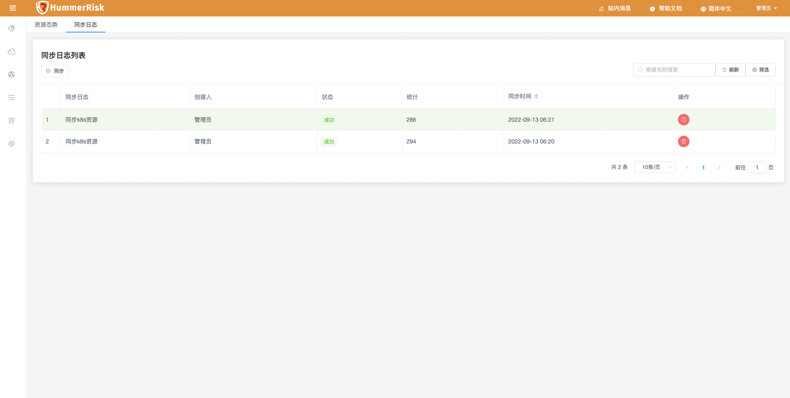
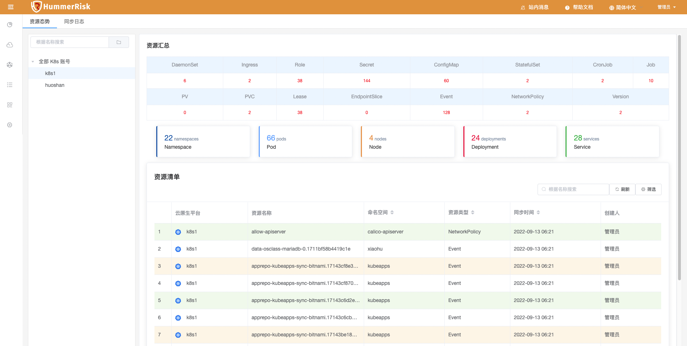
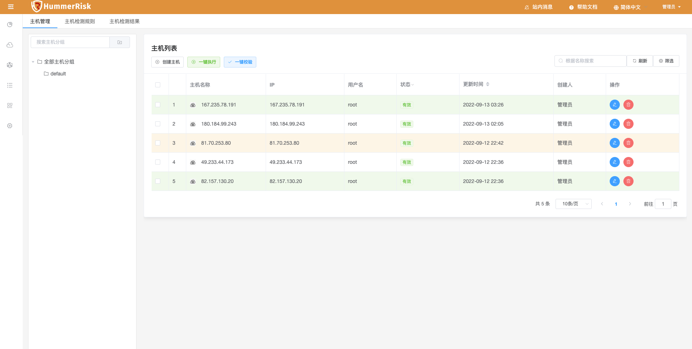
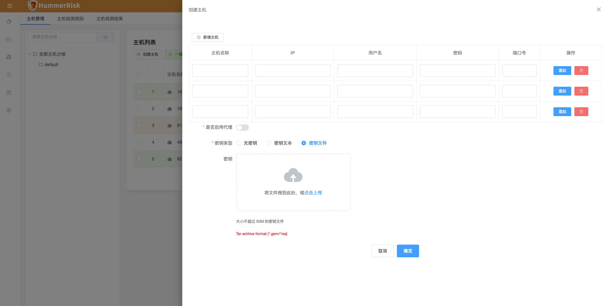
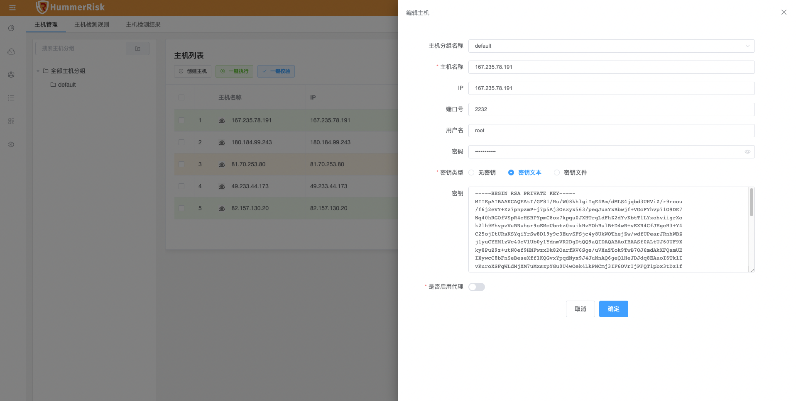
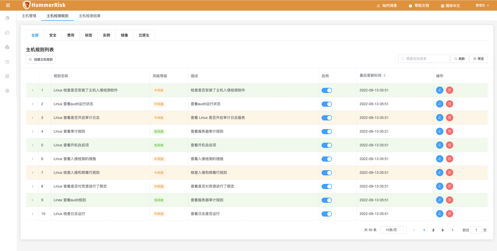

## 1 新功能 Features

### 1.1 镜像检测

!!! abstract "镜像检测"
    如下图所示，新增 dockerhub、nexus 镜像仓库认证，手动同步仓库镜像，并且可以一键快速执行镜像检测。

{ width="95%" }
{ width="95%" }
{ width="95%" }

### 1.2 资源态势

!!! abstract "资源态势"
    如下图所示，新增 K8s 资源态势同步日志功能，手动同步 K8s 资源。

{ width="95%" }
{ width="95%" }

### 1.3 主机检测

!!! abstract "主机检测"
    如下图所示，新增密钥认证，新增 Ubuntu 等操作系统 ssh 连接。

{ width="95%" }
{ width="95%" }
{ width="95%" }

### 1.4 主机检测

!!! abstract "主机检测"
    如下图所示，新增主机检测规则，绑定主机后一键检测获取结果。

{ width="95%" }

## 2 性能优化 Optimization

### 2.1 K8s 检测

!!! abstract "K8s 检测"
    新增 K8s 账号类型：Rancher、KubeSphere，绑定账号后一键检测。

### 2.2 软件检测

!!! abstract "软件检测"
    优化软件检测、镜像检测，合并到云原生安全里，去除软件包检测。

### 2.3 操作审计

!!! abstract "操作审计"
    优化操作审计：云事件同步与云事件查询功能。

### 2.4 执行检测

!!! abstract "执行检测"
    优化执行安全检测过程，抽象执行过程为 Hummer Plugin。

## 3 Bug修复 Bug Fixes

### 3.1 镜像检测

!!! abstract "镜像检测"
    修复镜像检测结果被覆盖的问题。

### 3.2 操作审计

!!! abstract "操作审计"
    修复不支持多区域同时同步的问题。

### 3.3 主机检测

!!! abstract "主机检测"
    修复新增主机不支持添加密钥的问题。

### 3.4 首页

!!! abstract "首页"
    优化首页显示数据不正确的问题。
