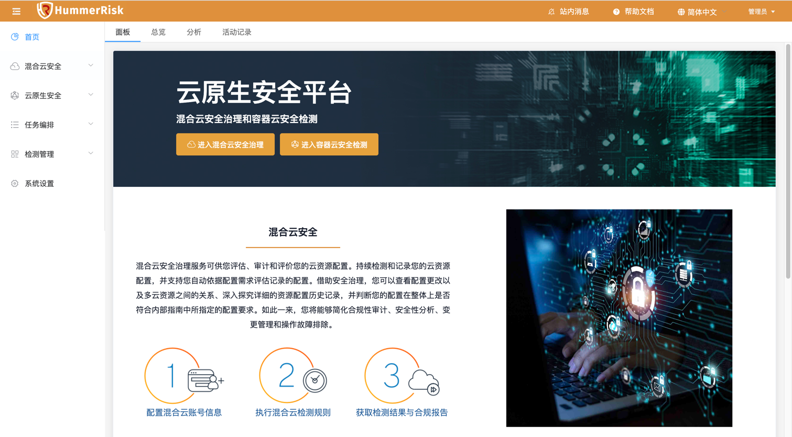
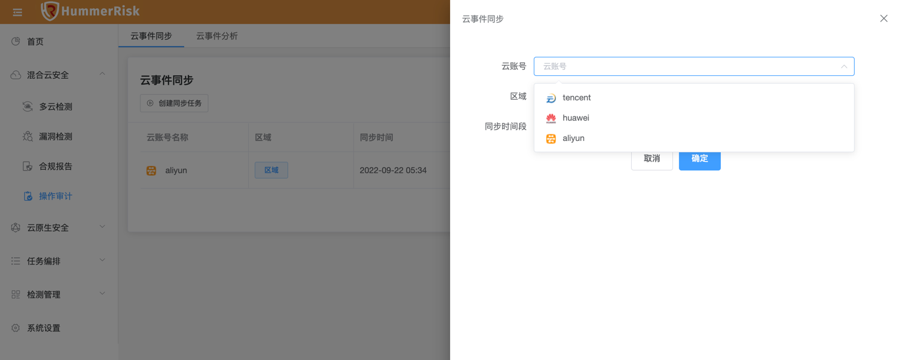
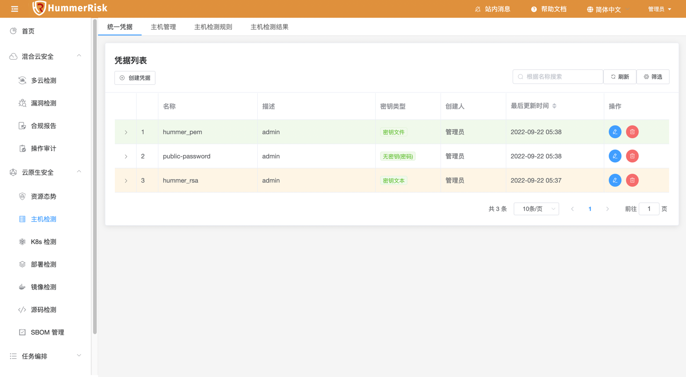
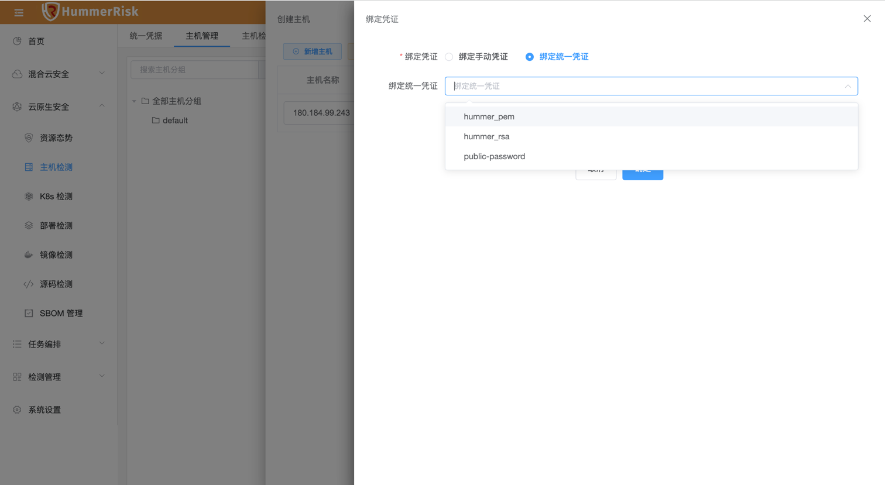
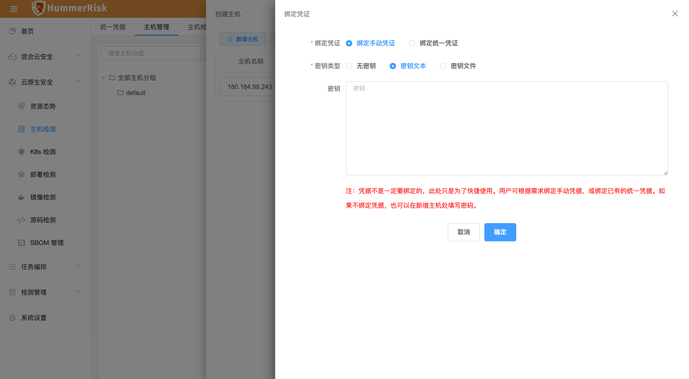
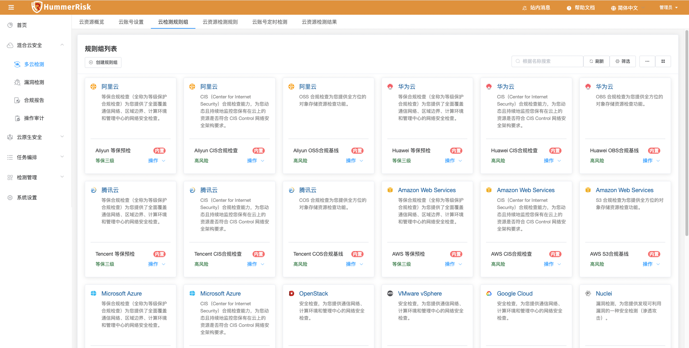
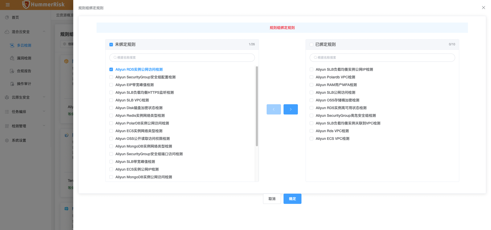
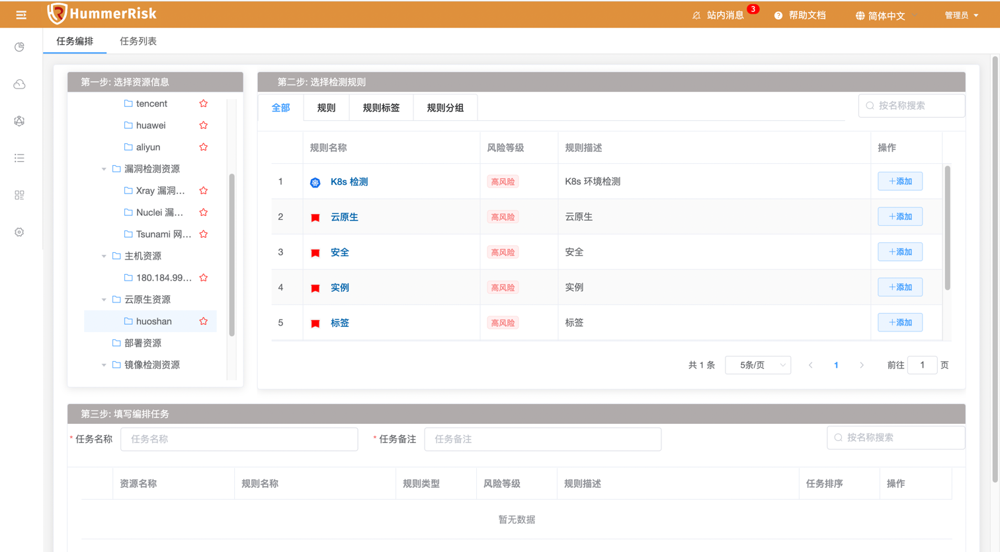

## 1 新功能 Features

### 1.1 首页面板

!!! info ""
    如下图所示，新增首页面板，登录访问直接到面板，可快速进入混合云安全与云原生安全模块。

{ width="900px" }

### 1.2 操作审计

!!! info ""
    如下图所示，新增华为云、腾讯云平台事件日志信息同步，并且按事件的风险等级分类。

{ width="900px" }
{ width="900px" }

### 1.3 统一凭证

!!! info ""
    如下图所示，新增主机认证统一凭证，新建、修改主机信息时，可灵活绑定凭证，凭证由密码或密钥组成。

{ width="900px" }
{ width="900px" }
{ width="900px" }

### 1.4 检测规则

!!! info ""
    如下图所示，新增云资源检测规则组，符合多场景检测任务，规则组可自由配置绑定检测规则。

{ width="900px" }
{ width="900px" }

## 2 性能优化 Optimization

### 2.1 任务编排

!!! info ""
    新增任务编排类型: K8s 检测和部署检测。

{ width="900px" }

### 2.2 首页

!!! info ""
    优化首页Top数据展示，新增 K8s 检测数据和部署检测数据。

### 2.3 检测规则

!!! info ""
    优化检测规则与规则组，新增多条件筛选过滤，规则组可自行绑定规则，内置规则不允许编辑。

### 2.4 检测结果

!!! info ""
    优化检测结果，新增进度条实时展示数据。新增检测结果详情，可多维度查看检测资源信息。

{ width="900px" }
{ width="900px" }

### 2.5 检测结果

!!! info ""
    优化云原生安全检测结果，新增风险等级展示。

{ width="900px" }

### 2.6 菜单栏

!!! info ""
    优化登录侧菜单栏默认展开，并且刷新页面由之前的状态决定，上次是展开刷新依旧展开，反之亦然。

### 2.7 镜像仓库

!!! info ""
    优化镜像仓库类型，新增 Harbor 1.0 版本的同步功能。

### 2.8 镜像检测

!!! info ""
    优化检测结果，去除无效的 unfixed 结果。

## 3 Bug修复 Bug Fixes

### 3.1 镜像管理

!!! info ""
    修复镜像异步上传tar包报错我问题。

### 3.2 镜像检测

!!! info ""
    去除grype类型镜像检测，只保留trivy，去除dependency-check软件包检测。

### 3.3 主机检测

!!! info ""
    修复新增主机不支持添加密钥的问题。

### 3.4 源码检测

!!! info ""
    修复源码检测页面弹出空指针错误。

### 3.5 一键检测

!!! info ""
    修复云资源一键检测选择规则组后页面等待时间过长的问题。

### 3.6 镜像检测

!!! info ""
    修复镜像绑定页面，字段过长不折行的问题。

### 3.7 镜像仓库

!!! info ""
    修复镜像仓库同步的镜像列表，某些字段为空的问题。
