## 1 新功能 Features

### 1.1 云资源态势

!!! info ""
    如下图所示，新增云资源态势功能，根据云账号同步云资源，进行资源汇总。

{ width="900px" }
{ width="900px" }

### 1.2 云资源态势

!!! info ""
    如下图所示，新增云资源拓扑图功能，根据同步云资源汇总信息，形成拓扑图。

{ width="900px" }
{ width="900px" }

### 1.3 云检测规则组

!!! info ""
    如下图所示，新增阿里云最佳实践规则组，新增规则组直接快速检测功能。

{ width="900px" }
{ width="900px" }

### 1.4 云检测规则

!!! info ""
    如下图所示，新增 UCloud 、 Aliyun 云检测规则。

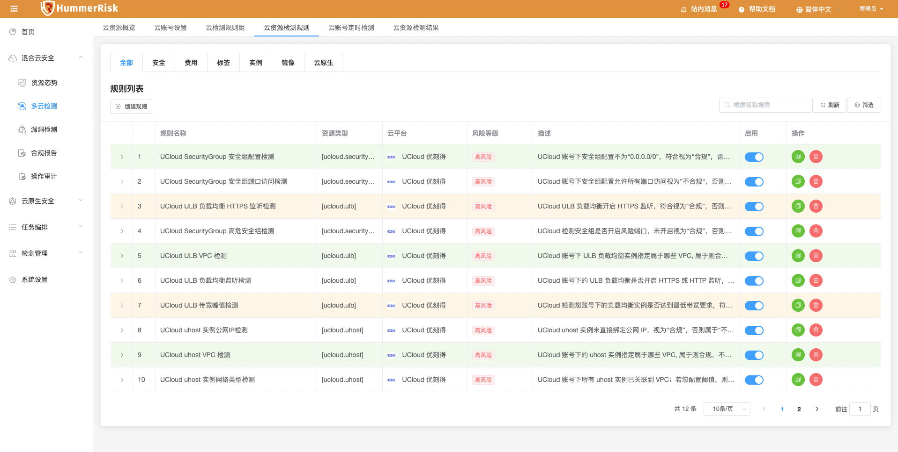{ width="900px" }

### 1.5 云检测结果

!!! info ""
    如下图所示，新增云资源检测优化建议功能，根据检测规则跳转优化建议页面。

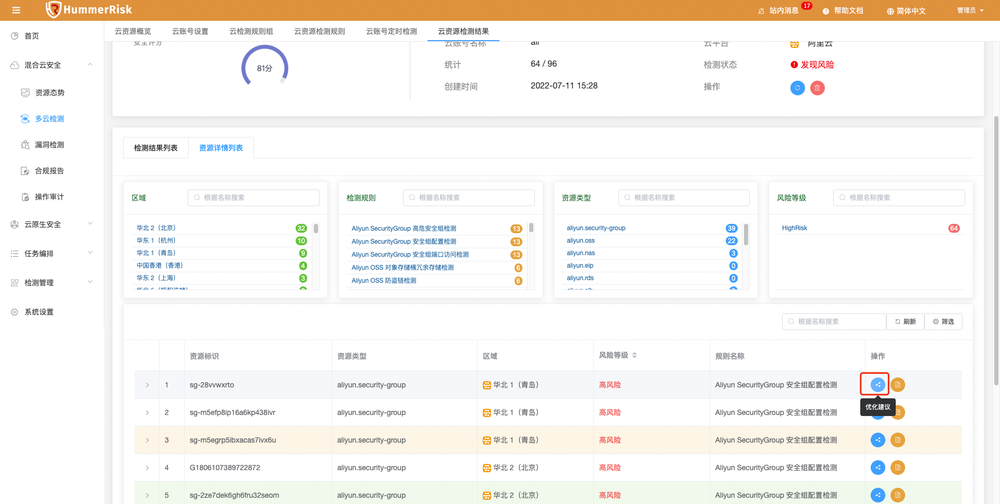{ width="900px" }

### 1.6 操作审计

!!! info ""
    如下图所示，新增操作审计概览、云事件聚合功能。

{ width="900px" }
{ width="900px" }

### 1.7 源码检测

!!! info ""
    如下图所示，新增源码概览、源码检测历史记录、历史检测数据对比、下载检测报告功能。

{ width="900px" }
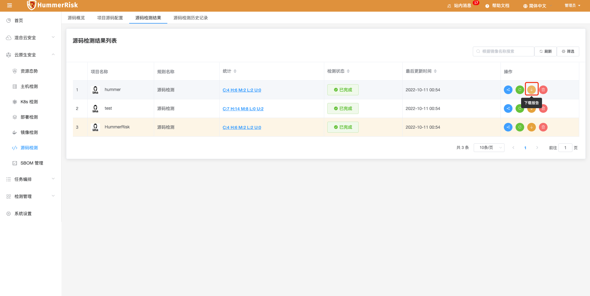{ width="900px" }
{ width="900px" }
{ width="900px" }

### 1.8 部署检测

!!! info ""
    如下图所示，新增部署概览、部署检测历史记录、历史检测数据对比、下载检测报告功能。

{ width="900px" }
{ width="900px" }
{ width="900px" }
{ width="900px" }
{ width="900px" }

### 1.9 镜像检测

!!! info ""
    如下图所示，新增镜像概览、镜像检测历史记录、历史检测数据对比、下载检测报告功能。

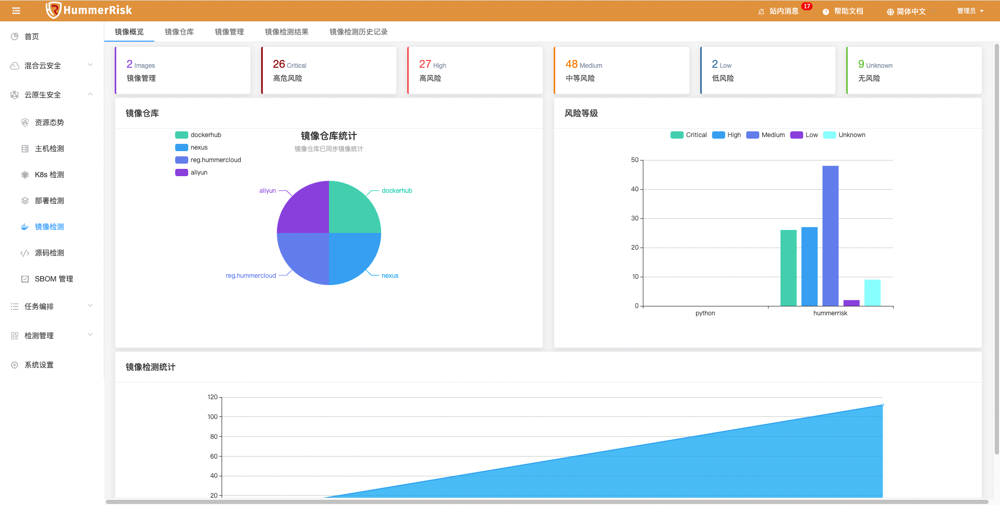{ width="900px" }
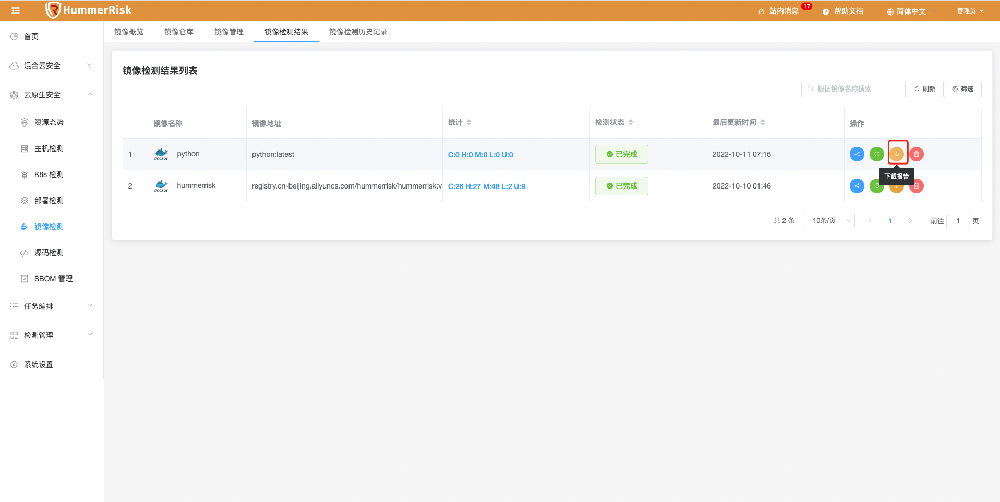{ width="900px" }
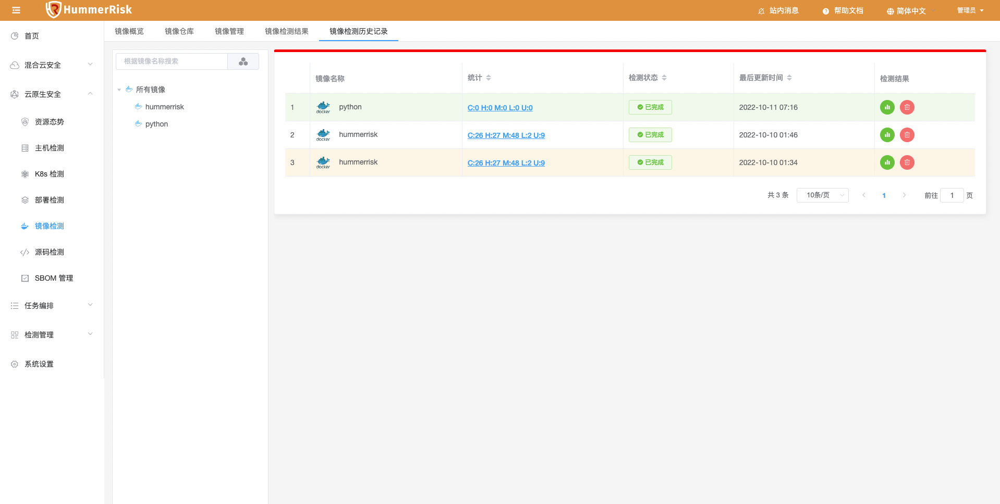{ width="900px" }
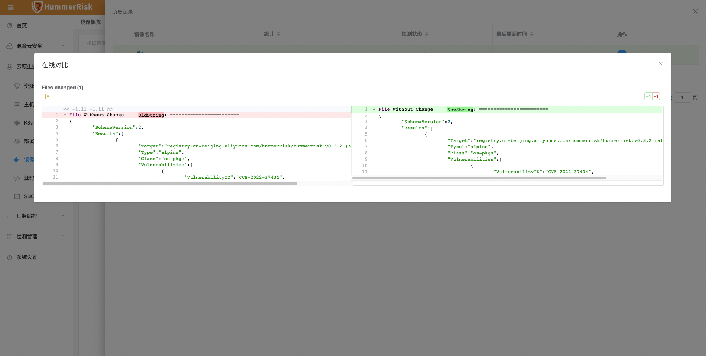{ width="900px" }

### 1.10 主机检测

!!! info ""
    如下图所示，新增主机概览、主机检测历史记录、历史检测数据对比功能。

{ width="900px" }
{ width="900px" }
{ width="900px" }

### 1.11 K8s 检测

!!! info ""
    如下图所示，新增 K8s 概览、K8s 检测历史记录、历史检测数据对比、下载检测报告功能。

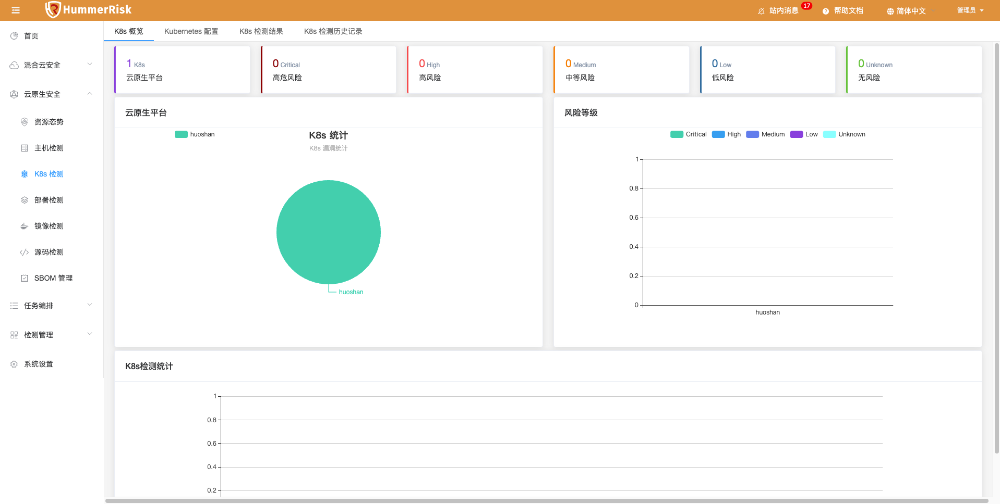{ width="900px" }
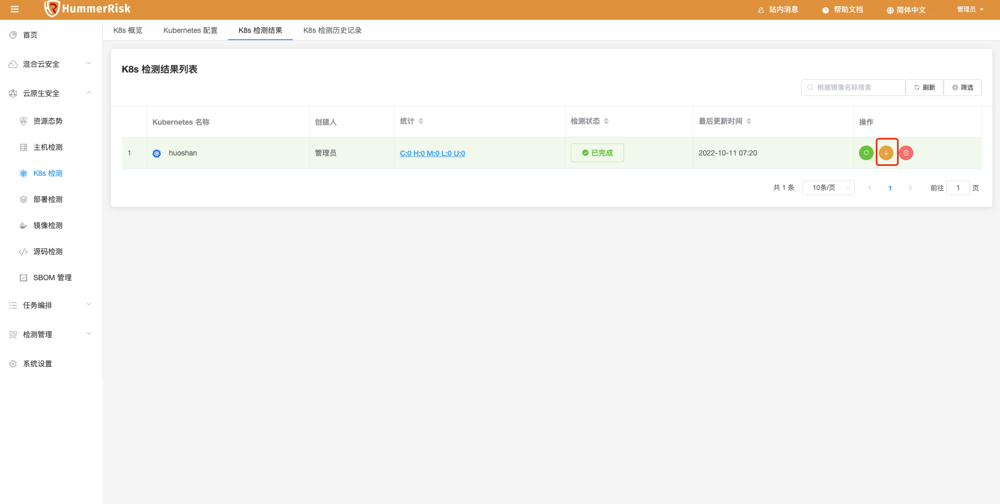{ width="900px" }
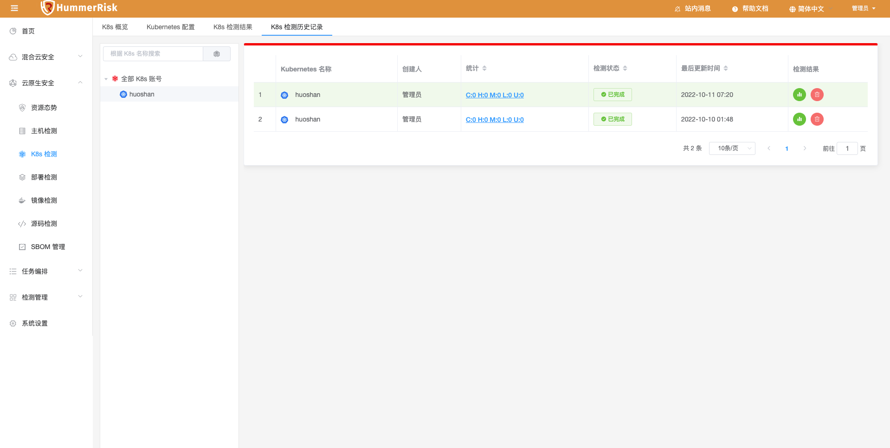{ width="900px" }

### 1.12 K8s 资源态势

!!! info ""
    如下图所示，新增 K8s 资源拓扑图功能，根据同步 K8s 资源汇总信息，形成拓扑图。

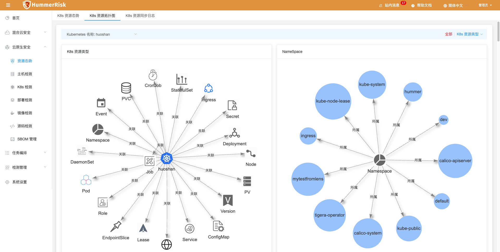{ width="900px" }

### 1.13 HummerRisk 安装

!!! info ""
    如下图所示，新增 K8s 安装部署 HummerRisk。

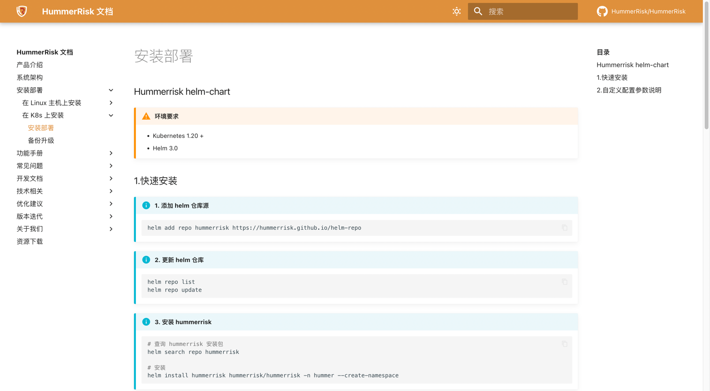{ width="900px" }

## 2 性能优化 Optimization

### 2.1 多云检测

!!! info ""
    优化云账号一键检测，提升检测效率与检测速度。

### 2.2 版本升级

!!! info ""
    升级 pom 依赖包版本，升级 spring-boot 和 jdk 等版本。

### 2.3 检测规则组

!!! info ""
    优化规则组展示顺序与样式。

### 2.4 主机检测

!!! info ""
    优化主机检测规则，维护有状态检测结果。

### 2.5 站内消息

!!! info ""
    站内消息通知，添加k8s、镜像、源码检测等类型。

### 2.6 树结构

!!! info ""
    优化所有页面树结构展示样式与数据结构。

### 2.7 i18n

!!! info ""
    优化前后端数据翻译展示。

## 3 Bug修复 Bug Fixes

### 3.1 主机检测

!!! info ""
    修复主机检测只有密码时报错不了的问题。

### 3.2 主机检测

!!! info ""
    解决 server 主机凭证数据没有及时刷新，选择不到的问题。

### 3.3 源码检测

!!! info ""
    解决源码检测，连接 github 仓库时，无法自己修改分支名称。

### 3.4 sbom 分析

!!! info ""
    解决 sbom 分析里，镜像检测结果详情显示字段不正确的问题。

### 3.5 sbom 分析

!!! info ""
    修复 sbom 列表字段展示问题。

### 3.6 云资源检测

!!! info ""
    解决分组检测重复检测的问题。

### 3.7 漏洞检测

!!! info ""
    修改国家信息安全漏洞库网址(旧址换新址)。

### 3.8 漏洞检测

!!! info ""
    修复漏洞检测概览数据显示不正确的问题，解决漏洞检测报错的问题。
