## 1 新功能 Features

### 1.1 文件检测

!!! abstract "文件检测"
    如下图所示，新增依赖文件检测功能，手动添加项目依赖文件(单独文件或包含依赖文件的压缩包zip或tar)，例如：pom.xml、package.json、yarn.lock、pnpm.yaml等，检测依赖项的漏洞风险等信息。

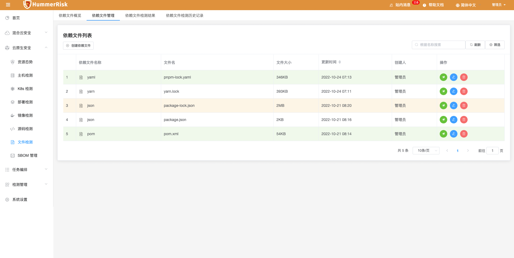{ width="95%" }
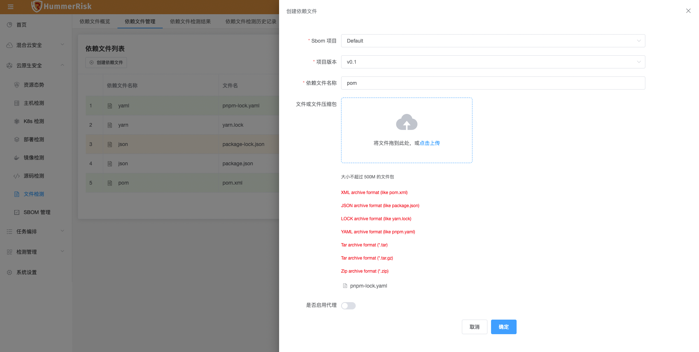{ width="95%" }
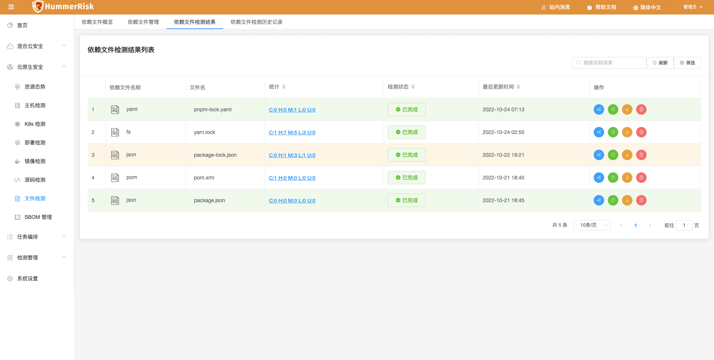{ width="95%" }
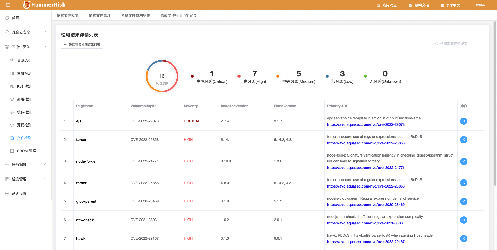{ width="95%" }
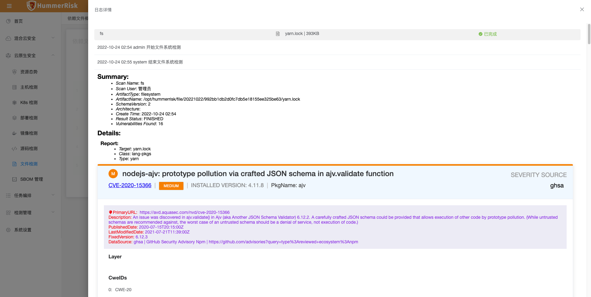{ width="95%" }
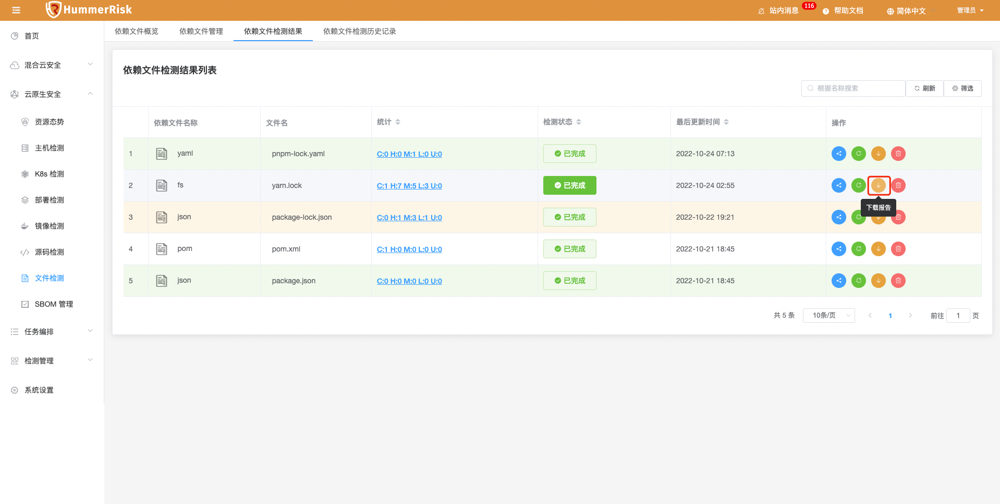{ width="95%" }
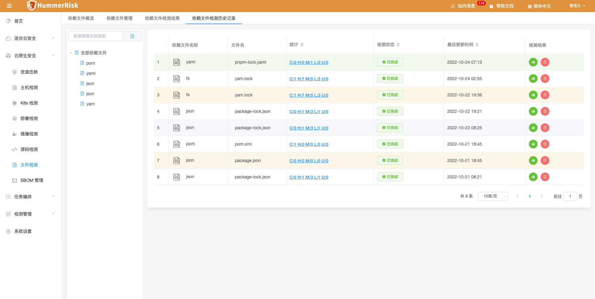{ width="95%" }
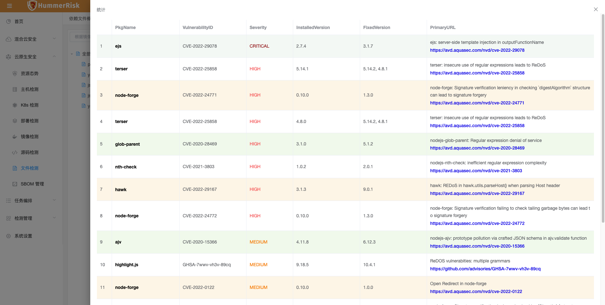{ width="95%" }
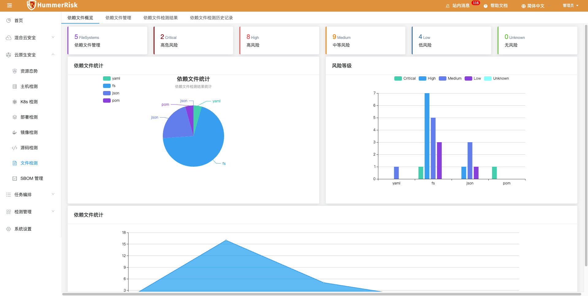{ width="95%" }

### 1.2 多云检测

!!! abstract "多云检测"
    如下图所示，新增 AWS 检测规则组与规则，实现具体等保合规、CIS、最佳实践等场景的检测。

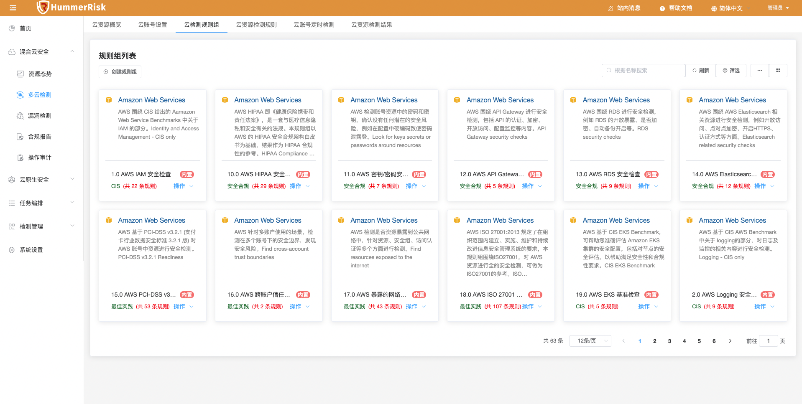{ width="95%" }
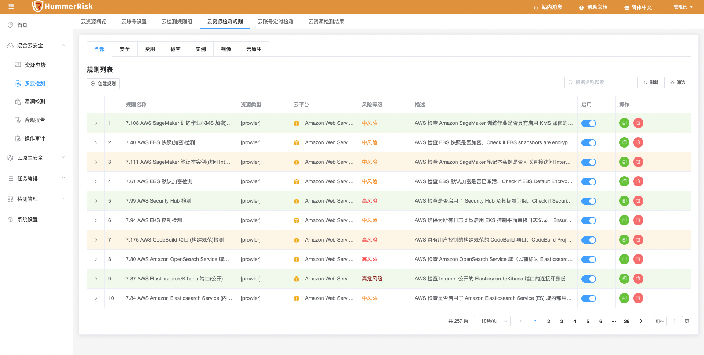{ width="95%" }
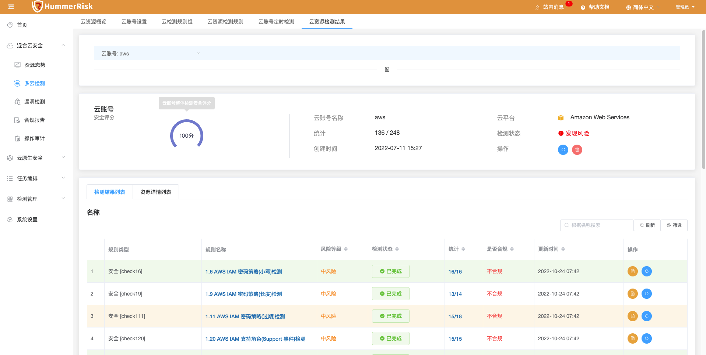{ width="95%" }

### 1.3 资源态势

!!! abstract "资源态势"
    如下图所示，新增云资源态势页面的资源清单，关联已检测的不合规的结果，可以快速查看同步的资源哪些有风险。

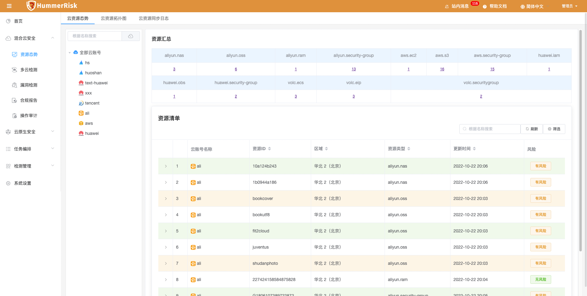{ width="95%" }
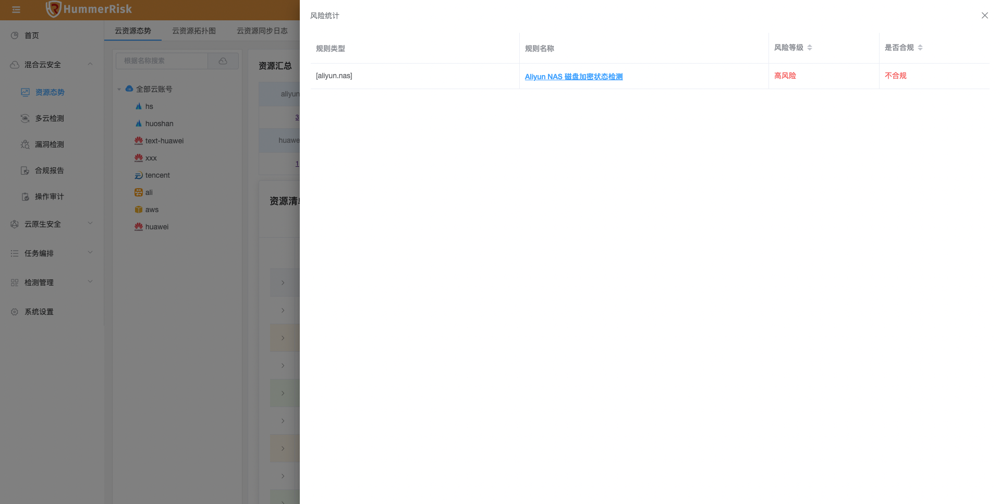{ width="95%" }

### 1.4 sbom 管理

!!! abstract "sbom 管理"
    如下图所示，sbom管理里添加文件系统检测，历史数据展示，报告下载等功能。

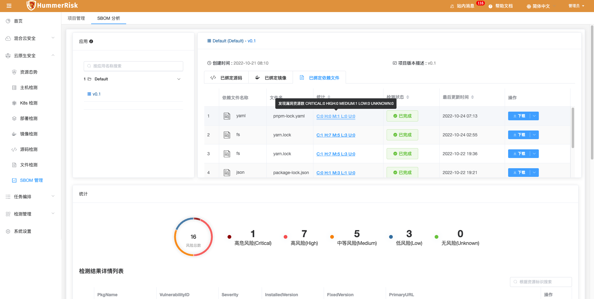{ width="95%" }

## 2 性能优化 Optimization

### 2.1 K8s 检测

!!! abstract "K8s 检测"
    优化 k8s 字段提示和页面 textarea 展示。

### 2.2 K8s 检测

!!! abstract "K8s 检测"
    优化 k8s valite 校验提示显示。

### 2.3 任务编排

!!! abstract "任务编排"
    优化 task 任务编排，新增 fs 文件检测类型。

### 2.4 任务报告

!!! abstract "任务报告"
    优化任务报告，新增 fs 文件检测结果类型。

### 2.5 关于

!!! abstract "关于"
    优化关于菜单，优化弹出框展示信息。

### 2.6 主机管理

!!! abstract "主机管理"
    优化批量添加主机，绑定凭证。

## 3 Bug修复 Bug Fixes

### 3.1 项目依赖

!!! abstract "项目依赖"
    升级前后端依赖版本，解决 warning 提示。

### 3.2 多云检测

!!! abstract "多云检测"
    解决华为云校验报错的问题。

### 3.3 镜像检测

!!! abstract "镜像检测"
    修复编辑页面二级下拉菜单没有初始值的问题。

### 3.4 多云检测

!!! abstract "多云检测"
    修复云检测和漏洞检测，筛选条件查询下拉列表值的问题。

### 3.5 合规报告

!!! abstract "合规报告"
    修改云资源合规报告，标签过多时显示问题，修改查询风险条例与检测规则组关联关系。

### 3.6 检测日志

!!! abstract "检测日志"
    优化 log 操作描述为文本字段，防止存储报错信息过长报错。

### 3.7 检测详情

!!! abstract "检测详情"
    修改各个检测结果日志详情样式，跟随风险等级变化。

### 3.8 镜像管理

!!! abstract "镜像管理"
    修改镜像管理，镜像地址、名称等长度过长折行的问题。
