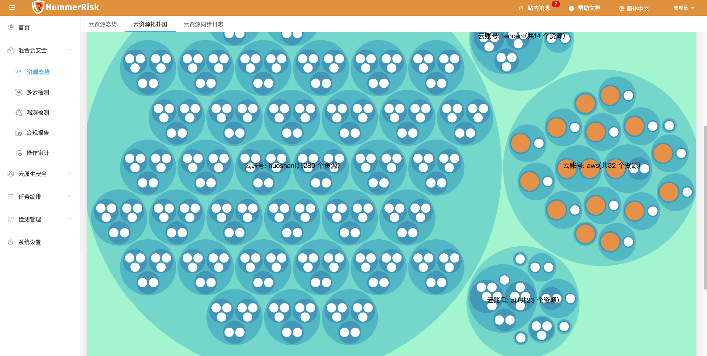
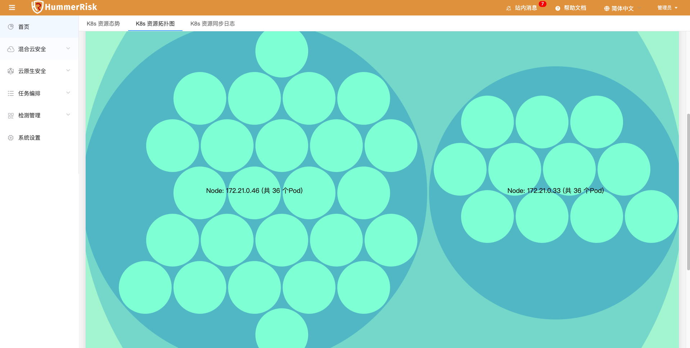
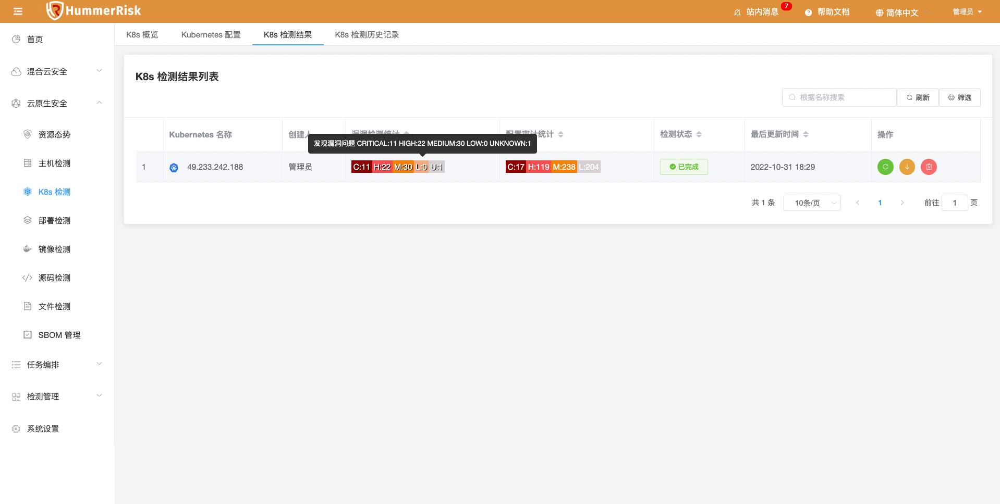
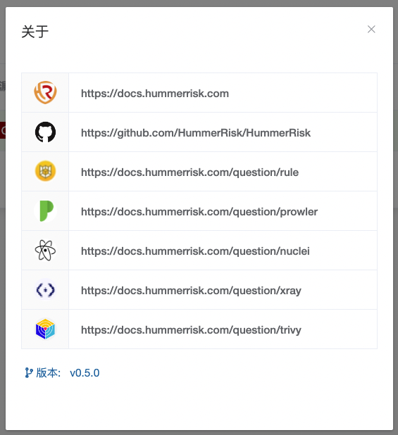

## 1 新功能 Features

### 1.1 合规报告

!!! abstract "合规报告列表"
    如下图所示，新增云资源检测合规报告，按已检测规则组分类，可查看/下载云资源合规报告。

{ width="95%" }

!!! tip "下载云账号整体合规报告"
    如下图所示，下载云账号整体合规报告。选择一个以上的云账号进行合并下载。

{ width="95%" }
    
!!! tip "展示"
    报告以 Excel 形式展示：

{ width="95%" }

!!! tip "检测报告详情"
    如下图所示，报告详情展示检测内容与风险数据，下方显示不合规的资源列表和风险条例列表。
{ width="95%" }
{ width="95%" }
{ width="95%" }

!!! tip "检测规则列表"
    如下图所示，规则列表展示检测的规则组里面具体检测了什么规则。
{ width="95%" }

### 1.2 主机检测

!!! abstract "主机检测"
    如下图所示，新增主机复制功能，实现快速添加类似的主机的操作动作。
{ width="95%" }
{ width="95%" }

### 1.3 主机规则

!!! abstract "主机规则"
    如下图所示，新增主机检测规则，满足针对主机风险的安全检测需求。
{ width="95%" }

### 1.4 云资源态势

!!! abstract "云资源态势"
    如下图所示，云资源清单列表新增风险关联功能，利用云账号同步的资源与安全合规检测的资源做关联，达到查看整体资源与风险资源的目的。
{ width="95%" }

## 2 性能优化 Optimization

### 2.1 云资源拓扑图

!!! abstract "云资源拓扑图"
    优化云资源拓扑图，可以查看已检测资源是否存在安全风险。
{ width="95%" }

### 2.2 K8s 资源拓扑图

!!! abstract "K8s 资源拓扑图"
    优化 K8s 资源拓扑图，采用 D3 类型，分为节点视角、命名空间视角、资源视角。
{ width="95%" }

### 2.3 检测结果

!!! abstract "检测结果"
    优化检测结果列表展示漏洞个数的样式。
{ width="95%" }

### 2.4 关于

!!! abstract "关于"
    优化关于菜单，优化弹出框展示信息。
{ width="95%" }

### 2.5 I18n

!!! abstract "主机管理"
    优化前后端翻译，模糊搜索。

## 3 Bug修复 Bug Fixes

### 3.1 主机凭据

!!! abstract "主机凭据"
    修复添加主机绑定凭据关联失败的问题。

### 3.2 规则列表

!!! abstract "规则列表"
    修改规则组列表展示，切换云账号实时切换数据。

### 3.3 多云检测

!!! abstract "多云检测"
    解决 policy.yml 重复写入问题。

### 3.4 进度条

!!! abstract "进度条"
    解决进度条非 number 数据或显示 NAN 的问题。

### 3.5 结果列表

!!! abstract "结果列表"
    修改列表间距，数据按风险排序。

### 3.6 K8s 检测

!!! abstract "K8s 检测"
    修改 K8s configAuditReport 配置个数的问题，只显示 false 有问题的数据。

### 3.7 K8s 检测

!!! abstract "检测详情"
    修复 K8s 检测日志样式问题。

