## 1 新功能 Features

### 1.1 对象存储

!!! abstract "对象存储账号列表"
    如下图所示，新增对象存储模块，创建对象存储账号同步存储桶资源，目前支持阿里云、华为云、腾讯云、AWS、百度云。

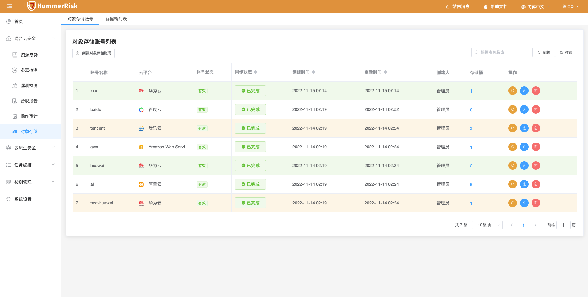{ width="95%" }
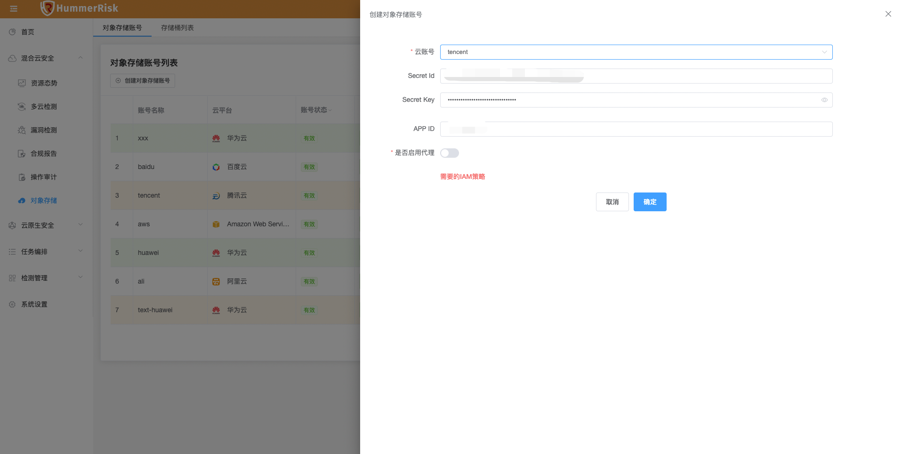{ width="95%" }
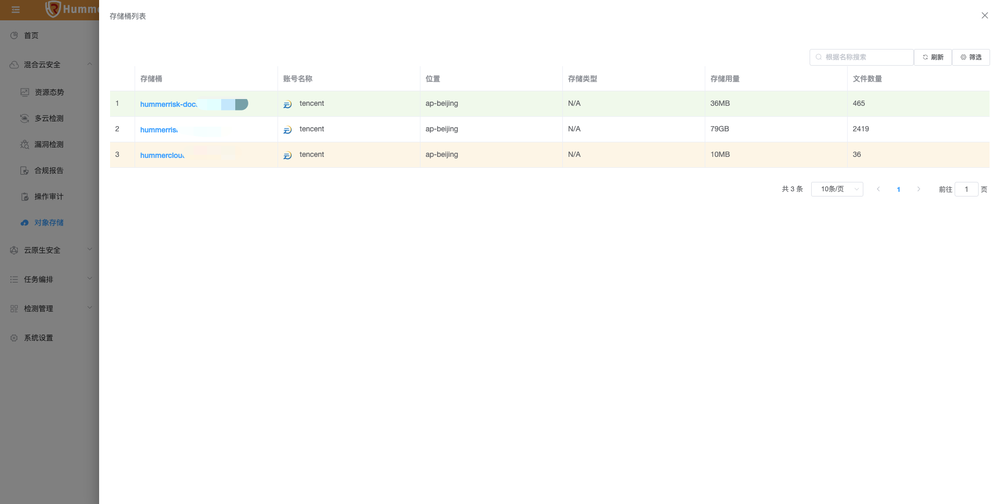{ width="95%" }
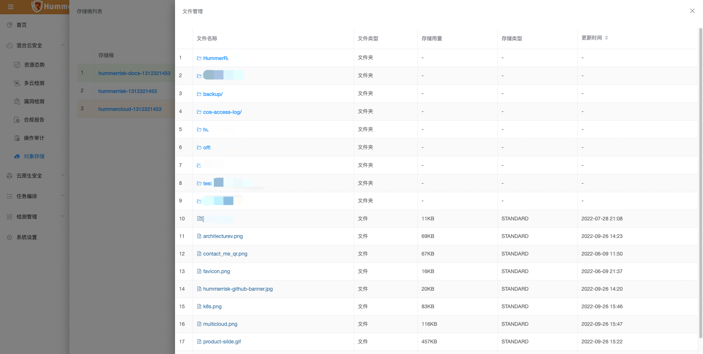{ width="95%" }

### 1.2 对象存储

!!! abstract "存储桶列表"
    如下图所示，对象存储查看存储桶下面的目录、文件对象，存储用量、存储类型、读写权限等信息。
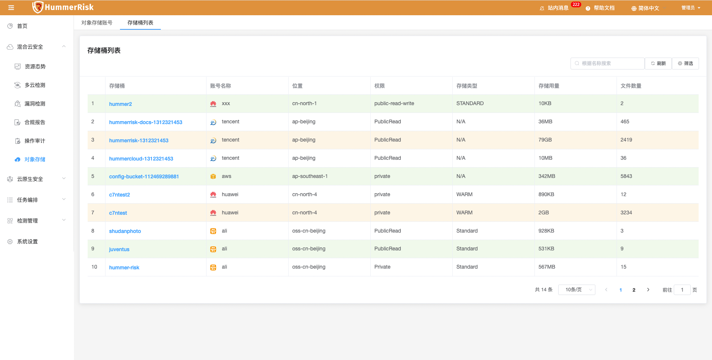{ width="95%" }
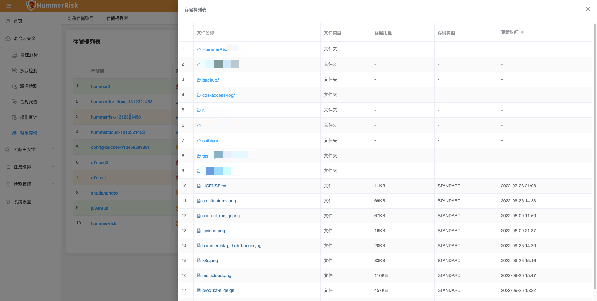{ width="95%" }
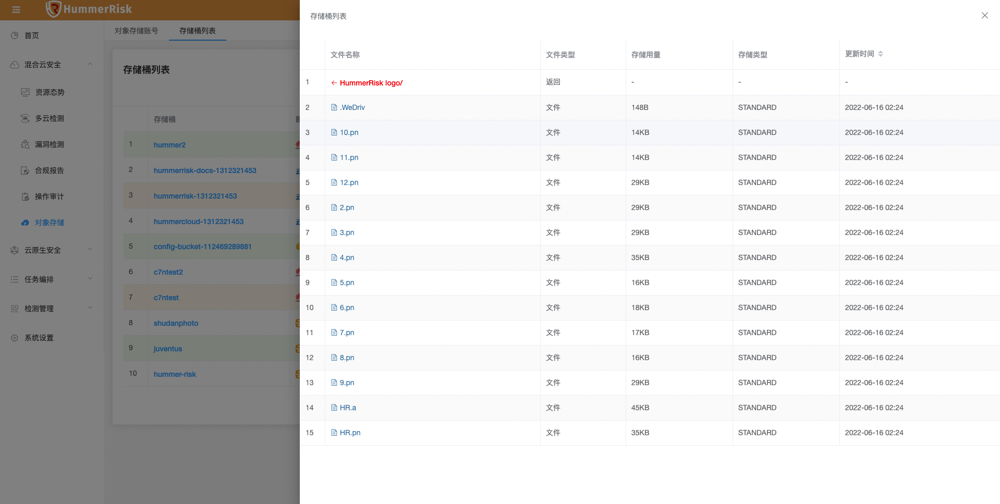{ width="95%" }

### 1.3 K8s 资源态势

!!! abstract "K8s 资源态势"
    如下图所示，K8s 资源态势，新增资源详情，可以点击查看同步的资源 Yaml 或 Json 部署配置，Pod/Deployment/DaemonSet/StatefulSet/CronJob/Job 等资源的镜像信息等。
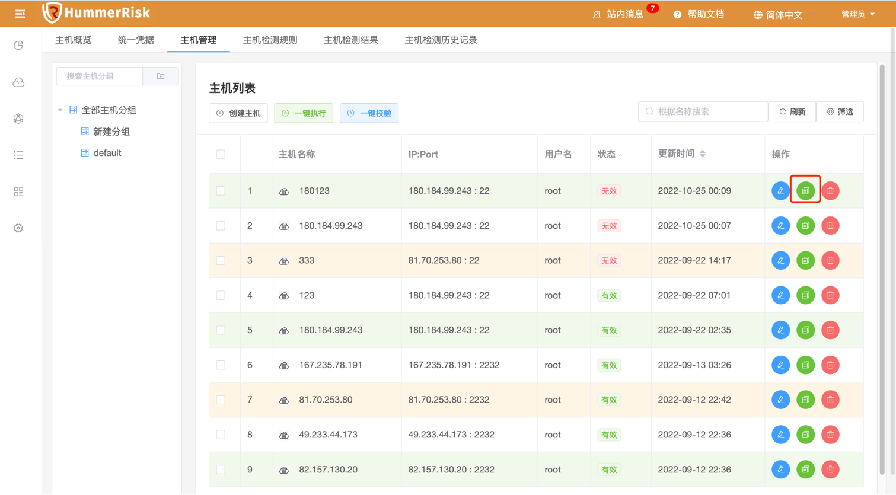{ width="95%" }
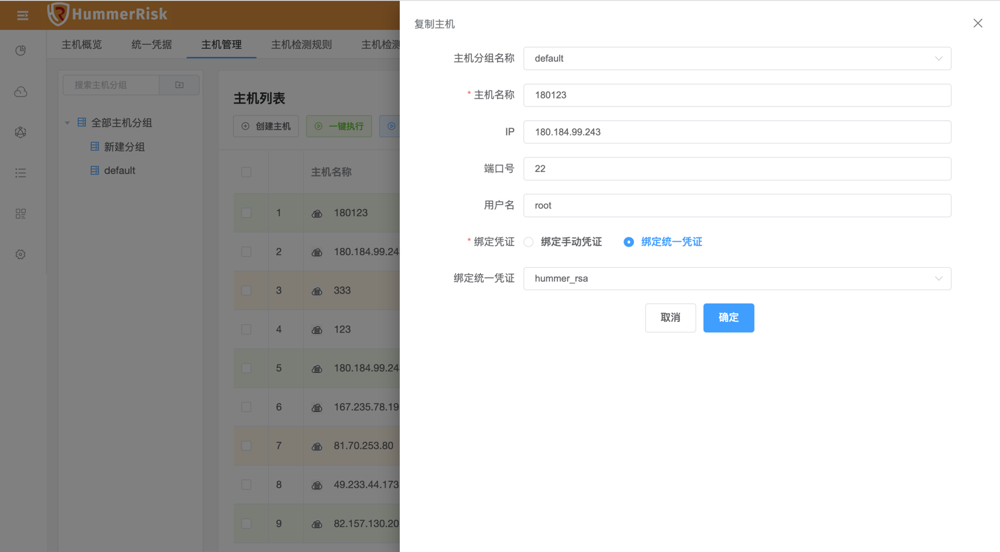{ width="95%" }
{ width="95%" }
{ width="95%" }

### 1.4 K8s 资源态势

!!! abstract "K8s 资源态势"
    如下图所示，K8s 资源拓扑新增 K8s 风险视角，将资源态势信息和已检测的 K8s 漏洞结果关联，得到有风险的镜像与漏洞信息。
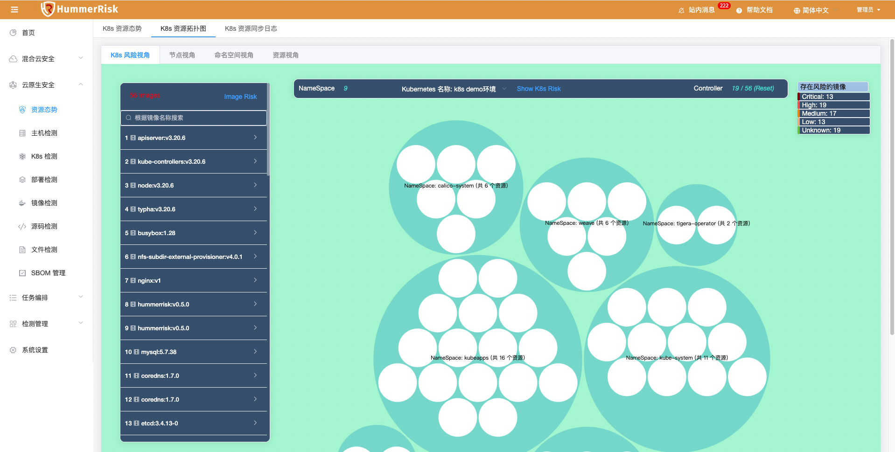{ width="95%" }
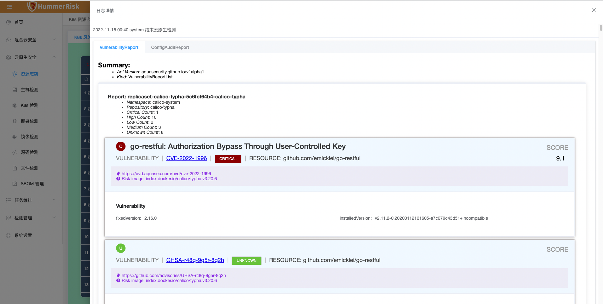{ width="95%" }

## 2 性能优化 Optimization

### 2.1 镜像检测

!!! abstract "优化批量检测镜像仓库同步的镜像问题。"

### 2.2 资源态势

!!! abstract "优化云资源态势同步资源，新增腾讯云资源类型。"

### 2.3 漏洞检测

!!! abstract "优化漏洞检测安全评分。"

### 2.4 IAM

!!! abstract "优化 IAM 策略，新增百度、青云、UCloud IAM 策略。"

### 2.5 多云检测

!!! abstract "优化账号认证，新增 APPID，获取监控数据信息。"

## 3 Bug修复 Bug Fixes

### 3.1 多云检测

!!! abstract "修复检测结果刷新页面的问题。"

### 3.2 镜像检测

!!! abstract "修改镜像仓库认证和同步镜像的问题。"

### 3.3 Sbom 管理

!!! abstract "修改初始化 Sbom 数据问题。"

### 3.4 镜像检测

!!! abstract "解决页面名称过长校验报错的问题。"

### 3.5 docker 挂载

!!! abstract "修改 docker 挂载问题，部署到 K8s 上不使用 docker 也可正常使用。"

### 3.6 操作审计

!!! abstract "修改再次点开新增页面区域默认全选的问题。"

### 3.7 多云检测

!!! abstract "修复新增云账号时自动同步云资源到资源态势的问题。"

