## 1 新功能 Features

### 1.1 对象存储

!!! abstract "对象存储管理"
    如下图所示，新增对象存储的存储桶创建、删除功能，目录的创建、删除功能，存储对象的上传、下载、刷新、删除功能。

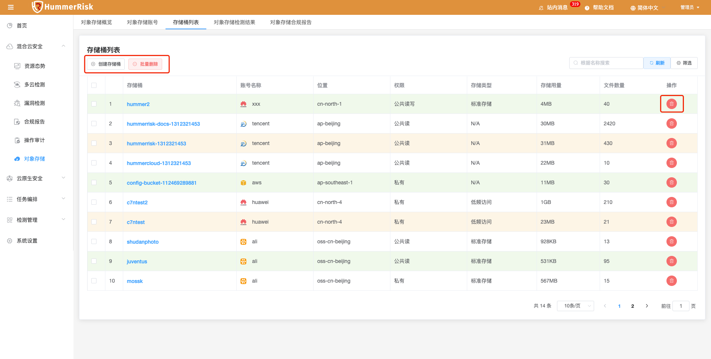{ width="95%" }
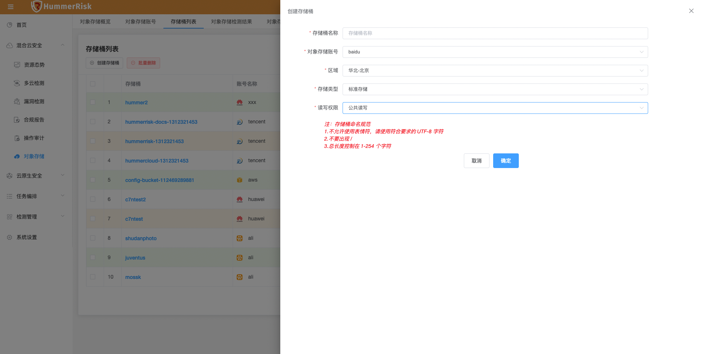{ width="95%" }
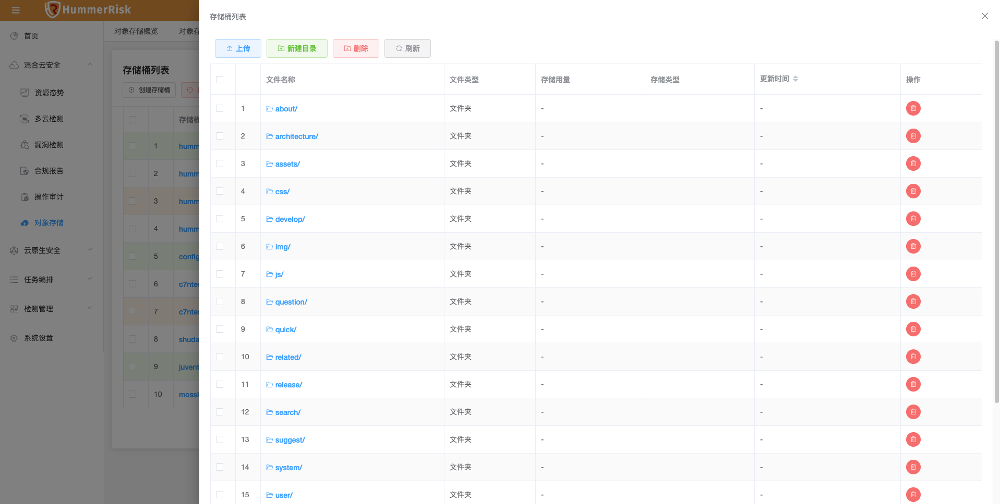{ width="95%" }
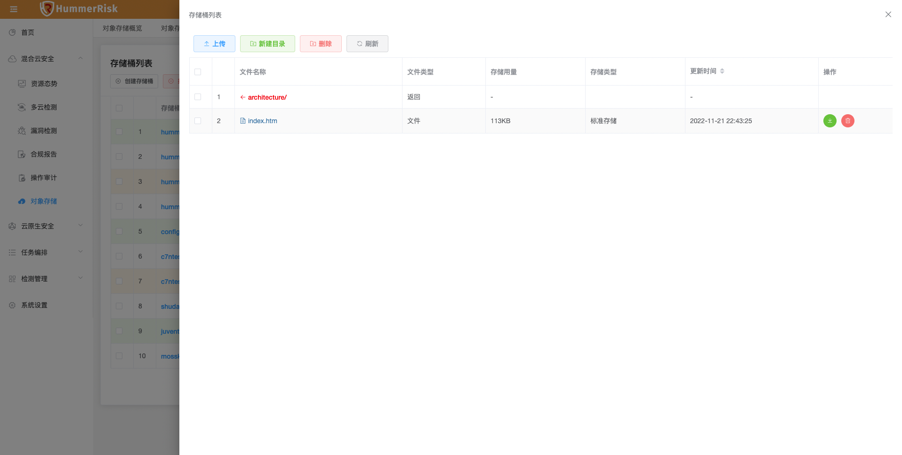{ width="95%" }

!!! abstract "对象存储风险检测"
    如下图所示，新增对象存储概览、对象存储检测结果、对象存储合规报告功能。
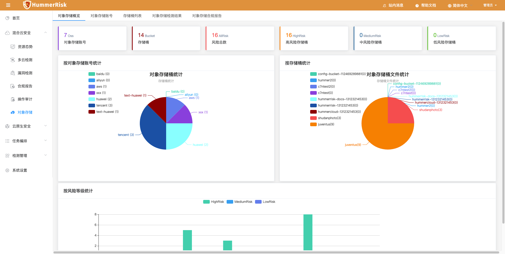{ width="95%" }
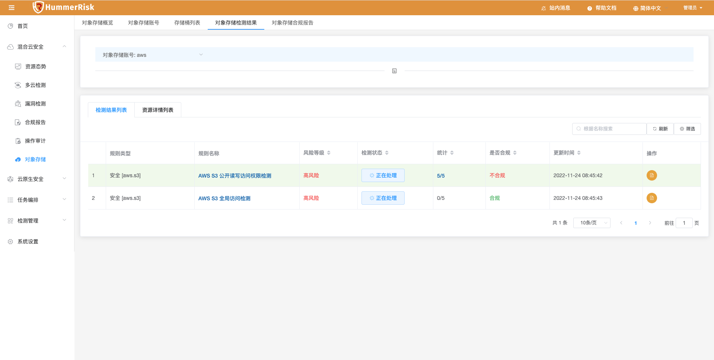{ width="95%" }
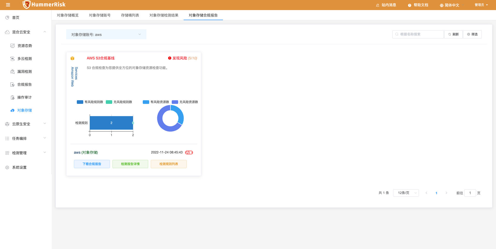{ width="95%" }

### 1.2 多云检测

!!! abstract "多云检测"
    如下图所示，新增七牛云类型检测，新增阿里云规则、七牛云规则、百度云规则。
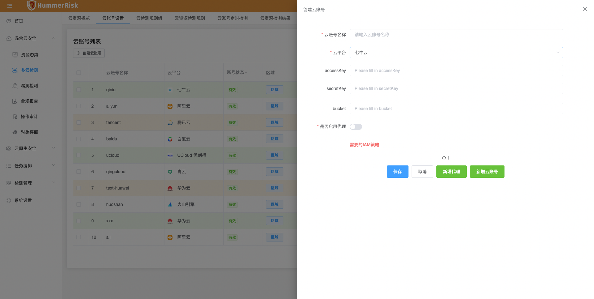{ width="95%" }
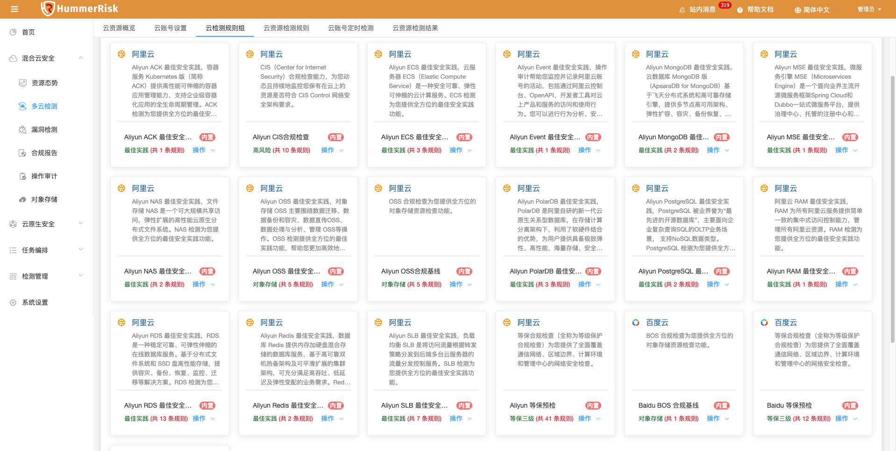{ width="95%" }

### 1.3 操作审计

!!! abstract "操作审计"
    如下图所示，新增操作审计 AWS 云类型。
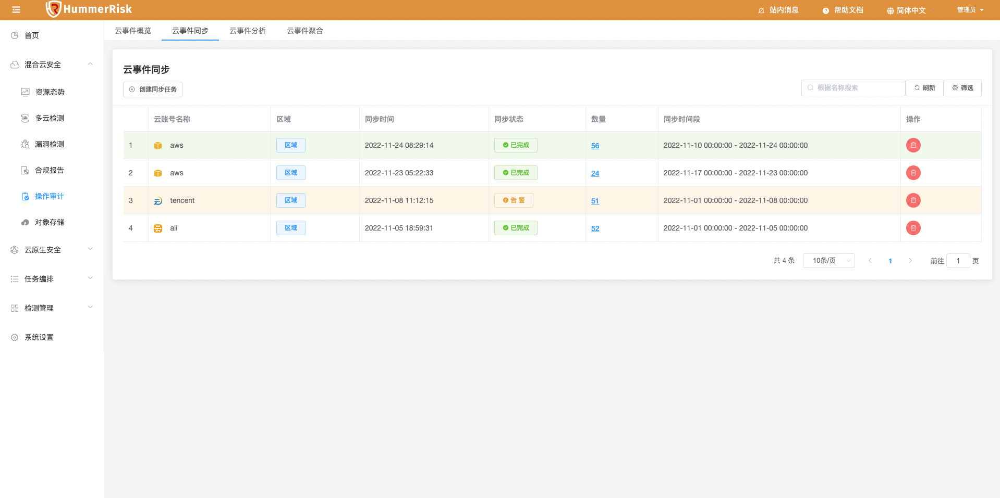{ width="95%" }
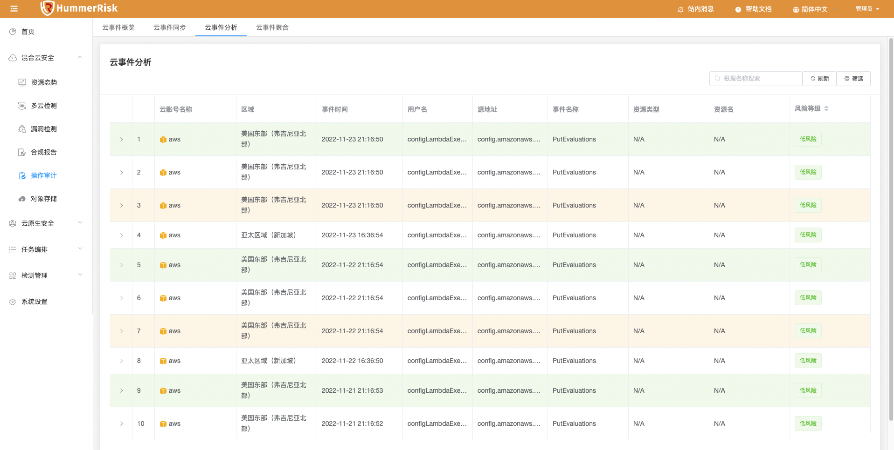{ width="95%" }
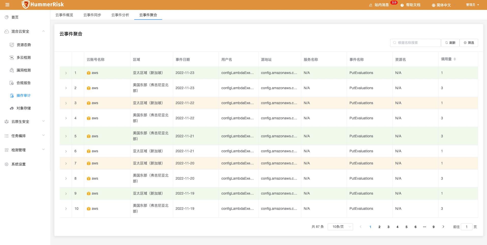{ width="95%" }

### 1.4 系统设置

!!! abstract "系统设置"
    如下图所示，新增在线更新漏洞库与离线更新漏洞库功能。
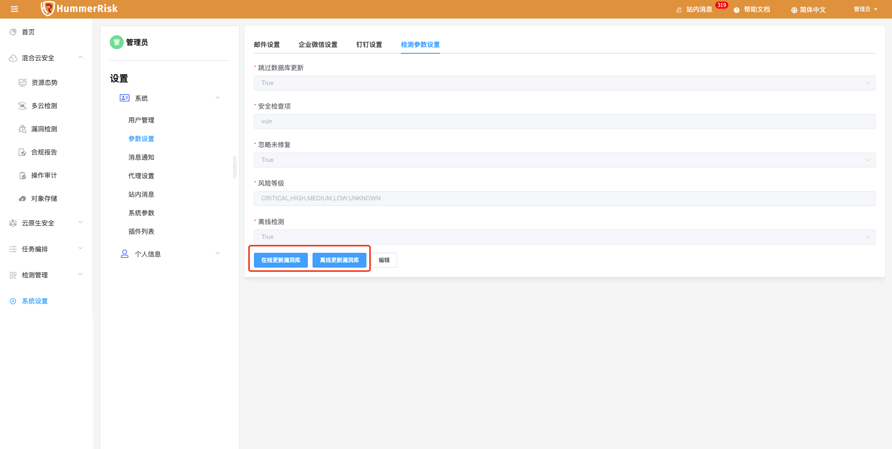{ width="95%" }

### 1.5 K8s 资源态势    

!!! abstract "K8s 资源态势"
    如下图所示，K8s 资源拓扑新增 K8s 风险视角 Node 显示，将资源态势信息和已检测的 K8s 漏洞结果关联，得到有风险等级的镜像与漏洞信息。
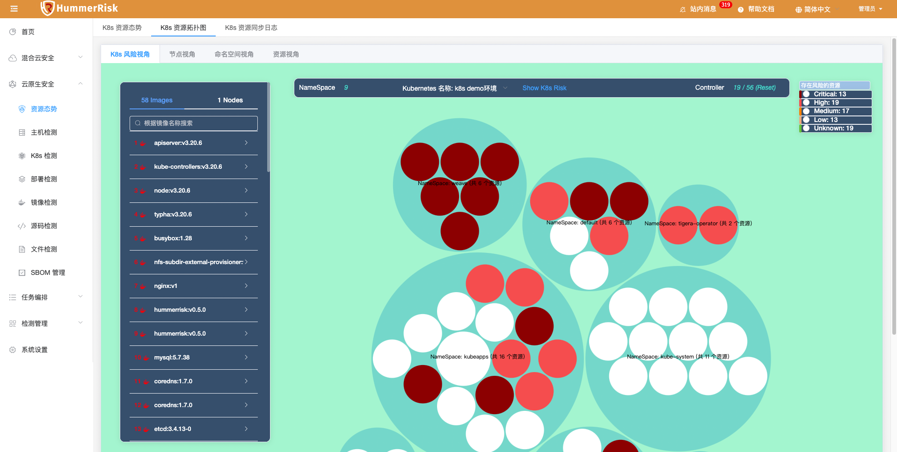{ width="95%" }
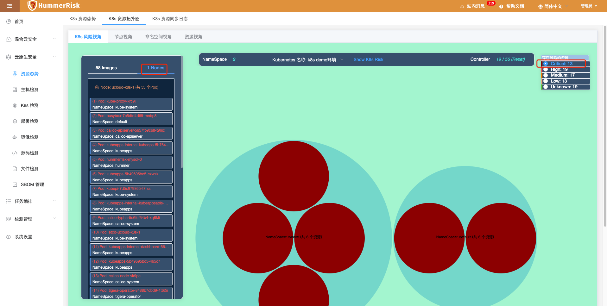{ width="95%" }

## 2 性能优化 Optimization

### 2.1 table 列表

!!! abstract "优化 table 列表，固定右侧操作列，左侧字段过多时折叠显示。"

### 2.2 时间列展示

!!! abstract "优化 table 列表时间列展示，所有时间精确到秒级。"

### 2.3 镜像仓库

!!! abstract "镜像仓库同步的镜像根据k8s环境排序优先展示，供用户选择优先执行。"

### 2.4 多云检测

!!! abstract "优化百度云、七牛云、阿里云对象存储检测规则组。"

### 2.5 主机检测

!!! abstract "优化主机检测，一键执行时部分规则一直属于执行中状态的问题。"

## 3 Bug修复 Bug Fixes

### 3.1 对象存储

!!! abstract "修复编辑对象存储账号，不同步存储桶的问题。"

### 3.2 历史记录

!!! abstract "修复历史记录冗余，状态一直处于执行中的问题。"

### 3.3 历史任务

!!! abstract "修复历史任务报错问题，报告格式问题。"

### 3.4 资源态势

!!! abstract "解决云资源态势风险列展示篡位问题。"

### 3.5 操作审计

!!! abstract "修改操作审计 table 样式,新增 index 排序列。"

### 3.6 操作审计

!!! abstract "修改操作审计，大文本字段 varchar 改为 text。"

### 3.7 多云检测

!!! abstract "修复 AWS 检测报错空指针的问题。"

