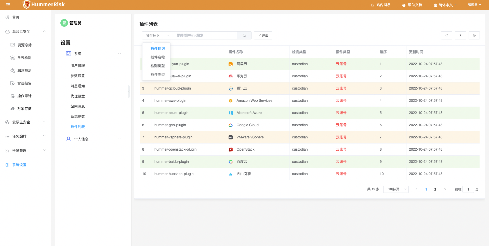
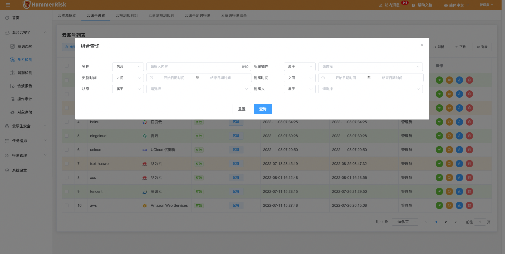
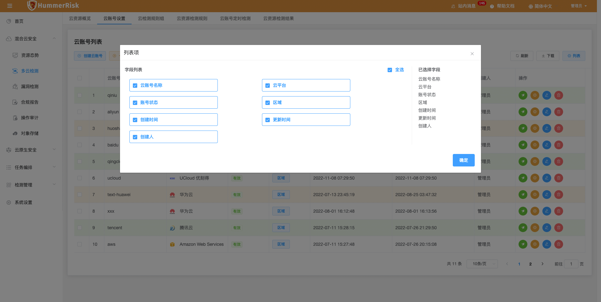
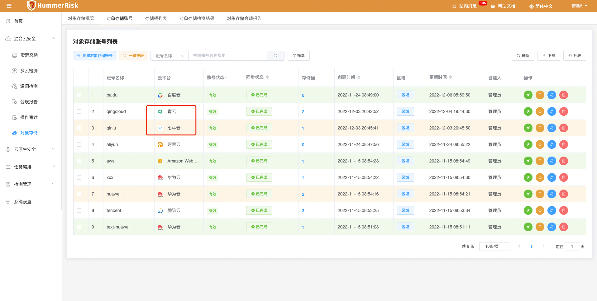
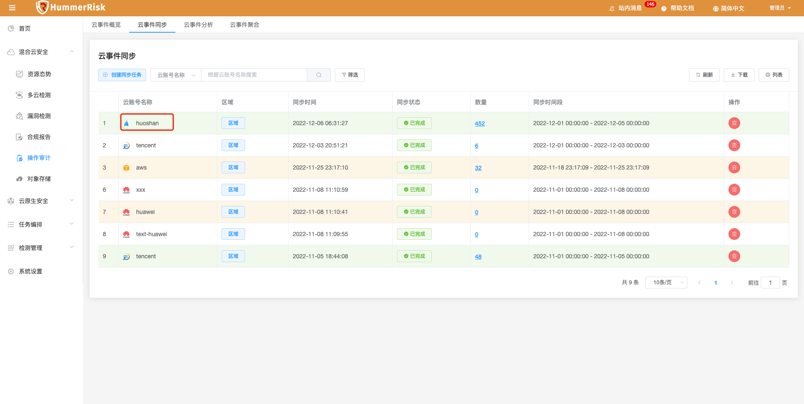
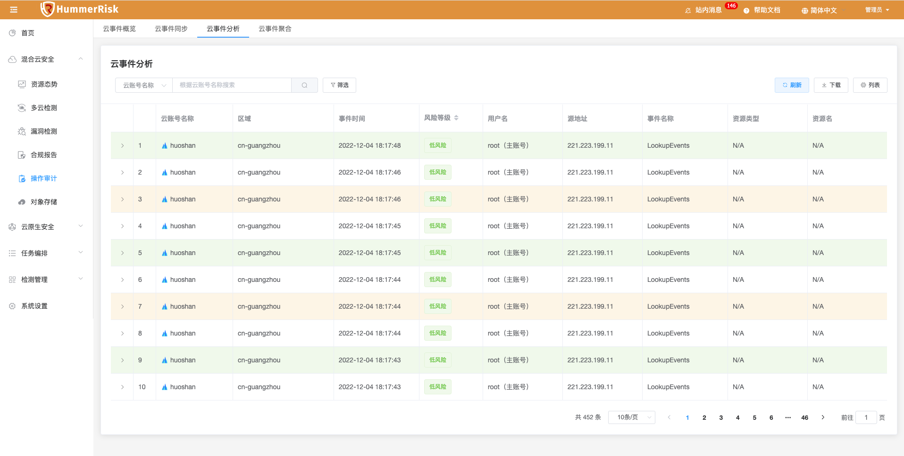
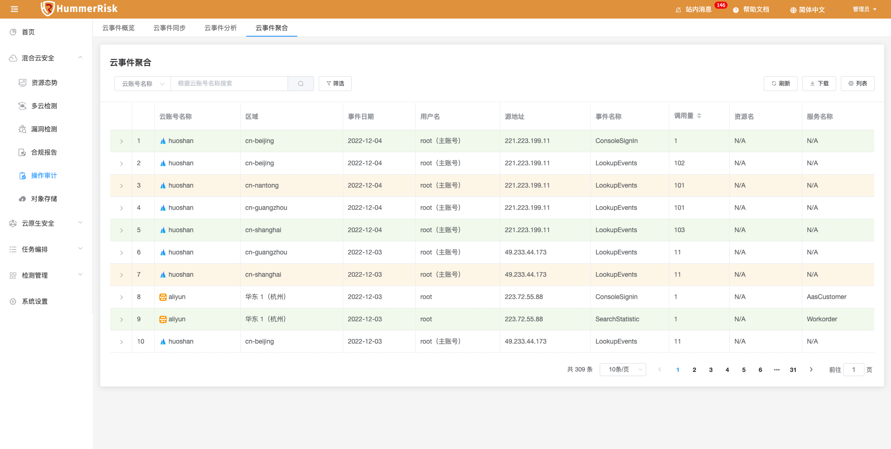
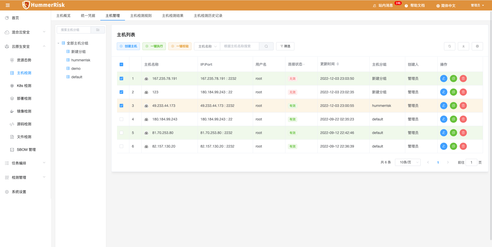
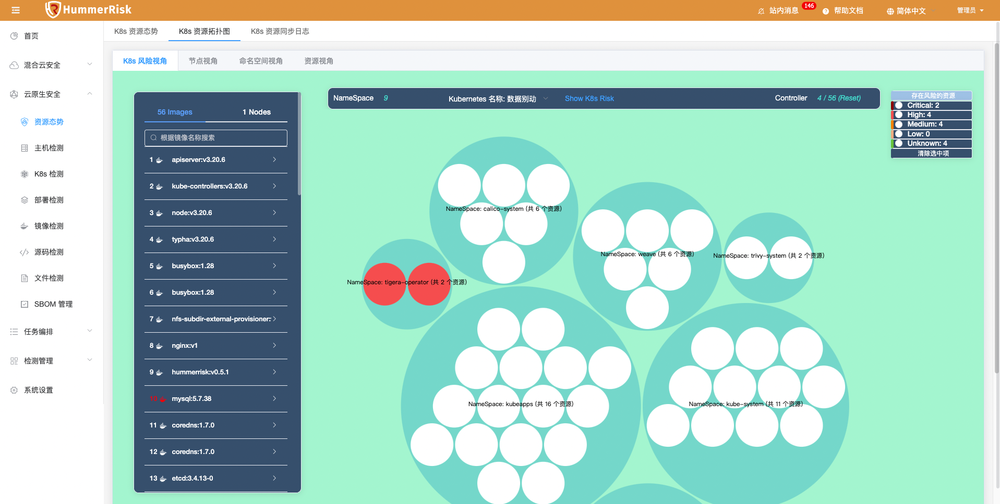

## 1 新功能 Features

### 1.1 所有列表

!!! abstract "所有列表"
    如下图所示，新增表头高级搜索功能(按名称快速搜索与组合查询)，新增下载列表为 Excel 功能，新增列表展示与隐藏某些字段功能。

{ width="95%" }
{ width="95%" }
{ width="95%" }

### 1.2 对象存储

!!! abstract "对象存储"
    如下图所示，新增对象存储七牛云与青云类型，根据云账号，同步存储桶信息，并可以上传下载存储对象，风险检测存储桶。
{ width="95%" }

### 1.3 操作审计

!!! abstract "操作审计"
    如下图所示，新增操作审计火山引擎（火山云）类型，根据火山账号，同步操作审计数据，进而进行事件分析与聚合查询。
{ width="95%" }
{ width="95%" }
{ width="95%" }

## 2 性能优化 Optimization

### 2.1 主机管理

!!! abstract "优化主机一键校验和单个校验，实时修改状态刷新页面。"

{ width="95%" }

### 2.2 主机检测

!!! abstract "限制连接状态无效的主机不能一键检测。"

### 2.3 K8s 管理

!!! abstract "优化 K8s 账号校验立刻刷新页面，加提示。无效状态的账号无法执行检测。"

### 2.4 参数设置

!!! abstract "优化离线上传漏洞库，自动解压到指定目录。"

### 2.5 资源态势

!!! abstract "优化 K8s 资源拓扑图，添加清理选中项按钮，风险镜像颜色随风险改变。"

{ width="95%" }

### 2.6 邮件设置

!!! abstract "优化邮件设置，端口号限制输入数字，并且大小限制 0-65535。"

### 2.7 SBOM 分析

!!! abstract "优化 SBOM 分析只显示最新记录，不显示历史记录。"

### 2.8 操作审计

!!! abstract "优化事件同步时加入时间范围限制，新增最近两周快捷选择。"

## 3 Bug修复 Bug Fixes

### 3.1 K8s 检测

!!! abstract "解决 K8s 检测报错问题。"

### 3.2 消息通知

!!! abstract "解决消息通知空指针报错问题和线程池堵塞问题。"

### 3.3 合规报告

!!! abstract "修复云资源合规报告数据不准确的问题。"

### 3.4 主机检测

!!! abstract "解决主机检测失败报错，一键校验卡顿的问题。"

### 3.5 主机管理

!!! abstract "修复对已经保存的主机，修改分组信息，保存后没有生效的问题。新增主机分组列。"

### 3.6 部署检测

!!! abstract "修复部署检测日志翻译问题。"

### 3.7 SBOM 分析

!!! abstract "修复 SBOM 分析列表最后一行展示被遮挡问题。"

### 3.8 资源态势

!!! abstract "修复 K8s 资源拓扑图，命名空间视角数量不正确的问题。"

### 3.9 镜像管理

!!! abstract "修复镜像管理编辑页面，手动改绑定镜像时报错问题。"

### 3.10 多云管理

!!! abstract "解决 OpenStack 账号校验失败的问题。"

### 3.11 检测规则

!!! abstract "解决云资源检测规则切换标签后点击搜索标签失效的问题。"

### 3.12 操作审计

!!! abstract "解决火山云区域同步数据数量重复问题。"

### 3.13 检测结果

!!! abstract "解决资源详情数量校准问题，检测结果跳转检测详情列表，区域等信息跟着过滤的问题，详情列表字段宽度显示的问题。"
