## 1 新功能 Features

### 1.1 多云检测

!!! abstract "多云检测"
    如下图所示，新增京东云类型检测，新增京东云检测规则。
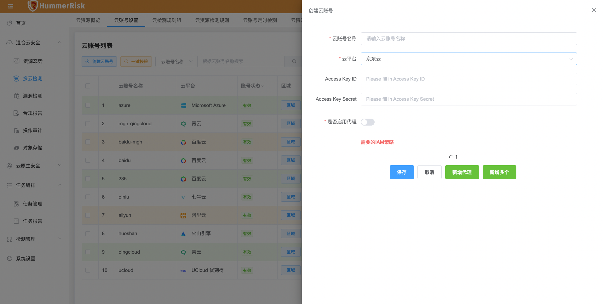{ width="95%" }
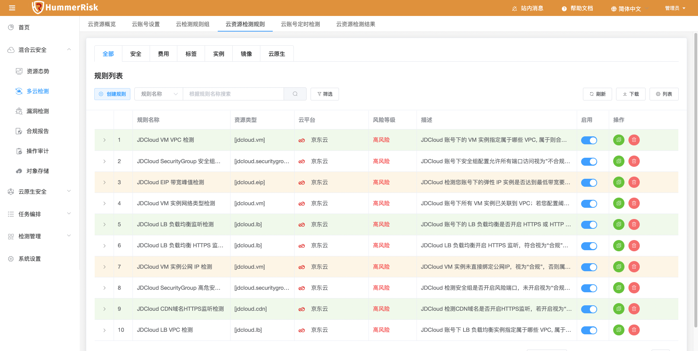{ width="95%" }

### 1.2 WebHook

!!! abstract "WebHook"
    如下图所示，新增 WebHook 功能，消息通知时选择 WebHook 类型，即可通过 WebHook 对检测结果进行通知。
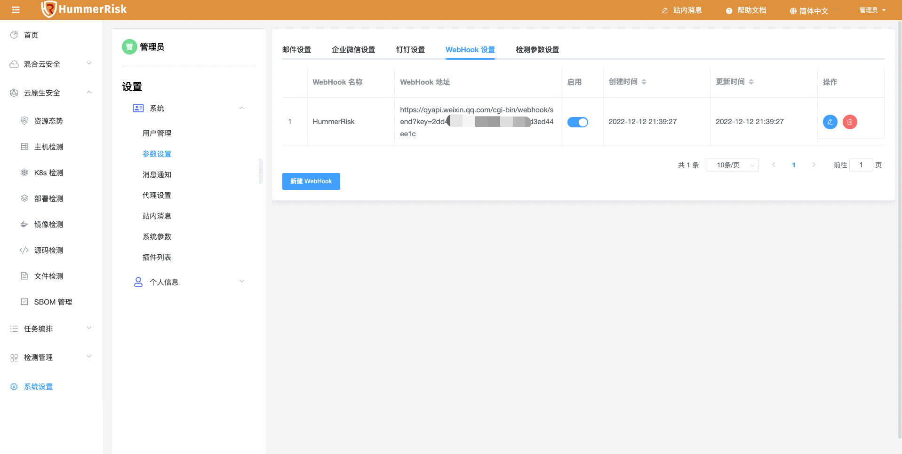{ width="95%" }
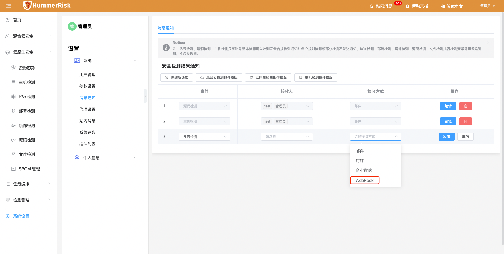{ width="95%" }
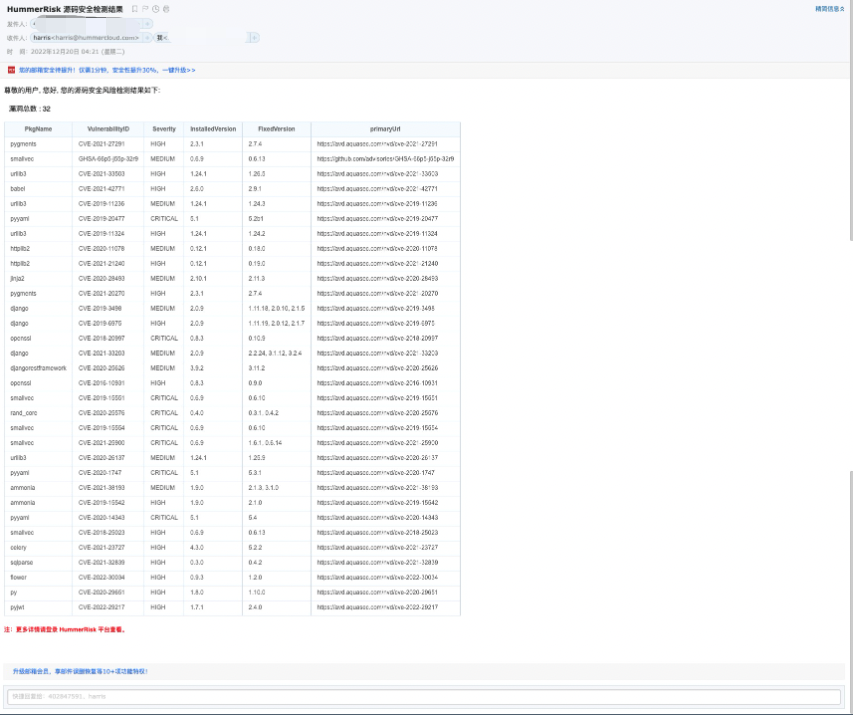{ width="95%" }
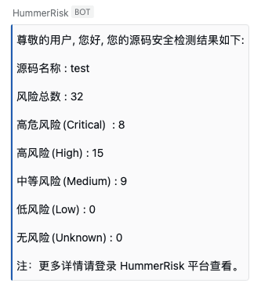{ width="95%" }

### 1.3 PDF 下载

!!! abstract "PDF 下载"
    如下图所示，所有页面新增 PDF 下载功能，列表页面，通过下载按钮选择下载 PDF 或 Excel 类型数据，指定页面可下载 PDF 图表。
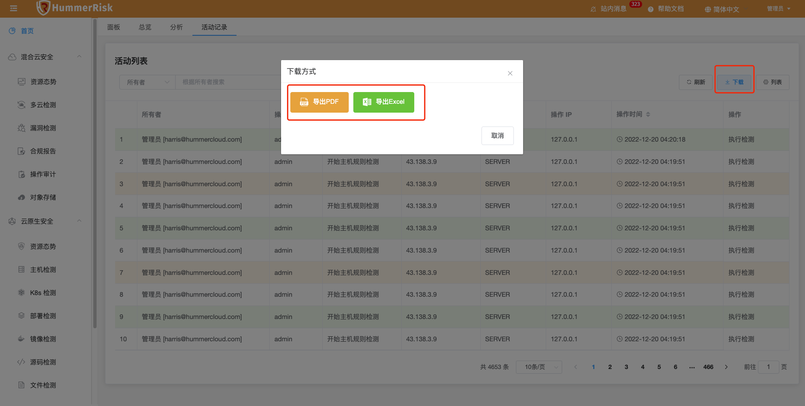{ width="95%" }
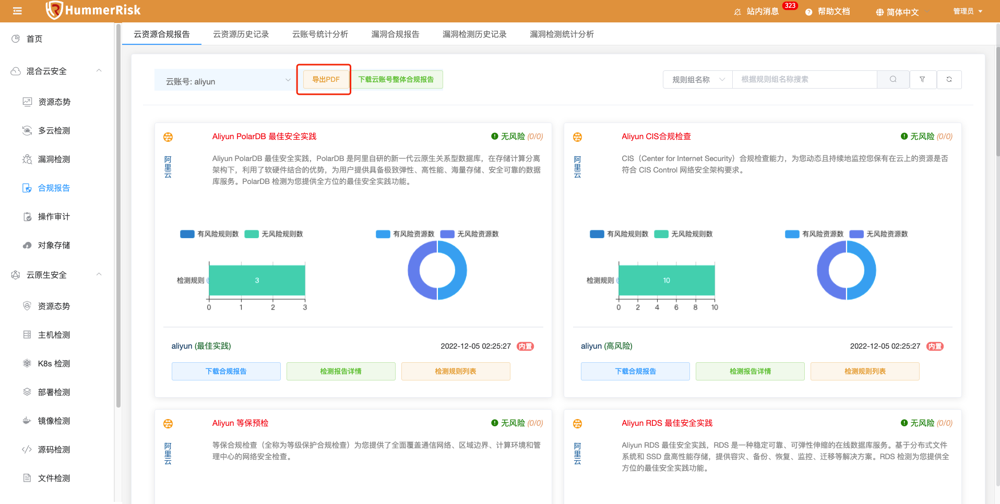{ width="95%" }
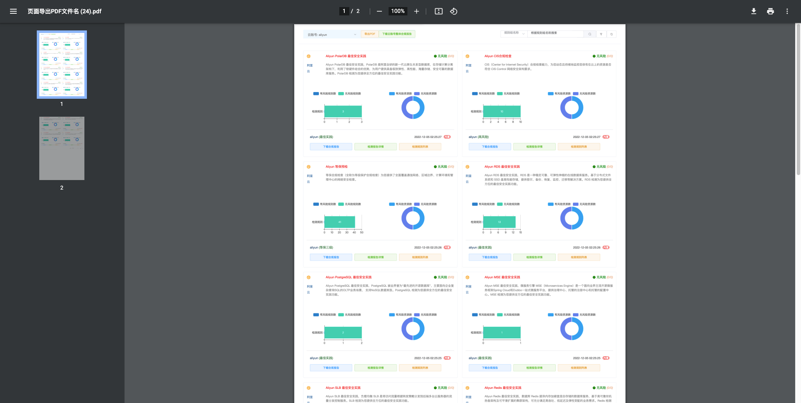{ width="95%" }
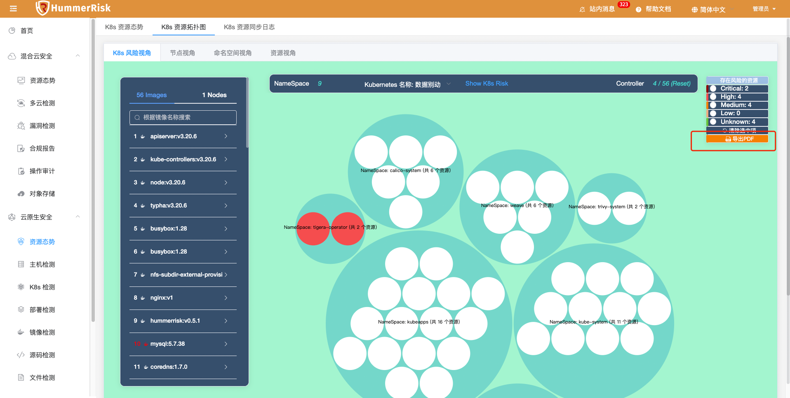{ width="95%" }
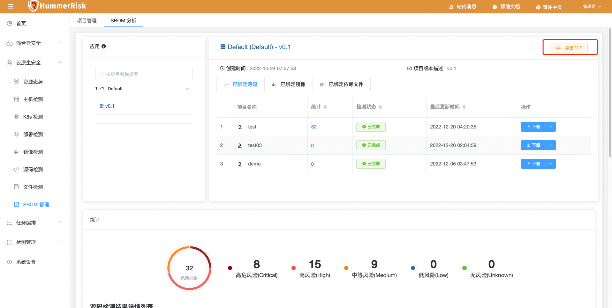{ width="95%" }
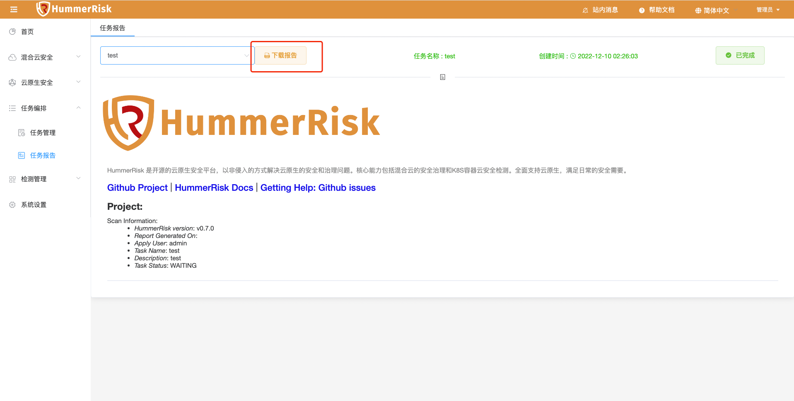{ width="95%" }

### 1.4 主机管理

!!! abstract "主机管理"
    如下图所示，新增批量添加主机功能，根据 Excel 模板，可以批量添加主机信息。
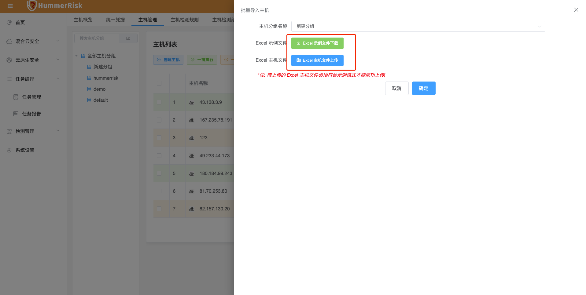{ width="95%" }
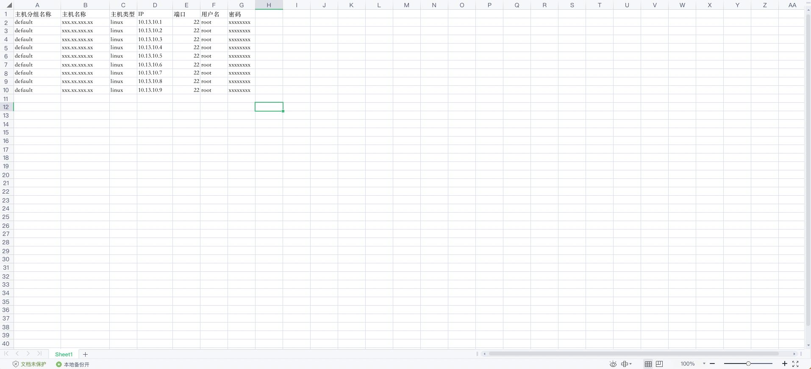{ width="95%" }

### 1.5 主机检测

!!! abstract "主机检测"
    如下图所示，新增 Windows 主机类型与检测规则，新增主机检测结果不同维度功能（检测规则维度、检测主机维度）。
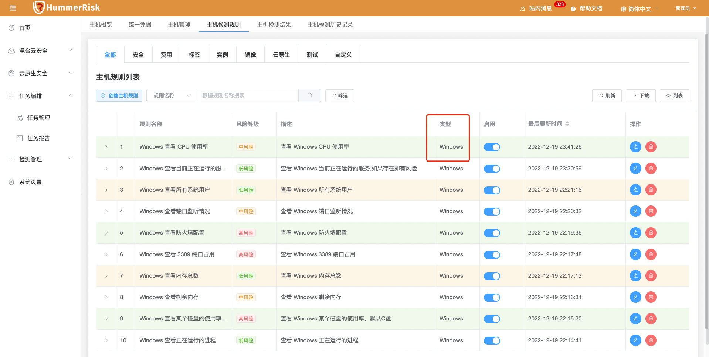{ width="95%" }
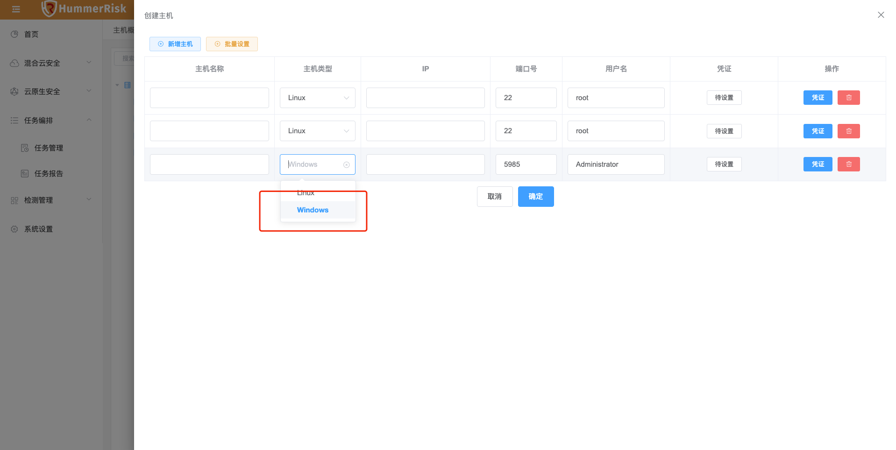{ width="95%" }
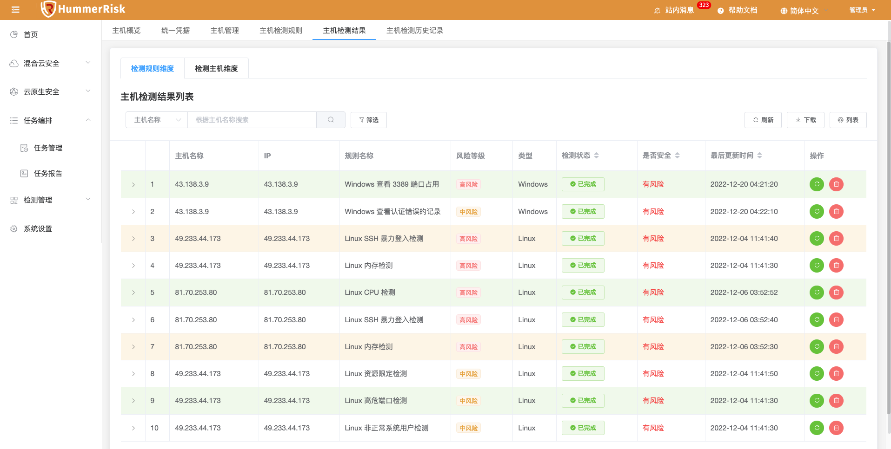{ width="95%" }
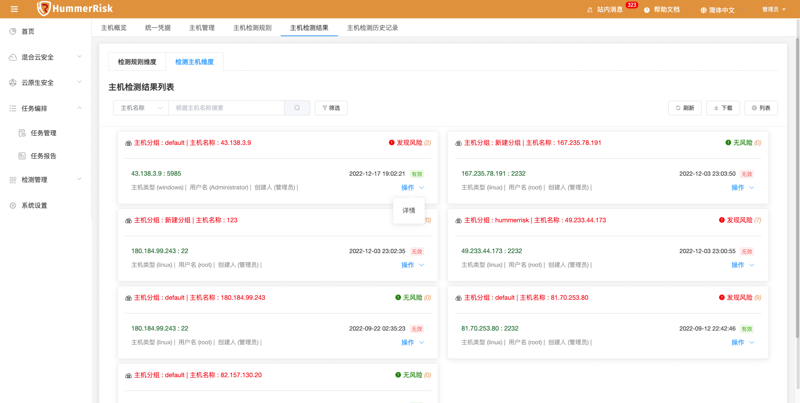{ width="95%" }
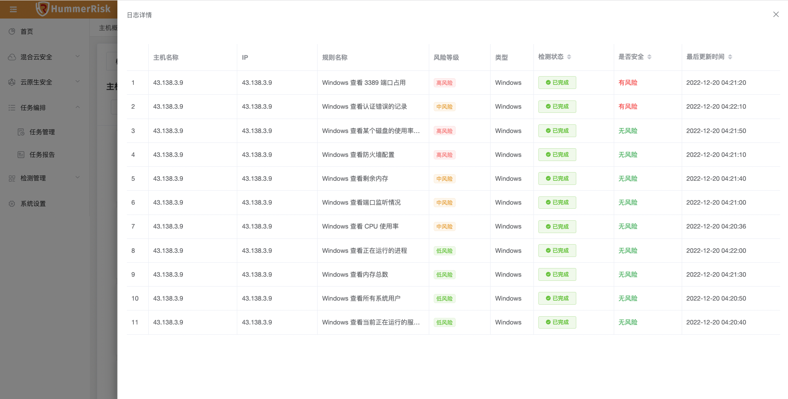{ width="95%" }

## 2 性能优化 Optimization

### 2.1 规则组

!!! abstract "优化规则组下载，与列表项隐藏功能。"

### 2.2 WebHook

!!! abstract "优化 webhook 启用状态。"

### 2.3 消息通知

!!! abstract "优化邮件模板设置与 webhook 模板设置。"

### 2.4 源码检测

!!! abstract "优化源码检测默认 sbom 信息，添加提示注释。"

### 2.5 镜像检测

!!! abstract "优化 provider 检测报错页面直接显示问题。"

## 3 Bug修复 Bug Fixes

### 3.1 漏洞检测

!!! abstract "修复漏洞检测结果页面导出 pdf 功能。"

### 3.2 sbom分析

!!! abstract "修复 sbom 分析页面导出 pdf 功能。"

### 3.3 任务报告

!!! abstract "解决生成任务报告报错问题。"

### 3.4 滚动列表

!!! abstract "解决 default-passive-events，导致出现解决滚动背景的问题。"

### 3.5 源码检测

!!! abstract "解决源码检测结果详情列表页面报错，新增搜索与下载。"

### 3.6 文件检测

!!! abstract "解决文件检测结果详情列表页面报错，新增搜索与下载。"

### 3.7 多云检测

!!! abstract "解决多云管理添加 Azure 账号校验失败问题。"

### 3.8 文件检测

!!! abstract "解决文件检测tar包、.gz、zip包没有解压的问题。"
