## 1 新功能 Features

### 1.1 多云检测

!!! abstract "多云检测"
    如下图所示，新增金山云类型检测，新增金山云检测规则。
{ width="95%" }
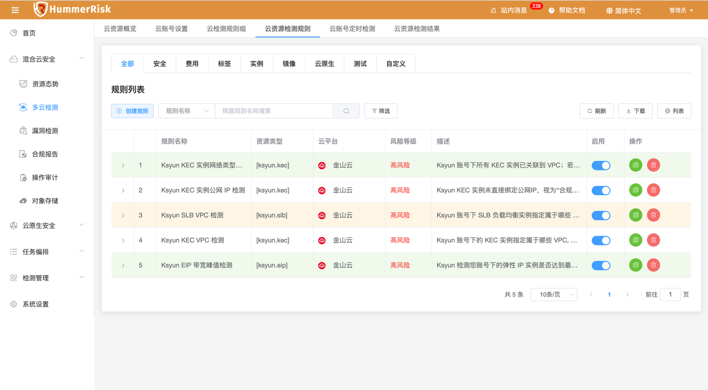{ width="95%" }

### 1.2 K8s 检测

!!! abstract "K8s 检测"
    如下图所示，新增 CIS Benchmark 功能，可以自动/手动安装 Operator 和 CIS Benchmark，新增安装日志。K8s 检测结果新增 CIS Benchmark 信息。
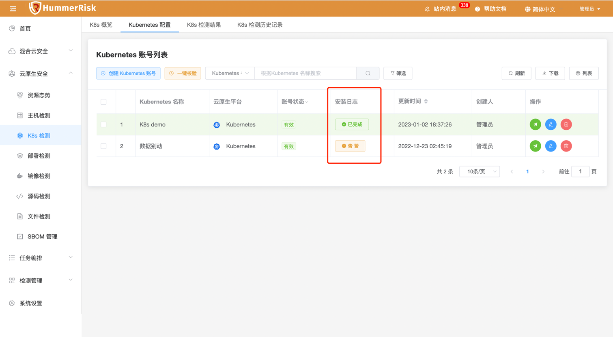{ width="95%" }
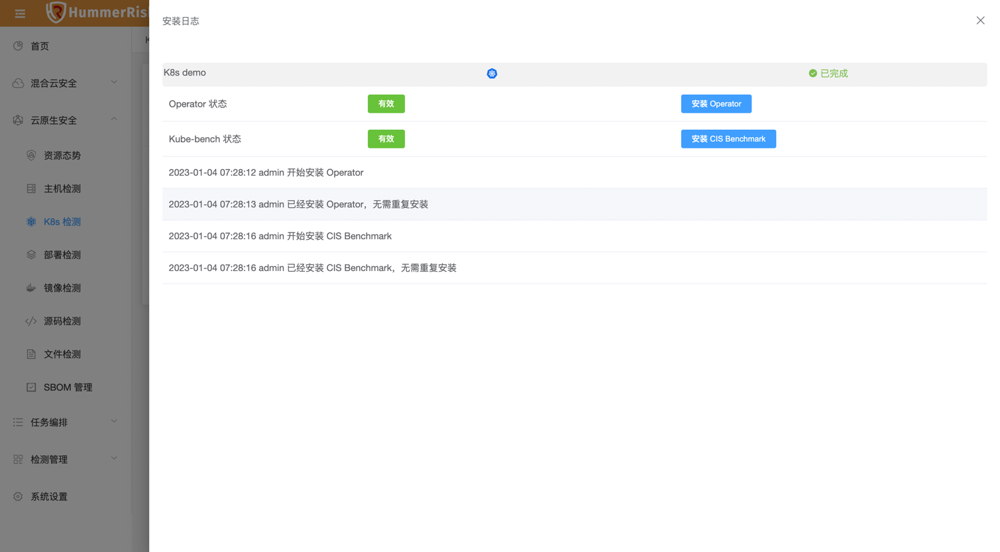{ width="95%" }
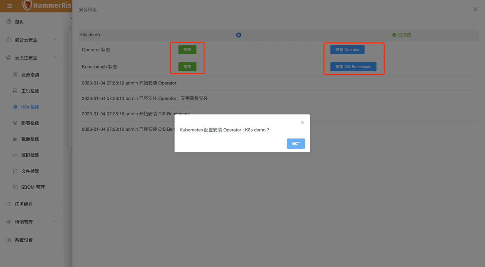{ width="95%" }
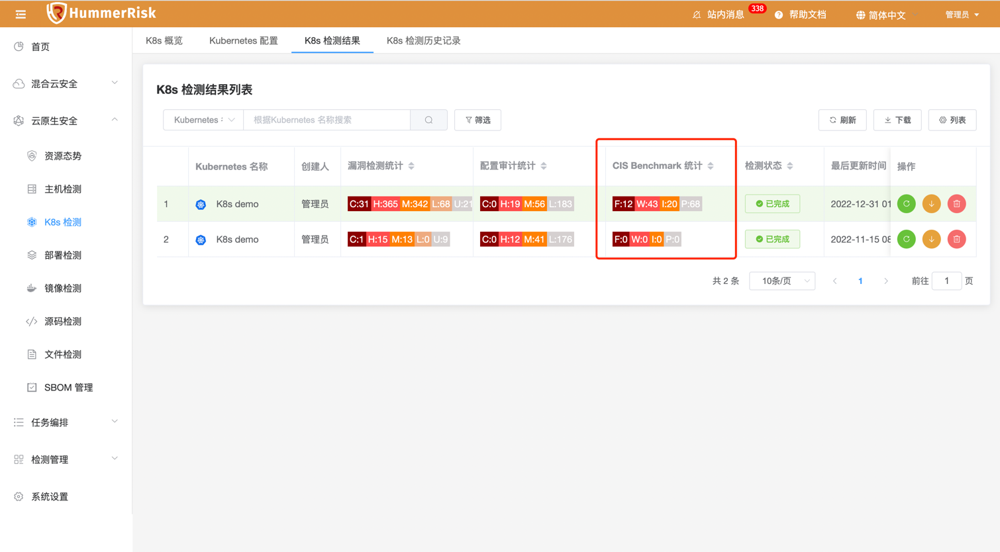{ width="95%" }
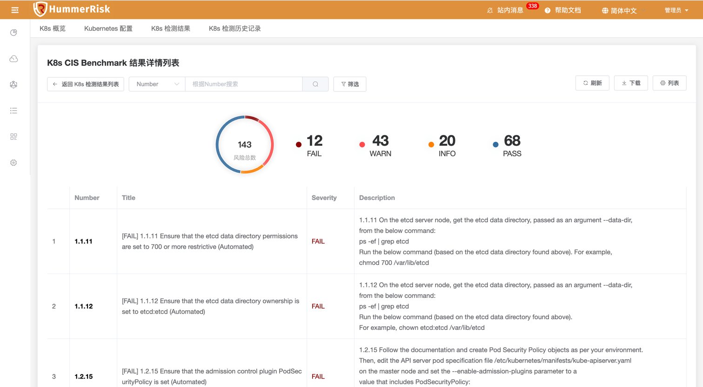{ width="95%" }
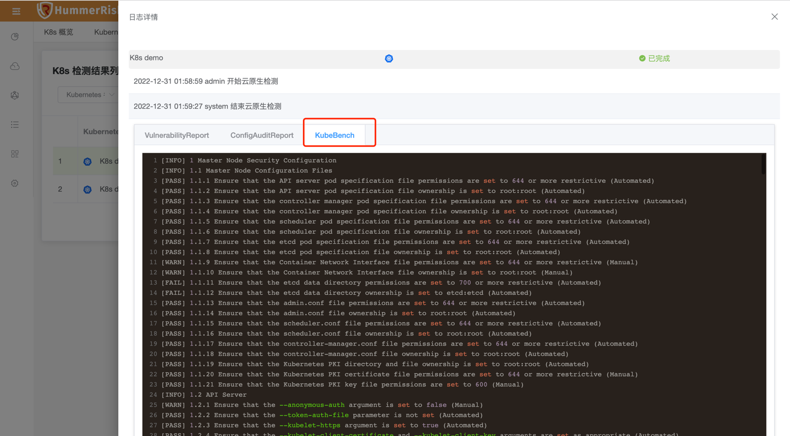{ width="95%" }

### 1.3 操作审计

!!! abstract "操作审计"
    如下图所示，新增源 IP 分析，通过对 IP 地址的访问量集中统一，展示此 IP 访问了哪些云账号下的哪些资源。
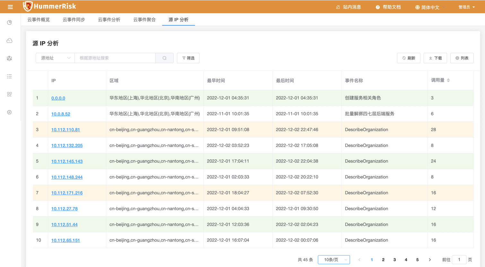{ width="95%" }
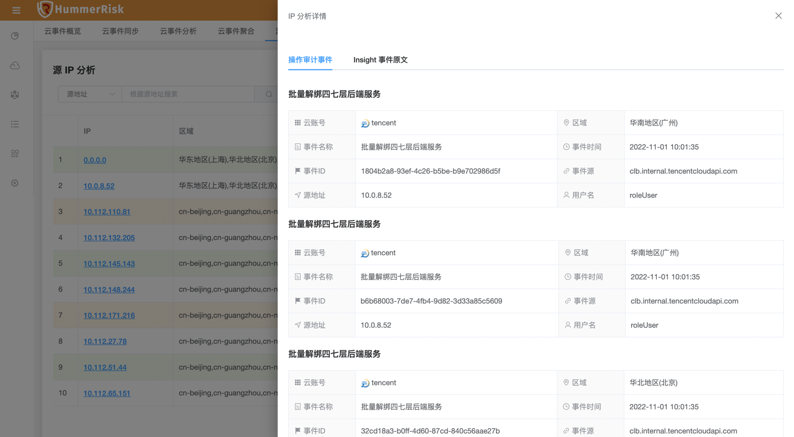{ width="95%" }
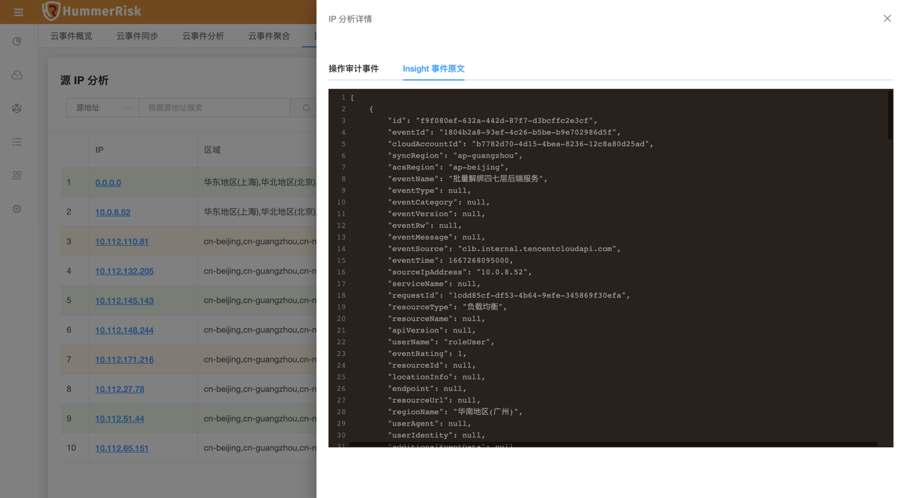{ width="95%" }

### 1.4 主机检测

!!! abstract "主机检测"
    如下图所示，新增 Linux 主机检测规则，新增主机检测结果主机维度日志详情页面。
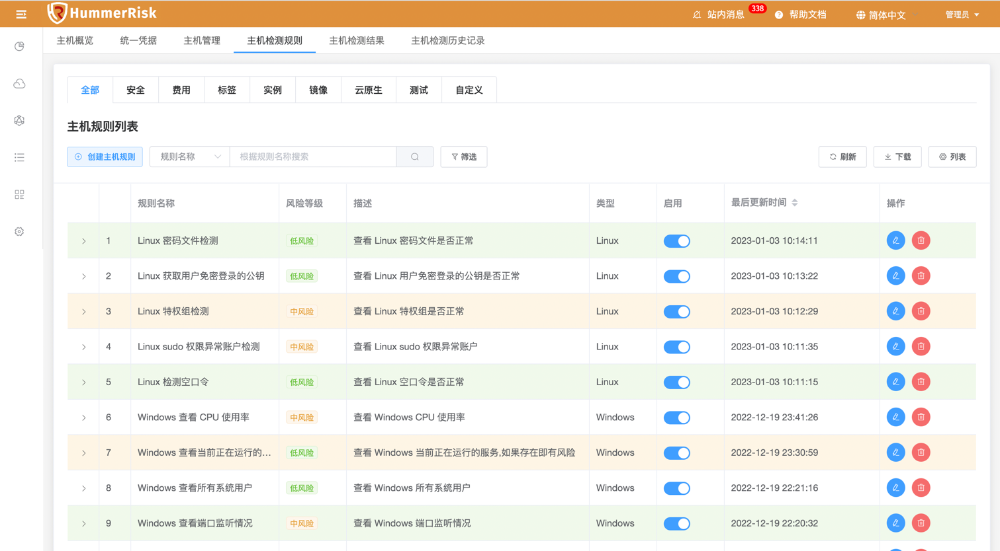{ width="95%" }
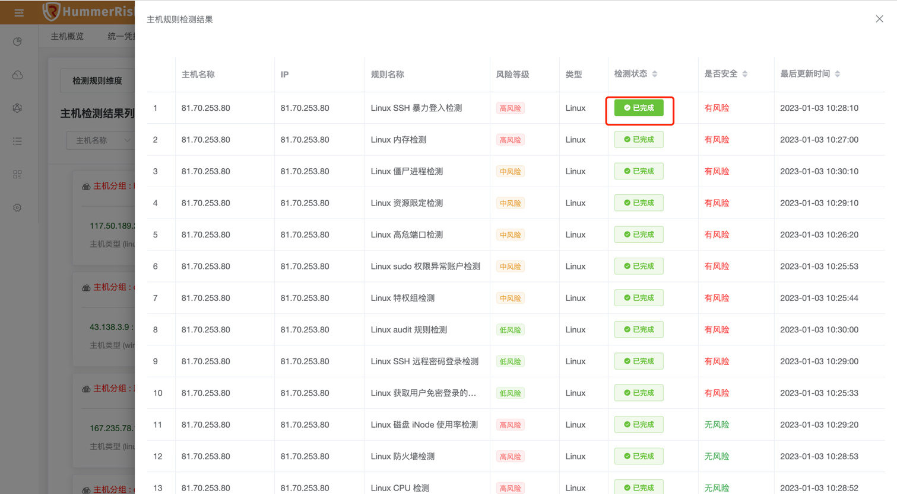{ width="95%" }
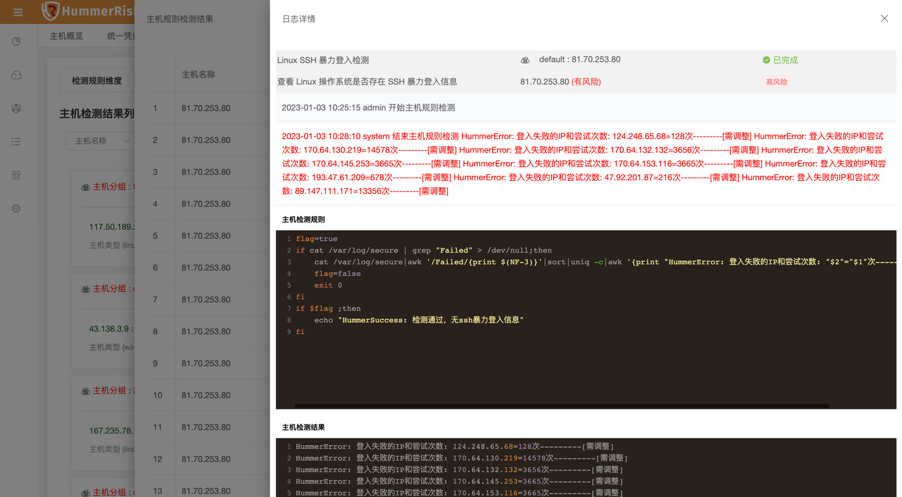{ width="95%" }

## 2 性能优化 Optimization

### 2.1 操作审计

!!! abstract "优化操作审计页面模糊查询功能。"

### 2.2 K8s 管理

!!! abstract "优化 Operator 和 CIS Benchmark 的连接状态。"

### 2.3 K8s 检测

!!! abstract "优化 K8s 检测结果页面的展示。"

### 2.4 资源态势

!!! abstract "优化 K8s 资源态势下的资源同步数据。"

### 2.5 系统设置

!!! abstract "优化检测参数设置，上传离线漏洞库的文件格式为 tar.gz。"

### 2.6 主机检测

!!! abstract "优化主机检测结果（包含历史结果）详情样式，优化 IP 排序。"

## 3 Bug修复 Bug Fixes

### 3.1 操作审计

!!! abstract "调整操作审计页面列表宽度，使展示更合理。"

### 3.2 操作审计

!!! abstract "解决操作审计页面翻译的问题。"

### 3.3 K8s 管理

!!! abstract "解决 K8s 检测字段变更的问题。"

### 3.4 K8s 检测

!!! abstract "解决 K8s 检测自动刷新页面的问题。"

### 3.5 主机管理

!!! abstract "解决 Linux 主机校验报错的问题。"

### 3.6 主机管理

!!! abstract "解决添加主机默认分配到 default 分组的问题。"
