## 1 新功能 Features

### 1.1 首页

!!! abstract "首页"
    如下图所示，首页，新增各项检查的统计数据，可以直观的看到有多少任务进行中、已完成、以及发生异常。
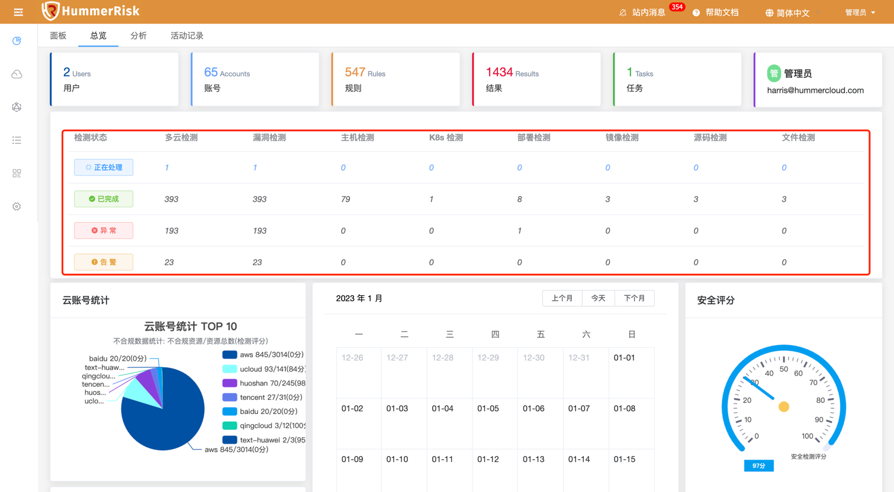{ width="95%" }

### 1.2 资源态势

!!! abstract "RBAC 资源拓扑图"
    如下图所示，云原生资源态势新增 RBAC 资源拓扑图，可以直观的看到 K8s 账号下的 ServiceAccount、Role、Resource 等关联关系。
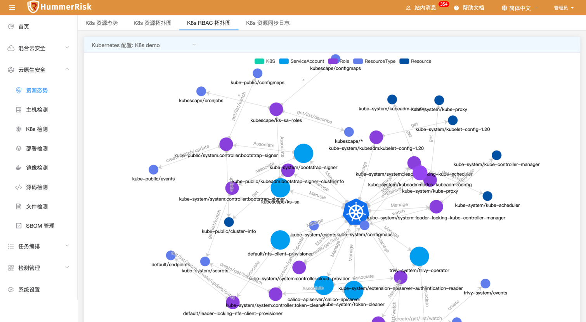{ width="95%" }

### 1.3 对象存储

!!! abstract "对象存储"
    如下图所示，新增对象存储京东云类型，根据云账号，同步存储桶信息，并可以上传下载存储对象，风险检测存储桶。
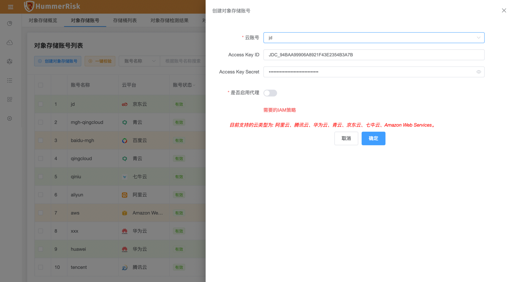{ width="95%" }
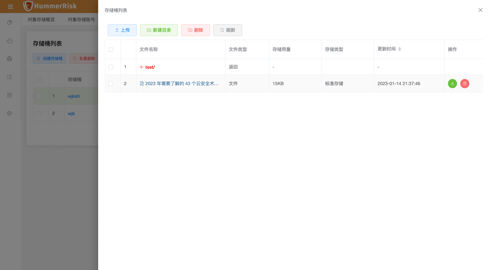{ width="95%" }

### 1.4 主机检测

!!! abstract "主机检测"
    如下图所示，新增多条内置 Linux 主机检测规则。
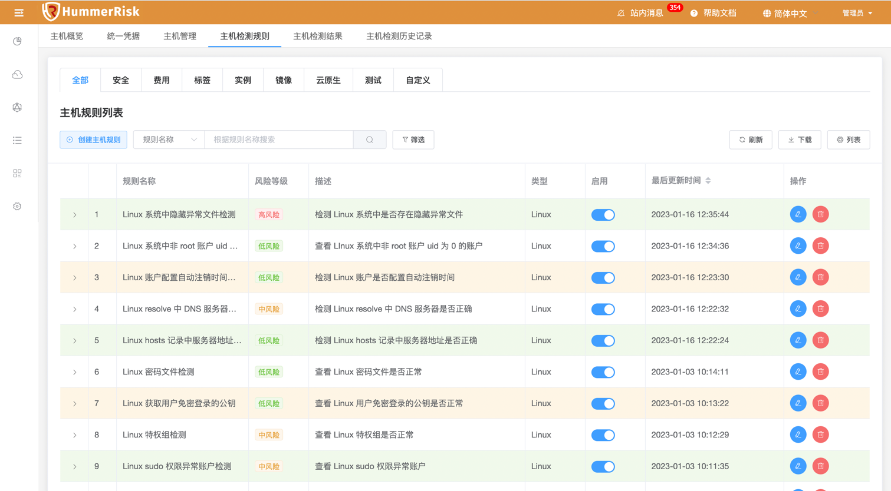{ width="95%" }

### 1.5 漏洞检测

!!! abstract "漏洞检测"
    如下图所示，新增多条内置 Nuclei 漏洞检测规则。
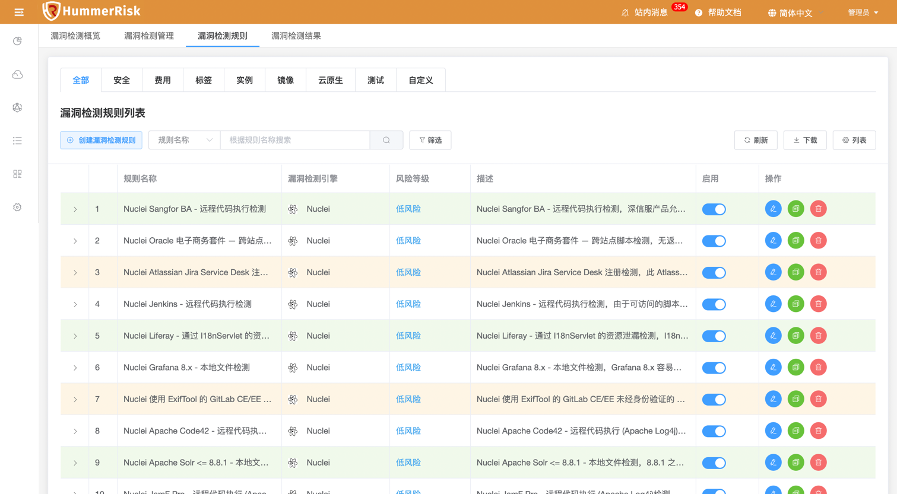{ width="95%" }

### 1.6 多云检测

!!! abstract "多云检测"
    如下图所示，新增多条内置京东云对象存储检测规则与规则组。
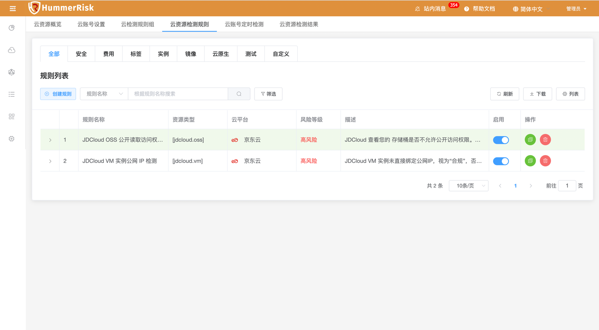{ width="95%" }

### 1.7 操作审计

!!! abstract "操作审计"
    如下图所示，新增操作审计金山云类型，根据金山云账号，同步操作审计数据，进而进行事件分析、聚合查询、源 IP 分析。
{ width="95%" }
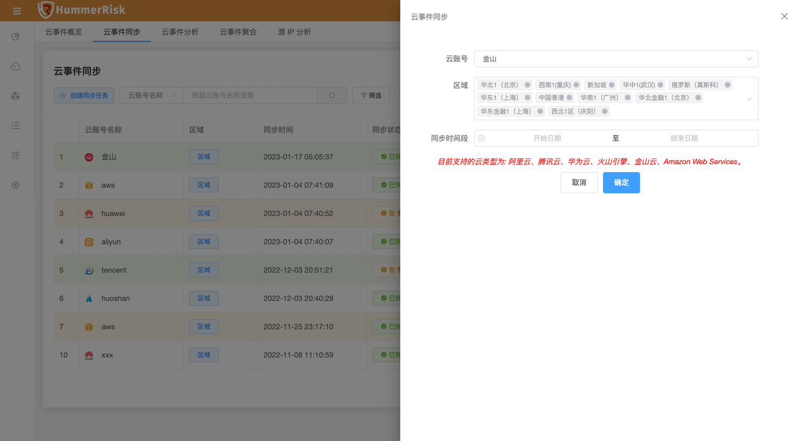{ width="95%" }
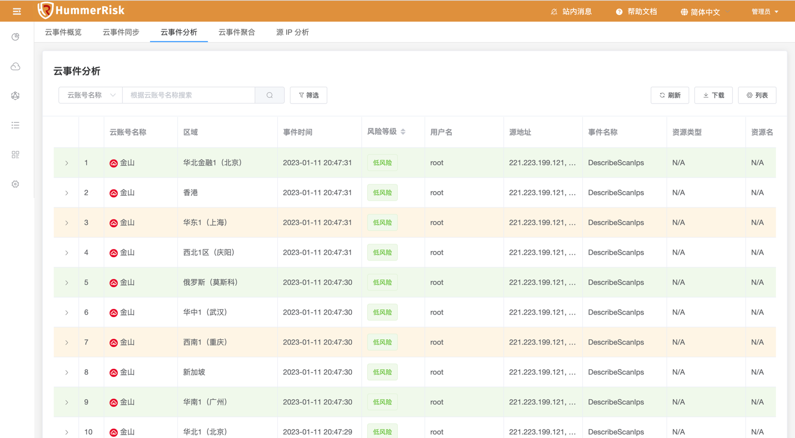{ width="95%" }
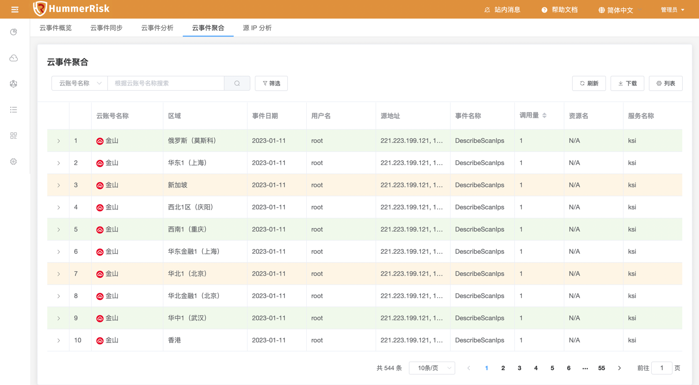{ width="95%" }

### 1.8 镜像仓库

!!! abstract "镜像仓库"
    如下图所示，已同步的镜像列表，新增手动批量设置镜像仓库名称的功能，方便镜像前缀发生变化后快速修改并执行检测。
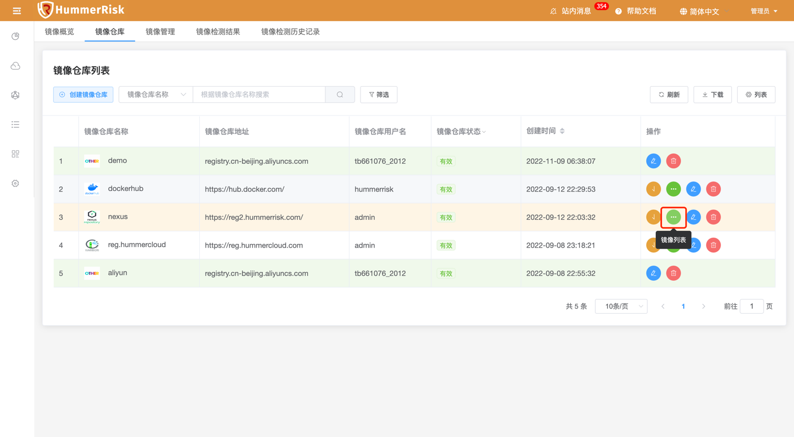{ width="95%" }
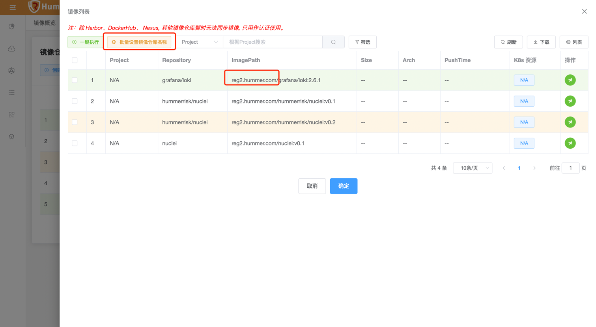{ width="95%" }
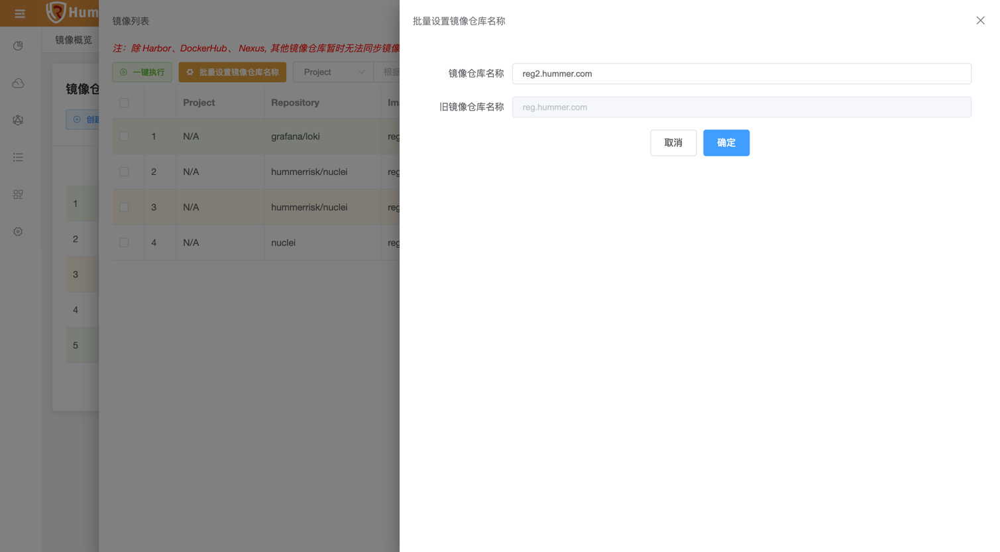{ width="95%" }

### 1.9 操作审计

!!! abstract "源 IP 分析"
    如下图所示，源 IP 分析详情页面，新增 7 日内操作 IP 调用量统计。
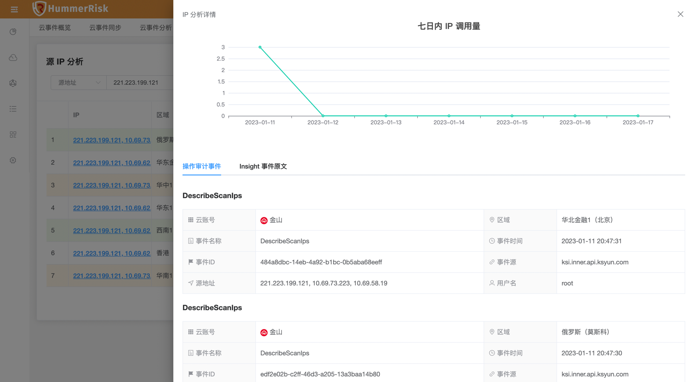{ width="95%" }

## 2 性能优化 Optimization

### 2.1 关于

!!! abstract "优化关于页面的检测引擎或工具的链接地址。"

### 2.2 漏洞检测

!!! abstract "优化规则描述内容，增加规则描述字段大小。"

### 2.3 主机管理

!!! abstract "优化主机管理批量上传 excel xlsx 模板，新增 windows 类型。"

### 2.4 资源态势

!!! abstract "优化 K8s 资源态势下的 ServiceAccount、Role、RoleBinding、ClusterRole、ClusterRoleBinding 等资源类型的数据同步。"

### 2.5 漏洞检测

!!! abstract "优化漏洞检测 Nuclei 的检测结果查询列表中存在 Xray 的类型的问题。"

### 2.6 检测查询

!!! abstract "优化检测查询过程中文件非空判断。"

## 3 Bug修复 Bug Fixes

### 3.1 镜像管理

!!! abstract "解决镜像管理，图片上传报错的问题。"

### 3.2 对象存储

!!! abstract "解决京东云创建目录报错问题。"

### 3.3 漏洞库链接

!!! abstract "解决国家信息安全漏洞库链接地址跳转失败的问题。"

### 3.4 漏洞检测

!!! abstract "修复漏洞检测 Nuclei 组件获取不到日志 log 的问题。"

### 3.5 任务编排

!!! abstract "解决任务编排部署检测无法选择问题。"

### 3.6 任务编排

!!! abstract "解决任务编排主机检测规则无法选择问题。"
