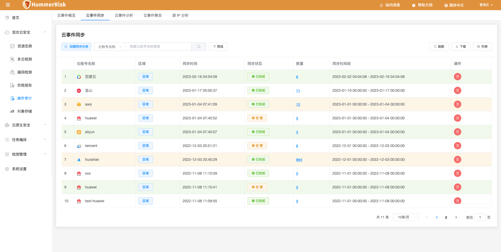
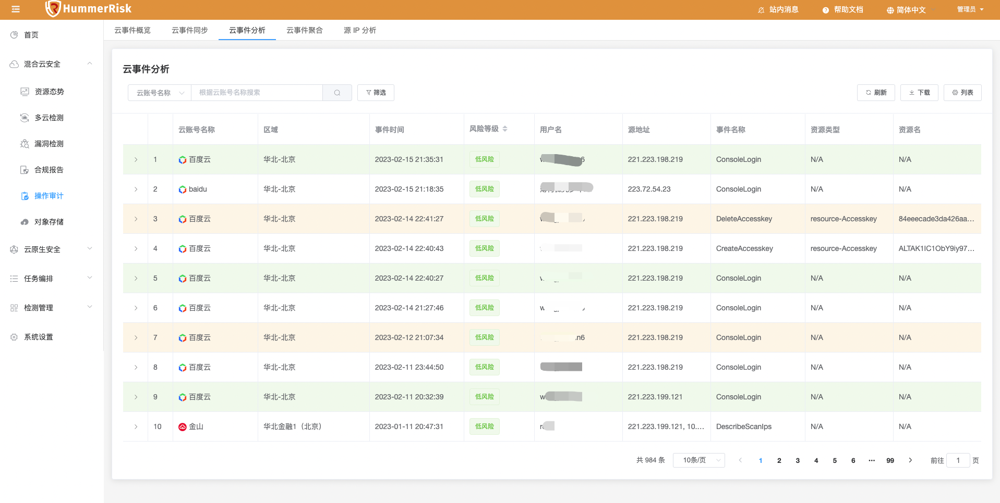
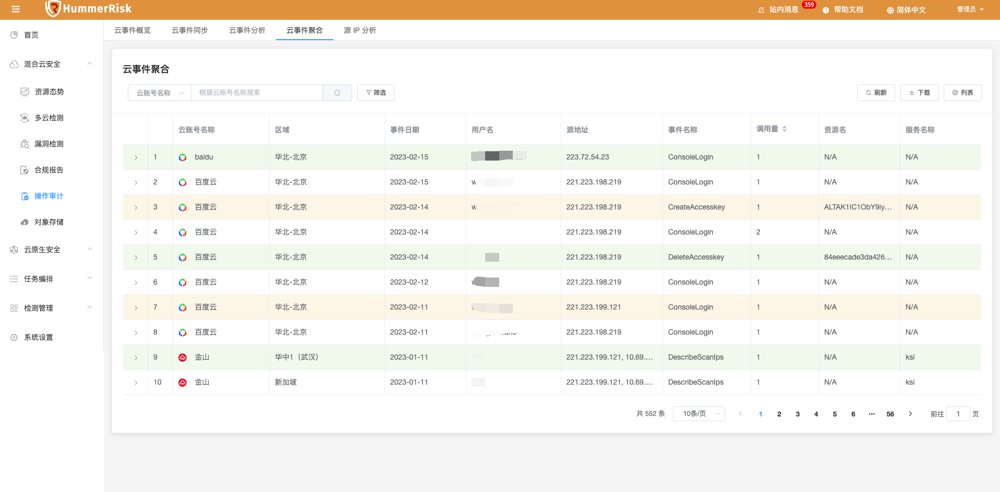
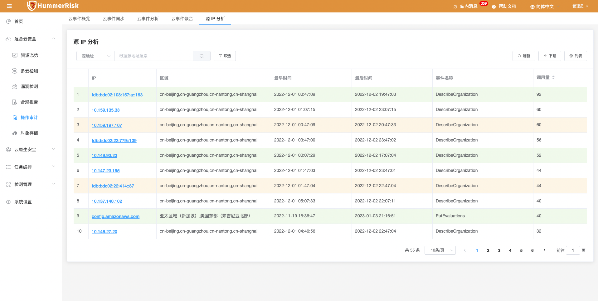
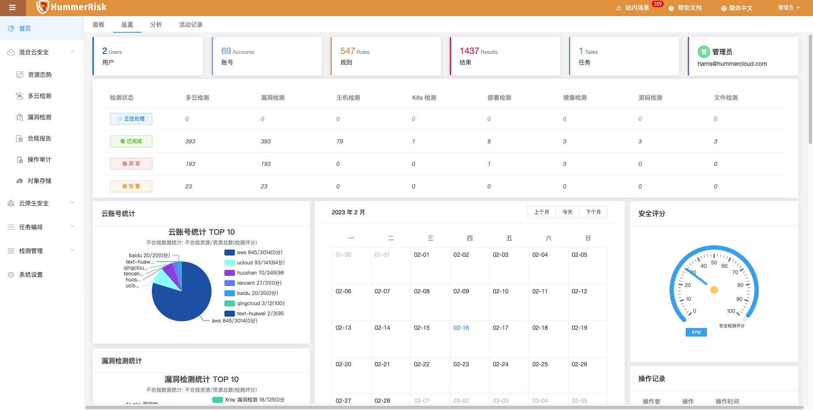
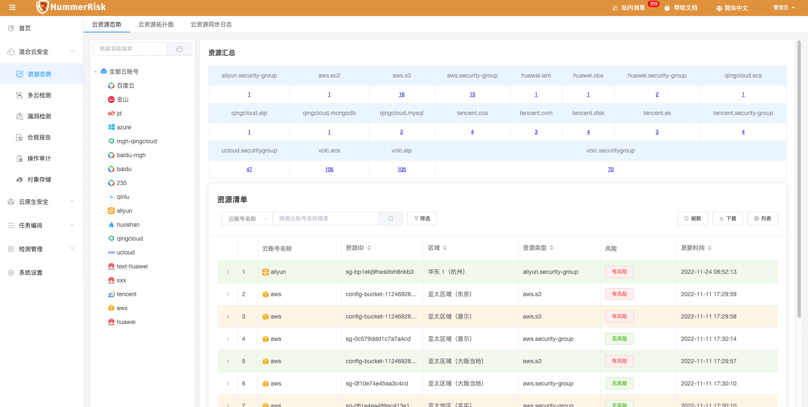
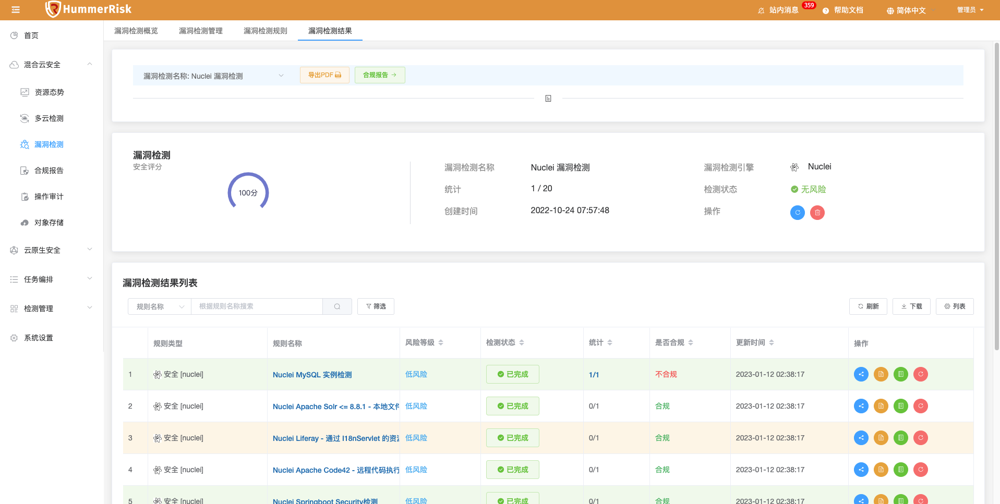
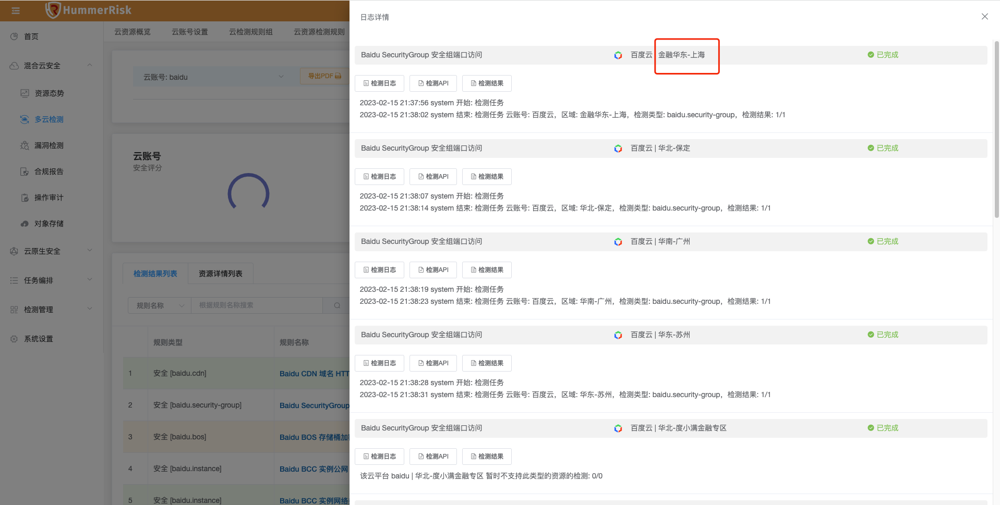
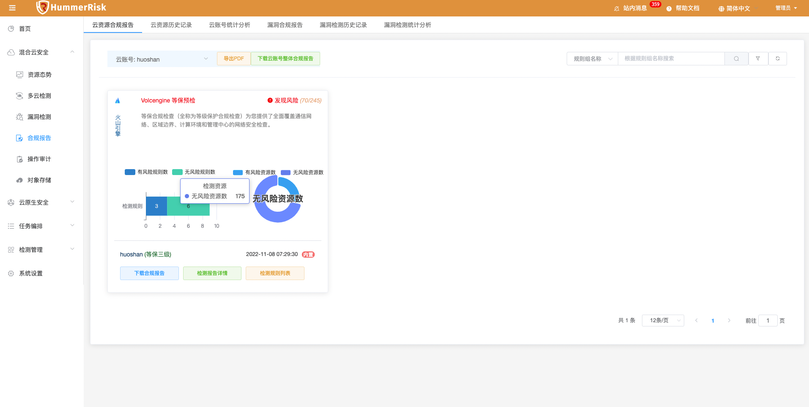

## 1 新功能 Features

### 1.1 首页

!!! abstract "主机检测"
    如下图所示，新增多条内置 Linux 主机检测规则。
{ width="95%" }

### 1.2 操作审计

!!! abstract "RBAC 资源拓扑图"
    如下图所示，新增操作审计百度云类型，根据百度云账号，同步操作审计数据，进而进行事件分析、聚合查询、源 IP 分析。
{ width="95%" }
{ width="95%" }
{ width="95%" }
{ width="95%" }

## 2 性能优化 Optimization

### 2.1 echarts

!!! abstract "升级 echarts 以及 vue-echarts 版本，全新图标展示。"
{ width="95%" }

### 2.2 资源态势

!!! abstract "提高资源态势查询速度。"
{ width="95%" }

### 2.3 安装配置

!!! abstract "安装前支持通过修改 install.conf 来配置使用外部数据库。"

### 2.4 安装配置

!!! abstract "优化在多网卡环境中，安装脚本精准获取 IP 地址功能。"

### 2.5 漏洞检测

!!! abstract "优化漏洞检测 Nuclei 的检测结果查询列表中存在 Xray 的类型的问题。"
{ width="95%" }

### 2.6 用户登录

!!! abstract "优化在登录页面密码位数限制。"
{ width="95%" }

### 2.7 多云检测

!!! abstract "优化多云检测结果详情页面，百度云和青云的区域`中文化`的功能。"
{ width="95%" }

### 2.8 合规报告

!!! abstract "优化下载云账号整体合规报告的功能。"
{ width="95%" }

## 3 Bug修复 Bug Fixes

### 3.1 echarts

!!! abstract "修复 echarts 最新图表数据，更改字段大小写的问题。"

### 3.2 源码检测

!!! abstract "修复源码检测，忽略根证书导致检测阻塞的问题。"

### 3.3 镜像检测

!!! abstract "修复点进某个镜像检测结果，在详情列表下载导出excel，发现excel表格中重复漏洞详情的问题。"

### 3.4 镜像检测

!!! abstract "修复批量执行一键扫描镜像仓库的镜像报错的问题。"

### 3.5 资源态势

!!! abstract "解决有风险资源跳转检测结果云账号选择错误问题。"

### 3.6 系统管理

!!! abstract "修复离线漏洞库上传报错的问题。"

### 3.7 容器启动

!!! abstract "修复 tirvy server 启动报错问题。"

### 3.8 对象存储

!!! abstract "修复对象存储添加百度云账号失败的问题。"

### 3.9 操作审计

!!! abstract "修复操作审计页面因云账号删除后分页查询失败的问题。"
