## 1 新功能 Features

### 1.1 主机检测

!!! abstract "主机检测"
    如下图所示，新增主机检测规则组，将已有的规则进行分类，执行主机检测将按照规则组进行检测。
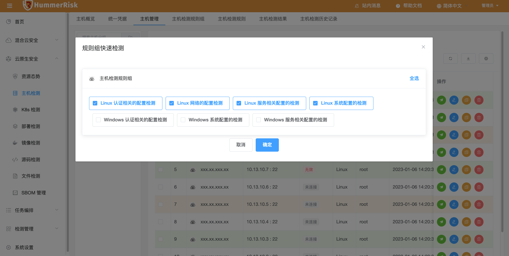{ width="95%" }
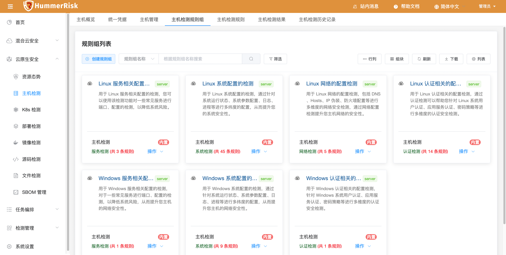{ width="95%" }
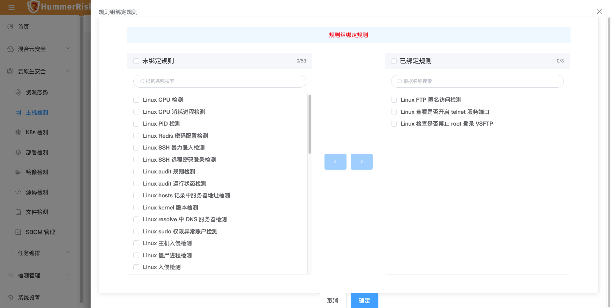{ width="95%" }
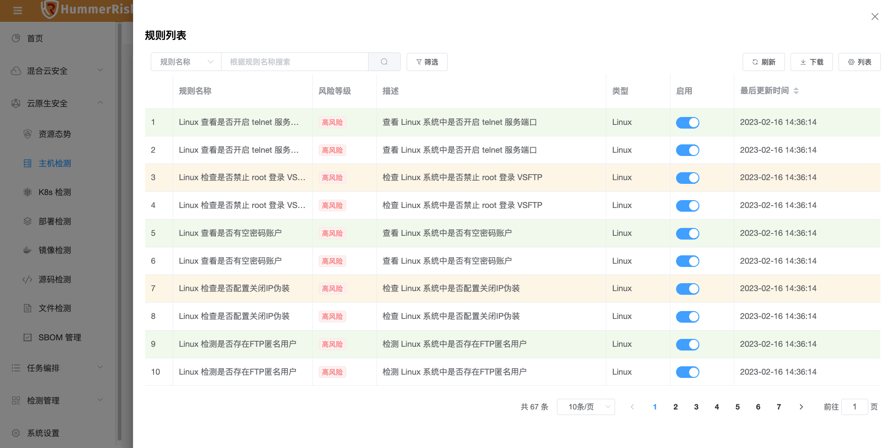{ width="95%" }
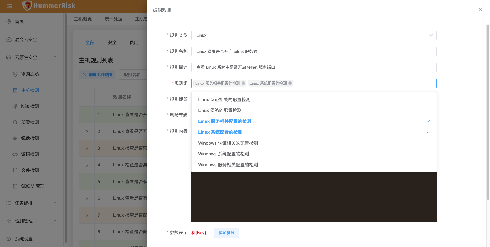{ width="95%" }

### 1.2 多云检测

!!! abstract "K8s 合规"
    如下图所示，新增 K8s 类型检测规则组和规则，执行 K8s 合规检测，将按照规则组进行检测。
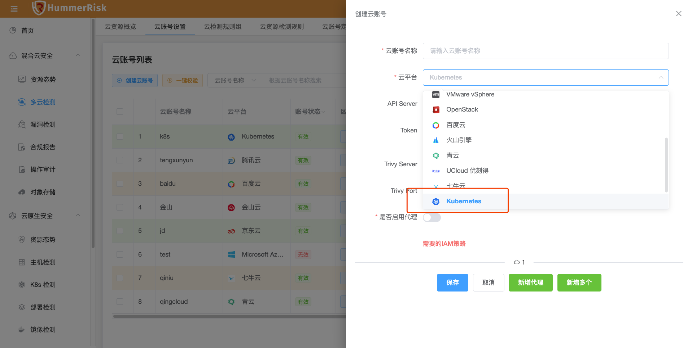{ width="95%" }
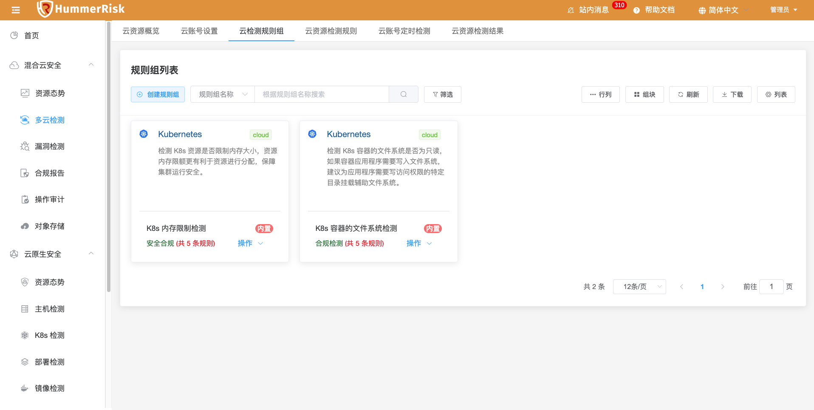{ width="95%" }
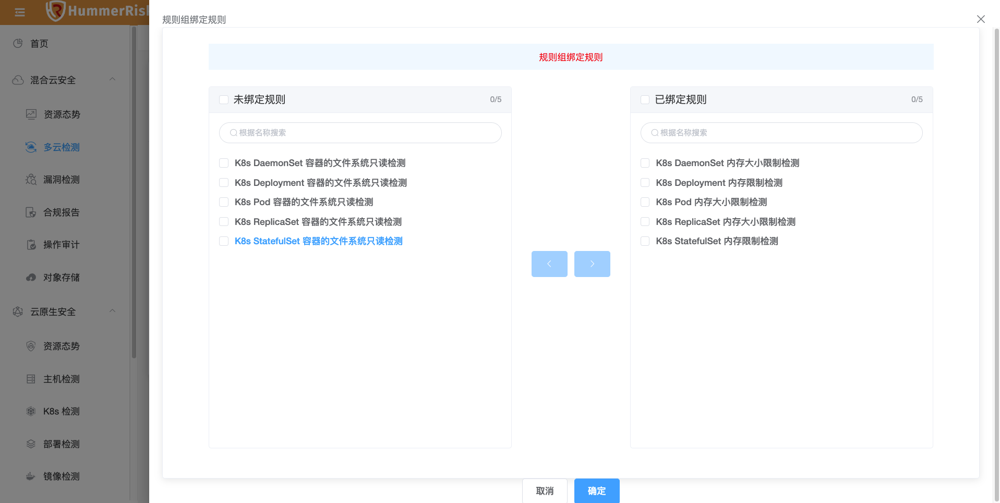{ width="95%" }
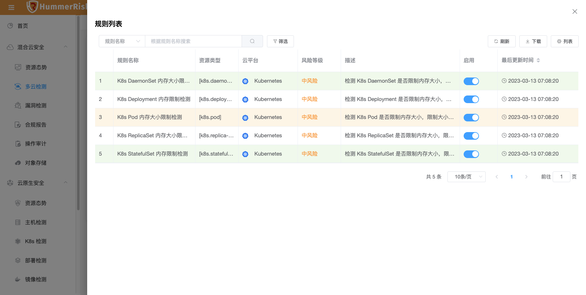{ width="95%" }
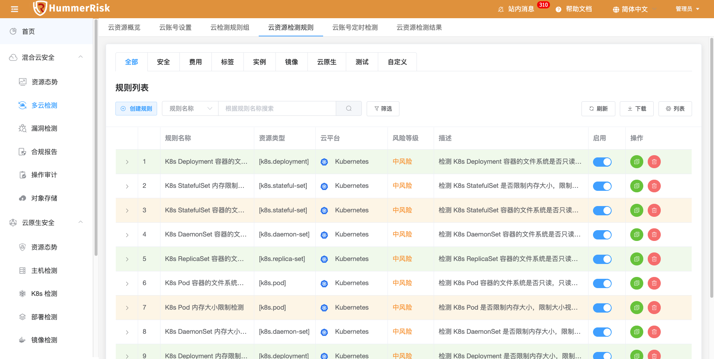{ width="95%" }
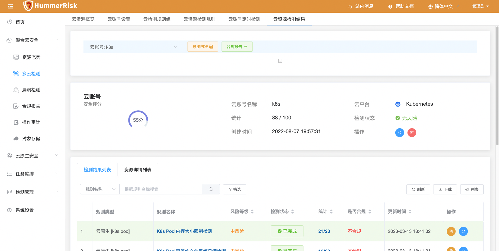{ width="95%" }

## 2 性能优化 Optimization

### 2.1 APIs

!!! abstract "优化 HummerRisk Restful APIs。"

### 2.2 镜像管理

!!! abstract "优化镜像管理列表数据展示。"

### 2.3 检测规则

!!! abstract "优化规则组列表样式，内容过多时显示省略号。"

### 2.4 资源概览

!!! abstract "优化云资源概览页面，云账号统计数据的展示。"

### 2.5 操作审计

!!! abstract "优化操作审计页面部分字段的国际化翻译。"

### 2.6 检测结果

!!! abstract "优化检测结果列表页面定时刷新功能。"

### 2.7 云原生

!!! abstract "优化云原生安全模块所有检测功能被卡住的问题。"

### 2.8 关于

!!! abstract "添加问题咨询链接。"

## 3 Bug修复 Bug Fixes

### 3.1 K8s 检测

!!! abstract "修复 K8s 配置，第一次自动安装 trivy-operator 报错的问题。"

### 3.2 对象存储

!!! abstract "修复对象存储因云账号删除导致无法添加和查看数据的问题。"

### 3.3 对象存储

!!! abstract "修复对象存储腾讯云不显示文件数量和存储用量的问题。"

### 3.4 文件检测

!!! abstract "修复文件检测任务执行检测任务查询过滤项不准确的问题。"

### 3.5 镜像检测

!!! abstract "修复镜像检测概览页面风险统计数据不正确的问题。"

### 3.6 系统设置

!!! abstract "修复系统设置国际化翻译不准确的问题。"

### 3.7 部署检测

!!! abstract "修复部署检测json结果文件找不到的问题。"
