## 1 新功能 Features

### 1.1 架构升级

!!! abstract "架构升级"
    如下图所示，HummerRisk 由 SpringBoot 单体架构升级为 SpringCloud 微服务架构，性能和效率显著提升。
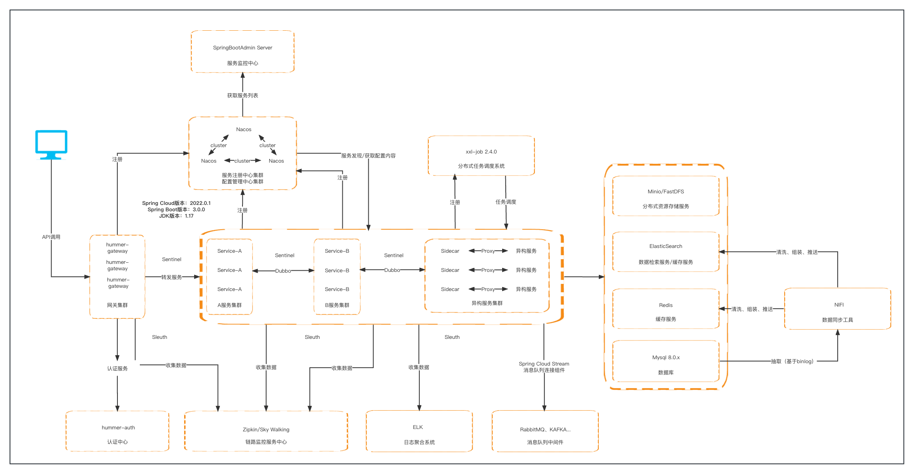{ width="95%" }
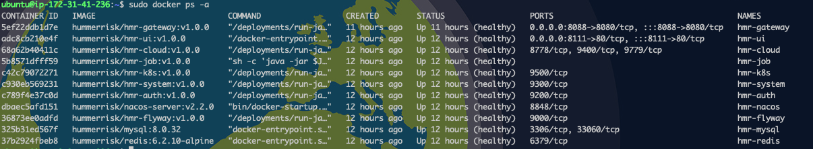{ width="95%" }
{ width="95%" }
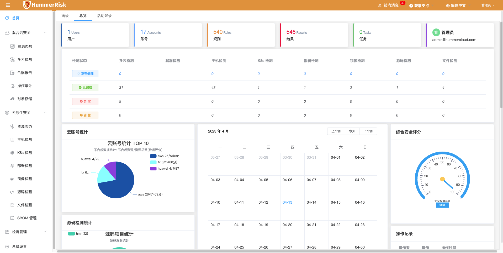{ width="95%" }

### 1.2 K8s 检测

!!! abstract "K8s 检测"
    如下图所示，新增 K8s 类型检测规则组和规则，K8s 检测分为漏洞检测、配置检测、CIS Benchmarks 检测、合规规则检测。
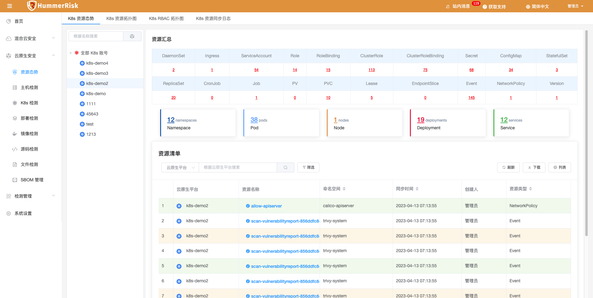{ width="95%" }
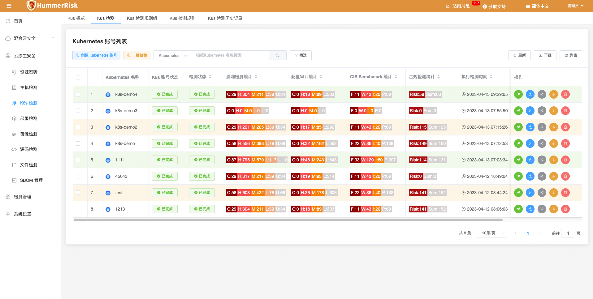{ width="95%" }
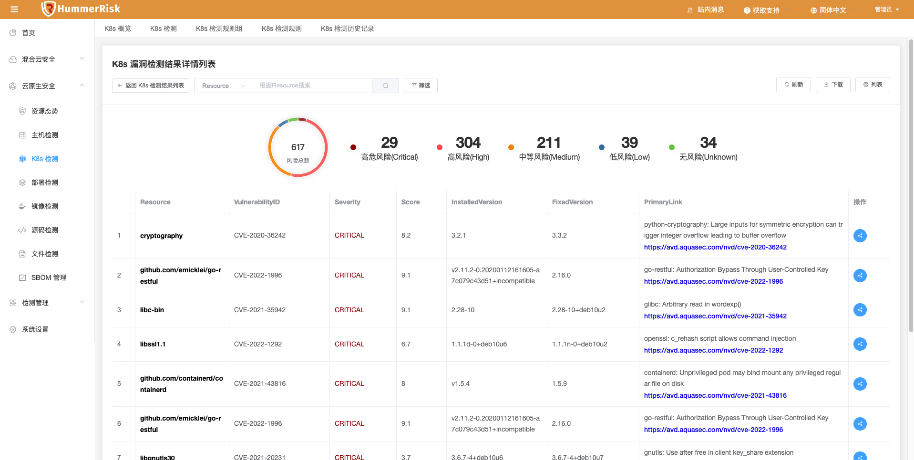{ width="95%" }
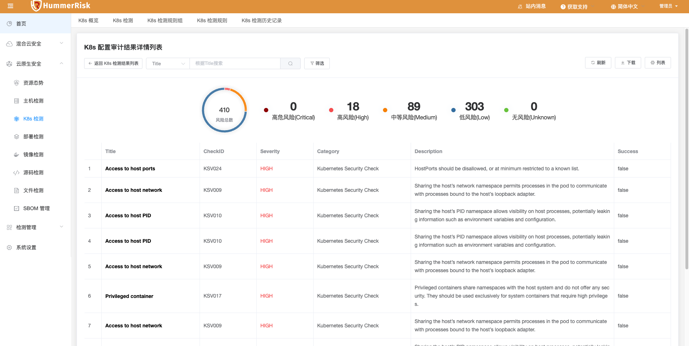{ width="95%" }
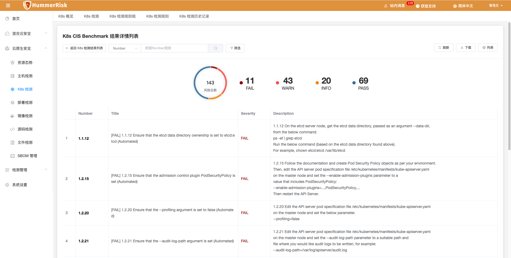{ width="95%" }
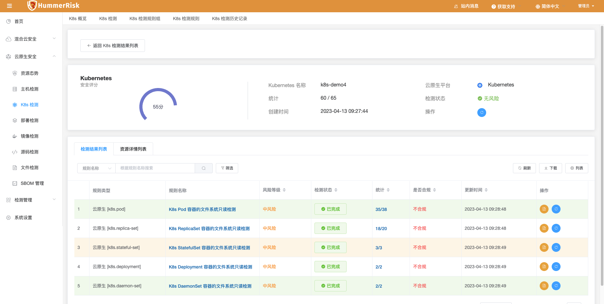{ width="95%" }

### 1.3 主机检测

!!! abstract "主机检测"
    如下图所示，主机检测添加 sudo 权限，非 root 用户也可执行检测。
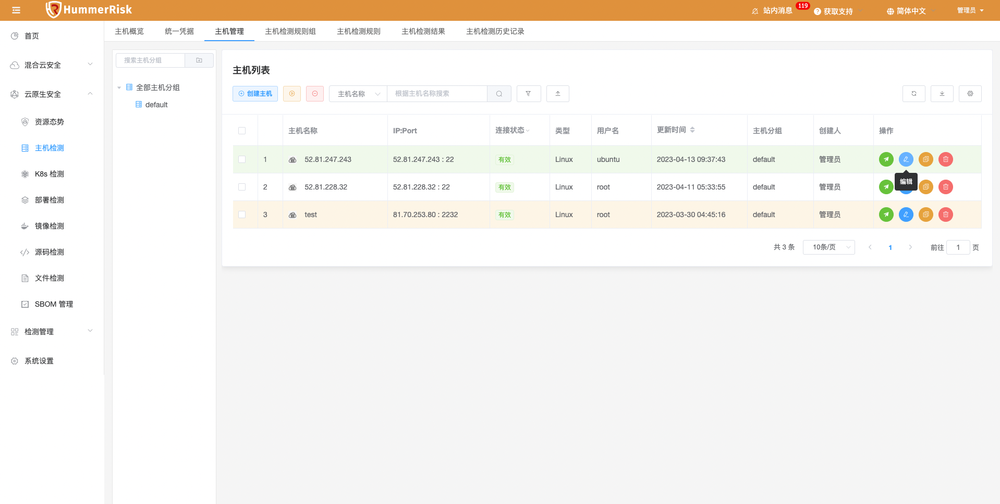{ width="95%" }
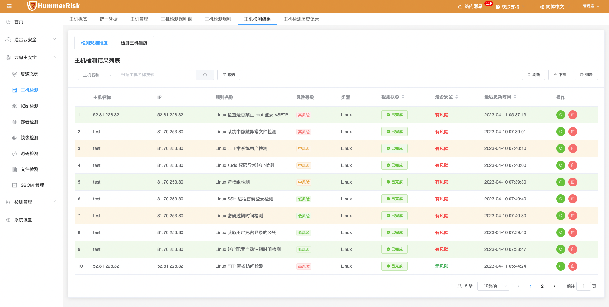{ width="95%" }
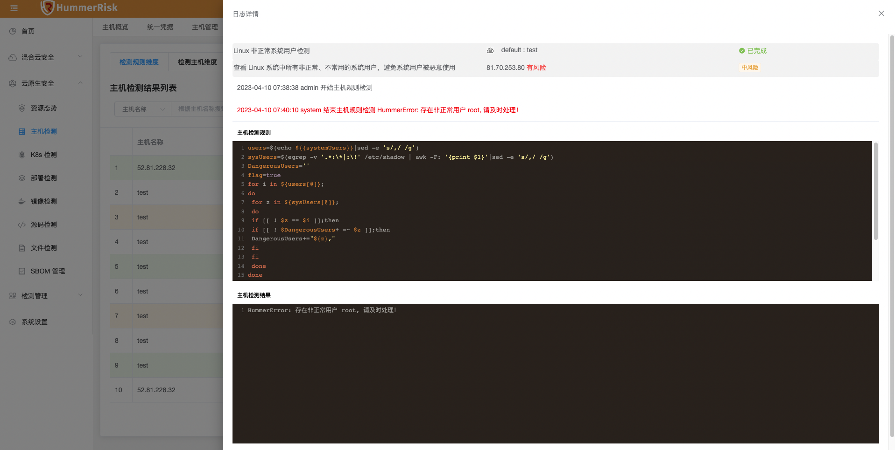{ width="95%" }

### 1.4 多云检测

!!! abstract "新增阿里云 redis 规则。"
    如下图所示，新增阿里云 redis 规则。
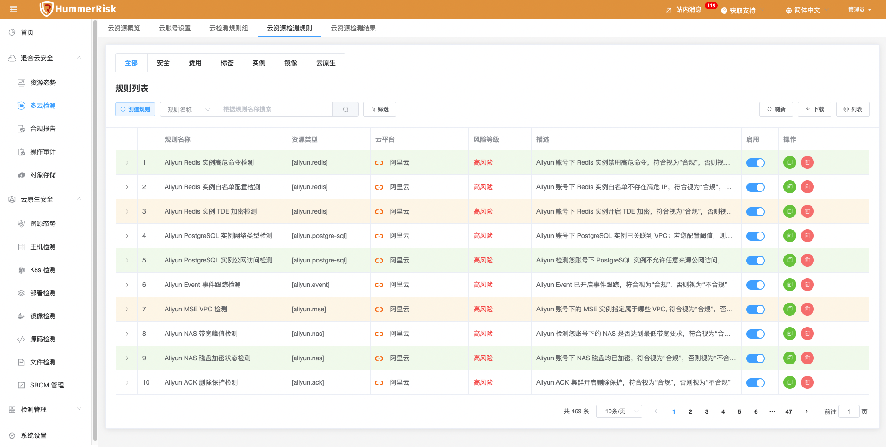{ width="95%" }

## 2 性能优化 Optimization

### 2.1 定时任务

!!! abstract "定时任务优化，有日志可追踪。"

### 2.2 多云检测

!!! abstract "优化新建云检测规则时校验功能。"

### 2.3 资源概览

!!! abstract "优化云资源概览页面，云账号统计数据的展示。"

### 2.4 操作审计

!!! abstract "优化操作审计页面部分字段的国际化翻译。"

### 2.5 镜像仓库

!!! abstract "优化镜像仓库同步镜像，一键检测已同步镜像。"

### 2.6 主机检测

!!! abstract "优化主机检测流程，优化主机密钥、主机管理。"

### 2.7 K8s 检测

!!! abstract "优化 K8s 状态、trivy-operator、kubench 安装日志。"

### 2.8 K8s 检测

!!! abstract "优化 K8s 检测，管理页面和检测结果页面合并。"

### 2.9 部署检测

!!! abstract "优化部署检测，管理页面和检测结果页面合并。"

### 2.10 镜像检测

!!! abstract "优化镜像检测，管理页面样式优化，并和检测结果页面合并。"

### 2.11 源码检测

!!! abstract "优化源码检测，管理页面和检测结果页面合并。"

### 2.12 文件检测

!!! abstract "优化文件检测，管理页面和检测结果页面合并。"

### 2.13 多云检测

!!! abstract "云账号在编辑时不可查询 secret key 等私密凭证信息，只在添加时可见。"

### 2.14 API

!!! abstract "优化 API Swagger 按模块微服务化。"

## 3 Bug修复 Bug Fixes

### 3.1 对象存储

!!! abstract "修复对象存储账号中，执行一键检测，直接跳转到云账号检测结果页面的问题。"

### 3.2 镜像仓库

!!! abstract "修复镜像仓库用 IP + Port 的模式同步镜像，执行镜像检测时镜像地址错误的问题。"

### 3.3 SBOM 管理

!!! abstract "修复执行SBOM项目版本检测，未触发依赖文件的检测的问题。"

### 3.4 对象存储

!!! abstract "修复对象存储账号中，添加华为云对象存储失败的问题。"

### 3.5 主机管理

!!! abstract "修复 Excel 导入主机时名称为纯数字时报错的问题。"

### 3.6 主机管理

!!! abstract "修复添加主机绑定密钥文件失败的问题。"

### 3.7 镜像仓库

!!! abstract "修复 dockerhub 镜像仓库同步的镜像检测出错的问题。"

### 3.8 删减内容

!!! abstract "删减网络漏洞检测、任务编排、定时云检测等臃肿模块，保留原汁原味 HummerRisk 核心功能。"
