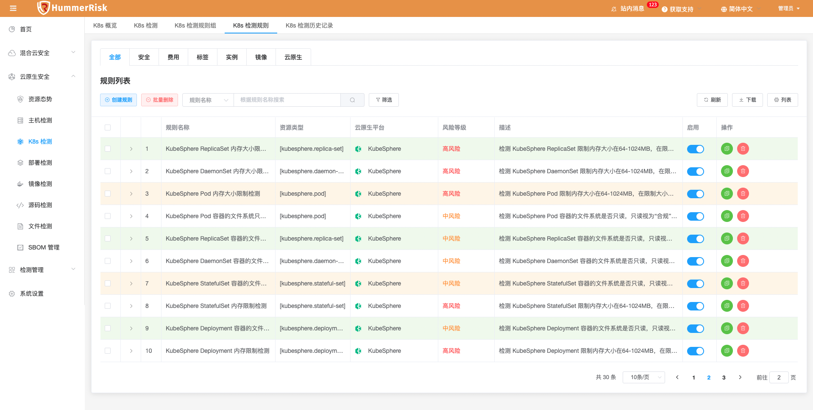
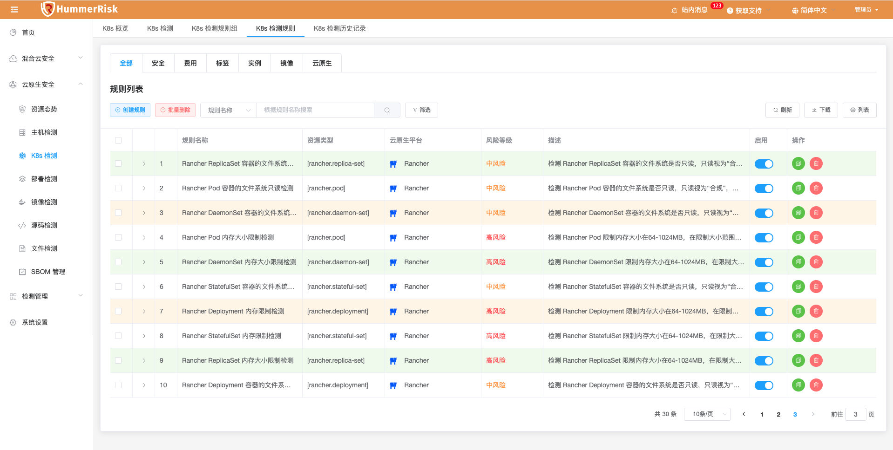
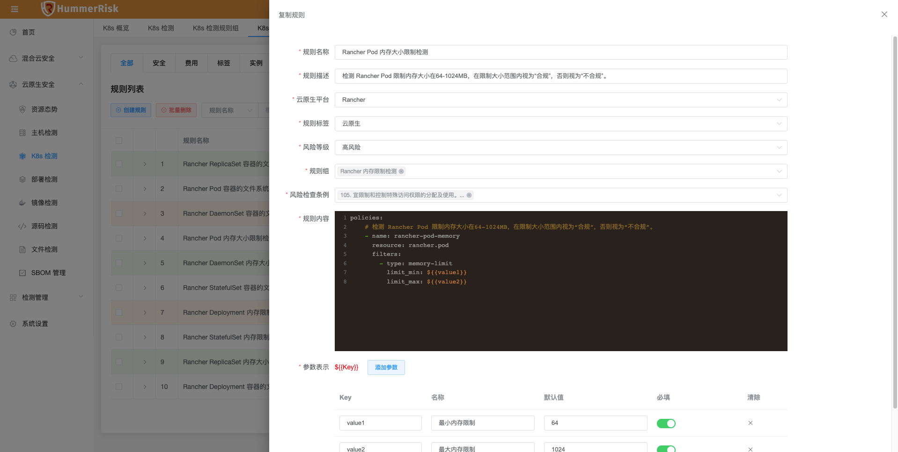
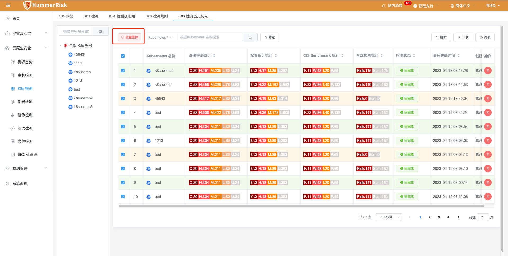
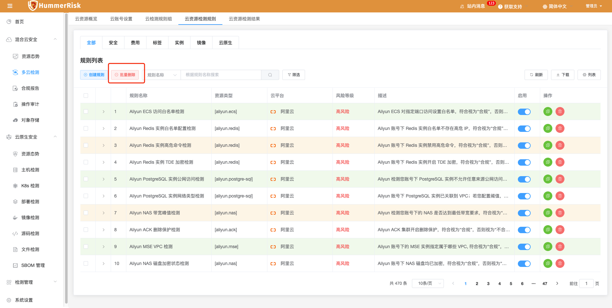
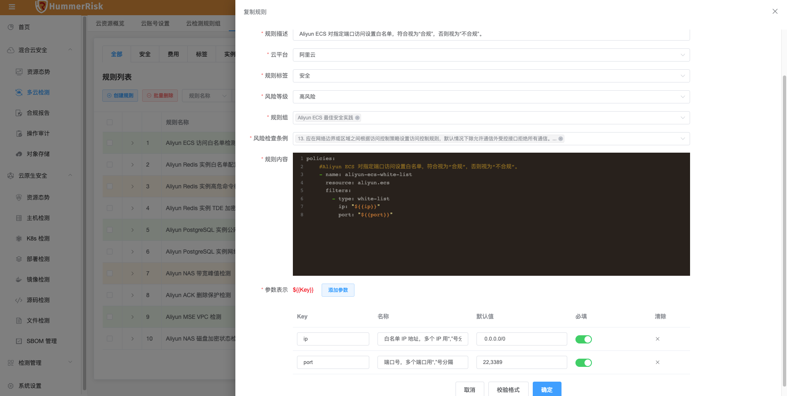

## 1 新功能 Features

### 1.1 K8s 检测

!!! abstract "K8s 检测"
    如下图所示，新增 Rancher 和 KubeSphere 类型检测规则组和规则，通过检测获取资源合规结果。
{ width="95%" }
{ width="95%" }
{ width="95%" }

### 1.2 批量删除

!!! abstract "批量删除"
    如下图所示，所有列表页面新增批量删除功能，便于数据量大时用户执行表单数据删除操作。
{ width="95%" }
{ width="95%" }

### 1.3 多云检测

!!! abstract "多云检测"
    如下图所示，新增阿里云 ECS 白名单检测规则。
{ width="95%" }

## 2 性能优化 Optimization

### 2.1 多云检测

!!! abstract "优化 huawei Iam 策略，缩小资源最小使用权限。"

### 2.2 K8s 检测

!!! abstract "优化 K8s 合规检测详情页面，展示资源名称和命名空间。"

### 2.3 K8s 检测

!!! abstract "优化 K8s Kubench 校验状态失败后，自动重试 5 次。"

### 2.4 关于

!!! abstract "优化关于页面。"

### 2.5 UI 优化

!!! abstract "优化列表检测状态按钮大小，统一列表高度。"

### 2.6 UI 优化

!!! abstract "优化所有侧拉弹框请求后台时带有遮罩效果。"

## 3 Bug修复 Bug Fixes

### 3.1 镜像仓库

!!! abstract "修复批量设置镜像名称报错的问题。"

### 3.2 资源同步

!!! abstract "修复同步资源数据字段超长导致报错的问题。"

### 3.3 资源态势

!!! abstract "修复资源态势列表中，点击资源的风险按钮，显示内容是空问题。"

### 3.4 风险条例

!!! abstract "修复风险条例某些字段不显示的问题。"

### 3.5 对象存储

!!! abstract "修复对象存储添加 aws 账号 awsSessionToken 必填的问题。"
