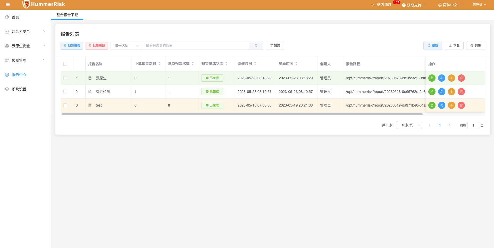

## 1 新功能 Features

### 1.1 报告中心

!!! abstract "报告中心"
    如下图所示，通过导入 License 使用 X-PACK 功能，新增定制整合报告功能，生成并下载为 PDF 格式。（X-PACK）
{ width="95%" }
{ width="95%" }
{ width="95%" }
{ width="95%" }

### 1.2 多云检测

!!! abstract "多云检测"
    如下图所示，新增阿里云、华为云类型内置检测规则组和规则，通过检测获取资源合规结果。（X-PACK）
{ width="95%" }
{ width="95%" }
{ width="95%" }

### 1.3 主机检测

!!! abstract "主机检测"
    如下图所示，新增 Linux 主机 docker 内置检测规则组和规则，通过检测获取资源合规结果。（X-PACK）
{ width="95%" }
{ width="95%" }

### 1.4 主机检测

!!! abstract "主机检测"
    如下图所示，新增 Linux 主机系统的安全扫描、安全审计功能。
{ width="95%" }
{ width="95%" }

### 1.5 K8s 检测

!!! abstract "K8s 检测"
    如下图所示，新增 Kubernetes 、Rancher 和 KubeSphere类型内置检测规则组和规则，通过检测获取资源合规结果。（X-PACK）
{ width="95%" }
{ width="95%" }

### 1.6 镜像仓库

!!! abstract "镜像仓库"
    如下图所示，镜像仓库新增公有云阿里云、腾讯云类型，同步镜像并加入到镜像管理里，方便进行检测。
{ width="95%" }

### 1.7 镜像管理

!!! abstract "镜像管理"
    如下图所示，新增镜像分组，镜像仓库同步的镜像将自动创建仓库名称的分组，镜像将自动分配到镜像分组里。也可以手动创建分组，手动分配镜像。新增批量检测镜像功能。
{ width="95%" }

## 2 性能优化 Optimization

### 2.1 首页

!!! abstract "优化首页 Dashboard 展示，去除面板。"
{ width="95%" }

### 2.2 多云检测

!!! abstract "优化云检测结果，新增规则组信息展示。"
{ width="95%" }

### 2.3 多云检测

!!! abstract "优云账号调参功能，可单独或批量设置区域。"
{ width="95%" }

### 2.4 主机检测

!!! abstract "优云主机检测结果展示，主机维度优化。"
{ width="95%" }

### 2.5 K8s 检测

!!! abstract "优化 K8s 检测结果，新增规则组信息展示。"
{ width="95%" }

### 2.6 资源拓扑

!!! abstract "优化 K8s RBAC 资源拓扑图，优化鼠标悬浮时数据展示，新增 namespace 过滤功能。"
{ width="95%" }

### 2.7 资源态势

!!! abstract "优化 K8s 资源态势，支持 namespace 过滤。"
{ width="95%" }

### 2.8 查询过滤

!!! abstract "查询过滤优化，将已使用条件作为过滤项在查询条件下显示。"
{ width="95%" }

## 3 Bug修复 Bug Fixes

### 3.1 多云检测

!!! abstract "修复百度、青云、七牛、ucloud 云账号认证状态的问题。"

### 3.2 主机检测

!!! abstract "修复新建主机规则绑定规则组失效的问题。"

### 3.3 主机检测

!!! abstract "修复主机检测执行，command 字段过短导致报错的问题。"

### 3.4 多云检测

!!! abstract "修复云检测规则组查询筛选条件不显示标签条件的问题。"
