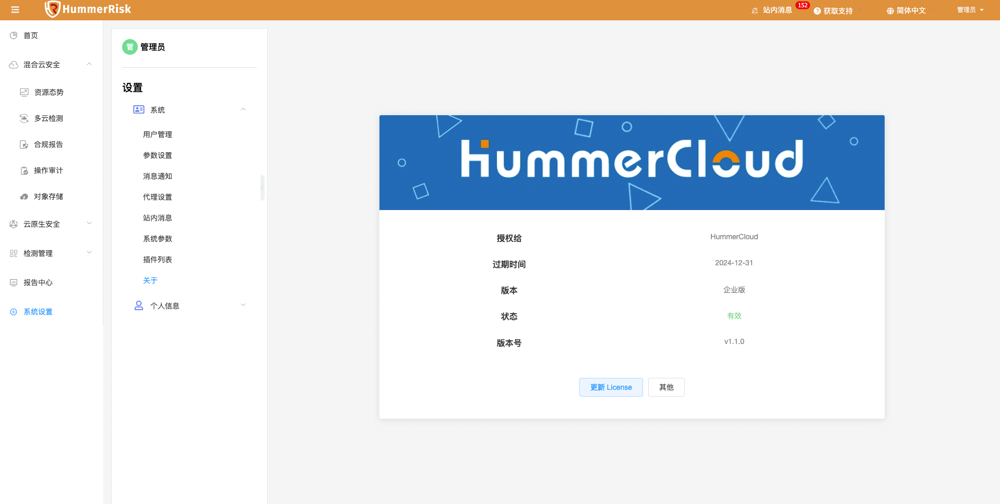

## 1 新功能 Features

### 1.1 资源态势

!!! abstract "资源态势"
    如下图所示，新增云资源检测拓扑（2.5D 图）与云资源关系拓扑。
{ width="95%" }
{ width="95%" }

### 1.2 多云检测

!!! abstract "多云检测"
    如下图所示，新增多云检测扩展模块，较社区版提效300%。（X-PACK）
{ width="95%" }

### 1.3 主机检测

!!! abstract "主机检测"
    如下图所示，新增 Linux 主机 整体检测结果。
{ width="95%" }
{ width="95%" }

### 1.4 规则组

!!! abstract "规则组"
    如下图所示，新增规则组标识，规范规则组类型。
{ width="95%" }
{ width="95%" }
{ width="95%" }
{ width="95%" }

### 1.5 镜像仓库

!!! abstract "镜像仓库"
    如下图所示，新增 AWS 类型镜像仓库。
{ width="95%" }

## 2 性能优化 Optimization

### 2.1 报告中心

!!! abstract "优化报告中心导出的报告页眉页脚显示样式，优化 xpack 规则组内容。（X-PACK）"

### 2.2 多云检测

!!! abstract "优云账号调参功能，批量设置区域功能。"

### 2.3 主机检测

!!! abstract "优化主机检测结果，主机维度下载 pdf 的功能。"

### 2.4 合规报告

!!! abstract "优化点击刷新按钮刷新数据的功能。"

### 2.5 资源同步

!!! abstract "优化同步过程，新增 vpc 类型资源。"

### 2.6 多云管理

!!! abstract "优化同步云上资源，在资源标识后新增资源名称。"

### 2.7 API Keys

!!! abstract "优化 RestFul API Keys 认证。"

## 3 Bug修复 Bug Fixes

### 3.1 报告中心

!!! abstract "修复报告中心添加报告时报错的问题。只显示已校验成功的账号和检测成功的结果。（X-PACK）"

### 3.2 多云管理

!!! abstract "修复 AWS 国际区账号资源的 IAM 策略。"

### 3.3 资源态势

!!! abstract "修复资源态势详情列表过滤数据错误的问题。"

### 3.4 主机检测

!!! abstract "修复主机 "IP 伪装" 检测规则内容不正确的问题。"

### 3.5 合规报告

!!! abstract "解决合规报告中有风险、无风险资源数量不对的问题。"

### 3.6 K8s 管理

!!! abstract "解决 K8s kubench 校验和重新安装的问题。"
