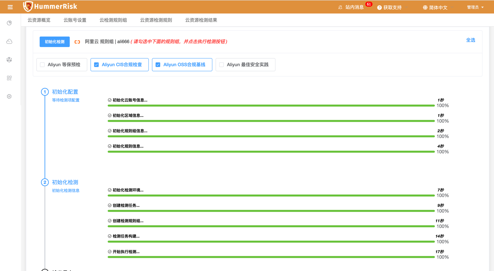
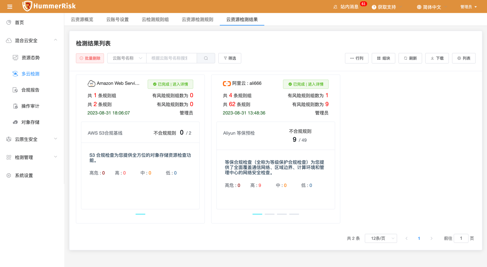
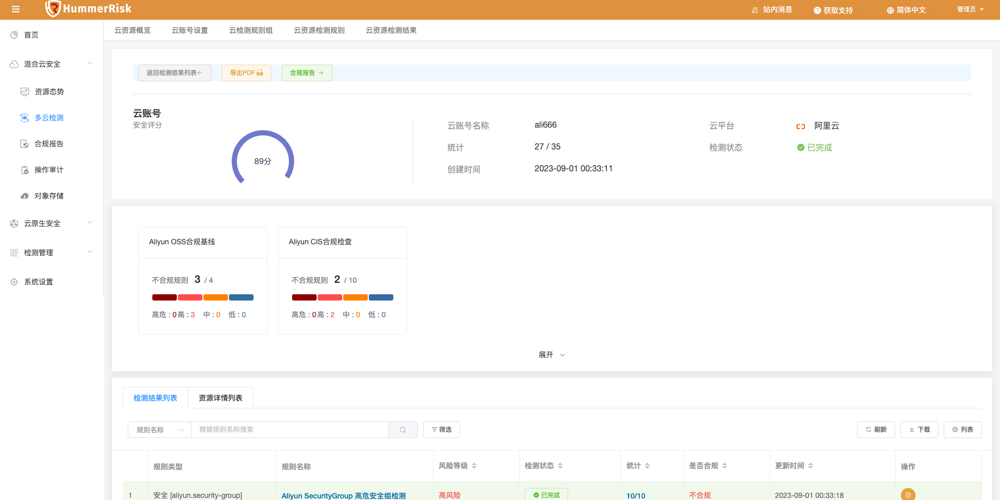
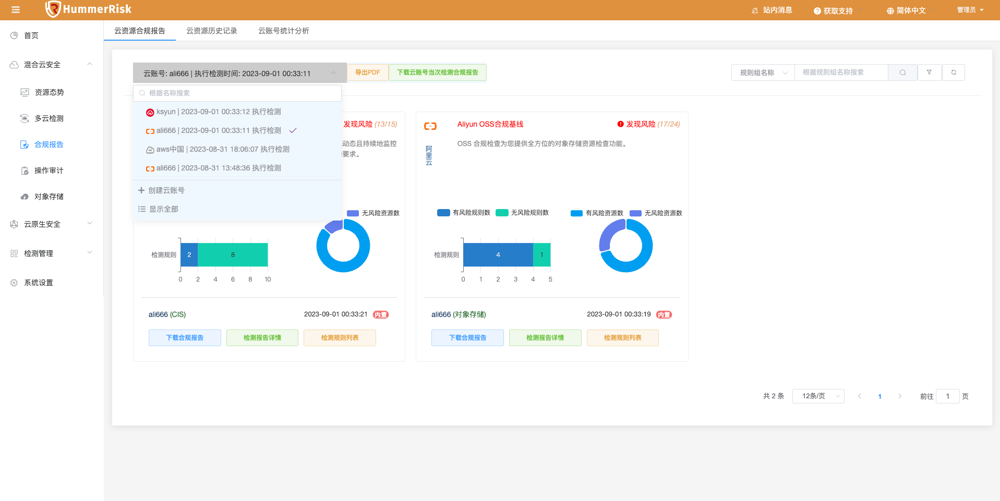
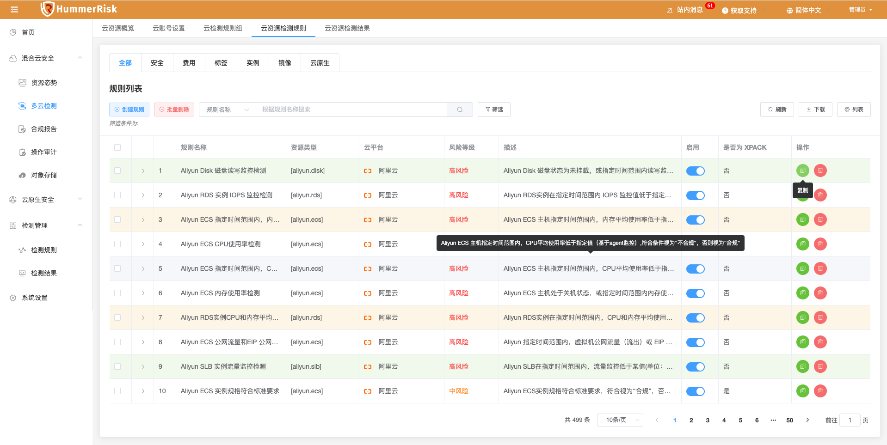
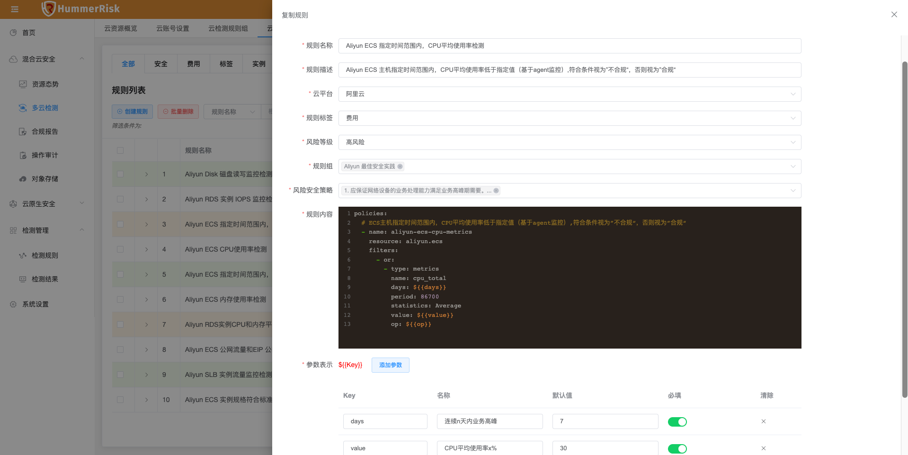
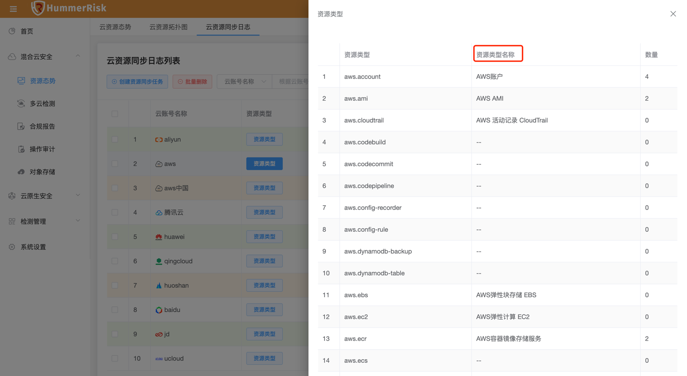
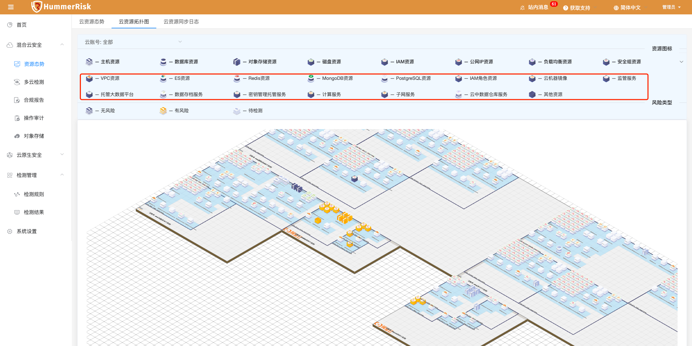

## 1 新功能 Features

### 1.1 多云检测

!!! abstract "多云检测"
    如下图所示，新增整体检测project模式，保留检测历史和检测详情。
{ width="95%" }
{ width="95%" }
{ width="95%" }
{ width="95%" }

### 1.2 检测规则

!!! abstract "检测规则"
    如下图所示，新增阿里云最佳实践资源监控检测规则。
{ width="95%" }
{ width="95%" }

### 1.3 资源同步

!!! abstract "资源同步"
    如下图所示，新增资源同步功能中资源类型的中文、英文、繁体对照。
{ width="95%" }

### 1.4 资源拓扑

!!! abstract "资源拓扑"
    如下图所示，资源拓扑新增多种资源类型与图标。
{ width="95%" }

## 2 性能优化 Optimization

### 2.1 检测结果

!!! abstract "优化检测结果详情页面，基于检测历史查看。"

### 2.2 合规报告

!!! abstract "优化合规报告页面所有功能，基于检测历史查看。"

### 2.3 资源拓扑

!!! abstract "优化资源拓扑关系详情页面展示，节点样式修改。"

### 2.4 API 文档

!!! abstract "优化 gateway 配置 Restful API 文档，升级 knife4j 版本。"

### 2.5 检测结果

!!! abstract "优化日志级别，修改日志执行检测的 log 输出。"

### 2.6 资源同步

!!! abstract "优化 AWS Cloud 资源同步的资源类型。"

### 2.7 对象存储

!!! abstract "关闭 oss 对象存储检测结果页面和合规报告页面，采用统一的页面查看数据。"

## 3 Bug修复 Bug Fixes

### 3.1 镜像仓库

!!! abstract "修复 harbor 私有仓库认证失败导致的无法检测问题。"

### 3.2 镜像列表

!!! abstract "修复镜像仓库同步的镜像列表侧拉页面名称检索不正确的问题。"

### 3.3 资源态势

!!! abstract "修复资源拓扑图中存在资源名称过长时报错的问题。"

### 3.4 对象存储

!!! abstract "修复对象存储校验云账号时报路径错误的问题。"

### 3.5 检测结果

!!! abstract "修复资源风险名称不展示的问题。"

### 3.6 下拉菜单

!!! abstract "优化各个新增编辑页面下拉菜单模糊查询与清除功能。"

### 3.7 部署检测

!!! abstract "解决部署检测新增编辑页面，yaml数据量较大时下拉列表请求字节较大的问题。"

### 3.8 API 文档

!!! abstract "解决 Restful API token 调用不通的问题。"
