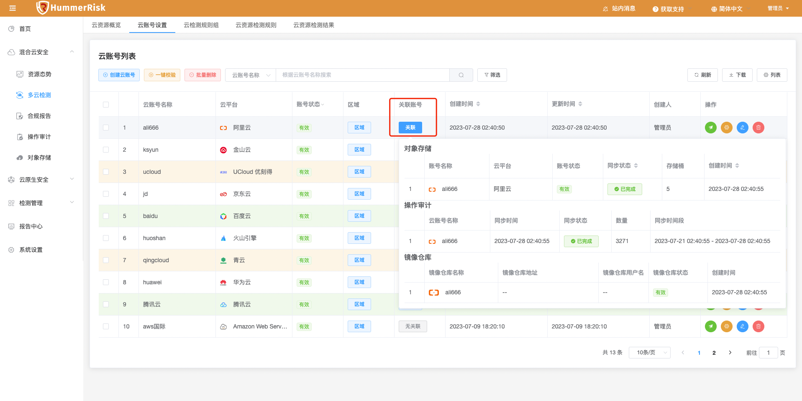
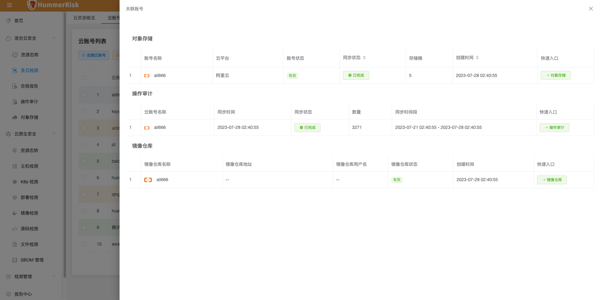
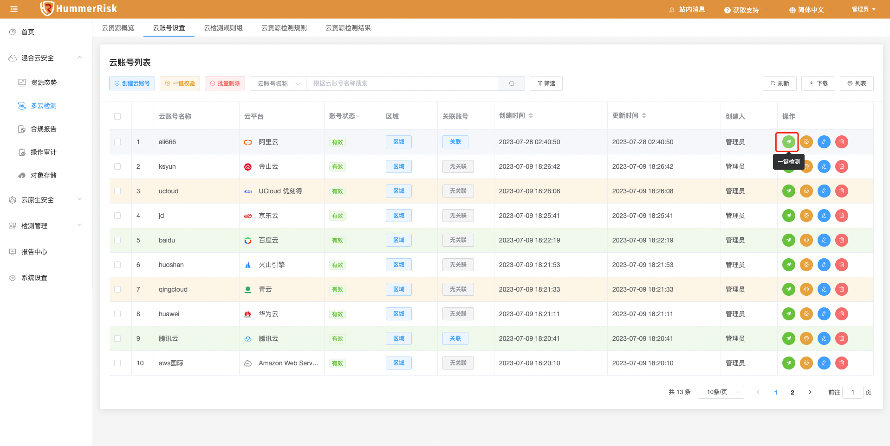
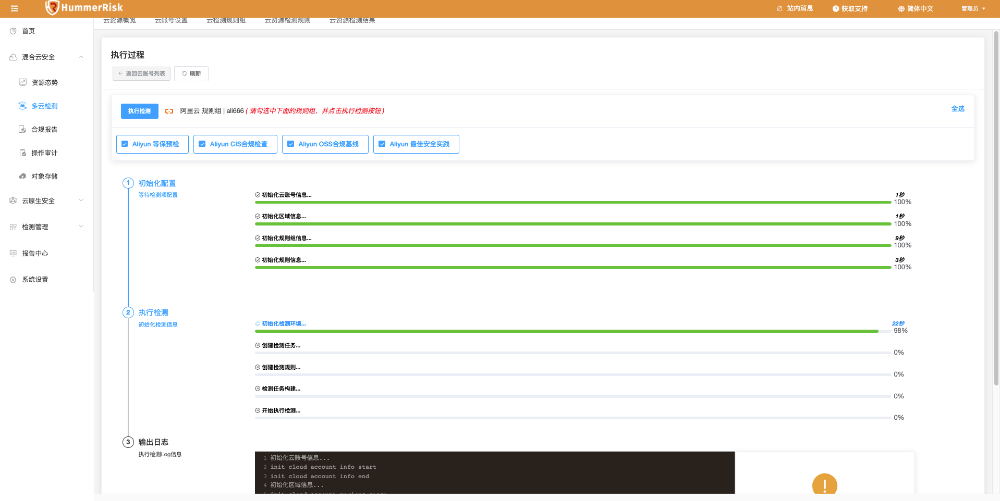
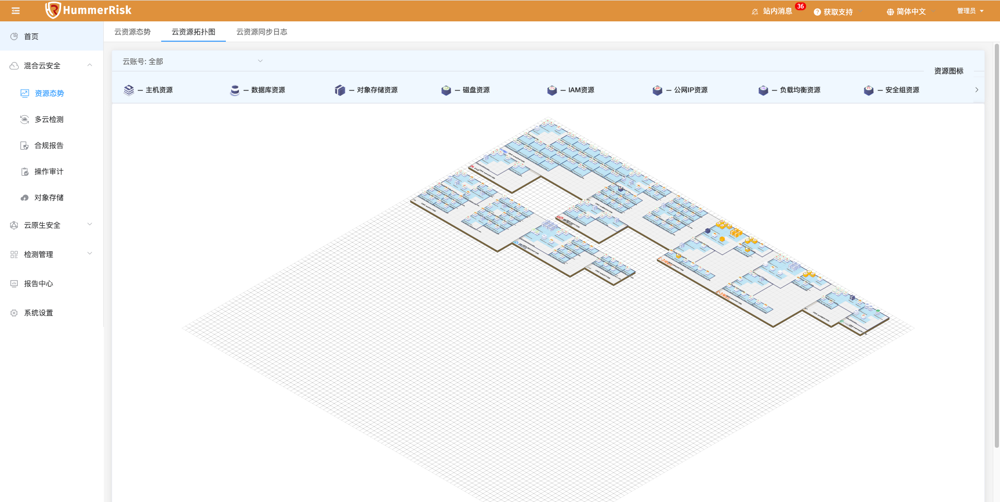
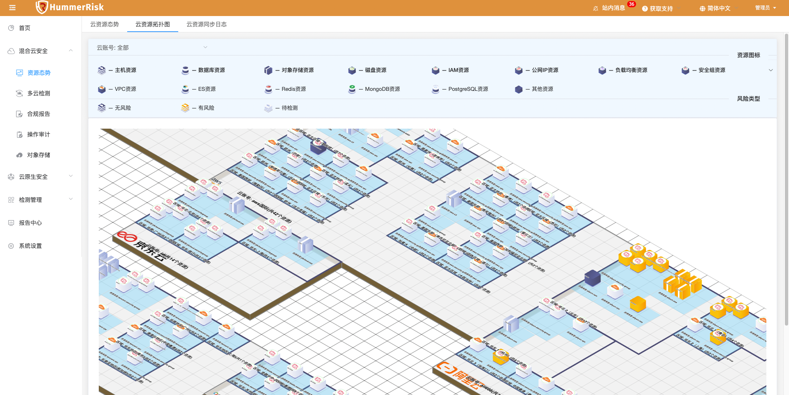
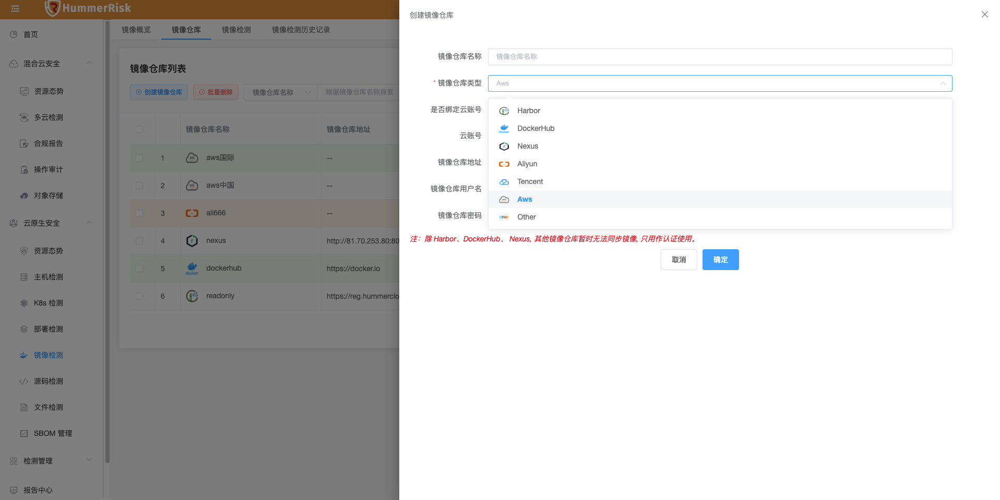
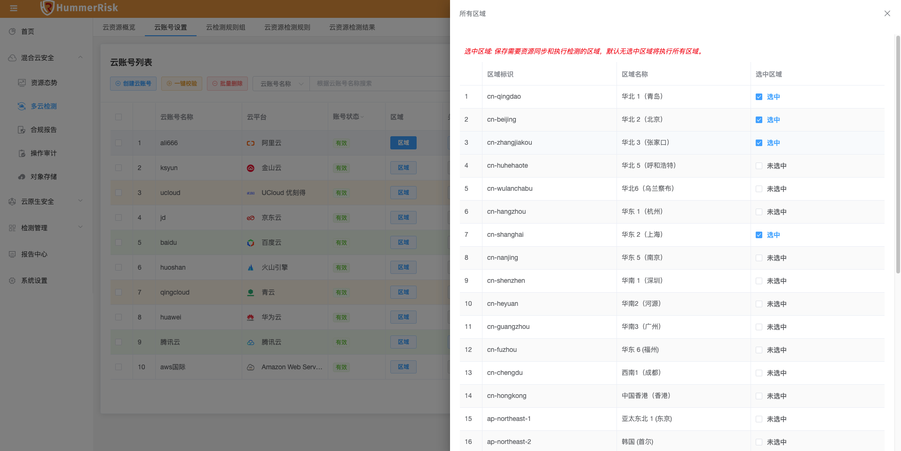
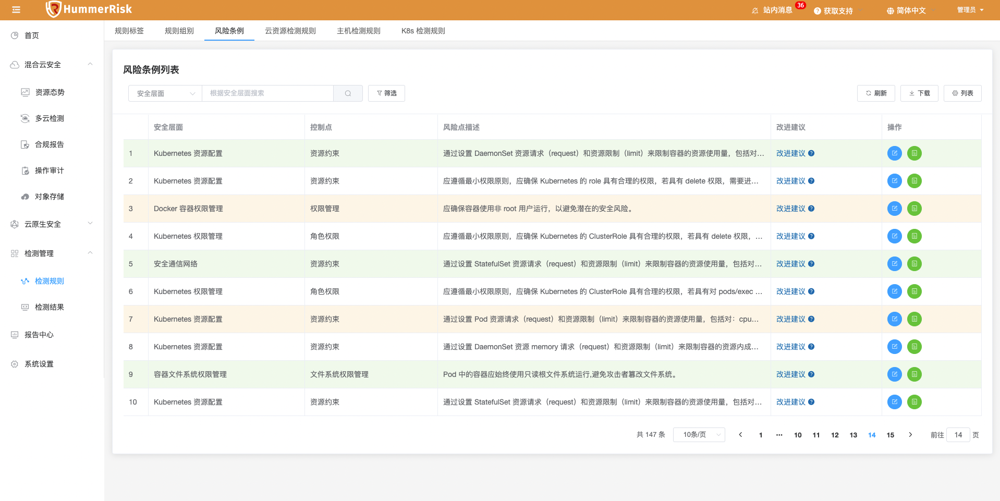

## 1 新功能 Features

### 1.1 多云管理

!!! abstract "多云管理"
    如下图所示，新增云账号关联对象存储、操作审计、镜像仓库等功能。
{ width="95%" }
{ width="95%" }
{ width="95%" }

### 1.2 多云检测

!!! abstract "多云检测"
    如下图所示，新增多云检测执行过程功能。
{ width="95%" }
{ width="95%" }

### 1.3 资源态势

!!! abstract "资源态势"
    如下图所示，新增腾讯云、华为云部分资源关系，增加 AWS 资源类型，新增关系拓扑资源类型。
{ width="95%" }
{ width="95%" }

### 1.4 镜像仓库

!!! abstract "镜像仓库"
    如下图所示，镜像仓库 AWS 类型增加中国区同步，增加私有仓库同步。
{ width="95%" }

## 2 性能优化 Optimization

### 2.1 多云管理

!!! abstract "优化云账号区域，选中区域的资源同步和检测优化。"
{ width="95%" }

### 2.2 风险条例

!!! abstract "优化风险条例，新增20条 K8s 类型风险条例。"
{ width="95%" }

### 2.3 K8s 检测

!!! abstract "优化 K8s 检测页面规则组样式，清理执行检测已选规则组缓存。"

### 2.4 检测规则

!!! abstract "优化阿里云规则组最佳实践分组与规则。"

### 2.5 K8s 规则

!!! abstract "优化 K8s 规则对应的风险条例。"

### 2.6 镜像仓库

!!! abstract "AWS 类型镜像仓库增加仓库地址显示。"

### 2.7 检测结果

!!! abstract "优化资源名称显示。"

### 2.8 镜像仓库

!!! abstract "优化镜像仓库列表显示。"

## 3 Bug修复 Bug Fixes

### 3.1 资源拓扑

!!! abstract "修复云资源报 null 的错误。"

### 3.2 资源同步

!!! abstract "修复同步资源待检测资源数量不准确的问题。"

### 3.3 资源态势

!!! abstract "修复资源态势页面，资源列表中资源ID为空的情况。"

### 3.4 镜像管理

!!! abstract "修复手动添加镜像添加不上的问题。"

### 3.5 主机管理

!!! abstract "清理主机执行检测已选规则组缓存。"

### 3.6 资源态势

!!! abstract "修复在资源态势通过 namespace 过滤出来的资源不对的问题。"
